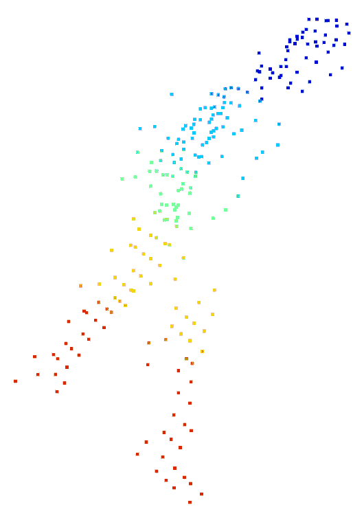
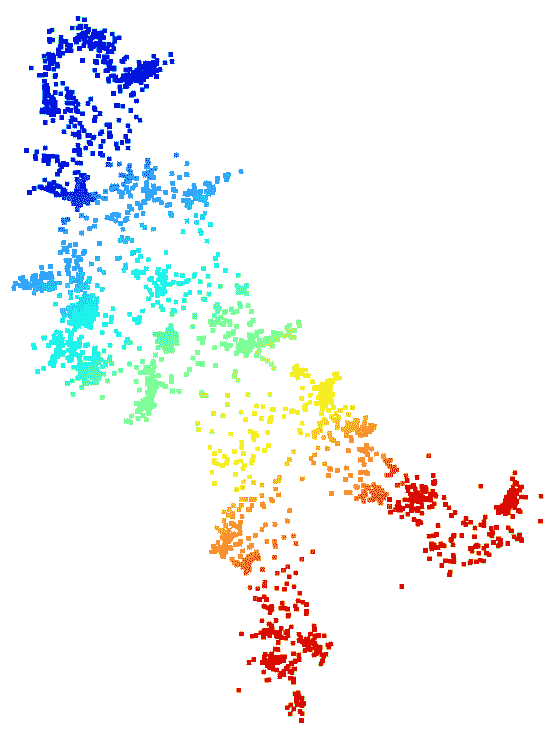

# 3

# 将可变形网格模型拟合到原始点云

本章将讨论一个项目，使用可变形网格模型拟合来自原始深度相机传感器结果的原始点云观测数据。深度相机的原始点云观测数据通常是没有任何关于这些点如何连接的信息的点云格式；即，点云不包含关于如何从这些点形成表面的信息。这与网格相反，网格通过定义面的列表显示了表面是如何形成的。如何将点聚集成表面的信息对于后续的后处理（如去噪和物体检测）非常重要。例如，如果一个点孤立无援，没有与任何其他点连接，那么该点很可能是传感器的误检。

因此，从点云中重建表面信息通常是 3D 数据处理流程中的标准步骤。关于从点云进行 3D 表面重建的前沿文献有很多，例如泊松重建。使用可变形网格模型进行表面重建也是一种常用方法。本章讨论的将可变形网格模型拟合到点云的方法是一种实用且简单的基准方法。

本章提出的方法基于 PyTorch 优化。该方法是如何使用 PyTorch 进行优化的另一个完美示范。我们将详细解释优化过程，以便你能进一步加深对 PyTorch 优化的理解。

损失函数在大多数深度学习算法中非常重要。在这里，我们还将讨论应该使用哪些损失函数，以及传统上在 PyTorch3D 中包含的损失函数。幸运的是，许多著名的损失函数已经在许多现代 3D 深度学习框架和库中实现，如 PyTorch3D。在本章中，我们将学习许多这样的损失函数。

本章将涵盖以下主要主题：

+   将网格拟合到点云——问题

+   将网格模型拟合问题表述为优化问题

+   用于正则化的损失函数

+   使用 PyTorch3D 实现网格拟合

# 技术要求

若要运行本书中的示例代码片段，理想情况下，你的计算机应配备 GPU。然而，仅使用 CPU 运行代码片段也是可行的。

推荐的计算机配置包括以下内容：

+   一块 GPU，例如 GTX 系列或 RTX 系列，至少有 8 GB 的内存

+   Python 3

+   PyTorch 和 PyTorch3D 库

本章中的代码片段可以在[`github.com/PacktPublishing/3D-Deep-Learning-with-Python`](https://github.com/PacktPublishing/3D-Deep-Learning-with-Python)找到。

# 将网格拟合到点云——问题

现实世界中的深度相机，如激光雷达（LiDAR）、飞行时间（ToF）相机和立体视觉相机，通常输出深度图像或点云。例如，在飞行时间相机的情况下，调制的光线从相机投射到世界中，并通过接收到的反射光线的相位测量每个像素的深度。因此，在每个像素处，我们通常可以获得一个深度测量和一个反射光强度测量。然而，除了采样的深度信息外，我们通常没有表面的直接测量。例如，我们无法直接测量表面的光滑度或法线。

类似地，在立体视觉相机的情况下，每个时段，相机可以从一对相机中几乎在同一时间拍摄两张 RGB 图像。然后，相机通过寻找两张图像之间的像素对应关系来估算深度。输出的结果就是每个像素的深度估计。同样，相机无法给我们表面的任何直接测量。

然而，在许多实际应用中，通常需要表面信息。例如，在机器人抓取任务中，通常需要找到物体上的某些区域，使得机器人手臂能够牢固地抓住。在这种情况下，通常希望这些区域具有较大的面积并且相对平坦。

还有许多其他场景，我们需要将（可变形的）网格模型拟合到点云。例如，有一些机器视觉应用中，我们有工业部件的网格模型，深度相机的点云测量具有未知的方向和姿态。在这种情况下，找到网格模型与点云的拟合将恢复未知的物体姿态。

举个例子，在人脸追踪中，有时我们希望将一个可变形的面部网格模型拟合到点云测量数据上，以便我们可以恢复人的身份和/或面部表情。

损失函数是几乎所有优化问题中的核心概念。实质上，为了拟合点云，我们需要设计一个损失函数，使得当损失函数被最小化时，作为优化变量的网格能够拟合点云。

实际上，选择合适的损失函数通常是许多实际项目中的一个关键设计决策。不同的损失函数选择通常会导致显著不同的系统性能。损失函数的要求通常至少包括以下几个属性：

+   损失函数需要具备良好的数值特性，如光滑、凸性、没有梯度消失问题等。

+   损失函数（及其梯度）可以轻松计算；例如，它们可以高效地在 GPU 上计算。

+   损失函数是衡量模型拟合度的良好标准；也就是说，最小化损失函数会导致输入点云的网格模型拟合效果令人满意。

除了模型拟合优化问题中的一个主要损失函数外，我们通常还需要其他损失函数来正则化模型拟合。例如，如果我们有一些先验知识表明表面应该是光滑的，那么通常需要引入一个额外的正则化损失函数，使得不光滑的网格会受到更多惩罚。

使用行人进行点云测量的示例见于*图 3.1*。在本章的后续部分，我们将讨论一种基于变形网格的方法，用于将网格模型拟合到点云上。该点云存储在 `pedestrian.ply` 文件中，可以从本书的 GitHub 页面下载。通过使用 `vis_input.py` 中提供的代码片段，可以将该点云可视化。



图 3.1：一个深度相机输出的 3D 点云示例；注意点云密度相对较低

我们已经讨论了将网格拟合到点云的问题。现在，让我们来谈谈如何将其表述为一个优化问题。

# 将变形网格拟合问题表述为一个优化问题

在本节中，我们将讨论如何将网格拟合问题表述为优化问题。这里的一个关键观察是，物体表面（如行人）总是可以连续地变形为一个球体。因此，我们将采取的方法是从球体表面开始，通过变形表面来最小化成本函数。

成本函数应该选择得当，以便很好地衡量点云与网格的相似性。在这里，我们选择主要的成本函数为 Chamfer 集合距离。Chamfer 距离定义如下：


Chamfer 距离是对称的，且是两个项的和。在第一项中，对于第一个点云中的每个点 *x*，找到另一个点云中最近的点 *y*。对于每一对 *x* 和 *y*，计算它们之间的距离，并将所有对的距离相加。类似地，在第二项中，对于第二个点云中的每个 *y*，找到一个 *x*，并将这些 *x* 和 *y* 对之间的距离相加。

一般而言，Chamfer 距离是两个点云之间的距离。如果两个点云完全相同或非常相似，那么 Chamfer 距离可以为零或非常小。如果两个点云相距较远，则它们的 Chamfer 距离可能很大。

在 PyTorch3D 中，Chamfer 距离的实现位于 `pytorch3d.loss.chamfer_distance`。不仅提供了前向损失函数的计算，我们还可以通过该实现轻松计算反向传播的梯度。

对于将网格拟合到点云的任务，我们首先从网格模型中随机采样一些点，然后优化网格模型中采样点与输入点云之间的 Chamfer 距离。随机采样是通过`pytorch3d.ops.sample_points_from_meshes`实现的。同样，我们可以从`pytorch3d.ops.sample_points_from_meshes`中计算用于反向传播的梯度。

现在，我们有了一个基本的优化问题版本。然而，我们仍然可能需要一些损失函数来对这个问题进行正则化。我们将在下一节中深入探讨这些问题。

# 正则化的损失函数

在上一节中，我们成功地将可变形网格拟合问题转化为一个优化问题。然而，直接优化这个主要损失函数的方法可能会有问题。问题在于，可能存在多个网格模型，它们都可以很好地拟合相同的点云。这些良好拟合的网格模型可能包括一些与平滑网格相距较远的网格模型。

另一方面，我们通常有关于行人的先验知识。例如，行人的表面通常是平滑的，表面范数也是平滑的。因此，即使一个非平滑网格在 Chamfer 距离上接近输入点云，我们也能以一定的信心知道它与真实值相差甚远。

机器学习文献在过去几十年中提供了解决方案，以排除这种不希望出现的非平滑解。这个解决方案称为**正则化**。本质上，我们想要优化的损失是选择多个损失函数的和。当然，这些和中的第一个项是主要的 Chamfer 距离。其他项则是用来惩罚表面非平滑性和范数非平滑性的。

在接下来的几个子章节中，我们将讨论几种这样的损失函数，包括以下内容：

+   网格拉普拉斯平滑损失

+   网格法线一致性损失

+   网格边缘损失

## 网格拉普拉斯平滑损失

网格拉普拉斯算子是著名的拉普拉斯-贝尔特拉米算子的离散版本。其一种版本（通常称为统一拉普拉斯）如下：


在前面的定义中，*i*点的拉普拉斯算子只是差值的总和，每个差值是当前顶点与相邻顶点坐标之间的差。

拉普拉斯算子是用来度量平滑度的。如果*i*点及其邻居都位于同一平面内，则拉普拉斯算子应该为零。在这里，我们使用的是拉普拉斯算子的统一版本，其中每个邻居对总和的贡献是等权重的。拉普拉斯算子还有更复杂的版本，其中前述贡献会根据不同的方案进行加权。

本质上，将这个损失函数包含到优化过程中，将会产生更平滑的解。网格拉普拉斯平滑损失的一个实现（包括多个不同版本，而不仅仅是均匀版本）可以在 `pytorch3d.loss.mesh_laplacian_smoothing` 中找到。同样，反向传播的梯度计算是启用的。

## 网格法线一致性损失

网格法线一致性损失是一个损失函数，用于惩罚网格上相邻法向量之间的距离。一个实现可以在 `pytorch3d.loss.mesh_normal_consistency` 中找到。

## 网格边缘损失

网格边缘损失用于惩罚网格中的长边。例如，在本章我们考虑的网格模型拟合问题中，我们希望最终获得一个解，使得所获得的网格模型能够均匀地拟合输入的点云。换句话说，点云的每个局部区域都被网格的小三角形覆盖。否则，网格模型将无法捕捉到缓慢变化表面的细节，意味着模型可能不够准确或可靠。

上述问题可以通过在目标函数中包含网格边缘损失来轻松避免。网格边缘损失本质上是网格中所有边长的总和。网格边缘损失的一个实现可以在 `pytorch3d.loss.mesh_edge_loss` 中找到。

现在，我们已经涵盖了这个网格拟合问题的所有概念和数学内容。接下来，让我们深入探讨如何使用 Python 和 PyTorch3D 来编写代码解决这个问题。

# 使用 PyTorch3D 实现网格拟合

输入的点云包含在 `pedestrian.ply` 中。可以使用 `vis_input.py` 代码片段来可视化网格。拟合网格模型到点云的主要代码片段包含在 `deform1.py` 中：

1.  我们将从导入所需的包开始：

    ```py
    import os
    import sys
    import torch
    from pytorch3d.io import load_ply, save_ply
    from pytorch3d.io import load_obj, save_obj
    from pytorch3d.structures import Meshes
    from pytorch3d.utils import ico_sphere
    from pytorch3d.ops import sample_points_from_meshes
    from pytorch3d.loss import (
        chamfer_distance,
        mesh_edge_loss,
        mesh_laplacian_smoothing,
        mesh_normal_consistency,
    )
    import numpy as np
    ```

1.  然后我们声明一个 PyTorch 设备。如果你有 GPU，那么设备将会被创建来使用 GPU。否则，设备将只能使用 CPU：

    ```py
    if torch.cuda.is_available():
        device = torch.device("cuda:0")
    else:
        device = torch.device("cpu")
        print("WARNING: CPU only, this will be slow!")
    ```

1.  我们将从 `pedestrian.ply` 加载点云。现在，`load_ply` 是一个 PyTorch3D 函数，它加载 `.ply` 文件并输出 `verts` 和 `faces`。在这个例子中，`verts` 是一个 PyTorch 张量，`faces` 是一个空的 PyTorch 张量，因为 `pedestrian.ply` 实际上不包含任何面。`to` 成员函数将张量移动到设备上；如果设备使用 GPU，那么 `verts` 和 `faces` 会被传输到 GPU 内存中：

    ```py
    verts, faces = load_ply("pedestrian.ply")
    verts = verts.to(device)
    faces = faces.to(device)
    ```

1.  然后我们运行一些归一化处理并改变张量的形状以便后续处理：

    ```py
    center = verts.mean(0)
    verts = verts - center
    scale = max(verts.abs().max(0)[0])
    verts = verts / scale
    verts = verts[None, :, :]
    ```

1.  在下一步中，我们使用 `ico_sphere` PyTorch3D 函数创建一个名为 `src_mesh` 的网格变量。`ico_sphere` 函数本质上创建了一个大致表示球形的网格。这个 `src_mesh` 将作为我们的优化变量；它将从一个球体开始，然后优化以适应点云：

    ```py
    src_mesh = ico_sphere(4, device)
    ```

1.  在下一步中，我们想定义一个`deform_verts`变量。`deform_verts`是一个顶点位移的张量，对于`src_mesh`中的每个顶点，都有一个三维向量的顶点位移。我们将优化`deform_verts`，以寻找最优的可变形网格：

    ```py
    src_vert = src_mesh.verts_list()
    deform_verts = torch.full(src_vert[0].shape, 0.0, device=device, requires_grad=True)
    ```

1.  我们定义一个 SGD 优化器，以`deform_verts`作为优化变量：

    ```py
    optimizer = torch.optim.SGD([deform_verts], lr=1.0, momentum=0.9)
    ```

1.  我们定义了一组不同损失函数的权重。如前所述，我们需要多个损失函数，包括主要的损失函数和正则化损失函数。最终的损失将是不同损失函数的加权和。这里是我们定义权重的地方：

    ```py
    w_chamfer = 1.0
    w_edge = 1.0
    w_normal = 0.01
    w_laplacian = 0.1
    ```

1.  然后，我们就可以进入主要的优化迭代过程。我们将进行 2,000 次迭代来计算损失函数、计算梯度并沿着梯度下降方向前进。每次迭代从`optimizer.zero_grad()`开始，这将重置所有的梯度，然后计算`loss`变量，接着在`loss.backward()`中计算梯度反向传播；沿着梯度下降方向的更新在`optimizer.step()`中完成。

为了能够计算 Chamfer 距离，在每次迭代中，我们通过使用 PyTorch3D 中的`sample_points_from_meshes`函数从变形后的网格模型中随机采样一些点。请注意，`sample_points_from_meshes`函数支持梯度反向传播计算。

我们还使用三个其他的损失函数进行正则化，`mesh_edge_loss`、`mesh_normal_consistency`和`mesh_laplacian_smooth`。最终的`loss`变量实际上是这四个损失函数的加权和：

```py
for i in range(0, 2000):
    print("i = ", i)
    optimizer.zero_grad()
    new_src_mesh = src_mesh.offset_verts(deform_verts)
    sample_trg = verts
    sample_src = sample_points_from_meshes(new_src_mesh, verts.shape[1])
    loss_chamfer, _ = chamfer_distance(sample_trg, sample_src)
    loss_edge = mesh_edge_loss(new_src_mesh)
    loss_normal = mesh_normal_consistency(new_src_mesh)
    loss_laplacian = mesh_laplacian_smoothing(new_src_mesh, method="uniform")
    loss = (
        loss_chamfer * w_chamfer
        + loss_edge * w_edge
        + loss_normal * w_normal
        + loss_laplacian * w_laplacian
    )
    loss.backward()
    optimizer.step()
```

1.  然后我们从`new_src_mesh`变量中提取得到的顶点和面，然后恢复它的原始中心位置和比例：

    ```py
    final_verts, final_faces = new_src_mesh.get_mesh_verts_faces(0)
    final_verts = final_verts * scale + center
    ```

1.  最终，得到的网格模型保存在`deform1.ply`文件中：

    ```py
    final_obj = os.path.join("./", "deform1.ply")
    save_ply(final_obj, final_verts, final_faces, ascii=True)
    ```


图 3.2：优化后的变形网格模型。请注意，我们的点数比原始输入点云要多得多

可以通过使用`vis1.py`在屏幕上可视化得到的网格。优化后的网格的截图如*图 3.2*所示。请注意，与原始输入点云相比，优化后的网格模型实际上包含更多的点（2,500 个点对比 239 个点）。而且得到的表面看起来比原始输入点更加平滑。

## 不使用任何正则化损失函数的实验

如果我们不使用任何正则化损失函数会怎样？我们使用`deform2.py`中的代码运行实验。`deform2.py`中的代码与`deform1.py`中的代码唯一不同的是以下几行：

```py
w_chamfer = 1.0
```

```py
w_edge = 0.0
```

```py
w_normal = 0.00
```

```py
w_laplacian = 0.0
```

注意，所有权重已设置为零，除了 Chamfer 损失函数的权重。实际上，我们没有使用任何正则化损失函数。通过运行`vis2.py`，可以在屏幕上可视化结果网格。截图显示在*图 3.3*中：



图 3.3: 未使用任何正则化损失函数获得的网格

注意，*图 3.3*中获得的网格并不平滑，并且不太可能接近实际的真实表面。

## 仅使用网格边缘损失的实验

这次，我们将使用以下一组权重。代码片段在`deform3.py`中：

```py
w_chamfer = 1.0
```

```py
w_edge = 1.0
```

```py
w_normal = 0.00
```

```py
w_laplacian = 0.0
```

获得的网格模型位于`deform3.ply`。可以通过使用`vis3.py`在屏幕上可视化网格。网格的截图显示在*图 3.4*中：


图 3.4: 仅使用网格边缘损失正则化获得的网格

从*图 3.4*中，我们可以观察到获得的网格比*图 3.3*中的网格平滑得多。然而，似乎在表面法线方面存在一些急剧变化。实际上，你可以自己尝试其他权重，看看这些损失函数如何影响最终结果。

# 总结

本章讨论了一种将可变形网格模型拟合到点云的方法。如我们所讨论的，从点云获取网格通常是许多 3D 计算机视觉管道中的标准步骤。本章中的拟合方法可以作为实践中的简单基准方法。

从这个可变形网格拟合方法中，我们学会了如何使用 PyTorch 优化。我们还了解了许多损失函数及其在 PyTorch3D 中的实现，包括 Chamfer 距离、网格边缘损失、网格拉普拉斯平滑损失和网格法线一致性损失。

我们学会了这些损失函数应该在何时使用以及用于何种目的。我们看到了几个实验，展示了损失函数如何影响最终结果。也鼓励你运行自己的实验，尝试不同的损失函数和权重组合。

在下一章，我们将讨论一个非常激动人心的 3D 深度学习技术——可微分渲染。实际上，我们将在本书中有几章与可微分渲染相关。下一章将是这些章节中的第一章。
