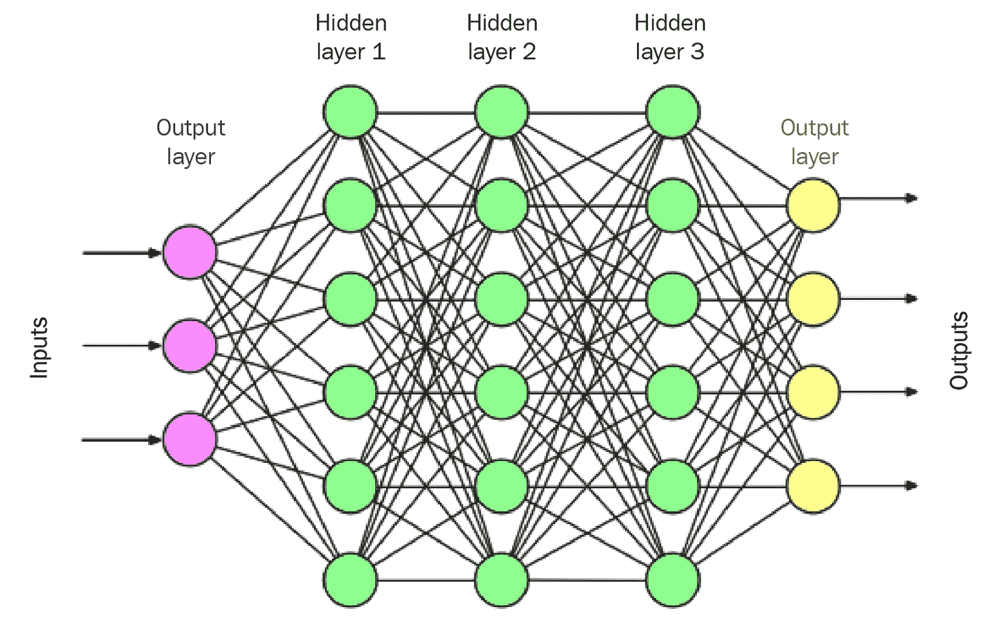
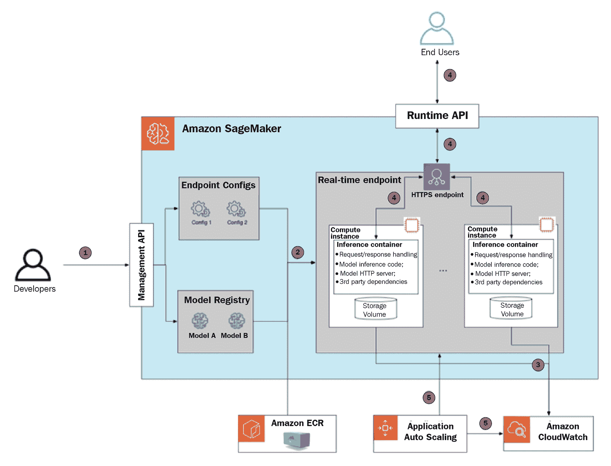
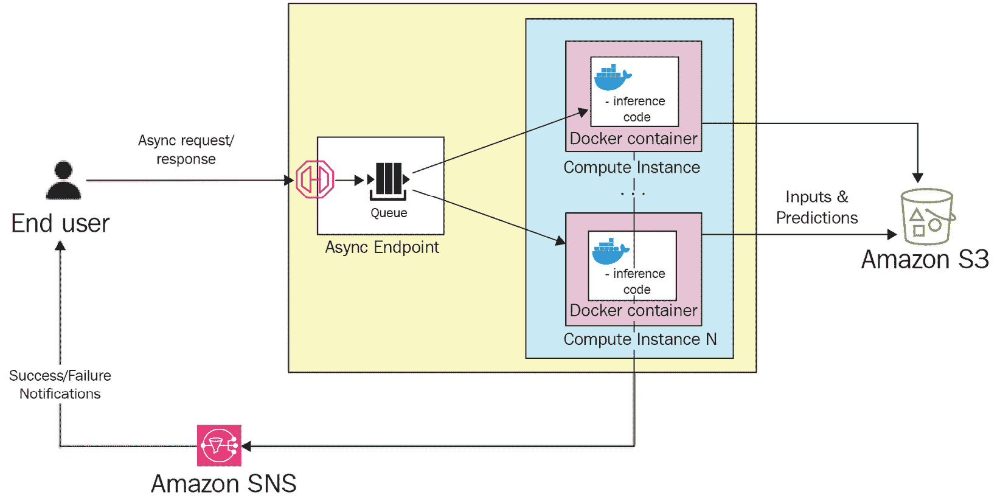
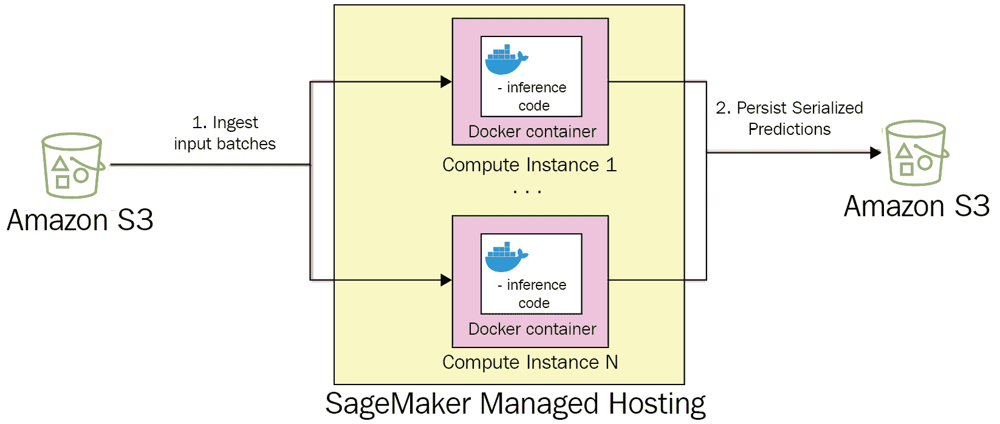

# 1

# 介绍与 Amazon SageMaker 的深度学习

**深度学习**（**DL**）是一个相对较新的但正在积极发展的**机器学习**（**ML**）领域。在过去的 15 年里，深度学习从研究实验室走向了我们的家庭（如智能家居和智能音响）、汽车（即自动驾驶功能）、手机（例如，照片增强软件）以及你每天使用的应用程序（如你最喜欢的视频平台中的推荐系统）。

深度学习模型在计算机视觉（如物体检测与分割、图像分类任务和图像生成）以及语言任务（如翻译、实体提取和文本情感分析）等任务中，已经达到了甚至超越了人类的准确性。除这些领域外，深度学习还被广泛应用于复杂领域，如医疗保健、信息安全、机器人技术和自动化。

我们应该预期这些领域中的深度学习应用将随着时间的推移不断增长。随着当前成果和未来的承诺，也伴随而来的是实现深度学习模型时的挑战。但在讨论这些挑战之前，我们先来快速回顾一下深度学习是什么。

在本章中，我们将完成以下内容：

+   我们将快速回顾一下深度学习及其挑战

+   我们将概述 Amazon SageMaker 以及它在深度学习项目中的价值主张

+   我们将概述 SageMaker 的基础组件——即托管训练和托管栈

+   我们将概述其他关键的 AWS 服务

以下主题将涵盖：

+   使用 Amazon SageMaker 探索深度学习

+   选择 Amazon SageMaker 处理深度学习工作负载

+   探索 SageMaker 的托管训练栈

+   使用 SageMaker 的托管托管栈

+   与 AWS 服务的集成

# 技术要求

本章中有多个动手编码示例。要跟随这些示例，您需要以下内容：

+   一个 AWS 账户和具有管理 Amazon SageMaker 资源权限的 IAM 用户。

+   安装了 Python3 和 SageMaker SDK 的计算机或云主机（[`pypi.org/project/sagemaker/`](https://pypi.org/project/sagemaker/)）。

+   已安装 AWS CLI（请参见 [`docs.aws.amazon.com/cli/latest/userguide/install-cliv2.xhtml`](https://docs.aws.amazon.com/cli/latest/userguide/install-cliv2.xhtml)）并配置为使用 IAM 用户（请参见 [`docs.aws.amazon.com/cli/latest/userguide/cli-configure-quickstart.xhtml`](https://docs.aws.amazon.com/cli/latest/userguide/cli-configure-quickstart.xhtml) 的说明）。

+   要使用某些 SageMaker 实例类型进行训练，您可能需要请求在 AWS 账户中的服务限制增加。有关更多信息，请访问 [`docs.aws.amazon.com/general/latest/gr/aws_service_limits.xhtml`](https://docs.aws.amazon.com/general/latest/gr/aws_service_limits.xhtml)。

本章中的所有代码可以从 [`github.com/PacktPublishing/Accelerate-Deep-Learning-Workloads-with-Amazon-SageMaker`](https://github.com/PacktPublishing/Accelerate-Deep-Learning-Workloads-with-Amazon-SageMaker) 下载。

# 使用 Amazon SageMaker 探索深度学习

深度学习是机器学习领域的一个子集，它使用一种特定的架构：各层之间相互连接的可学习参数。在这种架构中，每一层都在从训练数据集中“学习”一种表示。每一组新的训练数据样本会稍微调整模型各层中的可学习参数，以最小化损失函数。堆叠的层数构成了模型的“深度”。在推理时（即，当我们使用模型从输入信号推理输出时），每一层接收来自前一层输出的输入，根据输入计算其表示，并将其传递给下一层。



图 1.1 – 全连接深度学习网络

简单的深度学习模型可能仅由几个全连接层组成，而**最先进的**（**SOTA**）模型则有数百个层次，包含数百万甚至数十亿个可学习的参数。而且，模型的规模还在不断增长。例如，我们来看看 GPT 系列模型在各种自然语言处理任务中的演变。GPT-1 模型于 2018 年发布，拥有 1.1 亿个参数；2019 年发布的 GPT-2 模型拥有 15 亿个参数；最新版本 GPT-3 于 2020 年发布，拥有 1750 亿个参数！

随着参数数量的增加，深度学习从业者面临着若干工程问题：

+   我们如何在训练时将模型放入实例内存？如果不可能，那么如何将模型拆分到多个 GPU 设备和/或计算节点的内存中？

+   我们如何在训练时组织多个节点之间的通信，以便整体模型能够汇总各个节点的学习成果？

层内部结构也变得越来越复杂，需要更多的计算能力。深度学习模型通常还需要大量特定格式的数据。

因此，为了能够成功地训练和使用最先进的深度学习模型，机器学习工程师需要解决以下任务（当然，除了实现最先进的模型）：

+   在训练和推理过程中，获得大量专用计算资源

+   设置并维护软件堆栈（例如，GPU 库、深度学习框架和加速库）

+   实现、管理和优化分布式训练任务

+   实现、部署和监控推理管道

+   在调优模型性能时，组织高效的时间和成本实验

+   预处理、标记和访问大数据集（数 GB 和 TB 的数据）

如你所见，这些任务不一定与解决特定的业务问题相关。然而，你需要将这些组件都配置正确，以确保能够使用深度学习模型在时间和预算的范围内，以最高的准确度解决某一特定的业务问题。

## 使用 SageMaker

Amazon SageMaker 是 AWS 的一项服务，旨在通过消除“无差异的繁重工作”（例如前面提到的任务）来简化机器学习从业者的工作，让你能专注于实际解决业务问题。它集成了各种功能，帮助构建、训练和部署机器学习模型。SageMaker 首次推出是在 2017 年末，之后大幅扩展，仅在 2020 年，根据 AWS 的*Re:invent 2020*大会的主题演讲，便新增了 200 多项功能。

Amazon SageMaker 面向广泛的受众和使用场景，包括以下内容（这只是一个非独占的列表）：

+   没有太多机器学习背景的开发者

+   企业数据科学团队

+   领先的研究机构希望开展前沿研究

SageMaker 是一个托管服务，通过 API 抽象了底层计算资源和软件组件的管理。AWS 客户使用这些 API 创建训练任务，管理模型工件，并将模型部署到 Amazon SageMaker 进行推理。AWS 负责 SageMaker 资源的高可用性，并提供相应的**服务级别协议**（**SLAs**）。Amazon SageMaker 采用“按需付费”模式，客户仅为实际使用的资源付费。

在本书中，我们将探索与深度学习模型和工作负载相关的 SageMaker 功能，并为流行的深度学习用例（如**自然语言处理**（**NLP**）和**计算机视觉**（**CV**））构建端到端解决方案。

我们将专注于以下 Amazon SageMaker 功能：

+   模型开发阶段：

    +   使用 SageMaker GroundTruth 进行数据准备

    +   使用 SageMaker Processing 进行数据的预处理和后处理

    +   与数据存储解决方案的集成 – Amazon S3、Amazon EFS 和 Amazon FSx for Lustre

    +   使用 SageMaker Studio IDE 和 Notebooks 开发模型

+   训练阶段：

    +   托管的训练实例和软件堆栈

    +   支持 TensorFlow 和 Pytorch 框架的深度学习容器

    +   使用 SageMaker 的 DataParallel 和 ModelParallel 库实现分布式训练

    +   使用 SageMaker Debugger 进行训练监控和调试

+   推理：

    +   托管的批处理和实时推理平台

    +   在推理时对模型进行监控

    +   为深度学习服务计算实例

在本书的进程中，我们还将学习如何使用 SageMaker API 和 SDK 来编程管理我们的资源。此外，我们还将讨论优化策略和 SageMaker 功能，以降低成本并缩短上市时间。

本书专注于深度学习功能，因此我们将暂时搁置一些 SageMaker 的功能和特点。你可以通过阅读 SageMaker 文档（[`docs.aws.amazon.com/sagemaker/latest/dg/whatis.xhtml`](https://docs.aws.amazon.com/sagemaker/latest/dg/whatis.xhtml)）和实践博客（[`aws.amazon.com/blogs/machine-learning/category/artificial-intelligence/sagemaker/`](https://aws.amazon.com/blogs/machine-learning/category/artificial-intelligence/sagemaker/)）进一步探索 Amazon SageMaker。

在接下来的章节中，我们将了解 SageMaker 如何帮助我们处理深度学习工作负载。

# 选择 Amazon SageMaker 进行深度学习工作负载

如前所述，深度学习工作负载由于需要访问大量专门资源（主要是 GPU 设备和高吞吐量存储解决方案），因此面临多种工程挑战。然而，管理软件栈也是一个挑战，因为机器学习和深度学习框架会频繁发布新版本。由于相关成本较高，因此必须高效地组织训练和推理工作，以避免浪费。

让我们来回顾一下 SageMaker 如何应对这些挑战。

## 托管的计算和存储基础设施

SageMaker 为你的训练和推理工作负载提供了完全托管的计算基础设施。SageMaker 训练和推理集群能够在几分钟内扩展至几十个甚至上百个独立实例。这在需要快速访问大型计算集群且只需要短时间使用的场景中尤其有用（例如，你需要每隔几个月就训练一次复杂的深度学习模型，并且数据集很大）。与其他 AWS 服务一样，SageMaker 资源为推理端点提供了先进的自动扩展功能，以便客户根据需求调整资源，而无需过度配置资源。

你还可以根据特定深度学习模型和工作负载类型的需求，从越来越多的计算实例中进行选择。例如，在许多场景下，你可能需要使用基于 GPU 的实例来训练你的深度学习模型，而在推理时，可能可以使用较便宜的 CPU 实例，而不会影响最终用户性能。SageMaker 使你能够根据特定的深度学习模型和任务选择最优实例。

在发生故障时，AWS 会自动替换故障实例，无需客户干预。

这些 SageMaker 功能极大地惠及客户，因为 SageMaker 简化了机器学习基础设施的容量规划和运营管理。

## 管理的深度学习软件栈

要构建、训练和部署深度学习模型，你需要使用各种框架和软件组件来执行专门的计算以及在分布式集群中进行设备和节点之间的通信。在不同开发环境中创建和维护软件栈可能会非常繁琐。

为了解决这些需求，作为 SageMaker 生态系统的一部分，AWS 提供了多个预构建的开源 Docker 容器，支持流行的深度学习框架，如 PyTorch、TensorFlow、MXNet 等。这些容器由 AWS 构建和测试，并针对特定任务（例如，训练与推理的不同容器）和计算平台（基于 CPU 或 GPU 的容器，不同版本的 CUDA 工具包等）进行了优化。

由于 Docker 容器提供了互操作性和封装性，开发人员可以利用预构建的 SageMaker 容器，在将工作负载部署到云集群之前，先在本地构建和调试它们，从而缩短开发周期。你还可以根据特定需求扩展或修改 SageMaker 容器。

### 高级操作功能

虽然 Amazon SageMaker 利用多个流行的开源深度学习解决方案，但它还提供了一些独特的功能来解决在实现 ML 工作负载时遇到的特定挑战，例如：

+   SageMaker Debugger

+   SageMaker 模型监控

+   SageMaker 的 DataParallel/ModelParallel 分布式训练库

接下来让我们继续查看与其他 AWS 服务的集成。

### 与其他 AWS 服务的集成

Amazon SageMaker 与其他 AWS 服务紧密集成，帮助开发人员构建可扩展、高效且安全的工作负载。

在下一部分，我们将看看如何利用 Amazon SageMaker 的托管训练堆栈来运行深度学习模型。

# 探索 SageMaker 的托管训练堆栈

Amazon SageMaker 提供一套功能和与其他 AWS 服务的集成点，用于配置、运行和监控机器学习训练任务。通过 SageMaker 托管训练，开发人员可以执行以下操作：

+   从各种内置算法和容器中选择，或者使用自带的模型（BYO 模型）

+   根据模型需求，从广泛的计算实例中选择

+   使用 SageMaker Debugger 调试和分析其训练过程，接近实时

+   运行偏差检测和模型可解释性任务

+   运行增量训练任务，从检查点恢复并使用 Spot 实例

Spot 实例

Amazon EC2 Spot 实例为客户提供了以较低价格（最高可达 90%）访问未使用的计算资源的机会。当其他人抢占这些实例时，Spot 实例会被释放，导致工作负载中断。

+   运行模型调优任务，搜索最优的模型超参数组合

+   在可搜索的实验目录中组织训练任务

Amazon SageMaker 提供以下开箱即用的功能：

+   配置、引导和销毁训练节点

+   捕获训练任务的日志和指标

在本节中，我们将逐步介绍 SageMaker 训练任务的所有阶段及其相关组件。请参考下图，图中提供了创建、管理和监控您第一个 SageMaker 训练任务的逐步指南。我们将在本书的 *第二部分* 讨论 SageMaker 管理训练堆栈的高级功能：


图 1.2 – Amazon SageMaker 训练架构

让我们逐步了解每个步骤。

我们还将提供代码示例，说明如何使用 SageMaker Python SDK 配置 SageMaker 训练任务（[`sagemaker.readthedocs.io/en/stable/`](https://sagemaker.readthedocs.io/en/stable/)）。

## 步骤 1 – 配置并创建训练任务

您可以通过 API 调用实例化 SageMaker 训练任务。

SageMaker 定义了几个必须提供的配置参数。它们如下所示。

### 选择训练算法

Amazon SageMaker 支持多种类型的机器学习算法：

+   **内置算法**是所有 SageMaker 用户开箱即用的。截止到本文写作时，18 个内置算法涵盖了各种使用场景，包括计算机视觉和自然语言处理任务的深度学习算法。用户只需要负责提供算法的超参数。

+   **自定义算法**由用户开发。在这种情况下，AWS 不负责训练逻辑。训练脚本将在 Docker 容器内执行。开发人员可以选择使用 AWS 提供的预装软件依赖的 Docker 镜像，也可以使用自带 Docker 镜像。

+   **市场算法**由第三方供应商开发，并通过 AWS Marketplace 提供。与内置算法类似，它们通常提供完全托管的体验，用户负责提供算法的超参数。不同于内置算法是免费的，使用市场算法时用户通常需要支付费用。

### 定义 IAM 角色

Amazon SageMaker 依赖于 Amazon IAM 服务，特别是 IAM 角色，用于定义哪些 AWS 资源和服务可以从训练任务中访问。这就是为什么在每次调度 SageMaker 训练任务时，都需要提供一个 IAM 角色，之后该角色会被分配给训练节点。

### 定义训练集群

另一组必需的参数定义了训练集群的硬件配置，包括多个计算实例、实例类型以及实例存储。

建议根据具体需求仔细选择实例类型。至少，ML 工程师需要了解训练时使用的是哪种计算设备。例如，在大多数深度学习（DL）模型的情况下，通常需要使用基于 GPU 的实例，而许多经典的机器学习算法（如线性回归或随机森林）则是 CPU 绑定型的。

机器学习工程师还需要考虑应该配置多少实例。在配置多个节点时，您需要确保您的算法和训练脚本支持分布式训练。

内置算法通常会在其公共文档中提供推荐的实例类型和数量。它们还会定义是否支持分布式训练。如果不支持分布式训练，您应该配置单节点训练集群。

### 定义训练数据

Amazon SageMaker 支持几种用于训练数据的存储解决方案：

+   **Amazon S3**：这是一个低成本、高耐久性且高可用性的对象存储。它被视为存储训练数据集的默认选择。Amazon S3 支持两种输入模式（也在训练作业配置中定义）用于训练数据集：

    +   **文件**：Amazon SageMaker 将训练数据集从 S3 位置复制到本地目录

    +   **管道**：Amazon SageMaker 通过 Unix 命名管道直接从 S3 流式传输数据到容器

    +   **FastFile**：Amazon SageMaker 提供的一项新的文件流能力。

+   **Amazon EFS**：这是一个弹性文件系统服务。如果用于持久化训练数据，Amazon SageMaker 会自动将训练实例挂载到共享文件系统。

+   **Amazon FSx for Lustre**：这是一个高性能的共享文件系统，优化了最低延迟和最高吞吐量。

在训练开始之前，您需要确保数据已经存储在这些解决方案中的某个位置，然后提供数据集的位置。

请注意，您可以在训练作业中提供多个数据集的位置（例如，训练集、测试集和评估集）。

### 选择您的算法超参数

虽然这不是严格要求的，但在大多数情况下，您需要定义算法的某些超参数。此类超参数的示例包括批量大小、训练轮数和学习率。

在训练时，这些超参数将作为命令行参数传递给训练脚本。在自定义算法的情况下，开发人员需要负责在训练脚本中解析并设置超参数。

### 定义训练度量指标

**度量指标**是另一个可选但重要的参数。SageMaker 提供了与 Amazon CloudWatch 的开箱即用集成，可以实时传输训练日志和度量指标。在日志的情况下，SageMaker 会自动将 `stdout` 和 `stderr` 从训练容器传输到 CloudWatch。

stdout 和 stderr

`stdout` 和 `stderr` 是 Linux 和类 Unix 操作系统中的标准数据流。每次运行 Linux 命令时，这些数据流都会自动建立。正常的命令输出会发送到 `stdout`；任何错误消息则会发送到 `stderr`。

对于指标，用户需要首先定义每个指标的正则表达式模式。在训练时，运行在训练实例上的 SageMaker 实用程序将监控`stdout`和`stderr`中的正则表达式模式匹配，然后提取该指标的值并将指标名称和值提交到 CloudWatch。因此，开发人员可以在 CloudWatch 中近实时地监控训练过程。

一些常见的训练指标示例包括损失值和准确性度量。

### 配置 SageMaker 训练任务以进行图像分类

在下面的 Python 代码示例中，我们将演示如何配置一个简单的训练任务，使用内置的**图像分类**算法（[`docs.aws.amazon.com/sagemaker/latest/dg/image-classification.xhtml`](https://docs.aws.amazon.com/sagemaker/latest/dg/image-classification.xhtml)）：

1.  从您的初始导入开始：

    ```py
    import sagemaker
    from sagemaker import get_execution_role
    ```

1.  `get_execution_role()`方法允许您获取当前的 IAM 角色。此角色将用于调用 SageMaker API，而`sagemaker.Session()`则存储与 SageMaker 及其他 AWS 服务（如 S3）的交互上下文：

    ```py
    role = get_execution_role() 
    sess = sagemaker.Session() 
    ```

1.  `.image_uris.retrieve()`方法允许您识别与内置图像分类算法相关的正确容器。请注意，如果选择使用自定义容器，您需要为您的特定训练容器指定一个 URI：

    ```py
    training_image = sagemaker.image_uris.retrieve('image-classification', sess.boto_region_name)
    ```

1.  定义训练集群中的实例数量。由于图像分类支持分布式训练，我们可以为训练集群分配多个实例以加速训练：

    ```py
    num_instances = 2
    ```

1.  图像分类算法需要基于 GPU 的实例，因此我们将选择使用 SageMaker P2 实例类型：

    ```py
    instance_type = "ml.p2.xlarge"
    ```

1.  接下来，我们必须定义训练和验证数据集的位置。请注意，图像分类算法支持多种数据格式。在本例中，我们选择使用 JPG 文件格式，这还需要`.lst`文件列出所有可用的图像：

    ```py
    data_channels = {
        'train': f"s3://{sess.default_bucket()}/data/train", 
        'validation': f"s3://{sess.default_bucket()}/data/validation", 
        'train_lst': f"s3://{sess.default_bucket()}/data/train.lst",
        'vadidation_lst': f"s3://{sess.default_bucket()}/data/validation.lst",
    }
    ```

1.  配置训练的超参数：

    ```py
    hyperparameters=dict(
        use_pretrained_model=1,
        image_shape='3,224,224',
        num_classes=10,
        num_training_samples=40000, # TODO: update it
        learning_rate=0.001,
        mini_batch_size= 8    
    )
    ```

1.  配置`Estimator`对象，它封装了训练任务的配置：

    ```py
    image_classifier = sagemaker.estimator.Estimator(
        training_image,
        role, 
        train_instance_count= num_instances, 
        train_instance_type= instance_type,
        sagemaker_session=sess,
        hyperparameters=hyperparameters,
    )
    ```

1.  `fit()`方法将训练任务提交给 SageMaker API。如果没有问题，您应该会在 AWS 控制台中看到一个新的训练任务实例。您可以通过进入**Amazon SageMaker** | **Training** | **Training Jobs**来查看：

    ```py
    image_classifier.fit(inputs=data_channels, job_name="sample-train")
    ```

接下来，我们将配置训练集群。

## 第 2 步 – 配置 SageMaker 训练集群

提交训练任务请求后，SageMaker 会自动执行以下操作：

+   分配请求的训练节点数量

+   分配 Amazon EBS 卷并将其挂载到训练节点上

+   为每个节点分配 IAM 角色

+   启动各种实用工具（如 Docker、SageMaker 工具包库等）

+   将训练配置（超参数、输入数据配置等）定义为环境变量

接下来是训练数据。

## 第 3 步 – SageMaker 访问训练数据

当您的训练集群准备就绪时，SageMaker 为计算实例建立访问训练数据的权限。访问训练数据的确切机制取决于您的存储解决方案：

+   如果数据存储在 S3 中并且输入模式为**File**，则数据将下载到实例的 EBS 卷上。请注意，根据数据集的大小，下载数据可能需要几分钟。

+   如果数据存储在 S3 中并且输入模式为**Pipe**，则数据将根据需要在训练时从 S3 流式传输。

+   如果数据存储在 S3 中，并且输入模式为**FastFile**，则训练程序将像文件存储在训练节点上一样访问这些文件。但在底层，文件将从 S3 流式传输。

+   如果数据存储在 EFS 或 FSx for Luster 中，则训练节点将挂载在文件系统上。

训练继续部署容器。

## 第 4 步 - SageMaker 部署训练容器

SageMaker 会自动从 ECR 仓库中拉取训练映像。请注意，内置算法会抽象出底层的训练映像，使用户无需定义容器映像，只需定义要使用的算法。

## 第 5 步 - SageMaker 启动并监控训练作业

要启动训练作业，SageMaker 在所有训练节点上执行以下命令：

```py
docker run [TrainingImage] train
```

如果训练集群具有带 GPU 设备的实例，则将使用`nvidia-docker`。

训练脚本启动后，SageMaker 会执行以下操作：

+   捕获`stdout`/`stderr`并将其发送到 CloudWatch 日志。

+   运行正则表达式模式匹配以获取度量指标并将度量值发送到 CloudWatch。

+   从 SageMaker API 监听`SIGTERM`信号（例如，如果用户决定提前停止训练作业）。

+   监控是否发生早停止条件并在此情况下发出`SIGTERM`。

+   监控训练脚本的退出代码。在非零退出代码的情况下，SageMaker 将标记训练作业为“失败”。

## 第 6 步 - SageMaker 将持久化训练产物

无论训练作业成功还是失败，SageMaker 都会将产物存储在以下位置：

+   `/opt/ml/output`目录，可以用来在作业完成后持久化任何训练产物。

+   `/opt/ml/model`目录，其内容将被压缩成`.tar`格式并存储在 SageMaker 模型注册表中。

一旦您的第一个模型训练完毕以解决特定的业务问题，下一步就是使用您的模型（在 ML 术语中，**进行推断**）。在接下来的几节中，我们将了解 SageMaker 为运行各种用例的 ML 推断工作负载提供了哪些能力。

# 使用 SageMaker 的托管主机堆栈

Amazon SageMaker 支持多种类型的托管主机基础设施：

+   一个持久的同步 HTTPS 端点，用于实时推断

+   一个用于准实时推断的异步端点

+   一个瞬时的批量转换作业，用于整个数据集的推断

在下一部分，我们将讨论在何时使用哪种类型的托管基础设施的用例，并将详细回顾实时推理端点。

## 实时推理端点。

实时端点专为需要尽快获得推理结果的用例设计。SageMaker 的实时端点是一个 HTTPS 端点：模型输入由客户端通过 POST 请求负载提供，推理结果在响应体中返回。通信是同步的。

有许多场景适合使用实时端点，例如：

+   基于用户的观看历史、个人评分和当前流行趋势，在用户打开流媒体应用程序时提供电影推荐。

+   检测实时视频流中的物体。

+   在用户输入文本时生成建议的下一个单词。

SageMaker 实时端点为客户提供一系列功能，用于设计和管理其推理工作负载：

+   创建一个完全托管的计算基础设施，并实现横向扩展（意味着单个端点可以使用多个计算实例来应对高流量负载，而不会导致性能下降）。

+   有多种 EC2 计算实例类型可供选择，具体取决于模型的需求，包括 AWS 的自定义芯片 Inferentia 和 SageMaker 弹性推理。

+   针对流行的深度学习框架提供预构建的推理容器。

+   多模型和多容器端点。

+   用于 A/B 测试的模型生产变体。

+   多模型推理管道。

+   性能、准确性和偏差的模型监控。

+   使用 SageMaker Neo 和 SageMaker Edge Manager 在边缘设备上优化和管理推理。

由于这是一个托管能力，Amazon SageMaker 负责管理用户实时端点的以下方面：

+   根据客户定义的扩展策略提供和扩展基础计算基础设施。

+   在单个 SageMaker 端点上部署多个模型时，模型版本和容器之间的流量塑形。

+   在计算实例和模型级别流式传输日志和度量指标。

## 创建和使用您的 SageMaker 端点。

让我们一起走过配置、提供和使用第一个 SageMaker 实时端点的过程。这将帮助您理解其内部工作原理和可用的配置选项。以下图表提供了一个视觉指南：



图 1.3 – SageMaker 推理端点的部署与使用。

### 第一步 – 启动端点创建。

有几种方法可以启动 SageMaker 端点创建：SageMaker Python SDK、boto3 SDK、AWS CLI 或通过 CloudFormation 模板。在请求过程中，您需要提供以下几个参数：

+   SageMaker Model Registry 中的**模型定义**，将在推理时使用。模型定义包括对 S3 中序列化模型工件的引用，以及对 Amazon ECR 中推理容器（或多容器端点的情况下的多个容器）的引用。

+   **端点配置**，定义计算实例的数量和类型，以及（可选）多个模型的组合（在多模型端点的情况下）或多个模型生产变体的组合（在 A/B 测试的情况下）。

### 第二步 – 配置 SageMaker 端点用于图像分类

以下 Python 代码示例展示了如何使用先前训练的图像分类模型创建和部署端点：

1.  从初始导入、IAM 角色和 SageMaker 会话实例化开始：

    ```py
    import sagemaker
    from sagemaker import get_execution_role
    role = get_execution_role()
    sess = sagemaker.Session()
    ```

1.  获取图像分类算法的推理容器 URI：

    ```py
    image_uri = sagemaker.image_uris.retrieve('image-classification', sess.boto_region_name)
    ```

1.  定义存储在 S3 中的模型工件（如训练权重）的位置：

    ```py
    model_data = f"s3://{sess.default_bucket}/model_location"
    ```

1.  创建一个 SageMaker `Model`对象，封装模型配置：

    ```py
    model = Model(
    image_uri=image_uri, 
    model_data=model_data,
    name="image-classification-endpoint",
    sagemaker_session=sess,
    role=role
    )
    ```

1.  定义端点配置参数：

    ```py
    endpoint_name = "image-classification-endpoint"
    instance_type = "ml.g4dn.xlarge"
    instance_count = 1
    ```

1.  `.predict()`方法向 SageMaker 提交请求，创建部署了特定模型的端点：

    ```py
    predictor = model.deploy(
    instance_type=instance_type, 
    initial_instance_count=instance_count,
    endpoint_name=endpoint_name,
    )
    ```

完成这些步骤后，SageMaker 开始工作。

### 第三步 – SageMaker 配置端点

提交配置请求后，SageMaker 执行以下操作：

+   根据端点配置分配多个实例

+   它将部署推理容器

+   它将下载模型工件

从开始到完成端点配置需要几分钟时间。配置时间取决于多个参数，如实例类型、推理容器大小以及需要上传到推理实例的模型工件大小。

请注意，SageMaker 不直接暴露推理实例。相反，它使用前端负载均衡器，然后在配置的实例之间分发流量。作为托管服务，您永远不会直接与推理实例交互，只能通过 SageMaker API 进行操作。

### 第四步 – SageMaker 启动模型服务器

一旦端点完全配置完成，SageMaker 通过运行以下命令启动推理容器，执行容器中的`ENTRYPOINT`命令：

```py
docker run image serve
```

此脚本执行以下操作：

+   启动模型服务器，暴露 HTTP 端点

+   使模型服务器将模型工件加载到内存中

+   在推理时，使模型服务器执行推理脚本，定义如何预处理数据

在 SageMaker 托管的 Docker 镜像情况下，模型服务器和启动逻辑已由 AWS 实现。如果选择自己带服务的容器（BYO serving container），则需要单独实现。

SageMaker 捕获 `stdout`/`stderr` 流并自动将其流式传输到 CloudWatch 日志。它还会流式传输实例指标，如总调用次数和每个实例的调用次数、调用错误和延迟指标。

### 步骤 5 – SageMaker 端点处理流量

一旦模型服务器启动并运行，最终用户可以向 SageMaker 端点发送 `POST` 请求。该端点会根据授权头进行请求授权（当使用 SageMaker Python SDK 或 AWS CLI 时，这些头部会根据 IAM 配置文件自动生成）。如果授权成功，则将负载发送到推理实例。

运行中的模型服务器通过执行推理脚本来处理请求，并返回响应负载，然后将其传递给最终用户。

### 步骤 6 – SageMaker 扩展推理端点的规模

您可以选择定义自动扩展策略，以便在端点实例之间进行扩展或缩减。在这种情况下，SageMaker 会根据需求更高效地添加或移除端点后面的计算节点。请注意，SageMaker 仅支持水平扩展，例如添加或移除计算节点，而不支持更改实例类型。

SageMaker 支持多种类型的扩展事件：

+   手动方式，用户通过 API 调用更新端点配置

+   一种目标追踪策略，SageMaker 根据用户定义的指标的值（例如调用次数或资源利用率）来扩展或缩减

+   一种步骤扩展策略，它提供更细粒度的控制，允许用户根据阈值的突破程度调整实例的数量

+   一种计划扩展策略，允许您根据特定的计划扩展 SageMaker 端点（例如，在流量较低的周末进行缩减，在流量较高的工作日进行扩展）

### 高级模型部署模式

我们刚刚回顾了一个简单的单模型实时端点的结构。然而，在许多现实场景中，需要在任何给定时间点都能提供数十个或数百个模型，这种方法将导致大量的推理节点未被充分利用或不均匀使用。

这种情况通常是不可取的，因为它会导致高昂的计算成本而没有为最终用户带来任何价值。为了解决这个问题，Amazon SageMaker 提供了一些高级部署选项，允许您将多个模型合并到同一个实时端点中，从而更高效地利用资源。

#### 多容器端点

部署多容器端点时，您可以在同一个端点中指定最多 15 个不同的容器。每个推理容器都有自己的模型工件和运行时环境。这使得您能够在单个 SageMaker 端点内部署使用不同框架和运行时环境构建的模型。

在创建时，你需要定义一个唯一的容器主机名。然后，每个容器可以独立调用。在终端调用期间，你需要将该容器主机名作为请求头之一提供。SageMaker 将根据该请求头自动将推理请求路由到正确的容器。

当有多个模型且流量较低，且这些模型有不同的运行时环境（例如，Pytorch 和 TensorFlow）时，这个功能非常实用。

#### 推理管道

类似于多容器终端，推理管道允许你在单个 SageMaker 终端中组合不同的模型和容器运行时环境。然而，这些容器是按顺序调用的。该功能适用于需要使用不同运行时要求进行前处理和/或后处理的推理请求场景；例如：

+   前处理阶段使用 scikit-learn 库完成

+   推理使用深度学习框架完成

+   后处理使用自定义运行时环境完成，例如 Java 或 C++

通过将推理管道的不同阶段封装在单独的容器中，一个容器的变化不会对其他容器产生不利影响，例如更新依赖版本。由于推理管道中的容器位于同一计算节点上，因此可以保证容器之间请求交接时的低延迟。

#### 多模型终端

多模型终端允许你在单个终端中部署数百个模型。与多容器终端和推理管道不同，多模型终端只有一个运行时环境。SageMaker 会自动将模型工件加载到内存中，并处理推理请求。当模型不再需要时，SageMaker 会将其从内存中卸载，以释放资源。这会导致在一段时间后首次调用模型时出现一些额外的延迟。模型工件存储在 Amazon S3 中，并由 SageMaker 自动加载。

多模型终端的核心是 AWS 开发的开源 Multi-Model Server，它提供模型管理功能（加载、卸载和资源分配），并通过 HTTP 前端接收推理请求，执行给定模型的推理代码，并返回结果负载。

多模型终端在有大量同质模型且最终用户可以容忍预热延迟时最为适用。

## SageMaker 异步终端

到目前为止，我们讨论了 SageMaker 实时终端，它们是同步工作的：用户通过发送 POST 请求调用终端，等待终端运行推理代码，然后返回推理结果到响应负载中。推理代码预计会在 60 秒内完成；否则，SageMaker 终端将返回超时响应。

然而，在某些场景中，这种同步通信模式可能会带来问题：

+   大型模型可能需要相当长的时间来进行推理

+   大型负载数据（例如，高分辨率图像）

对于此类场景，SageMaker 提供了异步端点，允许您排队推理请求并异步处理，避免了潜在的超时问题。异步端点还允许处理更大的负载，最大可达 1 GB，而 SageMaker 实时端点的限制为 5 MB。异步端点可以在推理队列为空时缩减到 0 个实例，以提供额外的成本节省。这对于具有零星推理流量模式的场景特别有用。

异步端点的主要权衡是推理结果在*接近*实时的情况下交付，可能不适合那些对一致延迟有要求的场景：



图 1.4 – SageMaker 异步端点

## SageMaker 批量转换

SageMaker 批量转换允许您对一批推理输入进行预测。这对于那些有重复业务流程且对延迟没有严格要求的场景非常有用。例如，每晚执行的任务用于计算负载应用程序的风险。

SageMaker 批量转换对以下用例非常有利：

+   客户仅为任务执行期间消耗的资源付费

+   批量转换任务可以扩展到 GB 级和数十个计算节点

在调度批量转换任务时，您需要定义集群配置（计算节点的类型和数量）、模型工件、推理容器、推理数据集的输入 S3 位置以及生成的预测结果的输出 S3 位置。请注意，客户可以使用相同的容器用于 SageMaker 实时端点和批量转换任务。这使得开发人员可以使用相同的模型/容器进行在线预测（作为实时端点）和离线预测（作为批量转换任务）：



图 1.5 – SageMaker 批量转换任务

通过此方法，您可以了解如何使用 SageMaker 训练任务训练一个简单的深度学习模型，并创建一个实时端点进行推理。在继续之前，我们需要了解一些亚马逊 SageMaker 使用的基础 AWS 服务，这些服务将贯穿本书。

# 与 AWS 服务的集成

亚马逊 SageMaker 依赖于多个 AWS 服务，如存储和密钥管理。在本节中，我们将回顾与其他 AWS 服务的关键集成，以及它们在何种场景下可能有用。

## 数据存储服务

数据存储服务是构建任何机器学习工作负载的关键。AWS 提供了多种存储解决方案，以应对各种实际应用场景。

**Amazon S3** 是一种无服务器对象存储服务，是 AWS 的基础服务之一。SageMaker 利用 S3 处理各种用例，例如：

+   用于存储训练数据集

+   用于存储模型工件和训练输出

+   存储异步端点和批量转换作业的推理输入和输出  

Amazon S3 是一个高耐久性、可扩展且成本高效的存储解决方案。在访问存储在 S3 上的数据时，开发者可以选择将完整数据集从 S3 位置下载到 SageMaker 计算节点，或者通过流式传输数据。将大型数据集从 S3 下载到 SageMaker 计算节点会增加训练作业的启动时间。  

## Amazon EFS

**Amazon Elastic File System**（**EFS**）是一个弹性文件系统服务。Amazon SageMaker 支持将训练数据集存储在 EFS 位置。在训练时，SageMaker 节点会挂载到 EFS 位置并直接访问训练数据集。在这种情况下，节点访问数据时不需要数据迁移，通常可以减少训练作业的启动时间。EFS 还允许多个节点持久化并无缝共享数据（因为这是一个共享系统）。当缓存或系统状态需要在训练节点之间共享时，这非常有用。  

## Amazon FSx for Lustre  

**Amazon FSx for Lustre** 是专门为低延迟、高性能场景设计的共享文件系统服务。Amazon FSx 会自动从 S3 源复制数据，并使其在 SageMaker 计算节点上可用。Amazon FSx 具有与 EFS 相似的优势——即减少训练作业的启动时间，并提供共享文件系统。  

## 编排服务  

编排服务允许你将基于 SageMaker 的工作负载与其他 IT 生态系统进行集成。  

### AWS Step Functions  

AWS Step Functions 是一个无服务器工作流服务，允许你编排业务流程和与其他 AWS 服务的交互。通过 Step Functions，你可以轻松地将单独的步骤组合成可重用和可部署的工作流。它支持可视化设计、分支和条件逻辑。  

Step Functions 提供与 SageMaker 资源的原生集成。在需要通过多个服务协调复杂的机器学习流程时，Step Functions 非常有用。AWS 为开发者提供了 AWS Step Functions Data Science Python SDK 来开发、测试和执行此类流程。  

### Amazon API Gateway  

Amazon API Gateway 是一个完全托管的 API 管理服务，用于开发、监控和管理 API。API Gateway 支持多个功能，在开发高度可扩展和安全的机器学习推理 API 时非常有用：  

+   认证和授权机制  

+   请求缓存、速率限制和流量控制  

+   防火墙功能  

+   请求头和负载转换  

API Gateway 允许你将 SageMaker 实时端点与外部流量隔离，并提供额外的安全层。它还允许你为终端用户提供统一的 API，而无需暴露 SageMaker 运行时 API 的具体细节。  

## 安全服务  

强大的安全控制对于任何机器学习工作负载都是必不可少的，特别是在处理私密和敏感数据时。虽然本书并不专注于安全性，但了解 AWS 上权限和数据加密的基本概念非常重要。

### AWS IAM

**AWS 身份与访问管理** (**IAM**) 允许客户管理对 AWS 服务和资源的访问。在 SageMaker 的情况下，IAM 具有双重功能：

+   IAM 角色和策略定义了 SageMaker 任务可以访问和管理的 AWS 资源——例如，使用假定的 IAM 角色的训练任务是否可以访问 S3 上给定的数据集。

+   IAM 角色和策略定义了哪些主体（用户或服务）可以访问和管理 SageMaker 资源。例如，它定义了给定用户是否可以使用特定集群配置安排 SageMaker 训练任务。

审查 IAM 超出了本书的范围，但您需要了解它。在使用 SageMaker 时，设置 IAM 权限和角色是必要的前提。

### Amazon VPC

**Amazon 虚拟私有云** (**VPC**) 是一项服务，允许您在逻辑上隔离的私有网络中运行云工作负载。这种网络级别的隔离为谁可以访问您的工作负载提供了额外的安全性和控制。SageMaker 允许您在专用的 VPC 内运行训练和推理工作负载，这样您就可以控制从 SageMaker 资源进出的流量。

### AWS KMS

**AWS 密钥管理服务** (**KMS**) 用于加密底层数据。它还管理在加密和解密数据时对加密密钥的访问。在 SageMaker 中，KMS 主要用于加密训练数据、模型工件以及 SageMaker 集群中的底层磁盘。KMS 与所有可用的存储解决方案（如 S3、EFS 和 EBS（底层磁盘卷））集成。

## 监控服务

AWS 提供了专门的服务，用于监控其他 AWS 资源的管理、审计和执行。

### Amazon CloudWatch

**CloudWatch** 提供监控和可观察性功能。在 SageMaker 的上下文中，它主要用于两个目的：

+   用于存储和管理来自 SageMaker 资源（如端点或训练任务）的日志。默认情况下，SageMaker 会将 `stdout`/`stderr` 日志发送到 CloudWatch。

+   用于存储时间序列指标。SageMaker 默认提供了若干指标（例如，对于实时端点，它会流式传输延迟和调用指标）。不过，开发人员也可以实现自定义指标。

### Amazon CloudTrail

**CloudTrail** 捕获与管理任何 AWS 资源（包括 SageMaker 资源）相关的所有活动（如 API 调用）。通常，CloudTrail 用于治理和审计目的，但它也可以用来构建事件驱动的工作流。例如，开发人员可以使用它来监控资源创建或更新请求，并通过编程方式响应特定事件。

# 总结

本章开始时，我们提供了深度学习领域及其挑战的概述，以及 Amazon SageMaker 服务及其对深度学习工作负载的价值主张。然后，我们回顾了 SageMaker 的核心功能：托管训练和托管推理。我们研究了 SageMaker 训练作业和实时推理端点的生命周期。代码片段展示了如何使用 Python SDK 编程方式配置和提供 SageMaker 资源。我们还介绍了其他相关的 AWS 服务，因为在本书的其余部分中，我们将频繁使用它们。这将帮助我们更好地理解它们的使用和功能。

在下一章，我们将更深入地探讨任何 SageMaker 工作负载的基础构建块：运行时环境（特别是支持的深度学习框架）和容器。SageMaker 提供了多个流行的预配置运行时环境和容器，但它也允许通过其“BYO 容器”功能来完全自定义这些环境。我们将学习何时选择这些选项之一以及如何使用它们。
