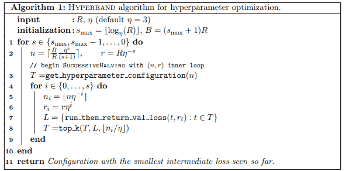
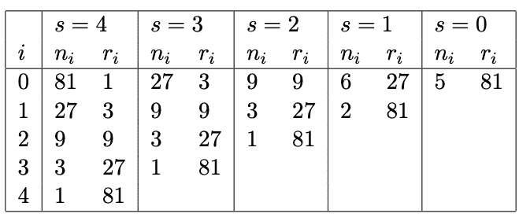
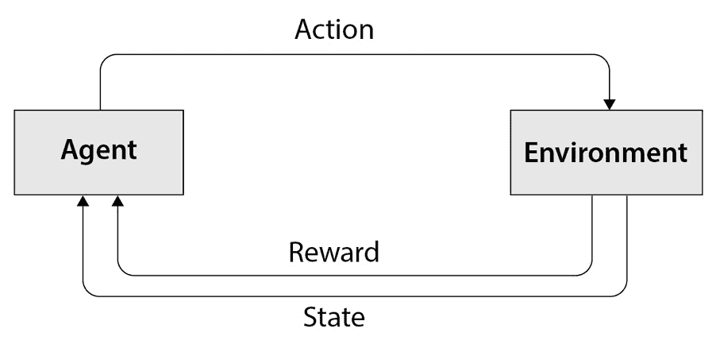
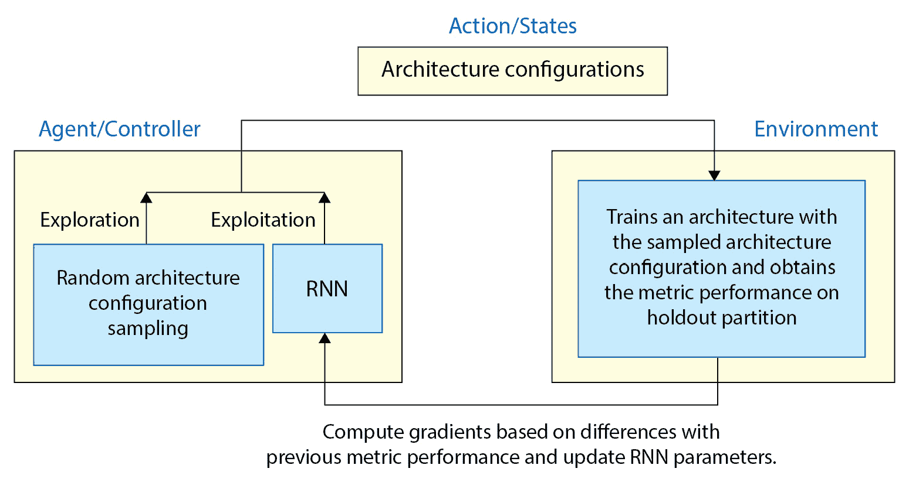
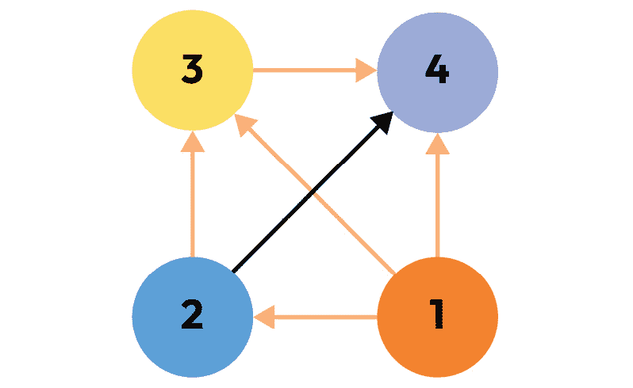
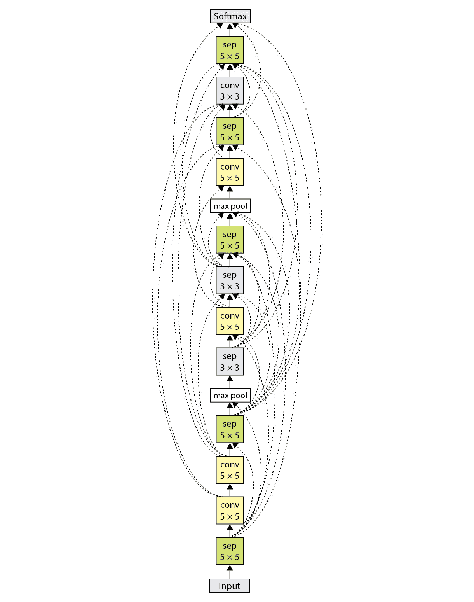
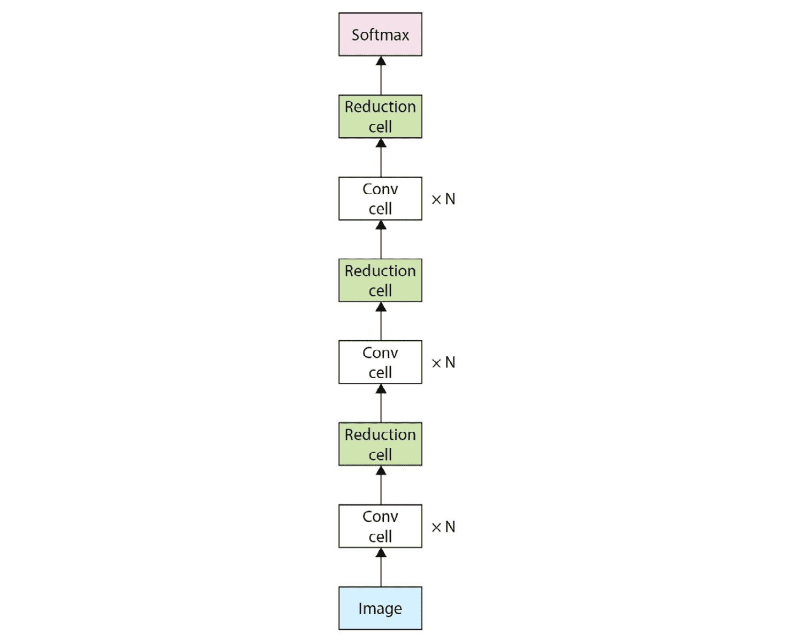
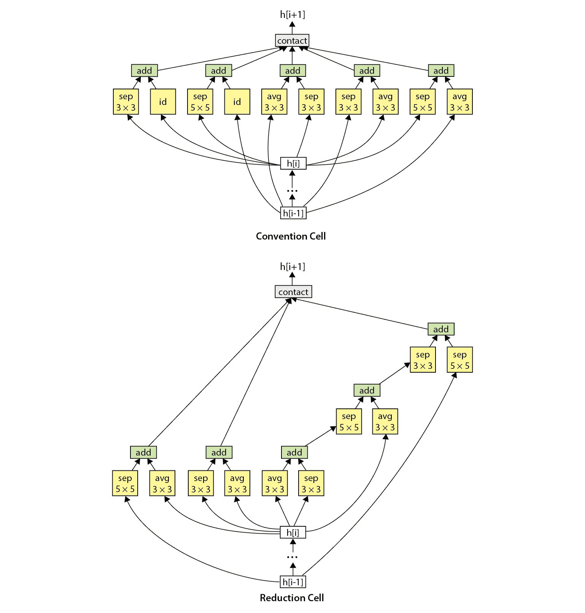
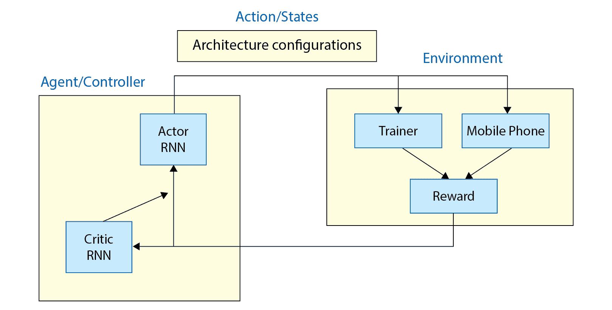
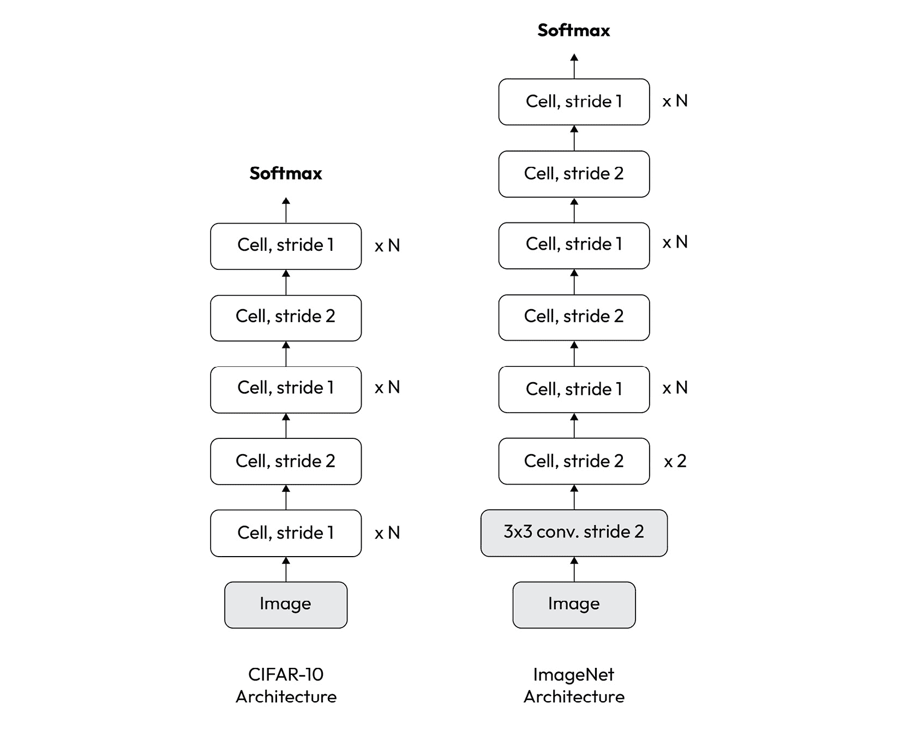

# 7

# 深度神经架构搜索

前几章介绍并回顾了不同的**神经网络**（**NNs**），这些网络被设计用来处理不同类型的数据。设计这些网络需要的知识和直觉是通过多年在该领域的研究才能获得的。大部分网络是由专家和研究人员手工设计的。这包括发明全新的 NN 层，并通过组合和堆叠已存在的 NN 层来构建一个实际可用的架构。这两个任务都需要大量的迭代实验时间，才能成功创建出一个有用的网络。

现在，想象一个我们可以专注于发明有用的新型层，而软件负责自动化最终架构构建过程的世界。自动化架构搜索方法正是通过简化设计最佳最终 NN 架构的任务来实现这一目标，只要根据深厚的领域知识选择合适的搜索空间。在本章中，我们将重点介绍如何通过一种叫做 **神经架构搜索**（**NAS**）的自动化架构创建过程，从已有的 NN 层构建一个实际可用的架构。通过理解不同类型的 NAS，你将能够根据当前的模型构建设置，选择最简单的自动化搜索优化方法，从简单到高效复杂都有涉及。具体来说，以下主题将被介绍：

+   理解 NAS 的大局

+   理解基于一般超参数搜索的 NAS

+   理解基于 **强化学习**（**RL**）的 NAS

+   理解非 RL 基于的 NAS

# 技术要求

本章包括使用 Python 编程语言的实际实现。这些简单的方法需要安装以下库：

+   `numpy`

+   `pytorch`

+   `catalyst ==` `21.12`

+   `scikit-learn`

你可以在 GitHub 上找到本章的代码文件，地址为 [`github.com/PacktPublishing/The-Deep-Learning-Architect-Handbook/tree/main/CHAPTER_7`](https://github.com/PacktPublishing/The-Deep-Learning-Architect-Handbook/tree/main/CHAPTER_7)。

# 理解 NAS 的大局

在我们深入探讨 NAS 方法的全貌之前，重要的是要注意，尽管 NAS 减少了构建最终架构所需的手动工作，但它并没有完全消除该领域专业知识的需求。正如我们之前讨论的，**深度学习**（**DL**）的基础知识对于选择合适的搜索空间并准确解读 NAS 的结果至关重要。搜索空间是搜索过程中可以探索的可能选项或配置的集合。此外，NAS 的性能在很大程度上依赖于训练数据的质量以及搜索空间与任务的相关性。因此，领域专业知识仍然是必要的，以确保最终架构不仅高效，而且准确且与解决的问题相关。通过本节内容的学习，你将更好地理解如何利用你的领域专业知识来优化 NAS 的效果。

前几章关于神经网络（NN）的内容仅介绍了少数几种显著的神经网络层类型，并且只是略微触及了现有神经网络层库的表面。如今，神经网络层的变种非常多，这使得精确设计在架构中的各个环节使用哪些层变得困难。主要问题在于，可能的神经网络架构空间是无限大的。此外，评估任何可能的架构设计需要耗费大量的时间和资源。这些因素使得评估所有可能的神经网络架构变得不可能。以在 ImageNet 上训练**卷积神经网络**（**CNN**）ResNet50 架构为例，来感受这种不可能性的程度。仅使用一块 RTX 3080 Ti Nvidia GPU（这是一款面向普通消费者的 GPU，且可以在市场上购买到）进行训练，大约需要 3-4 天的时间。另一方面，商业消费者通常使用工业级的 GPU 变体，这些 GPU 具有更强的处理能力，可以将训练时间缩短至一天以内。

通常，研究人员会凭直觉手动设计已经存在的神经网络（NN）层和操作。这种手动方法是一次性的努力，当出现更新、更好的核心神经网络层时，反复进行这种操作并不可扩展。这就是神经架构搜索（NAS）发挥作用的地方。NAS 利用已经发明的神经网络层和操作来构建更高效的神经网络架构。NAS 的核心在于通过更智能的方式在不同架构之间进行概念上的搜索。NAS 的搜索机制可以通过三种方式实现，即：**一般超参数搜索优化**、强化学习（RL）以及不使用强化学习的 NAS 方法。

通用超参数搜索优化方法适用于任何**机器学习**（**ML**）算法的超参数优化。强化学习（RL）是另一种高级机器学习方法，与**监督学习**（**SL**）和**无监督学习**（**UL**）一起，它涉及某种形式的优化，在一个环境中采取的行动会产生具有可量化奖励或惩罚的状态。非 RL 基础的 NAS 方法可以进一步分为三种不同类型：从小的架构基线逐步增长的架构、从复杂的完全定义架构图逐步缩小的架构，以及进化算法。逐步增长架构的方法包括所有将简单网络逐渐发展成更大网络的算法，增加其深度或宽度。反之，也有一些方法首先定义一个包含所有可能连接和操作的架构，然后逐步去掉这些连接。最后，**进化算法**是一类基于生物现象（如变异和繁殖）的算法。在本章中，我们将只介绍一些通用超参数搜索优化方法、RL 方法、基于逐步增长的简单 NAS 形式，以及逐步缩小的 NAS 的竞争版本。技术实现将提供给基于逐步增长的 NAS 方法，但其他更复杂的方法将不涉及，更多复杂方法的开源实现将另行参考。

在深入研究上述提到的 NAS 方法之前，你需要先了解**微架构**和**宏架构**的概念。微架构指的是在逻辑模块中所使用的层组合的具体细节。正如在*第三章*《理解卷积神经网络》中介绍的那样，一些逻辑模块可以重复堆叠在一起，以生成实际使用的架构。最终生成的架构中也可能包含不同的逻辑模块和不同的层配置。相比之下，宏架构指的是从更高层次上概述不同模块如何组合形成最终的神经网络架构。NAS 方法的核心思想总是围绕着基于已经整理好的知识来减少搜索空间，这些知识帮助我们知道哪些层或哪些层配置效果最佳。本章将介绍的这些方法，要么在保持宏架构不变的情况下，只在微架构空间中进行搜索，要么具有灵活性，可以通过创新技巧探索微架构和宏架构空间，从而使搜索变得可行。

首先，让我们从最简单的 NAS 方法开始，它是通用超参数搜索优化算法。

# 理解基于通用超参数搜索的 NAS

在机器学习中，参数通常指的是模型在训练过程中学习到的权重和偏差，而**超参数**是训练开始前设定的值，影响模型的学习方式。超参数的例子包括学习率和批量大小。通用的超参数搜索优化算法是一种 NAS 方法，用于自动搜索用于构建给定神经网络架构的最佳超参数。让我们来了解一些可能的超参数。在**多层感知机**（**MLP**）中，超参数可能是控制 MLP 深度的层数、每层的宽度以及使用的中间层激活函数类型。在卷积神经网络（CNN）中，超参数可能是卷积层的滤波器大小、每层的步幅大小以及每个卷积层后使用的中间层激活函数类型。

对于神经网络架构，可配置的超参数类型在很大程度上取决于用于创建和初始化神经网络的辅助工具和方法的能力。例如，考虑单独配置三层隐藏层的任务。如果有一种方法可以生成一个具有固定三层的多层感知机（MLP），那么就可以只对隐藏层大小进行超参数搜索。这可以通过简单地向函数中添加三个超参数来实现，分别设置三层隐藏层的大小。然而，要想实现既能进行层数的超参数搜索，又能进行隐藏层大小的搜索，就必须构建一个辅助方法，动态地应用这些超参数来创建一个 MLP。

最简单的神经架构搜索（NAS）形式利用这些工具来对已定义的超参数进行稍微智能的搜索。这里将介绍三种广为人知的超参数搜索变体；其中包括`pytorch`，因为其实现简短，足够在一章内介绍。让我们从连续二分法开始。

## 使用连续二分法搜索神经网络架构

最基本的通过缩小搜索空间来优化运行时间的方法是随机采样一些超参数配置，仅对采样的配置执行完整的训练和评估。这种方法简单地称为**随机搜索**。如果我们知道某些配置在消耗一定资源后几乎肯定会表现差呢？

连续二分法是随机搜索的一种扩展，它有助于在寻找最佳神经网络架构时节省资源。连续二分法的理念是在每一步中淘汰表现不佳的一半配置，从而使我们能够集中精力在更有前景的配置上。这样，我们就不会浪费时间在那些不太可能产生良好结果的配置上。

让我们通过一个简单的例子来分解这个概念。假设你正在尝试为一个 MLP 找到最佳配置，该配置包含不同的超参数，如层数和每层的大小。你从随机抽取 100 个不同的配置开始。现在，不是将所有 100 个配置训练到完成，你应用了逐步缩减（successive halving）。你将每个配置训练一段短时间（例如 5 个 epoch），然后评估它们在验证集上的表现。此时，你会淘汰表现最差的 50 个配置，继续训练剩下的 50 个配置，再进行 5 个 epoch。

在第二轮训练后，你再次评估剩余配置的性能，并淘汰表现最差的 25 个配置。然后，前 25 个配置可以继续训练，直到收敛。通过应用逐步缩减，你通过专注于最有前景的配置，同时早期淘汰表现不佳的配置，节省了资源和时间。这使得你能够更高效地寻找问题的最佳神经网络架构。

让我们深入研究逐步缩减的技术实现，这将为基于超参数调整的 NAS 下的所有其他方法奠定基础：

1.  让我们首先导入相关的库，并设置`pytorch`库的随机种子，以确保结果的可复现性：

    ```py
    import json
    import os
    import numpy as np
    import torch
    import torch.nn as nn
    import torch.nn.functional as F
    from catalyst import dl, utils
    from catalyst.contrib.datasets import MNIST
    from sklearn import datasets
    from sklearn.metrics import log_loss
    from sklearn.model_selection import train_test_split from sklearn.preprocessing import MinMaxScaler from torch import nn as nn from torch import optim from torch.utils.data import DataLoader, TensorDataset torch.manual_seed(0)
    ```

1.  接下来，让我们定义一个`pytorch` MLP 类，该类具有根据隐藏层的数量和每层的隐藏层大小动态构建 MLP 的功能：

    ```py
    class MLP(nn.Module):
      def __init__(self, input_layer_size, output_layer_size, layer_configuration, activation_type='relu'):
         super(MLP, self).__init__()
         self.fully_connected_layers = nn.ModuleDict()
         self.activation_type = activation_type
         hidden_layer_number = 0
         for hidden_layer_idx in range(len(layer_configuration)):
         if hidden_layer_idx == 0:
            self.fully_connected_layers[
               str(hidden_layer_number)
            ] = nn.Linear(
               input_layer_size,
               layer_configuration[hidden_layer_idx]
            )
            hidden_layer_number += 1
         if hidden_layer_idx == len(layer_configuration) - 1:
            self.fully_connected_layers[
               str(hidden_layer_number)
            ] = nn.Linear(
               layer_configuration[hidden_layer_idx],
               output_layer_size
            )
         else:
            self.fully_connected_layers[
               str(hidden_layer_number)
            ] = nn.Linear(
               layer_configuration[hidden_layer_idx],
               layer_configuration[hidden_layer_idx+1]
            )
            hidden_layer_number += 1
      def forward(self, x):
         for fc_key in self.fully_connected_layers:
            x = self.fully_connected_layersfc_key
            if fc_key != str(len(self.fully_connected_layers) -1):
               x = F.relu(x)
         return x
    ```

1.  接下来，我们需要为该 MLP 编写训练逻辑，并提供一个特定的层配置列表。在这里，我们将使用名为`catalyst`的`pytorch`抽象库来训练模型，并通过一些便捷的方法保存最佳和最后的训练模型：

    ```py
    def train_and_evaluate_mlp(
      trial_number, layer_configuration, epochs,
      input_layer_size, output_layer_size ,
      load_on_stage_start=False, best_or_last='last',
      verbose=False
    ):
      criterion = nn.CrossEntropyLoss()
      runner = dl.SupervisedRunner(
         input_key="features", output_key="logits",
         target_key="targets", loss_key="loss"
      )
      model = MLP(
         input_layer_size=input_layer_size,
         layer_configuration=layer_configuration,
         output_layer_size=output_layer_size,
      )
      optimizer = optim.Adam(model.parameters(), lr=0.02)
      checkpoint_logdir = "logs/trial_{}".format(
         trial_number
      )
      runner.train(
         model=model, criterion=criterion,
         optimizer=optimizer, loaders=loaders,
         num_epochs=epochs,
         callbacks=[
            dl.CheckpointCallback(
               logdir=checkpoint_logdir,
               loader_key="valid",
               metric_key="loss",
               mode="all",
               load_on_stage_start="last_full" if load_on_stage_start else None,
            )
         ], logdir="./logs", valid_loader="valid",
         valid_metric="loss", minimize_valid_metric=True,
         verbose=verbose
      )
      with open(os.path.join(checkpoint_logdir, '_metrics.json'), 'r') as f:
         metrics = json.load(f)
         if best_or_last == 'last':
            valid_loss = metrics['last']['_score_']
         else:
            valid_loss = metrics['best']['valid']['loss']
      return valid_loss
    ```

1.  接下来，我们需要一个方法来生成 MLP 的随机超参数。超参数结构为隐藏层大小的规格列表，其中列表中的项数决定了层数。我们将隐藏层的数量固定在 1 到 6 层之间，隐藏层的大小则在 2 到 100 之间：

    ```py
    def get_random_configurations(
      number_of_configurations, rng
    ):
      layer_configurations = []
      for _ in range(number_of_configurations):
         layer_configuration = []
         number_of_hidden_layers = rng.randint(
            low=1, high=6
         )
         for _ in range(number_of_hidden_layers):
            layer_configuration.append(
               rng.randint(low=2, high=100)
            )
         layer_configurations.append(layer_configuration)
      layer_configurations = np.array(
         layer_configurations
      )
      return layer_configurations
    ```

1.  现在，随着助手函数的定义完成，让我们设置我们的表格数据集来应用 MLP。这里将使用来自`scikit-learn`的`iris`数据集。我们将加载数据集，缩放数据值，将数据集划分为训练集和验证集，并为`catalyst`库做准备。请注意，直到此步骤的代码将在接下来的两个方法中重复使用：

    ```py
    iris = datasets.load_iris()
    iris_input_dataset = iris['data']
    target = torch.from_numpy(iris['target'])
    scaler = MinMaxScaler()
    scaler.fit(iris_input_dataset)
    iris_input_dataset = torch.from_numpy(
      scaler.transform(iris_input_dataset)
    ).float()
    (
      X_train, X_test, y_train, y_test
    ) = train_test_split(
      iris_input_dataset, target, test_size=0.33,
      random_state=42
    )
    training_dataset = TensorDataset(X_train, y_train)
    validation_dataset =  TensorDataset(X_test, y_test)
    train_loader = DataLoader(
      training_dataset, batch_size=10, num_workers=1
    )
    valid_loader = DataLoader(
      validation_dataset, batch_size=10, num_workers=1
    )
    loaders = {"train": train_loader, "valid": valid_loader}
    ```

1.  我们在这里采用的连续二分方法是，将 epoch 作为资源组件，在预定义的 epoch 数量执行完后，执行三次连续二分迭代。表现最好的配置的前一半将在下一次迭代中继续训练。这里，我们使用 20 个初始配置，每个配置进行 3 次连续二分，每次 5 个 epoch。让我们首先定义这些值，并定义控制生成配置随机性的随机数生成器：

    ```py
    rng = np.random.RandomState(1234)
    number_of_configurations = 20
    layer_configurations = get_random_configurations(
      number_of_configurations, rng
    )
    successive_halving_epochs = [5, 5, 5]
    ```

1.  最后，我们将定义连续二分的执行逻辑。请注意，这里使用的是最后训练的 epoch 权重，而不是具有最佳验证得分的 epoch，下一次迭代时会使用这些权重：

    ```py
    for succesive_idx, successive_halving_epoch in enumerate(successive_halving_epochs):
      valid_losses = []
      for idx, layer_configuration in enumerate(layer_configurations):
         trial_number = trial_numbers[idx]
         valid_loss = train_and_evaluate_mlp(
            trial_number, layer_configuration,
            epochs=successive_halving_epoch,
            load_on_stage_start=False if succesive_idx==0 else True
         )
         valid_losses.append(valid_loss)
         if succesive_idx != len(successive_halving_epochs) - 1:
            succesive_halved_configurations = np.argsort(
               valid_losses
            )[:int(len(valid_losses)/2)]
            layer_configurations = layer_configurations[
               succesive_halved_configurations
            ]
            trial_numbers = trial_numbers[
               succesive_halved_configurations
            ]
    ```

1.  最佳配置可以通过以下逻辑来找到：

    ```py
    best_loss_idx = np.argmin(valid_losses)
    best_layer_configuration = layer_configurations[best_loss_idx]
    best_loss_trial_number = trial_numbers[best_loss_idx]
    ```

在连续二分中，一些配置可能只有在训练过程的后期阶段才能表现出色，而一些配置则可以在训练过程的早期阶段就表现出色。选择更长或更短的等待时间将使一些模型处于不利地位，并且需要找到一种我们可能尚不知道真相的平衡。接下来将介绍的 Hyperband 方法正是尝试解决这一问题。

## 使用 Hyperband 搜索神经网络架构

Hyperband 通过执行多个独立的端到端连续二分迭代（称为括号），改进了连续二分中的局限性。每个连续的括号将拥有更小的初始样本配置，但分配的资源更多。该算法本质上允许一些随机抽样的配置训练更长时间，从而增加了展示良好性能的固有潜力的概率，因此在后续的括号中放弃这些配置不会是浪费。完整的算法在*图 7.1* 中展示：



图 7.1 – Hyperband 算法伪代码

此算法需要两个用户输入配置：具体而言，R，表示训练和评估单个配置的最大资源量；以及 η，表示决定每次连续二分迭代结束时保留配置数量的除数。每个括号的总数 s_max、每个括号分配的总资源 B、每个括号和迭代的总配置数量 n 和 n_i 以及每个括号分配的资源 r_i 都通过公式计算。为了更容易理解，*图 7.2* 显示了当 R = 81 且 η = 3 时，每个括号中 Hyperband 结果配置示例：



图 7.2 – 每个括号中 Hyperband 结果配置示例

这些设置生成总共 5 个括号并生成总共 10 个最终模型。这 10 个模型中的最佳模型将作为搜索操作生成的最终模型。

注意，在此方法中，可以通过将模型的宏架构固定并仅搜索微架构逻辑块的超参数，将专家知识显式地注入到两种搜索方法的过程中。让我们通过在成功的减半主题中定义的方法和数据集实现 Hyperband 来进行实现：

1.  首先，让我们定义在这里计算对数所需的额外库：

    ```py
    import math
    ```

1.  接下来，我们将定义 Hyperband 实现所需的两个输入参数，即我们希望在每个配置的最大资源（以 epochs 表示），以及在 Hyperband 算法中的每个成功的减半操作后的配置除数`N`：

    ```py
    resource_per_conf = 30  # R
    N = 3
    ```

1.  现在，我们将根据*图 7.1*定义 Hyperband 的主要逻辑：

    ```py
    s_max = int(math.log(resource_per_conf, N))
    bracket_resource = (s_max + 1) * resource_per_conf  bracket_best_valid_losses = []
    bracket_best_layer_configuration = []
    for s in range(s_max, -1, -1):
      number_of_configurations = int(
         (bracket_resource / resource_per_conf) *
         (N**s / (s+1))
      )
      r = resource_per_conf * N**-s
      layer_configurations = get_random_configurations(
         number_of_configurations, rng
      )
      trial_numbers = np.array(
         range(len(layer_configurations))
      )
      valid_losses = []
      for i in range(s+1):
         number_of_configurations_i = int(
            number_of_configurations * N**-i
         )
         r_i = int(r * N**i)
         valid_losses = []
         for idx, layer_configuration in enumerate(layer_configurations):
            trial_number = '{}_{}'.format(
               s, trial_numbers[idx]
            )
            valid_loss = train_and_evaluate_mlp(
               trial_number, layer_configuration,
               epochs=r_i, load_on_stage_start=False if
               s==s_max else True
            )
            valid_losses.append(valid_loss)
            if succesive_idx != len(successive_halving_epochs) - 1:
               succesive_halved_configurations = np.argsort(
                valid_losses
               )[:int(number_of_configurations_i/N)]
               layer_configurations = layer_configurations[
                  succesive_halved_configurations
               ]
               trial_numbers = trial_numbers[
                succesive_halved_configurations
               ]
               best_loss_idx = np.argmin(valid_losses)
               best_layer_configuration = layer_configurations[best_loss_idx]
               best_loss_trial_number = trial_numbers[
                  best_loss_idx
               ]
               bracket_best_valid_losses.append(
                  valid_losses[best_loss_idx]
               )
               bracket_best_layer_configuration.append(
                  best_layer_configuration
               )
    ```

这两种方法在选择超参数配置时都广泛使用随机搜索，而不是很聪明。接下来，我们将探讨一种搜索方法，在进行了一些初始搜索后，优化下一个超参数选择的方法。

## 使用贝叶斯超参数优化搜索神经架构

贝叶斯超参数优化是一种利用代理性能估计模型选择估计最佳配置集以从中采样和评估的方法。正式地说，采样配置来训练和评估称为**采集函数**。贝叶斯优化尝试利用从初始随机配置采样和实际训练评估中获得的先验信息，找到预计表现良好的新配置。贝叶斯优化的步骤如下：

1.  对一些超参数配置进行采样。

1.  使用这些配置进行完整的训练和评估，以获取性能分数。

1.  使用所有可用数据训练一个代理回归模型（通常使用**高斯过程**（**GP**）模型）来估计基于超参数的性能分数。

1.  要么使用所有可能的超参数配置，要么随机采样大量超参数配置，并使用代理模型预测性能分数。

1.  从代理模型中获取具有最小估计性能分数的*k*个超参数配置。

1.  重复*步骤 1*到*步骤 5*，要么预先确定的次数，直到获得足够好的结果，要么直到资源预算用完为止。

该过程本质上试图通过估计将要产生的分数来加速实际的训练和评估过程，只有在估算的前几个最佳配置进行实际训练时才会进行训练。优化只有在代理模型性能评分估计函数显著快于实际训练和评估主模型时才有效。请注意，标准的贝叶斯优化只适用于连续空间，无法正确处理离散超参数。让我们通过之前定义的相同方法和数据集来回顾基于贝叶斯优化的 NAS 的技术实现：

1.  让我们从导入贝叶斯优化方法背后的主要工具开始，这就是`scikit-learn`中的 GP 回归器：

    ```py
    from sklearn.gaussian_process import GaussianProcessRegressor
    ```

1.  接下来，让我们定义一个方法，创建一个结构化的固定大小为 6 的列，这是之前定义的最大可能层数。当层数少于 6 时，后面的列将只具有 0 层作为特征：

    ```py
    def get_bayesian_optimization_input_features(
      layer_configurations
    ):
      bo_input_features = []
      for layer_configuration in layer_configurations:
         bo_input_feature = layer_configuration + [0] * (6 - len(layer_configuration))
         bo_input_features.append(bo_input_feature)
      return bo_input_features
    ```

1.  接下来，让我们定义用于基于贝叶斯优化的 NAS 与 MLP 的三个重要参数。第一个参数是配置数。我们在这里采取的方法是根据每个配置的指定训练轮次，在第一次迭代时初步训练 100 个配置。之后，我们建立一个 GP 回归器来预测验证损失。然后，我们将在接下来的几次迭代中采样配置，并使用模型进行预测，选择前五个配置进行完整训练。在每次迭代中，都会使用所有可用的验证损失数据来构建一个新的回归器模型：

    ```py
    number_of_configurations = [100, 2000]
    epochs_per_conf = 15
    topk_models = 5
    ```

1.  最后，让我们定义实现基于贝叶斯优化的 NAS 版本的主要逻辑，使用 MLP：

    ```py
    Trial_numbers = np.array(
      range(len(layer_configurations))
    )
    trial_number = 0
    model = None
    best_valid_losses_per_iteration = []
    best_configurations_per_iteration = []
    overall_bo_input_features = []
    overall_bo_valid_losses = []
    for number_of_configuration in number_of_configurations:
      valid_losses = []
      layer_configurations = get_random_configurations(
         number_of_configuration, rng
      )
      if model:
         bo_input_features = get_bayesian_optimization_input_features(layer_configurations)
         predicted_valid_losses = model.predict(
            bo_input_features
         )
         top_k_idx = np.argsort(
            predicted_valid_losses
         )[:topk_models]
         layer_configurations = layer_configurations[
            top_k_idx
         ]
      for idx, layer_configuration in enumerate(layer_configurations):
         trial_identifier = 'bo_{}'.format(trial_number)
         valid_loss = train_and_evaluate_mlp(
            trial_number, layer_configuration,
            epochs=epochs_per_conf,
            load_on_stage_start=False, best_or_last='best'
         )
         valid_losses.append(valid_loss)
         trial_number += 1
      best_loss_idx = np.argmin(valid_losses)
      best_valid_losses_per_iteration.append(
         valid_losses[best_loss_idx]
      )
      best_configurations_per_iteration.append(
         layer_configurations[best_loss_idx]
      )
      bo_input_features = get_bayesian_optimization_input_features(layer_configurations)
      overall_bo_input_features.extend(bo_input_features)
      overall_bo_valid_losses.extend(valid_losses)
      model = GaussianProcessRegressor()
      model.fit(
         overall_bo_input_features,
         overall_bo_valid_losses
      )
    ```

至此，我们已经通过贝叶斯优化实现了 MLP 超参数搜索！

除了本章讨论的基于超参数搜索的 NAS 方法外，值得一提的还有三种其他方法：分层搜索、代理模型和进化算法：

+   分层搜索专注于在不同粒度级别上优化架构，允许更高效地探索搜索空间。

+   代理模型作为目标模型的轻量级近似，减少了在搜索过程中评估候选架构的计算成本。

+   最后，进化算法受自然选择过程的启发，可以应用于 NAS 问题，通过变异、交叉和选择操作来探索和优化架构。

在选择基于超参数搜索的 NAS 技术时，这些方法也可以作为参考。

使用通用超参数搜索方法的 NAS 提供了一种比纯粹的随机搜索或暴力搜索更智能的配置搜索方式。它最有帮助的时机是当你已经具备了基础设施，能够轻松选择不同的超参数，并且已经将该领域的专家知识内嵌在系统中。

然而，使用通用超参数搜索的 NAS 通常需要大量超出算法范围的工具来构建模型并正式化那些可以通过超参数可靠控制的辅助方法。除此之外，仍然需要掌握一定的知识，知道使用哪种类型的层，以及如何超出算法外构建神经网络（NN）模型的宏观和微观架构。

在下一节中，我们将介绍一系列 NAS 方法，这些方法更全面地涵盖了实现任何 NN 的 NAS 所需的所有步骤，称为基于 RL 的 NAS。

# 理解基于 RL 的 NAS

RL 是一类学习算法，旨在学习一种策略，使得智能体在与环境中的状态交互时能够做出连续的行动决策。*图 7.3*展示了 RL 算法的总体概述：



图 7.3 – RL 算法的总体概述

这一类算法最常用于创建智能机器人，这些机器人可以作为离线玩家与真实人类对战。在数字游戏的背景下，环境代表了智能体操作的整个设置，包括诸如游戏角色的位置和状态，以及游戏世界的条件等方面。另一方面，状态是给定时刻环境的快照，反映了游戏的当前状况。RL 的一个关键组成部分是环境反馈组件，它可以提供奖励或惩罚。在数字游戏中，奖励和惩罚的例子包括某种形式的竞争性评分系统、游戏内现金、升级系统，或有时通过死亡来进行负面惩罚。当应用到 NAS 领域时，状态将是生成的 NN 架构，而环境将是对生成的 NN 配置的评估。奖励和惩罚则是训练并在选定数据集上评估后的架构的延迟性能和度量性能。另一个关键组成部分是**策略**，即负责根据状态产生行动的组件。

请记住，在基于通用超参数搜索的 NAS 中，NN 配置样本的获取是基于随机采样的。在基于 RL 的 NAS 方法中，目标不仅是优化搜索过程，还包括基于先前经验产生 NN 配置的获取过程。然而，如何产生这些配置的方法在不同的基于 RL 的 NAS 方法中有所不同。

在这一部分，我们将深入研究与 NAS 相关的几种 RL 方法：

+   基于 RL 方法的创始 NAS

+   **高效 NAS**（**ENAS**）通过参数共享

+   **Mobile NAS**（**MNAS**）

让我们从基于 RL 方法的第一个创立的 NAS 开始。

## 理解基于 RL 的创始 NAS

RL 可以通过神经网络实现，在 NAS 的使用案例中，**递归神经网络**（**RNN**）用作在测试时间概率生成主 NN 配置所需的关键部分。*Figure 7**.4* 简略展示了采用 RL 方法的基础 NAS 的架构概述：



图 7.4 – 带有 RL 工作流的 NAS 的架构概述

RNN 是决定从先前环境交互中学习步骤后状态的策略。在 NAS 的情况下，动作等同于状态。回想一下，RNN 由多个顺序的递归单元组成，其中每个单元能够产生一个中间的顺序输出。在 NAS 中，这些中间的顺序输出被设计用来预测主 NN 的特定配置。然后，这些预测被作为单元输入馈送到下一个 RNN 单元中。考虑到在图像领域搜索最佳 CNN 架构的 NAS 任务。*Figure 7**.5* 展示了使用基于 RNN 的 NN 配置预测结构的任务结构：


图 7.5 – NAS 的基于 LSTM 的 CNN 层配置预测

卷积层有几个需要决定的规格：卷积滤波器的数量、卷积滤波器的大小和步幅的大小。*Figure 7**.5* 展示了单个 CNN 层的预测。对于后续的 CNN 层，相同的**长短期记忆**（**LSTM**）单元被重复顺序预测，上一个 LSTM 单元的状态和单元输出作为输入。对于四层 CNN，LSTM 将自回执行四次以获取所有所需的配置预测。

LSTM 的参数更新方式采用一种称为**策略梯度**的过程。策略梯度是一组使用梯度来更新策略的方法。具体而言，这里使用**reinforce**规则来计算更新参数的梯度。更易理解的术语是，以下公式展示了如何计算梯度：

梯度 = （所有抽样结构的交叉熵损失 x （奖励 − 先前奖励的移动平均）的平均）

这里的交叉熵损失专门用于强调配置预测任务被框架为一个多类分类问题，这样可以将搜索参数的数量限制在一个较小的范围内，同时确保边界被设置。例如，你不希望一个 CNN 层使用一百万个滤波器，或者一个 MLP 中的全连接层有一百万个神经元。

这里的强化学习（RL）过程是由探索与利用的概念引导的。如果我们仅仅继续使用 RNN 的预测状态，并将其作为计算交叉熵损失的标签，策略就会变得越来越偏向其自身的参数。将 RNN 预测作为标签被称为*利用过程*，其理念是让 RNN 对其自身的预测更有信心。这个过程使得模型在当前的智能水平上变得更加深刻，而不是朝着可以通过外部数据探索获得的智能方向发展。这里的*探索*是指在每个 RNN 单元中，网络配置是随机采样的，用来作为交叉熵损失的标签。这里的理念是从大量的探索开始，并逐渐减少探索，进入策略学习的后期，更多依赖于利用。

到目前为止，这些步骤仅允许相对简单的 CNN 形式，但可以向 RNN 代理中添加修改，以支持更复杂的 CNN 构建，例如来自 ResNet 或 DenseNet 的并行连接或跳跃连接。在原始方法中，尝试通过在*图 7.5*中展示的五个顺序 RNN 单元的末尾添加一个额外的单元来增加跳跃连接的复杂性，作为一种叫做`tanh`的激活函数，再乘以一个可学习的权重，最后应用一个 sigmoid 激活函数，将输出值限定在`0`到`1`之间。这里的关键信息是，sigmoid 函数提供一个概率值，允许执行“是否添加跳跃连接”的二分类任务。可以使用`0.5`的值来决定输出是`1`还是`0`。然而，一个问题是，不同层之间的输出大小可能不兼容。为了解决这个不兼容问题，会自动应用一种技巧，通过用零填充较小的输出特征图，以确保两个特征图具有相同的大小。

这种方法允许你在 NAS 中动态地向 CNN 添加跳跃连接。*图 7.6*展示了使用`CIFAR-10`图像数据集，通过这种 NAS 方法获得的最终架构：


图 7.6 – 从 https://arxiv.org/abs/1611.01578v2 论文中通过 NAS 与 RL 获得的 CNN

尽管架构简单，但它能够决定实现良好结果所需的最佳跳跃连接。由此产生的架构展示了架构的复杂性，也表明如果没有适当的搜索算法，人类手动设计出这种结果将是多么困难。再次指出，任何复杂性和修改都可以添加到 RNN 策略中，以考虑额外的组件，如学习率、池化方法、归一化方法或激活方法，这突显了这一思路的灵活性。此外，NAS 方法还可以应用于搜索 MLP 或 RNN 主神经网络。然而，这些额外的适配和复杂性在此不作讨论。

请注意，这项技术固定了微架构结构，因为它使用了标准的卷积层。然而，该技术通过允许跳跃连接，支持某种形式的宏架构设计。该基础技术的一个主要问题是评估随机生成或预测的架构配置所需的时间。接下来，我们将探索一种旨在最小化此问题的方法。

## 理解 ENAS

ENAS 是一种扩展基础 NAS 和 RL 方法的技术，通过提高生成架构的评估效率。此外，ENAS 提供了两种不同的方法，允许搜索宏架构或微架构。参数共享是一个与 **迁移学习**（**TL**）相关的概念，即从一个任务中学到的知识可以转移到另一个任务，并对该任务进行微调，以获得更好的结果。以这种方式训练和评估主要子架构提供了一种明显的加速过程的方法。然而，它在很大程度上依赖于从先前架构预训练的权重，并且即使最终搜索到的架构表现良好，也无法提供对最终架构的无偏评估。尽管如此，这种方法在与新颖的搜索空间结合时仍然证明是有价值的。

ENAS 也通过 RNN 应用 RL，但其搜索方向完全不同，并且通过 RNN 预测不同的组件。ENAS 使用的搜索空间是通过一个 **有向无环图**（**DAG**）实现的，其中节点的数量决定了子架构的层数。*图 7.7* 显示了一个四节点 DAG 的示例：



图 7.7 – 一个四节点的有向无环图（DAG）表示 ENAS 的搜索空间

然后，RNN 将作为控制器，预测任何架构类型的两个组成部分：即，连接哪个先前节点和使用哪个计算操作。在这种情况下，RNN 将自回归地预测这两个组成部分四次，以考虑四个节点。*图 7.7*中的红线显示了预测的先前节点连接。每个节点将有一个固定的计算操作可以选择。由于会进行计算操作的随机抽样以确保轨迹不偏，程序将基于相同的搜索空间。参数共享方法应用于这些节点的计算操作部分。在每次训练迭代后，每个层的每个计算操作的权重将被保存，以供将来进行参数共享使用。参数共享的工作方式是，每个节点号上的每个计算操作将作为标识符，在同一层和相同计算操作下再次使用时，保存并重新加载权重。

ENAS 可以应用于搜索 RNN 架构、CNN 架构和 MLP 架构，并且通常可以扩展到任何其他架构类型。以 ENAS 搜索 CNN 架构为例，对于 CNN，ENAS 引入了两种搜索方法；第一种是执行宏架构搜索，第二种是执行微架构搜索。在宏架构搜索中，提出了六种操作，这些操作包括大小为 3 x 3 和 5 x 5 的卷积滤波器、大小为 3 x 3 和 5 x 5 的深度可分离卷积、以及大小为 3 x 3 的最大池化和平均池化。这一操作集提供了更多的多样性，而不仅仅是普通的卷积层，但它没有允许卷积层配置值的更多动态变化，而是将相同的配置设定为固定值。这里的另一个实现细节是，当选择多个先前节点进行连接时，先前节点各层的输出会在深度维度上进行连接，然后发送到当前节点的层。*图 7.8*显示了使用`CIFAR-10`数据集进行宏架构搜索的结果：



图 7.8 – 使用宏架构搜索策略的 ENAS 结果

该结果仅使用 0.32 天，通过一块过时的 NVIDIA GTX 1080 Ti GPU 在`CIFAR-10`数据集上实现，虽然没有使用 ImageNet 数据集，但在`CIFAR-10`验证集上仅取得了 3.87 的错误率。

至于微架构搜索，思路是构建低级逻辑块并重复相同的逻辑块，以便架构能够轻松扩展。ENAS 中搜索了两种不同的逻辑块：一个由主要卷积操作组成的逻辑块，以及一个旨在减少维度的缩减逻辑块。*图 7.9*展示了用于在 ENAS 中扩展微架构决策的最终架构的宏架构：



图 7.9 – 扩展微架构逻辑块的最终宏架构结构

*N*是一个固定的数字，在整个搜索过程中保持不变。由于这是微架构，因此架构构建过程被设计成允许层之间进行更复杂的交互，特别是通过跳跃连接向前一节点的输出添加操作。由于这一点，对于卷积逻辑块，RNN 被调整，通过固定前两个 RNN 单元来指定连接到哪两个前置节点索引，接下来的 RNN 单元则预测要对这两个选择的前置节点索引分别应用的计算操作。至于缩减逻辑块，主要思路是选择任何操作并使用步幅为 2 的卷积，这有效地将输入的空间维度缩小了一半。缩减逻辑块可以与卷积逻辑块一起预测，使用相同数量的节点和相同的 RNN。微架构中的参数共享方法等效地从一般情况调整，通过类似的方式使用层数和计算类型作为标识符来保存和加载训练好的子架构权重。*图 7.10*展示了在 ENAS 中使用微架构搜索策略的结果：



图 7.10 – ENAS 微架构搜索策略的结果

该结果仅使用过时的 NVIDIA GTX 1080Ti GPU，在`CIFAR-10`数据集上完成，虽然没有使用 ImageNet 数据集，且在`CIFAR-10`验证数据集上的误差率仅为 2.89。

接下来，让我们介绍基于强化学习的最终 NAS 方法，称为 MNAS。

## 理解 MNAS

MNAS 是一种用于创建 CNN 架构的方法，称为 **MnasNet**，这是一种基于 CNN 的架构。MNAS 后来被用于构建在 *第三章*《理解卷积神经网络》中介绍的 EfficientNet 架构系列。然而，该方法仍然可以用于生成其他架构类型，如 RNN 或 MLP。MNAS 的主要目标是考虑延迟组件，这是用于边缘计算或移动设备架构时的主要关注点，正如其名称所示。MNAS 扩展了基于 RL NAS 的概念，并引入了一个比 ENAS 中的微架构搜索更灵活的搜索空间，从而允许在不同模块中创建更多样化的层，尽管宏架构是固定的。*图 7.11* 显示了一个 MNAS 固定宏架构布局，包含七个模块，同时允许每个模块中的不同层具有不同的配置。七模块结构来自于 MobileNetV2 架构：


图 7.11 – 固定的七个模块宏架构示例，以及每个模块的配置，这些配置将被随机采样或预测

这里使用 RNN 作为控制网络，以预测每个 CNN 模块的以下配置：

+   **卷积操作**：标准卷积层、深度卷积层，以及来自 MobileNet 的 MBConv 层。

+   **卷积滤波器大小**：3x3 和 5x5。

+   **压缩与激励比率**：0，0.25。

+   **跳跃连接操作**：池化、恒等残差或没有跳跃连接。

+   **每个模块的层数**：0，+1，-1。该结构还参考了 MobileNetV2 中相同模块的层数。

+   **每层输出滤波器大小**：0.75，1.0，1.25。该结构还参考了 MobileNetV2 中相同位置卷积层的滤波器大小。

引入的搜索空间对提高网络效率和增加容量至关重要，以实现更好的度量性能。例如，在 CNN 中，大部分计算集中在较早的层，因为这些层的特征尺寸较大，相比于后期的层，需要更高效的层。

关于延迟的一个大问题是，它是一个依赖于软件和硬件环境的组件。例如，假设架构 *A* 在硬件和软件 *C* 上比架构 *B* 更快。当在另一个硬件和软件环境 *D* 上测试时，架构 *B* 可能比架构 *A* 更快。此外，架构的参数数量和**每秒浮动点运算**（**FLOPs**）规格，也是延迟的一个代理，延迟还依赖于架构的并行度和硬件的计算核心。基于这些原因，MobileNet 将延迟组件添加到奖励计算中，通过在手机的软件和硬件环境中客观评估它，结合度量计算和延迟。*图 7.12* 展示了整个 MNAS 过程的概览：



图 7.12 – MNAS 概述，一种具有延迟保证的平台感知 NAS

延迟可以在实际的目标软件和硬件环境中计算，而不仅仅局限于使用手机。奖励是通过公式计算的，可以输入所需的目标延迟（以秒为单位）：

reward = accuracy x [ 延迟 - 目标延迟 ] ^ w

MnasNet 的另一个关键细节是，OpenAI 使用了另一种叫做**近端策略优化**（**PPO**）的策略梯度方法来训练 RNN 策略网络，而不是强化方法。PPO 是一种方法，它相比标准的强化学习策略梯度，完成了以下两件事：

+   对策略进行较小的梯度更新，使策略以更稳定的方式学习，从而能够实现更高效的收敛

+   使用生成的概率本身作为随机样本生成的采样概率，从而自动平衡探索与利用

第一点通过两种方式实现：

+   使用当前演员网络的概率与参数更新前由演员网络生成的旧概率来加权损失

+   将概率裁剪到区间 [1 - ϵ , 1 + ϵ ]，其中 ϵ 可以变化，但使用了 0.2 的值

该方法通过两个网络而非一个网络执行，分别称为演员网络和评论员网络。评论员网络的结构是预测一个不受约束的单一值，该值作为生成架构的评估逻辑的一部分，并与度量性能的奖励一起使用。另一方面，演员网络是我们所知的主要网络，负责生成理想的网络架构配置。这两个网络都可以通过 RNN 实现。此过程在*图 7.12*中得到了很好的展示。两个网络参数在每个批次中共同更新。演员网络的损失可以通过以下公式计算：

损失 = 当前预测配置概率  _____________________________  旧预测配置概率 x 优势

然后使用该损失的最小值和另一种带有剪切概率的损失版本作为最终损失。剪切损失定义如下：

剪切损失 = （当前预测配置概率  _____________________________  旧预测配置概率，1 − ϵ，1 + ϵ） x 优势

这里的优势是一个自定义的损失逻辑，提供了对采样的子架构的量化评估数值，既考虑了奖励（使用度量性能），又考虑了评论员网络预测的单一值。在强化学习法中，**指数加权移动平均**（**EMA**）被用来处理之前的奖励。类似地，这里使用了一种 EMA 形式来减少不同时间步的优势。这个逻辑稍微更具科学性，但对于那些想了解更多的人，可以通过以下公式进行计算：

优势 = 折扣 第一时间步的距离 x 评论员和奖励评估折扣 = λγ

评论员和奖励评估 = （奖励 + γ（t+1 时刻的评论员预测值） − t 时刻的评论员预测值）

λ（lambda）和γ（gamma）是介于 0 和 1 之间的常量。它们分别控制每个时间步前进时优势折扣的权重衰减程度。此外，γ还控制着未来时间步中预测的评论员（critic）值的贡献。至于评论员网络的损失，它可以通过以下公式来定义：

评论员损失 = （优势 + 未来评论员值 − 当前评论员值）²

最终的总损失将是评论员损失和演员损失的总和。与传统的强化学习策略梯度相比，PPO 在效率和收敛性方面通常表现更好。这总结了 PPO 的逻辑，便于理解。

这里的强化学习搜索空间效率较低，直接在 64 个 TPUv2 设备上训练 ImageNet 大约需要 4.5 天。然而，这导致了一个名为 MnasNet 的子架构，其效率超过了相同准确度下的 MobileNetV2，或者在相同延迟下比 MobileNetV2 更准确，且在 ImageNet 上进行了基准测试。同样的 MNAS 方法最终被应用于 EfficientNet，成为今天最有效的 CNN 模型家族之一。

## 总结 NAS 与 RL 方法

强化学习（RL）为我们提供了一种通过采样、训练和评估神经网络架构来智能地学习最具表现力的神经网络（NN）架构的方法，并通过预测性地生成最有效的神经网络架构配置来应用所学的经验。简而言之，使用 RL 的神经架构搜索（NAS）训练一个神经网络来生成最佳的神经网络架构！使用 RL 的 NAS 最大的挑战仍然是所需的高昂计算时间。为了规避这个问题，下面列出了一些不同方法所采取的技巧：

+   在一个较小但仍具有代表性的数据集上训练 NAS 作为代理任务，并在主要的大数据集上训练和评估最终获得的神经架构。

+   通过唯一的层数和计算类型进行参数共享，幸运的是，这可以通用地适应 ENAS 的其他方法。

+   平衡宏观架构和微观架构的搜索灵活性，以减少搜索空间，同时确保它足够灵活，可以利用网络不同阶段所需的关键差异，从而实现高效性和良好的度量性能。

+   将目标延迟和实际延迟直接嵌入作为奖励结构的一部分，结果是只搜索大多数位于指定延迟范围内的架构。

请注意，这里介绍的方法并没有提供关于强化学习（RL）及其潜力的详尽概述。

尽管 RL 提供了实现 NAS 的具体方式，但它并不是绝对必要的。在接下来的部分，我们将通过一些不使用 RL 的 NAS 特定方法的示例。

# 理解非 RL 基础的 NAS

NAS 的核心在于通过基于先前搜索经验做出决策，智能地在不同的子架构配置中进行搜索，从而以非随机和非暴力的方式找到最佳的子架构。而 RL 的核心则是利用基于控制器的系统来实现这种智能。无需使用 RL 也能实现智能化的 NAS，在这一部分，我们将介绍一种简化版的逐步从零开始的 NAS 方法，它不使用控制器，以及另一种来自复杂完全定义的神经网络宏观架构和微观架构的竞争性消除方法。

## 理解基于路径消除的神经架构搜索（NAS）

首先，`softmax` 激活在加权求和过程之前。在测试时，选择节点间的前 *k* 条路径或操作作为实际网络，而其他路径则被剪枝。当权重向量更新时，子架构本质上发生了变化。然而，并不会训练和评估这个新的子架构以获取其在保留或验证数据集上的新度量性能，而是仅使用整个架构的一个训练周期，通过训练损失来估算最佳的验证性能。这个估算值将通过梯度下降更新超参数架构的参数。

`BinaryConnect`。这些二值化的权重充当门控，只有在启用时才允许数据通过。这一添加有助于缓解任何过度参数化架构的最大问题：需要的 GPU 内存来存储定义架构的参数。第二个补充是将延迟组件添加到整体损失中，这对于确保搜索考虑延迟并避免仅为获得更好的度量性能而尝试使用更多路径至关重要。让我们逐步揭示细节，首先描述代理 NAS 中使用的整体训练方法：

1.  仅根据每个节点的单个随机采样路径，基于`softmax`条件化的权重向量，使用训练数据集损失训练 BinaryConnect 权重向量。通过冻结架构的其余参数，并使用标准的交叉熵损失来实现这一点。

1.  仅根据每条路径的概率，通过`softmax`条件化的权重向量，基于验证数据集损失训练架构参数。这是通过冻结权重向量的参数，并使用架构参数的近似梯度公式来实现的：

    通过路径 1 的参数梯度 = 二进制权重 2 的梯度 x 路径 2 的概率 x (− 路径 1 的概率) + 二进制权重 1 的梯度 x 路径 1 的概率 x (1 − 路径 2 的概率)

    通过路径 2 的参数梯度 = 二进制权重 1 的梯度 x 路径 1 的概率 x (− 路径 2 的概率) + 二进制权重 2 的梯度 x 路径 2 的概率 x (1 − 路径 1 的概率)

    该公式计算路径 1 和路径 2 的梯度。所使用的损失是交叉熵损失，与修剪后的路径预测延迟相加，类似于 DARTS。延迟是通过一个外部机器学习模型预测的，该模型经过训练以根据架构的参数预测延迟，因为延迟评估占用了过多时间，通常需要多次运行的平均值才能得到可靠的估计。任何机器学习模型都可以用来构建延迟预测模型，并且这只是 NAS 过程开始之前的一次性操作。

1.  重复*步骤 1-2*，直到收敛，达到预定的训练周期数，或在验证损失上没有改进时提前停止，且停止的周期数是预设的。

    请记住，BinaryConnect 用于实现充当门控的二进制权重。一个细节是，标准的无约束非二进制权重向量仍然存在，但会应用二值化操作。二值化过程通过以下步骤执行：

    1.  将所有二进制权重设置为`0`。

    1.  使用`softmax`条件化的权重向量作为概率，采样所需数量的选择路径。

    1.  将所选路径的二进制权重设置为`1`。

1.  BinaryConnect 通过仅将非零路径加载到内存中来节省内存。

PNAS 直接在 ImageNet 上实现了 85.1%的 top-1 准确率，而没有使用诸如`CIFAR-10`之类的代理数据集，仅使用 NVIDIA GTX 1080 Ti GPU 进行了 8.3 天的搜索。

接下来，我们将介绍一种简单的基于渐进增长的 NAS 方法。

## 理解基于渐进增长的 NAS（Progressive NAS）。

基于渐进增长的 NAS 方法的关键区别在于，该方法可以在宏观架构和微观架构中都不受限制地构建。本章介绍的大多数技术在一般结构方面都有很多领域知识的投入，被发现是有用的。基于增长的 NAS 在搜索空间方面自然是非有限的，可能有助于发现效果良好的新型宏观架构结构。NAS 的这一路线将继续发展到可以与其他 NAS 方法竞争的阶段，但在本书中，我们将只介绍一种搜索名为**渐进 NAS**（PNAS）的子架构微观结构的方法。

PNAS 通过在 NAS 中采用基于渐进增长的方法简单地使用在本章前面介绍的贝叶斯优化概念，并在固定宏观架构结构的同时在微观架构水平上进行搜索，类似于 ENAS 微架构搜索方法。宏观架构结构适应数据集的大小，如`CIFAR-10`采用较小的结构，而 ImageNet 采用较深的结构。*图 7**.13*显示了这些结构：



图 7.13 – 来自 https://arxiv.org/abs/1712.00559v3 论文的 PNAS 宏观架构结构

该方法可以通过以下定义的步骤来完成，同时在单元格中有一个初始预定义的最大块数，并以零块开始：

1.  从第一个块开始。逐步构建所有单元格选项的完整 CNN，并评估所有 CNN。

1.  训练一个 RNN 代理模型，以预测使用单元格配置的指标性能。

1.  扩展到下一个块，并预测可能的单元格选项组合的下一个块的指标性能，使用所有已选择和评估的先前块变体。

1.  选择前两个最佳指标性能单元格选项用于下一个块，并训练和评估使用这两个单元格选项的完全构建的 CNN。

1.  使用在*步骤 4*获得的额外两个数据点对 RNN 代理模型进行微调。

1.  重复*步骤 3*到*步骤 5*，直到总块数达到最大块数或者指标性能不再改善为止。

每个单元格中的块都将有一个配置，这个配置定义了五个变量，类似于 ENAS；即，第一个输入、第二个输入、第一个输入的操作、第二个输入的操作，以及组合第一个输入操作和第二个输入操作输出的方法。可能的输入集包括所有先前的块、前一个单元格的输出，以及前一个单元格的前一个单元格的输出。这意味着该单元格可以与其他单元格进行交互。所有可能的输入组合、操作类型和组合方法都被列出在每个逐步的块步骤中，并传递给 RNN 模型以预测指标性能。

PNAS 成功地在 ImageNet 上实现了 84.2 的 top-1 准确率，但使用了 225 个 GPU 天，使用的 GPU 是 NVIDIA GTX 1080。

基于逐步增长的 NAS 方法已经发展到可以通过一种叫做**高效前向架构搜索**的方法，仅用 5 天的搜索就能实现 84 的 top-1 准确率，但这超出了本书的讨论范围。

本章结束时，*图 7.14*展示了图像领域中所有已介绍方法的性能总结比较，不包括通用超参数搜索方法：

| **方法** | **参数数量（百万）** | **搜索时间（天）** | **CIFAR-10** **测试误差** | **ImageNet** **测试误差** |
| --- | --- | --- | --- | --- |
| Vanilla RL NAS | 4.2 | 1680 | 4.47 | N/A |
| ENAS 宏 | 21.3 | 0.32 | 4.23 | N/A |
| ENAS 微 | 4.6 | 0.45 | 2.89 | N/A |
| DARTS | 3.4 | 4 | 2.83 | 26.9 |
| Proxyless NAS | 7.1 | 8.3 | N/A | 24.9 |
| PNAS | 5.1 | 225 | 3.41 | 25.8 |

图 7.14 – 所有已介绍的 NAS 方法的性能比较，不包括通用超参数搜索方法

本表格包括每个已介绍的 NAS 方法在`CIFAR-10`和 ImageNet 数据集上的参数数量、搜索时间和测试误差率。每个 NAS 方法在延迟、复杂度和准确性方面各有优缺点。特别是 ENAS 微方法，具有相对较少的参数、较短的搜索时间和较低的`CIFAR-10`测试误差率。它可能是图像领域神经架构搜索的推荐选择。然而，具体的选择依赖于项目的需求和约束，例如可用的计算资源和期望的准确性。

# 总结

NAS 是一种可以推广到任何类型神经网络（NN）的方法，允许自动创建新的和先进的神经网络，而无需手动设计神经网络架构。正如你可能猜到的，NAS 在基于图像的神经网络领域占据主导地位。EfficientNet 模型系列展示了 NAS 对基于图像的神经网络领域所带来的影响。这是因为与简单的 MLP 相比，CNN 组件种类繁多，设计起来更为复杂。对于序列或时间序列数据处理，RNN 单元的变化不多，因此 NAS 在 RNN 上的主要工作集中在设计自定义的循环单元上。为了适应当前最前沿的 Transformer 技术，还可以做更多工作，因为 Transformer 能够适应多种数据模态。

NAS 主要被大型机构中的研究人员或从业者采用。从业者在尝试为他们的用例训练更好的模型时，最关心的一个关键特性是达到最终结果的速度。NAS 本身仍然是一个需要数天完成的过程，如果应用于大规模数据集，可能需要几个月。这使得大多数从业者直接使用 NAS 变得困难。相反，他们通常使用已发布的开源实现中的现有架构。与手动定义的架构相比，使用现有架构在速度上没有差异，因此它给从业者提供了使用现有架构的动力。众所周知，预训练有助于提高模型的性能，因此直接使用 NAS 意味着你还需要在一个大型的通用数据集上预训练生成的架构，这进一步延长了完成 NAS 过程所需的时间。机器学习中的用例通常需要大量时间来探索问题设置，并找出从可用数据集中能够实现的潜在性能。因此，模型实验之间的快速迭代对于项目的成功至关重要。实验进展缓慢会延迟成功的识别。这些原因解释了为什么 NAS 主要被大型机构的从业者或那些愿意花时间设计可以跨领域使用的通用自定义神经架构的研究人员所采用，而不是为特定用例构建定制的架构。

然而，NAS 无疑仍为你的用例提供了一种独特的方式，去寻找独特的自定义架构，只要时间不成问题，并且目标是要么在特定延迟下最大化性能，要么通常获取最佳性能的模型，而不考虑延迟。

在下一章中，我们将详细讨论监督学习（**supervised** **DL**，**SDL**）中的不同问题类型，并提供一些通用的技巧和建议。
