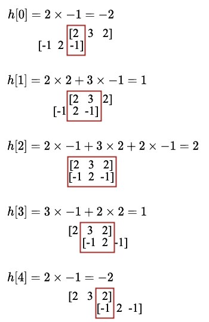
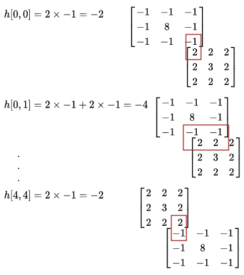
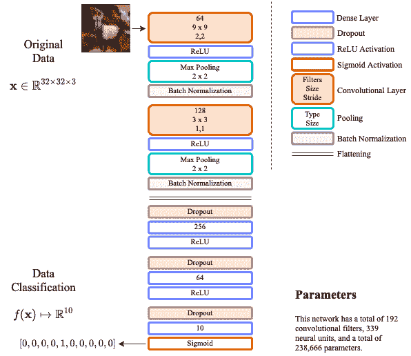
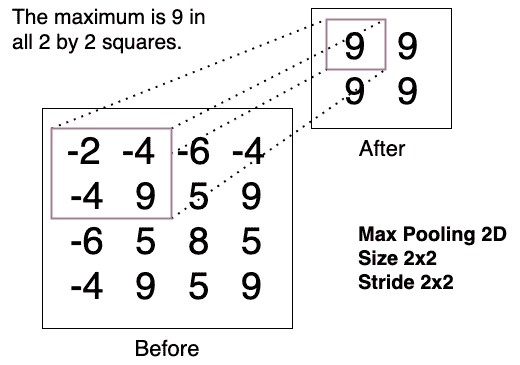
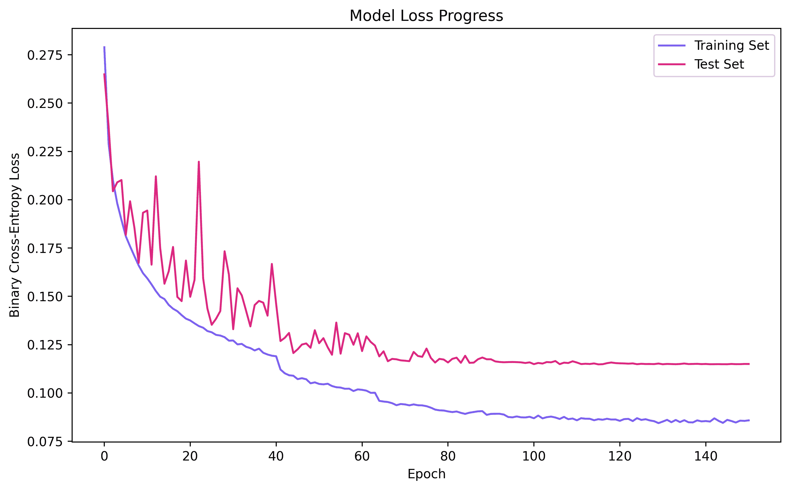
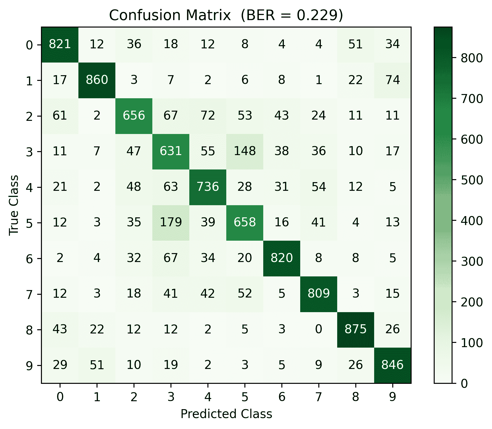
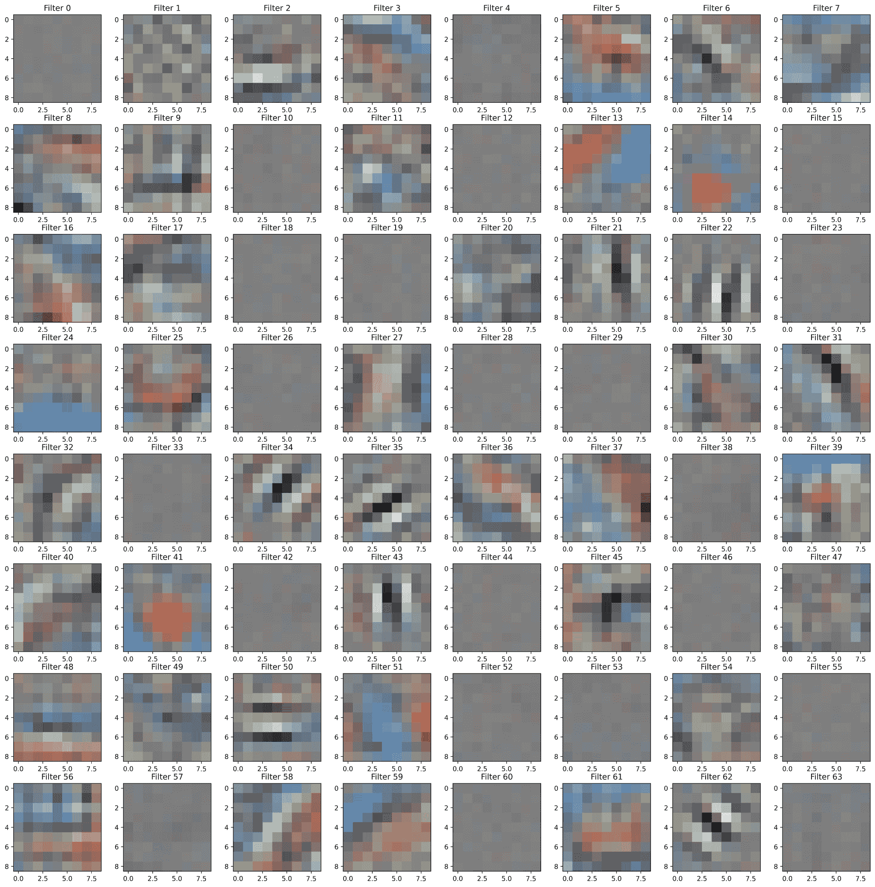

卷积神经网络

本章介绍了卷积神经网络，从卷积操作开始，逐步介绍卷积操作的集成层，目的是学习在数据集上操作的过滤器。接着介绍了池化策略，展示了这些变化如何提高模型的训练和性能。最后，展示了如何可视化学习到的过滤器。

到本章结束时，你将熟悉卷积神经网络背后的动机，并且知道卷积操作是如何在一维和二维中工作的。完成本章后，你将知道如何在层中实现卷积，以通过梯度下降学习过滤器。最后，你将有机会使用之前学过的许多工具，包括 dropout 和批量归一化，但现在你将知道如何使用池化作为减少问题维度并创建信息抽象层次的替代方法。

本章的结构如下：

+   卷积神经网络简介

+   *n*维度的卷积

+   卷积层

+   池化策略

+   过滤器的可视化

# 卷积神经网络简介

在第十一章《深度和广度神经网络》中，我们使用了一个对通用网络非常具有挑战性的数据集。然而，**卷积神经网络**（**CNNs**）将证明更加有效，正如你将看到的那样。CNNs 自 80 年代末以来就已经存在（LeCun, Y., 等人（1989））。它们已经改变了计算机视觉和音频处理的世界（Li, Y. D., 等人（2016））。如果你的智能手机有某种基于 AI 的物体识别功能，很可能它使用了某种 CNN 架构，例如：

+   图像中的物体识别

+   数字指纹的识别

+   语音命令的识别

CNNs 之所以有趣，是因为它们解决了一些计算机视觉中最具挑战性的问题，包括在一个叫做 ImageNet 的图像识别问题上击败人类（Krizhevsky, A., 等人（2012））。如果你能想到最复杂的物体识别任务，CNNs 应该是你实验的首选：它们永远不会让你失望！

CNN 成功的关键在于它们独特的**编码空间关系**的能力。如果我们对比两个不同的数据集，一个是关于学生的学校记录，包括当前和过去的成绩、出勤、在线活动等，另一个是关于猫和狗的图像数据集。如果我们的目标是对学生或猫和狗进行分类，这些数据是不同的。在一个数据集中，我们有学生特征，但这些特征没有空间关系。

例如，如果成绩是第一个特征，出勤率并不需要紧跟其后，因此它们的位置可以互换，而不会影响分类性能，对吗？然而，对于猫和狗的图像，眼睛的特征（像素）必须紧邻鼻子或耳朵；如果你改变空间特征并在两只眼睛中间看到一个耳朵（很奇怪），分类器的性能应该会受到影响，因为通常没有猫或狗的眼睛中间有耳朵。这就是 CNN 擅长编码的空间关系类型。你也可以考虑音频或语音处理。你知道某些声音在特定单词中必须在其他声音之后出现。如果数据集允许空间关系，CNN 有潜力表现得很好。

# n 维卷积

CNN 的名称来源于它们的标志性操作：**卷积**。这是一种在信号处理领域非常常见的数学运算。接下来，我们来讨论一下卷积操作。

## 一维卷积

让我们从一维离散时间卷积函数开始。假设我们有输入数据！[](img/42ad14d7-4801-41de-8544-14d064f7699d.png)和一些权重！[](img/e36d108f-f5b2-4205-bfb8-f85808f76dcd.png)，我们可以定义这两个之间的离散时间卷积操作如下：

。

在这个方程中，卷积操作用*****符号表示。为了不让事情变得过于复杂，我们可以说！[](img/8f014c06-f6a8-402e-9f00-0e79616523e0.png)是反转的，！[](img/a2dbdcc5-92fb-4538-b80d-949e4edb4024.png)，然后是平移的，！[](img/3cfe2848-09e8-4fb0-9069-e4c711729d34.png)。得到的结果是！[](img/781cc345-61b4-4a24-936a-8aeba31cd79c.png)，它可以被解释为应用滤波器！[](img/4dea30d8-7115-4bcc-8634-64707a585ecd.png)后输入的*过滤*版本。

如果我们将两个向量定义如下，！[](img/667d186e-3d70-423b-a31b-05a9832f428a.png)和！[](img/04ea475a-0074-4c06-b144-ed21e87c8651.png)，那么卷积操作将得到！[](img/45c8af6e-5ee5-494c-8f9c-033d812a2478.png)。

*图 12.1*展示了通过反转和平移滤波器并在输入数据上进行相乘来获得此结果的每个步骤：



图 12.1 - 涉及两个向量的卷积操作示例

在 NumPy 中，我们可以通过使用`convolve()`方法来实现这一点，代码如下：

```py
import numpy as np
h = np.convolve([2, 3, 2], [-1, 2, -1])
print(h)
```

这将输出以下结果：

```py
[-2, 1, 2, 1, -2]
```

现在，如果你想一下，最“完整”的信息是当滤波器完全与输入数据重叠时，这对于！[](img/1c903d14-4aa7-4725-8ac5-12b0e536298d.png)是成立的。在 Python 中，你可以通过使用`'valid'`参数来得到这个效果，代码如下：

```py
import numpy as np
h = np.convolve([2, 3, 2], [-1, 2, -1], 'valid')
print(h)
```

这将给出以下结果：

```py
2
```

再次强调，这只是为了最大化*相关*信息，因为卷积操作在向量的边缘，即向量开始和结束时，不完全重叠，因此不确定性更高。此外，为了方便，我们可以通过使用`'same'`参数，获得与输入相同大小的输出向量，方法如下：

```py
import numpy as np
h = np.convolve([2, 3, 2], [-1, 2, -1], 'same')
print(h)
```

这将输出如下内容：

```py
[1 2 1]
```

以下是使用卷积的三种方式的实际原因：

+   当你需要所有*有效*信息而不包含由于滤波器部分重叠所引起的噪声时，请使用`'valid'`。

+   当你希望计算更加简单时，请使用`'same'`。这将使得输入和输出的维度保持一致，计算也会更为方便。

+   否则，可以不使用任何方法来获得卷积操作的完整解析解，以满足您的任何需求。

卷积随着微处理器的发展而变得非常流行，这些微处理器专门用于极快地进行乘法和加法运算，同时随着**快速傅里叶变换**（**FFT**）算法的发展，卷积的应用也变得广泛。FFT 利用了一个数学性质，即离散时间域中的卷积等价于傅里叶域中的乘法，反之亦然。

现在，让我们继续讨论下一个维度。

## 2 维

二维卷积与一维卷积非常相似。然而，我们将拥有一个矩阵而不是一个向量，这也是图像可以直接应用的原因。

假设我们有两个矩阵：一个表示输入数据，另一个是滤波器，如下所示：

。

我们可以通过反转（在两个维度上）和移动（同样在两个维度上）滤波器来计算二维离散卷积。其方程如下：


这与一维版本非常相似。下图展示了前两步和最后一步，为了节省空间并避免重复：



图 12.2 - 二维离散卷积示例

在 Python 中，我们可以使用 SciPy 的`convolve2d`方法来计算二维卷积，方法如下：

```py
import numpy as np
from scipy.signal import convolve2d
x = np.array([[2,2,2],[2,3,2],[2,2,2]])
w = np.array([[-1,-1,-1],[-1,8,-1],[-1,-1,-1]])
h = convolve2d(x,w)
print(h)
```

这将输出如下内容：

```py
[[-2 -4 -6 -4 -2]
 [-4  9  5  9 -4]
 [-6  5  8  5 -6]
 [-4  9  5  9 -4]
 [-2 -4 -6 -4 -2]]
```

这里显示的结果是完整的解析结果。然而，与一维实现类似，如果您只想要完全重叠的结果，可以调用`'valid'`结果，或者如果您想要与输入大小相同的结果，可以调用`'same'`选项，如下所示：

```py
import numpy as np
from scipy.signal import convolve2d
x = np.array([[2,2,2],[2,3,2],[2,2,2]])
w = np.array([[-1,-1,-1],[-1,8,-1],[-1,-1,-1]])
h = convolve2d(x,w,mode='valid')
print(h)
h = convolve2d(x,w,mode='same')
print(h)
```

这将得到如下结果：

```py
[[8]]

[[9 5 9]
 [5 8 5]
 [9 5 9]]
```

现在，让我们继续讨论 n 维卷积。

## n 维

一旦你理解了一维和二维卷积，你就掌握了背后的基本概念。然而，你可能仍然需要在更高维度上执行卷积，例如，在多光谱数据集中。为此，我们可以简单地准备任意维度的 NumPy 数组，然后使用 SciPy 的 `convolve()` 功能。考虑以下示例：

```py
import numpy as np
from scipy.signal import convolve
x = np.array([[[1,1],[1,1]],[[2,2],[2,2]]])
w = np.array([[[1,-1],[1,-1]],[[1,-1],[1,-1]]])
h = convolve(x,w)
print(h)
```

在这里，向量  是三维数组，可以成功地进行卷积，产生如下输出：

```py
[[[ 1 0 -1]
  [ 2 0 -2]
  [ 1 0 -1]]

 [[ 3 0 -3]
  [ 6 0 -6]
  [ 3 0 -3]]

 [[ 2 0 -2]
  [ 4 0 -4]
  [ 2 0 -2]]]
```

n 维卷积的唯一困难可能是将其可视化或在脑海中想象它们。我们人类可以轻松理解一维、二维和三维，但更高维度的空间很难表示。但请记住，如果你理解了在一维和二维中如何进行卷积，你可以相信数学原理和算法在任何维度中都会有效。

接下来，我们来看一下如何通过定义 Keras 层并将其添加到模型中来 *学习* 这些卷积滤波器。

# 卷积层

卷积在深度学习领域具有一些非常有趣的特性：

+   它可以成功地对数据的空间属性进行编码和解码。

+   它可以通过最新的技术快速计算。

+   它可以用于解决多个计算机视觉问题。

+   它可以与其他类型的层结合以达到最佳性能。

Keras 为 TensorFlow 提供了封装函数，涉及最常见的维度，即一维、二维和三维：`Conv1D`、`Conv2D` 和 `Conv3D`。在本章中，我们将继续聚焦于二维卷积，但只要你理解了这一概念，你可以轻松地使用其他类型的卷积。

## Conv2D

二维卷积方法的签名如下：`tensorflow.keras.layers.Conv2D`。卷积层中最常用的参数如下：

+   `filters` 指的是在该特定层中需要学习的滤波器数量，并且影响该层输出的维度。

+   `kernel_size` 指的是滤波器的大小；例如，在 *图 12.2* 中，它的大小为 (3,3)。

+   `strides=(1, 1)` 对我们来说是新的。步幅（strides）定义为滤波器滑过输入时的步伐大小。我们迄今为止展示的所有示例都假设我们遵循卷积的原始定义，采用单位步幅。然而，在卷积层中，你可以选择更大的步幅，这会导致较小的输出，但也会丢失信息。

+   `padding='valid'` 指的是处理卷积结果边缘信息的方式。请注意，这里的选项只有 `'valid'` 或 `'same'`，并且无法获得完整的解析结果。其含义与本章前面提到的相同。

+   `activation=None` 提供了一个选项，可以在层中包括一个激活函数，如果需要的话；例如，`activation='relu'`。

为了举例说明这一点，考虑一个如以下图所示的卷积层，其中第一层是二维卷积层，包含 64 个 9x9 的滤波器，步长为 2, 2（即每个方向两个）。我们将在接下来的图示中继续解释模型的其余部分：



图 12.3 - 用于 CIFAR 10 的卷积神经网络架构

图中的第一个卷积层可以定义如下：

```py
import tensorflow as tf
from tensorflow.keras.layers import Conv2D
input_shape = (1, 32, 32, 3)
x = tf.random.normal(input_shape)
l = Conv2D(64, (9,9), strides=(2,2), activation='relu', 
           input_shape=input_shape)(l)
print(l.shape)
```

这实际上将创建一个具有给定规格的卷积层。打印语句将有效地产生以下内容：

```py
(1, 12, 12, 64)
```

如果你做一下计算，64 个滤波器中的每一个都会产生一个 23x23 的 `'valid'` 输出，但由于使用了 (2,2) 的步长，应该得到一个 11.5x11.5 的输出。然而，由于我们不能有小数，TensorFlow 会将其四舍五入到 12x12。因此，我们最终得到上面的输出形状。

## 层+激活组合

如前所述，`Conv2D` 类具有包括你选择的激活函数的能力。这是非常受欢迎的，因为它可以节省一些代码行，帮助那些希望高效编写代码的人。然而，我们必须小心，不能忘记在某处记录使用的激活类型。

*图 12.3* 显示了一个单独块中的激活。这是一个很好的方法，可以跟踪整个过程中的激活使用情况。卷积层最常见的激活函数是 ReLU，或者是 ReLU 家族中的任何激活函数，例如，leaky ReLU 和 ELU。下一个 *新* 元素是池化层。让我们来谈谈这个。

# 池化策略

通常，你会发现池化层伴随卷积层出现。池化是一种旨在通过降低问题的维度来减少计算量的理念。在 Keras 中，我们有几种池化策略可供选择，但最重要和最常用的两种策略是以下两种：

+   AveragePooling2D

+   MaxPooling2D

这些池化操作也存在于其他维度中，如 1D。然而，为了理解池化，我们可以简单地查看以下图示中的示例：



图 12.4 - 2D 最大池化示例

在图示中，你可以看到最大池化如何在每个 2x2 的小块上移动，每次移动两个位置，从而得出一个 2x2 的结果。池化的全部目的在于 **找到数据的一个更小的总结**。在神经网络中，我们通常关注最被 *激活* 的神经元，因此查看最大值作为更大数据部分的代表是有意义的。然而，请记住，你也可以查看数据的平均值（`AveragePooling2D`），它在各个方面也都是有效的。

在时间性能上，最大池化略占优势，但这一差异非常小。

在 Keras 中，我们可以非常轻松地实现池化。例如，对于 2D 的最大池化，我们可以简单地做如下操作：

```py
import tensorflow as tf
from tensorflow.keras.layers import MaxPooling2D
x = tf.constant([[-2, -4, -6, -4],
                 [-4, 9, 5, 9],
                 [-6, 5, 8, 5],
                 [-4, 9, 5, 9]])
x = tf.reshape(x, [1, 4, 4, 1])
y = MaxPooling2D(pool_size=(2, 2), strides=(2, 2), padding='valid')
print(tf.reshape(y(x), [2, 2]))
```

这将生成与*图 12.4*相同的输出：

```py
tf.Tensor(
[[9 9]
 [9 9]], shape=(2, 2), dtype=int32)
```

我们也可以对平均池化做同样的操作，如下所示：

```py
import tensorflow as tf
from tensorflow.keras.layers import AveragePooling2D
x = tf.constant([[-2., -4., -6., -4],
                 [-4., 9., 5., 9.],
                 [-6., 5., 8., 5.],
                 [-4., 9., 5., 9.]])
x = tf.reshape(x, [1, 4, 4, 1])
y = AveragePooling2D(pool_size=(2, 2), strides=(2, 2), padding='valid')
print(tf.reshape(y(x), [2, 2]))
```

这将产生如下输出：

```py
tf.Tensor(
[[-0.25 1\. ]
 [ 1\. 6.75]], shape=(2, 2), dtype=float32)
```

两种池化策略在总结数据方面都非常有效。你可以放心选择任何一种。

现在是大揭晓时刻。接下来，我们将在 CNN 中将所有这些内容结合起来。

# CIFAR-10 的卷积神经网络

我们已经达到了可以实际实现一个功能完备的 CNN 的阶段，经过对各个组成部分的了解：理解卷积操作，理解池化操作，理解如何实现卷积层和池化层。现在，我们将实现*图 12.3*中展示的 CNN 架构。

## 实现

我们将一步一步地实现*图 12.3*中的网络，分解成子部分。

### 加载数据

让我们按如下方式加载 CIFAR-10 数据集：

```py
from tensorflow.keras.datasets import cifar10
from tensorflow.keras.utils import to_categorical
import numpy as np

# The data, split between train and test sets:
(x_train, y_train), (x_test, y_test) = cifar10.load_data()
x_train = x_train.astype('float32') / 255.
x_test = x_test.astype('float32') / 255.

y_train = to_categorical(y_train, 10)
y_test = to_categorical(y_test, 10)
print('x_train shape:', x_train.shape)
print('x_test shape:', x_test.shape)
```

这应该有效地加载数据集并打印出其形状，如下所示：

```py
x_train shape: (50000, 32, 32, 3)
x_test shape: (10000, 32, 32, 3)
```

这非常直接，但我们可以进一步验证数据是否正确加载，通过加载并绘制`x_train`集合中每个类别的第一张图片，如下所示：

```py
import matplotlib.pyplot as plt
import numpy as np

(_, _), (_, labels) = cifar10.load_data()
idx = [3, 6, 25, 46, 58, 85, 93, 99, 108, 133]

clsmap = {0: 'airplane',
          1: 'automobile', 
          2: 'bird', 
          3: 'cat', 
          4: 'deer',
          5: 'dog',
          6: 'frog',
          7: 'horse',
          8: 'ship',
          9: 'truck'}

plt.figure(figsize=(10,4))
for i, (img, y) in enumerate(zip(x_test[idx].reshape(10, 32, 32, 3), labels[idx])):
  plt.subplot(2, 5, i+1)
  plt.imshow(img, cmap='gray')
  plt.xticks([])
  plt.yticks([])
  plt.title(str(y[0]) + ": " + clsmap[y[0]])
plt.show()
```

这将生成如下截图所示的输出：


图 12.5 - CIFAR-10 样本

接下来，我们将实现网络的各个层。

### 编译模型

再次回想一下*图 12.3*中的模型，以及我们如何像这样实现它。接下来你将看到的所有内容，都是我们在这一章和之前的章节中讨论过的：

```py
# Importing the Keras libraries and packages
from tensorflow.keras.layers import Conv2D, MaxPooling2D, Flatten
from tensorflow.keras.layers import Input, Dense, Dropout, BatchNormalization
from tensorflow.keras.models import Model
from tensorflow.keras.optimizers import RMSprop

# dimensionality of input and latent encoded representations
inpt_dim = (32, 32, 3)

inpt_img = Input(shape=inpt_dim)

# Convolutional layer
cl1 = Conv2D(64, (9, 9), strides=(2, 2), input_shape = inpt_dim, 
             activation = 'relu')(inpt_img)

# Pooling and BatchNorm
pl2 = MaxPooling2D(pool_size = (2, 2))(cl1)
bnl3 = BatchNormalization()(pl2)
```

我们继续添加更多的卷积层，如下所示：

```py
# Add a second convolutional layer
cl4 = Conv2D(128, (3, 3), strides=(1, 1), activation = 'relu')(bnl3)
pl5 = MaxPooling2D(pool_size = (2, 2))(cl4)
bnl6 = BatchNormalization()(pl5)

# Flattening for compatibility
fl7 = Flatten()(bnl6)

# Dense layers + Dropout
dol8 = Dropout(0.5)(fl7)
dl9 = Dense(units = 256, activation = 'relu')(dol8)
dol10 = Dropout(0.2)(dl9)
dl11 = Dense(units = 64, activation = 'relu')(dol10)
dol12 = Dropout(0.1)(dl11)
output = Dense(units = 10, activation = 'sigmoid')(dol12)

classifier = Model(inpt_img, output)
```

然后我们可以编译模型并打印出总结，如下所示：

```py
# Compiling the CNN with RMSprop optimizer
opt = RMSprop(learning_rate=0.001)

classifier.compile(optimizer = opt, loss = 'binary_crossentropy', 
                   metrics = ['accuracy'])

print(classifier.summary())
```

这将输出一个网络总结，内容如下所示：

```py
Model: "model"
_________________________________________________________________
Layer (type)                 Output Shape          Param # 
=================================================================
input_1 (InputLayer)         [(None, 32, 32, 3)]   0 
_________________________________________________________________
conv2d (Conv2D)              (None, 12, 12, 64)    15616 
_________________________________________________________________
max_pooling2d_4 (MaxPooling2 (None, 6, 6, 64)      0 
_________________________________________________________________
batch_normalization (BatchNo (None, 6, 6, 64)      256 
_________________________________________________________________
.
.
.
_________________________________________________________________
dropout_2 (Dropout)          (None, 64)            0 
_________________________________________________________________
dense_2 (Dense)              (None, 10)            650 
=================================================================
Total params: 238,666
Trainable params: 238,282
Non-trainable params: 384
```

到目前为止，有一件事应该对你非常明显，那就是这个网络的参数数量。如果你回忆一下前一章，你会惊讶地发现这个网络有近 25 万个参数，而宽或深的网络有几百万个参数。此外，你会很快看到，尽管这个相对较小的网络仍然是*过度参数化的*，它的表现将比前一章中那些有更多参数的网络要好。

接下来，让我们训练网络。

### 训练 CNN

我们可以使用我们在第十一章《深度与宽度神经网络》中学习过的*回调函数*来训练 CNN，如果网络没有进展，提前停止训练，或者如果达到*平台期*，通过降低学习率来集中梯度下降算法的努力。

我们将按如下方式训练它：

```py
# Fitting the CNN to the images
from tensorflow.keras.callbacks import ReduceLROnPlateau, EarlyStopping

reduce_lr = ReduceLROnPlateau(monitor='val_loss', factor=0.5, patience=10, 
                              min_delta=1e-4, mode='min', verbose=1)

stop_alg = EarlyStopping(monitor='val_loss', patience=35, 
                         restore_best_weights=True, verbose=1)

hist = classifier.fit(x_train, y_train, batch_size=100, epochs=1000, 
                   callbacks=[stop_alg, reduce_lr], shuffle=True, 
                   validation_data=(x_test, y_test))

classifier.save_weights("cnn.hdf5")
```

这个结果会因计算机而异。例如，可能需要更多或更少的训练轮次，或者梯度的方向可能会有所不同，如果小批量（随机选择的）包含多个边缘案例。然而，大多数情况下，你应该得到一个与此类似的结果：

```py
Epoch 1/1000
500/500 [==============================] - 3s 5ms/step - loss: 0.2733 - accuracy: 0.3613 - val_loss: 0.2494 - val_accuracy: 0.4078 - lr: 0.0010
Epoch 2/1000
500/500 [==============================] - 2s 5ms/step - loss: 0.2263 - accuracy: 0.4814 - val_loss: 0.2703 - val_accuracy: 0.4037 - lr: 0.0010
.
.
.
Epoch 151/1000
492/500 [============================>.] - ETA: 0s - loss: 0.0866 - accuracy: 0.8278
Epoch 00151: ReduceLROnPlateau reducing learning rate to 3.906250185536919e-06.
500/500 [==============================] - 2s 4ms/step - loss: 0.0866 - accuracy: 0.8275 - val_loss: 0.1153 - val_accuracy: 0.7714 - lr: 7.8125e-06
Epoch 152/1000
500/500 [==============================] - 2s 4ms/step - loss: 0.0864 - accuracy: 0.8285 - val_loss: 0.1154 - val_accuracy: 0.7707 - lr: 3.9063e-06
Epoch 153/1000
500/500 [==============================] - 2s 4ms/step - loss: 0.0861 - accuracy: 0.8305 - val_loss: 0.1153 - val_accuracy: 0.7709 - lr: 3.9063e-06
Epoch 154/1000
500/500 [==============================] - 2s 4ms/step - loss: 0.0860 - accuracy: 0.8306 - val_loss: 0.1153 - val_accuracy: 0.7709 - lr: 3.9063e-06
Epoch 155/1000
500/500 [==============================] - 2s 4ms/step - loss: 0.0866 - accuracy: 0.8295 - val_loss: 0.1153 - val_accuracy: 0.7715 - lr: 3.9063e-06
Epoch 156/1000
496/500 [============================>.] - ETA: 0s - loss: 0.0857 - accuracy: 0.8315Restoring model weights from the end of the best epoch.
500/500 [==============================] - 2s 4ms/step - loss: 0.0857 - accuracy: 0.8315 - val_loss: 0.1153 - val_accuracy: 0.7713 - lr: 3.9063e-06
Epoch 00156: early stopping
```

此时，训练完成后，你可以得到约 83.15%的准确率估算值。请注意，这并不是**平衡**准确率。为此，我们将在下一节中查看**平衡误差率**（**BER**）指标。但在那之前，我们可以看看训练曲线，看看损失是如何被最小化的。

以下代码将生成我们所需的结果：

```py
import matplotlib.pyplot as plt

fig = plt.figure(figsize=(10,6))
plt.plot(hist.history['loss'], color='#785ef0')
plt.plot(hist.history['val_loss'], color='#dc267f')
plt.title('Model Loss Progress')
plt.ylabel('Brinary Cross-Entropy Loss')
plt.xlabel('Epoch')
plt.legend(['Training Set', 'Test Set'], loc='upper right')
plt.show()
```

这将生成如下所示的图像，见*图 12.6*：



图 12.6 - CIFAR-10 上的 CNN 损失最小化

从这个图表中，你可以看到学习曲线上的波动，尤其是在训练集的曲线中比较明显，这些波动是由于通过回调函数`ReduceLROnPlateau`减少学习率所致。当测试集的损失不再改善时，训练将停止，这得益于`EarlyStopping`回调。

## 结果

现在，让我们看看客观的数值结果：

```py
from sklearn.metrics import classification_report
from sklearn.metrics import confusion_matrix
from sklearn.metrics import balanced_accuracy_score
import matplotlib.pyplot as plt
import numpy as np

(_, _), (_, labels) = cifar10.load_data()

y_ = labels
y_hat = classifier.predict(x_test)
y_pred = np.argmax(y_hat, axis=1)

print(classification_report(np.argmax(y_test, axis=1), 
                            np.argmax(y_hat, axis=1), 
                            labels=[0, 1, 2, 3, 4, 5, 6, 7, 8, 9]))
cm = confusion_matrix(np.argmax(y_test, axis=1), 
                      np.argmax(y_hat, axis=1), 
                      labels=[0, 1, 2, 3, 4, 5, 6, 7, 8, 9])
print(cm)
ber = 1- balanced_accuracy_score(np.argmax(y_test, axis=1), 
                                 np.argmax(y_hat, axis=1))
print('BER', ber)
```

这将给我们以下的数值结果，我们可以将其与上一章的结果进行比较：

```py
  precision  recall  f1-score  support

0      0.80    0.82      0.81     1000
1      0.89    0.86      0.87     1000
2      0.73    0.66      0.69     1000
3      0.57    0.63      0.60     1000
4      0.74    0.74      0.74     1000
5      0.67    0.66      0.66     1000
6      0.84    0.82      0.83     1000
7      0.82    0.81      0.81     1000
8      0.86    0.88      0.87     1000
9      0.81    0.85      0.83     1000

               accuracy  0.77     10000

[[821  12  36  18  12   8   4   4  51  34]
 [ 17 860   3   7   2   6   8   1  22  74]
 [ 61   2 656  67  72  53  43  24  11  11]
 [ 11   7  47 631  55 148  38  36  10  17]
 [ 21   2  48  63 736  28  31  54  12   5]
 [ 12   3  35 179  39 658  16  41   4  13]
 [  2   4  32  67  34  20 820   8   8   5]
 [ 12   3  18  41  42  52   5 809   3  15]
 [ 43  22  12  12   2   5   3   0 875  26]
 [ 29  51  10  19   2   3   5   9  26 846]]

BER 0.2288
```

特定类别的准确率最高可达 87%，而最低准确率为 66%。这比上一章中的模型要好得多。BER 为 0.2288，所有这些可以解读为 77.12%的平衡准确率。这与训练过程中测试集上报告的准确率相符，表明模型已正确训练。为了进行对比，以下图表展示了混淆矩阵的可视化表示：



图 12.7 - 在 CIFAR-10 上训练的 CNN 的混淆矩阵

从视觉混淆矩阵中可以更清楚地看出，类别 3 和 5 之间的混淆程度比其他类别更高。类别 3 和 5 分别对应猫和狗。

就这样。如你所见，这已经是一个不错的结果，但你可以自己进行更多实验。你可以编辑并添加更多卷积层来改进模型。如果你有兴趣，还有其他更大的 CNN 模型也取得了很大成功。以下是最著名的两个：

+   VGG-19：该模型包含 12 个卷积层和 3 个全连接层（Simonyan, K., 等人 (2014)）。

+   ResNet：该模型包含 110 个卷积层和 1 个全连接层（He, K., 等人 (2016)）。该配置在 CIFAR-10 数据集上能够达到 6.61%（±0.16%）的最低错误率。

接下来我们来讨论如何可视化学习到的滤波器。

## 滤波器可视化

本章的最后一部分处理了学习到的滤波器的可视化。如果你想研究网络学到了什么，这可能对你有用。这有助于提升网络的*可解释性*。然而，请注意，网络越深，理解它就越复杂。

以下代码将帮助你可视化网络的第一个卷积层的滤波器：

```py
from sklearn.preprocessing import MinMaxScaler

cnnl1 = classifier.layers[1].name   # get the name of the first conv layer
W = classifier.get_layer(name=cnnl1).get_weights()[0]   #get the filters
wshape = W.shape  #save the original shape

# this part will scale to [0, 1] for visualization purposes
scaler = MinMaxScaler()
scaler.fit(W.reshape(-1,1))
W = scaler.transform(W.reshape(-1,1))
W = W.reshape(wshape)

# since there are 64 filters, we will display them 8x8
fig, axs = plt.subplots(8,8, figsize=(24,24))
fig.subplots_adjust(hspace = .25, wspace=.001)
axs = axs.ravel()
for i in range(W.shape[-1]):
  # we reshape to a 3D (RGB) image shape and display
  h = np.reshape(W[:,:,:,i], (9,9,3))
  axs[i].imshow(h)
  axs[i].set_title('Filter ' + str(i))
```

这段代码在很大程度上依赖于你知道想要可视化的层、想要可视化的滤波器数量以及滤波器本身的大小。在这种情况下，我们要可视化第一个卷积层。它有 64 个滤波器（以 8x8 的网格显示），每个滤波器的大小为 9x9x3，因为输入的是彩色图像。*图 12.8*显示了前面代码生成的结果图：



图 12.8 - 第一个卷积层中学习到的滤波器

如果你是图像处理专家，你可能会认出其中一些模式，它们类似于 Gabor 滤波器（Jain, A. K., 等人（1991））。其中一些滤波器旨在寻找边缘、纹理或特定的形状。文献表明，在卷积网络中，较深的层通常编码高度复杂的信息，而第一层用于检测边缘等特征。

随时可以继续前进，尝试通过进行必要的修改来展示另一个层。

# 总结

本中级章节展示了如何创建卷积神经网络（CNN）。你了解了卷积操作，这是其基本概念。你还学习了如何创建卷积层和聚合池化策略。你设计了一个网络，通过学习滤波器来识别 CIFAR-10 中的物体，并学习了如何展示已学习的滤波器。

到此为止，你应该能自信地解释卷积神经网络背后的动机，这些动机根植于计算机视觉和信号处理领域。你应该能够使用 NumPy、SciPy 和 Keras/TensorFlow 来编写一维和二维卷积操作的代码。此外，你应该能够自信地在层中实现卷积操作，并通过梯度下降技术学习滤波器。如果有人要求你展示网络所学到的内容，你应该能准备好实现一个简单的可视化方法来展示学到的滤波器。

CNN 擅长编码高度相关的空间信息，如图像、音频或文本。然而，还有一种有趣的网络类型，旨在编码顺序性的信息。第十三章，*递归神经网络*，将介绍递归网络的最基本概念，进而引入长短期记忆模型。我们将探索多种顺序模型的变体，并应用于图像分类和自然语言处理。

# 问题与答案

1.  **本章讨论的哪种数据总结策略可以减少卷积模型的维度？**

池化。

1.  **增加更多卷积层会让网络变得更好吗？**

并非总是如此。研究表明，更多层数对网络有正面影响，但在某些情况下并没有提升效果。你应该通过实验来确定层数、滤波器大小和池化策略。

1.  **卷积神经网络（CNN）还有哪些其他应用？**

音频处理与分类；图像去噪；图像超分辨率；文本摘要及其他文本处理与分类任务；数据加密。

# 参考文献

+   LeCun, Y., Boser, B., Denker, J. S., Henderson, D., Howard, R. E., Hubbard, W., 和 Jackel, L. D. (1989). *反向传播应用于手写邮政编码识别*. *神经计算*, 1(4), 541-551。

+   Li, Y. D., Hao, Z. B., 和 Lei, H. (2016). *卷积神经网络综述*. *计算机应用杂志*, 36(9), 2508-2515。

+   Krizhevsky, A., Sutskever, I., 和 Hinton, G. E. (2012). *使用深度卷积神经网络进行 Imagenet 分类*. 见 *神经信息处理系统进展*（第 1097-1105 页）。

+   Simonyan, K., 和 Zisserman, A. (2014). *用于大规模图像识别的非常深的卷积网络*. arXiv 预印本 arXiv:1409.1556。

+   He, K., Zhang, X., Ren, S., 和 Sun, J. (2016). *深度残差学习用于图像识别*. 见 *IEEE 计算机视觉与模式识别大会论文集*（第 770-778 页）。

+   Jain, A. K., 和 Farrokhnia, F. (1991). *使用 Gabor 滤波器的无监督纹理分割*. *模式识别*, 24(12), 1167-1186。
