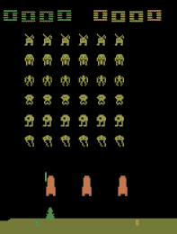
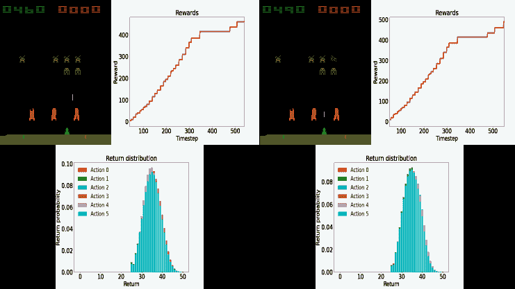

深度学习未来的最终思考

我们一起经历了一段旅程，如果你读到这里，你值得犒劳自己一顿美餐。你所取得的成就值得被认可。告诉你的朋友们，分享你所学到的内容，并记得始终保持学习。深度学习是一个快速发展的领域；你不能停滞不前。本章将简要介绍一些深度学习中新的、令人兴奋的主题和机会。如果你希望继续学习，我们将推荐一些来自 Packt 的其他有用资源，帮助你在这个领域继续前进。在本章结束时，你将知道在学习了深度学习的基础知识后，接下来该往哪里去；你将知道 Packt 提供的其他资源，帮助你继续深度学习的训练。

本章组织成以下几个部分：

+   寻找深度学习中的高级主题

+   使用 Packt 的更多资源进行学习

# 寻找深度学习中的高级主题

目前很难预测深度学习的未来；事物发展得非常迅速。然而，我相信，如果你把时间投资在当前的深度学习高级主题上，你可能会在不久的将来看到这些领域繁荣发展。

以下小节将讨论一些具有潜力、可能在我们领域蓬勃发展并带来颠覆性影响的高级主题。

## 深度强化学习

**深度强化学习**（**DRL**）是一个近年来备受关注的领域，因为深度卷积网络及其他类型的深度网络已经为过去难以解决的问题提供了解决方案。DRL 的许多应用场景是在我们无法拥有所有可能情境数据的领域，例如太空探索、电子游戏或自动驾驶汽车。

让我们扩展一下后面的例子。如果我们使用传统的监督学习来构建一辆自动驾驶汽车，让它能够从 A 点安全到达 B 点，我们不仅需要正面类的示例（成功的行程），还需要负面类的示例（例如车祸和糟糕的驾驶）。想想看：为了保持数据集的平衡，我们需要和成功事件一样多的车祸数据。这是不可接受的；然而，强化学习能够帮助我们解决这个问题。

深度强化学习（DRL）旨在**奖励**良好的驾驶行为；模型会学习到可以获得奖励，因此我们不需要负面示例。相比之下，传统学习需要通过撞车来**惩罚**不良结果。

当你使用深度强化学习（DRL）通过模拟器进行学习时，你可以获得能够在模拟飞行中击败飞行员的 AI（[`fortune.com/2020/08/20/f-16-fighter-pilot-versus-artificial-intelligence-simulation-darpa/`](https://fortune.com/2020/08/20/f-16-fighter-pilot-versus-artificial-intelligence-simulation-darpa/)），或者你可以获得能够在视频游戏模拟器中获胜的 AI。游戏世界是 DRL 的一个完美测试场景。假设你想要制作一个 DRL 模型来玩著名的游戏*太空侵略者*，如*图 15.1*所示；你可以创建一个奖励摧毁太空侵略者的模型。



图 15.1 – 太空侵略者视频游戏模拟器

如果你创建一个传统的模型来教用户**不死**，例如，你最终还是会失败，因为你最终会被太空入侵。因此，防止入侵的最佳策略是既不死又摧毁太空入侵者。换句话说，你奖励那些导致生存的行动，也就是在避免被它们的炸弹击中的同时迅速摧毁太空入侵者。

2018 年，发布了一个新的 DRL 研究工具，名为**Dopamine**（Castro, P. S., 等，2018）。Dopamine（[`github.com/google/dopamine`](https://github.com/google/dopamine)）用于快速原型开发强化学习算法。在第二章中，*深度学习框架的设置与介绍*，我们要求你为此时安装 Dopamine。我们只是想给你一个 Dopamine 的使用概念，让你可以在感兴趣时继续进行实验。在接下来的几行代码中，我们将简单地加载一个预训练模型（智能体），并让它玩游戏。

这将确保库已安装，然后加载预训练的智能体：

```py
!pip install -U dopamine-rl

!gsutil -q -m cp -R gs://download-dopamine-rl/colab/samples/rainbow/SpaceInvaders_v4/checkpoints/tf_ckpt-199.data-00000-of-00001 ./
!gsutil -q -m cp -R gs://download-dopamine-rl/colab/samples/rainbow/SpaceInvaders_v4/checkpoints/tf_ckpt-199.index ./
!gsutil -q -m cp -R gs://download-dopamine-rl/colab/samples/rainbow/SpaceInvaders_v4/checkpoints/tf_ckpt-199.meta ./
```

这个经过训练的智能体在这里被称为`rainbow`，是 Dopamine 的作者提供的，但如果你愿意，也可以训练自己的智能体。

下一步是让智能体运行（即，根据奖励决定采取的行动）若干步，例如`1024`步：

```py
from dopamine.utils import example_viz_lib
example_viz_lib.run(agent='rainbow', game='SpaceInvaders', num_steps=1024,
                    root_dir='./agent_viz', restore_ckpt='./tf_ckpt-199',
                    use_legacy_checkpoint=True)
```

这段代码可能需要一段时间才能运行。内部，它连接到 PyGame，这是 Python 社区的一个游戏模拟器资源。它做出几个决策，并避免太空入侵（以及死亡）。如*图 15.2*所示，模型描述了在时间步长中的累积奖励，以及每个动作的回报估计概率，例如停止、向左移动、向右移动和射击：


图 15.2 – 左：模型在时间步长中的计算奖励。右：每个行动的回报估计概率

这一点有趣的地方在于，你可以在任何时间步骤（帧）上可视化代理，并查看代理在特定时间步骤上做了什么。你可以使用*图 15.2*中的图来参考决定要可视化哪个时间步骤。假设你想要可视化步骤 540 或 550，你可以按如下方式进行：

```py
from IPython.display import Image
frame_number = 540   # or 550
image_file = '/<path to current directory>/agent_viz/SpaceInvaders/rainbow/images/frame_{:06d}.png'.format(frame_number)
Image(image_file)
```

你需要将`<path to current directory>`替换为你当前工作目录的路径。这是因为我们需要绝对路径，否则我们本可以使用带有`./`的相对路径。

从中可以显而易见，所有的帧都作为图像保存在`./agent_viz/SpaceInvaders/rainbow/images/`目录下。你可以单独展示它们，甚至制作成视频。前面的代码生成了*图 15.3*中所示的图像：



图 15.3 – 左：步骤 540。右：步骤 550

多巴胺就是这么简单。我们希望你能从强化学习中得到启发并进一步研究。

## 自监督学习

2018 年 ACM 图灵奖获得者之一的杨·勒昆在 2020 年 AAAI 会议上说道：*"未来是自监督的。"* 他暗示这个领域非常激动人心，并且具有巨大的潜力。

自监督是一个相对较新的术语，用来替代*无监督*这一术语。术语“无监督学习”可能会给人一种没有监督的印象，而实际上，无监督学习算法和模型通常使用比监督模型更多的监督数据。以 MNIST 数据集的分类为例，它使用 10 个标签作为监督信号。然而，在一个目标是完美重建的自编码器中，每一个像素都是一个监督信号，因此以 28 x 28 的图像为例，便有 784 个监督信号。

自监督还用来指代结合了无监督学习和监督学习某些阶段的模型。例如，如果我们管道化一个学习无监督表示的模型，我们可以在其下游附加一个模型，该模型将学习进行有监督的分类。

最近深度学习的许多进展都发生在自监督领域。如果你能进一步学习自监督学习算法和模型，将是非常值得投入的时间。

## 系统 2 算法

著名经济学家丹尼尔·卡尼曼在他的书《*思考，快与慢*》（Kahneman, D. 2011）中推广了双过程理论。主要思想是，有一些高度复杂的任务，我们人类能够相对快速且常常不需要过多思考地完成；例如，喝水、吃饭或看一个物体并识别它。这些过程由*系统 1*完成。

然而，有些任务对于人类大脑来说并不简单，这些任务需要我们全身心的注意力，比如在陌生的道路上驾驶，观察不属于预期背景的奇异物体，或理解一幅抽象画。这些过程由**系统 2**完成。2018 年 ACM 图灵奖的另一个获奖者 Yoshua Bengio 曾指出，深度学习在**系统 1**任务上表现得非常出色，这意味着现有模型能够相对轻松地识别物体并执行高度复杂的任务。然而，深度学习在**系统 2**任务上进展不大。也就是说，深度学习的未来将是解决那些对人类非常复杂的任务，这可能涉及跨不同领域、不同学习类型结合多种模型。胶囊神经网络可能是应对**系统 2**任务的一个良好替代方案（Sabour, S., 等，2017 年）。

由于这些原因，**系统 2**算法可能会成为深度学习的未来。

现在，让我们来看看来自 Packt 的资源，它们可以帮助进一步研究这些概念。

# 来自 Packt 的更多学习资源

以下的书单并不意在详尽无遗，而是为你的下一个探索提供一个起点。这些书籍的出版正值该领域引起广泛关注的好时机。无论你选择哪一本，你都不会失望。

## 强化学习

+   **《深度强化学习实战（第二版）》**，Maxim Lapan 著，2020 年出版。

+   **《强化学习工作坊》**，Alessandro Palmas *等*著，2020 年出版。

+   **《游戏中的实践强化学习》**，Micheal Lanham 著，2020 年出版。

+   **《PyTorch 1.x 强化学习实战》**，Yuxi Liu 著，2019 年出版。

+   **《Python 强化学习》**，Sudharsan Ravichandiran 著，2019 年出版。

+   **《Python 强化学习算法》**，Andrea Lonza 著，2019 年出版。

## 自监督学习

+   **《无监督学习工作坊》**，Aaron Jones *等*著，2020 年出版。

+   **《Python 应用无监督学习》**，Benjamin Johnston *等*著，2019 年出版。

+   **《用 Python 实践无监督学习》**，Giuseppe Bonaccorso 著，2019 年出版。

# 总结

本章简要讨论了深度学习中的新兴话题和机会。我们讨论了强化学习、自监督算法和**系统 2**算法。我们还推荐了一些来自 Packt 的进一步学习资源，希望你能继续学习，并在这一领域不断前进。此时，你应该知道接下来要做什么，并为深度学习的未来而感到鼓舞。你应该了解该领域的其他推荐书籍，以继续你的学习旅程。

你是深度学习的未来，而未来就是今天。勇敢迈出一步，去实现你的目标。

# 参考文献

+   Castro, P. S., Moitra, S., Gelada, C., Kumar, S., 和 Bellemare, M. G.（2018）。Dopamine: A research framework for deep reinforcement learning. arXiv 预印本 arXiv:1812.06110。

+   Kahneman, D. (2011). *思考，快与慢*。*麦克米兰出版社*。

+   Sabour, S., Frosst, N., 和 Hinton, G. E. (2017). 胶囊之间的动态路由。载于 *神经信息处理系统的进展*（第 3856-3866 页）。
