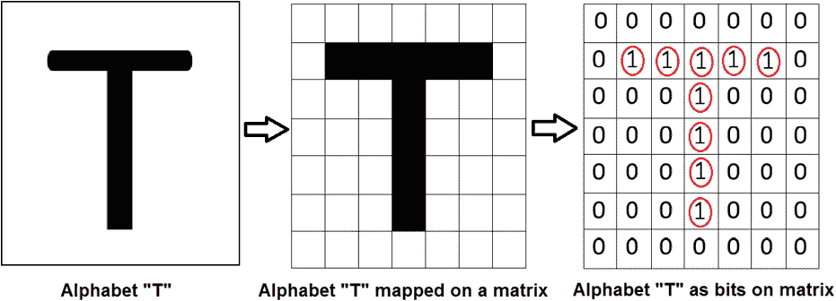
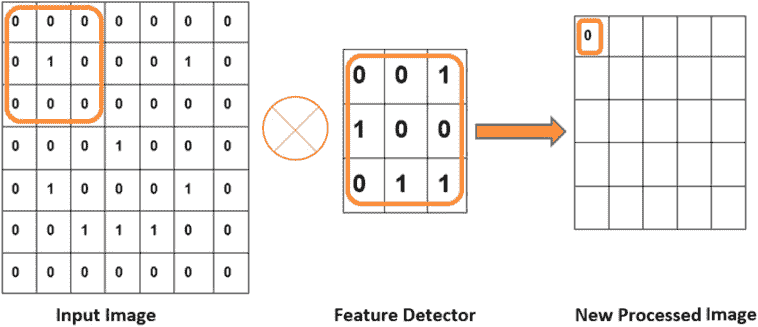
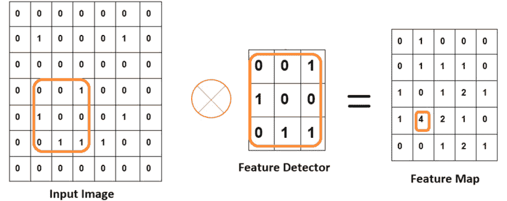
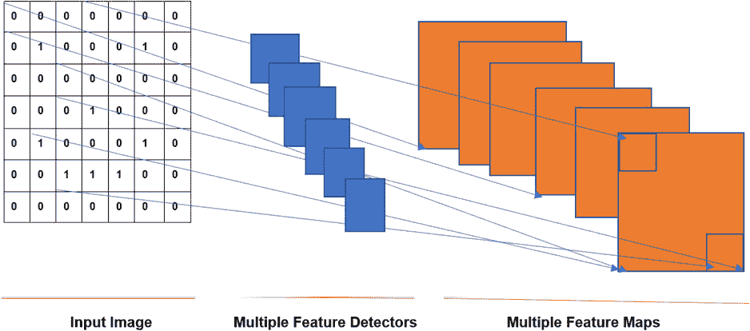
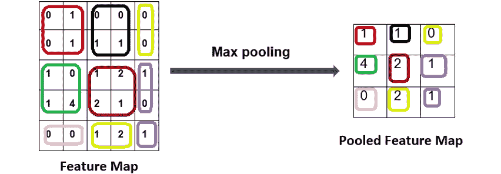
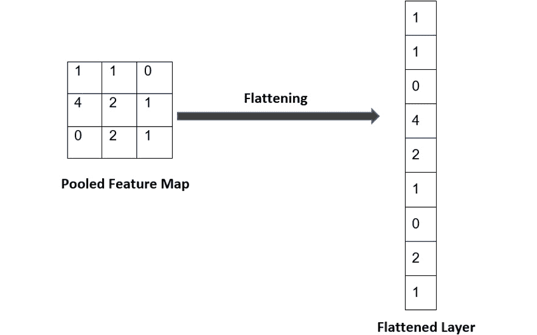
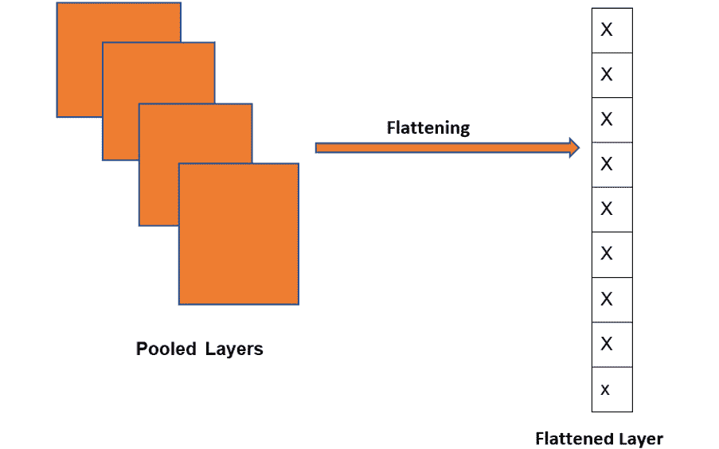
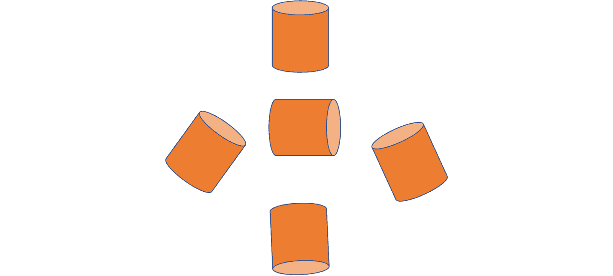
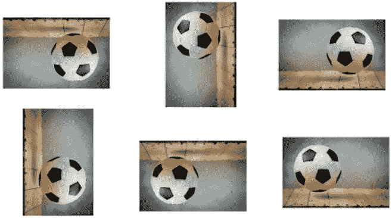

# 7. 使用卷积神经网络的计算机视觉

概览

本章涵盖了计算机视觉以及如何通过神经网络实现这一目标。你将学习如何构建图像处理应用程序，并使用卷积神经网络进行模型分类。你还将研究卷积神经网络的架构，并学习如何利用最大池化、展平、特征映射和特征检测等技术。在本章结束时，你不仅能构建自己的图像分类器，还能有效地评估它们，以便应用到自己的实际项目中。

# 引言

在上一章中，我们详细探讨了模型评估。我们介绍了`准确率`，以及为什么在某些数据集上，尤其是类别高度不平衡的分类任务中，准确率可能会产生误导。像预测太平洋地区飓风或预测某人是否会违约信用卡贷款这样的数据集，正类实例相较于负类实例较为稀有，因此准确率分数会产生误导，因为空准确率如此之高。

为了应对类别不平衡问题，我们学习了可以用来适当评估模型的技术，包括计算模型评估指标，如灵敏度、特异性、假阳性率和`AUC 分数`，以及绘制`ROC 曲线`。在本章中，我们将学习如何分类另一种类型的数据集——即图像。图像分类非常有用，并且有很多现实世界的应用，我们将会发现。

**计算机视觉**是机器学习和人工智能中最重要的概念之一。随着智能手机在拍摄、分享和上传图片方面的广泛使用，通过图像生成的数据量正在呈指数级增长。因此，专注于计算机视觉领域的专家需求达到了历史最高水平。像医疗保健行业这样的行业，由于医学影像领域的进展，正处于一场革命的边缘。

本章将介绍计算机视觉及其应用的各个行业。你还将学习`ANNs`（人工神经网络），它使用向量作为输入，而 CNN 则使用图像作为输入。在本章中，我们将更详细地研究`CNNs`（卷积神经网络），以及与之相关的概念，如**最大池化**、**展平**、**特征图**和**特征选择**。我们将使用 Keras 作为工具，运行实际图像上的图像处理算法。

# 计算机视觉

为了理解计算机视觉，我们先来讨论一下人类视觉。人类视觉是指人眼和大脑看见并识别物体的能力。计算机视觉是给机器提供一种类似的，甚至是更好的理解，能够看到和识别现实世界中的物体。

对人眼来说，准确识别一个动物是老虎还是狮子相对简单，但对于计算机系统来说，要区分这些物体需要大量的训练。计算机视觉也可以定义为构建能够模仿人眼和大脑功能的数学模型。基本上，就是训练计算机理解和处理图像与视频。

计算机视觉是许多前沿机器人技术领域的重要组成部分：医疗健康（X 光片、MRI 扫描、CT 扫描等）、无人机、自动驾驶汽车、体育和娱乐等。几乎所有的企业都需要计算机视觉才能成功运营。

想象一下，由全球的 CCTV 视频、我们智能手机每天捕捉的照片、每天在 YouTube 等互联网网站上传播的视频，以及我们在 Facebook 和 Instagram 等社交网站上分享的图片，所生成的大量数据。所有这些都会产生巨量的图像数据。为了处理和分析这些数据，使计算机在处理上变得更智能，这些数据需要高水平的计算机视觉专家来处理。计算机视觉是机器学习中一个高回报的领域。以下章节将描述如何通过神经网络——特别是卷积神经网络——来实现计算机视觉任务，而这些神经网络在计算机视觉任务中表现出色。

# 卷积神经网络

当我们谈论计算机视觉时，我们几乎总是提到 CNN。CNN 是一类深度神经网络，主要用于计算机视觉和图像领域。CNN 用于识别图像，将它们按相似性进行聚类，并在场景中实现物体识别。CNN 有不同的层次——即输入层、输出层和多个隐藏层。这些隐藏层包括全连接层、卷积层、作为**激活函数**的`ReLU 层`、`归一化层`和池化层。在一个非常简单的层面上，CNN 帮助我们识别图像并进行适当的标注；例如，一张老虎图像会被识别为老虎：


图 7.1：一个通用的 CNN

以下是一个 CNN 分类老虎的例子：


图 7.2：一个 CNN 将一张老虎图像分类为“老虎”类别

# CNN 的架构

CNN 架构的主要组成部分如下：

+   `输入图像`

+   `卷积层`

+   `池化层`

+   `扁平化`

## 输入图像

`输入图像`是 CNN 架构的第一个组成部分。图像可以是任何类型的：人类、动物、风景、医学 X 光图像等等。每张图像都会被转换成一个由零和一组成的数学矩阵。以下图解释了计算机如何看待字母**T**的图像。

所有值为 1 的块表示数据，而值为 0 的块表示空白区域：



图 7.3：字母‘T’的矩阵

## 卷积层

`卷积层`是图像处理开始的地方。卷积层由两个部分组成：

+   `特征检测器` 或 `滤波器`

+   `特征图`

`特征检测器` 或 `滤波器`：这是一个矩阵或模式，将其应用到图像上，可以将其转化为特征图：


图 7.4：特征检测器

如我们所见，这个特征检测器被（叠加）放置在原始图像上，并对相应的元素进行计算。计算是通过乘以相应的元素完成的，如下图所示。这个过程会对所有单元进行重复。最终得到一个新的处理过的图像—— `(0x0+0x0+0x1) + (0x1+1x0+0x0) + (0x0+0x1+0x1) = 0`：



图 7.5：特征检测器在图像中的掩膜

`特征图`：这是通过将`图像`与`特征检测器`卷积得到的缩小图像。我们必须将特征检测器放在原始图像的所有可能位置，并从中得出一个更小的图像；这个生成的图像就是输入图像的特征图：



图 7.6：特征图

注意

在这里，`特征检测器`是滤波器，`特征图`是缩小后的图像。在图像缩小时，一些信息会丢失。

在实际的卷积神经网络（CNN）中，会使用多个特征检测器生成多个特征图，如下图所示：



图 7.7：多个特征检测器和特征图

## 池化层

`池化层`帮助我们忽略图像中不太重要的数据，并进一步缩小图像的大小，同时保留其重要特征。考虑以下三张包含四只猫的图像：


图 7.8：猫图像示例

为了识别图像中是否包含猫，神经网络分析图片。它可能会查看耳朵形状、眼睛形状等。同时，图像中包含许多与猫无关的特征。前两张图中的树和叶子在猫的识别中是无用的。池化机制帮助算法理解图像中哪些部分是相关的，哪些部分是无关的。

从卷积层得到的特征图会通过池化层进一步减少图像的尺寸，同时保留图像中最相关的部分。池化层由最大池化、最小池化和平均池化等功能组成。这意味着我们选择一个矩阵大小，比如`2x2`，然后扫描特征图，选择适合该块的`2x2`矩阵中的最大数值。下图清晰地展示了最大池化是如何工作的。请参考颜色；从特征图中，每个彩色框中的最大值会被选中并放入池化后的特征图：



图 7.9：池化

考虑一个包含数字`4`的框。假设数字`4`表示一只猫的耳朵，而耳朵周围的空白部分是`0`和`1`。因此，我们忽略该块中的`0`和`1`，只选择`4`。以下是我们用来添加池化层的示例代码；这里使用`Maxpool2D`进行最大池化，它有助于识别最重要的特征：

```py
classifier.add(MaxPool2D(2,2))
```

## 展平

`Flattening`是 CNN 的一部分，其中图像被处理为 ANN 的输入。顾名思义，经过池化的图像被展平，并转换成一个单一的列。每一行被转化为一列，并一个接一个地堆叠在一起。在这里，我们将一个`3x3`矩阵转换成了一个`1xn`矩阵，其中`n`在我们的例子中为`9`：



图 7.10：展平

在实时处理中，我们会得到多个池化后的特征图，并将它们展平成一个单一的列。这个单一的列会作为 ANN 的输入。下图展示了多个池化层被展平为单一列：



图 7.11：池化与展平

以下是我们用来添加展平层的示例代码；这里使用`Flatten`来展平 CNN：

```py
classifier.add(Flatten())
```

现在，让我们来看一下卷积神经网络（CNN）的整体结构：


图 7.12：CNN 架构

以下是我们用来为 CNN 添加第一层的示例代码：

```py
classifier.add(Conv2D(32,3,3,input_shape=(64,64,3),activation='relu'))
```

`32,3,3`表示有`32`个`3x3`大小的特征检测器。作为一个好的实践，建议从`32`开始，之后可以添加`64`或`128`。

`Input_shape`：由于所有图像的形状和大小都不同，这个`input_image`将所有图像转换成统一的形状和大小。`(64,64)`是转换后的图像的尺寸。它可以设置为`128`或`256`，但如果你在笔记本电脑的 CPU 上工作，建议使用`64x64`。最后一个参数`3`是因为图像是彩色图像（使用红、绿、蓝编码，或 RGB）。如果图像是黑白的，那么可以将该参数设置为 1。使用的激活函数是 ReLU。

注意

本书中，我们使用 Keras 并以 TensorFlow 作为后端。如果后端是 Theano，那么`input_image`将被编码为（`3,64,64`）。

最后一步是拟合已经创建的数据。这里是我们用来执行此操作的代码：

```py
classifier.fit_generator(training_set,steps_per_epoch = 5000,\
                         epochs = 25,validation_data = test_set,\
                         validation_steps = 1000)
```

注意

`steps_per_epoch` 是训练图像的数量。`validation_steps` 是测试图像的数量。

# 图像增强

**增强**这个词意味着使某物变大或增多的动作或过程。**图像**或**数据增强**以类似的方式工作。图像/数据增强创建了许多我们图像的批次。然后，它对批次中的随机图像应用随机转换。数据转换可以是旋转图像、平移图像、翻转图像等。通过应用这种转换，我们在批次中获得了更多样化的图像，并且我们也拥有了比原来更多的数据。

一个圆柱体可以从不同角度旋转并呈现出不同的视角。在以下图像中，单个圆柱体可以从五个不同的角度看到。因此，我们实际上从一张图像中创建了五张不同的图像：



图 7.13：圆柱体的图像增强

以下是我们将用于图像增强的一些示例代码；在这里，`ImageDataGenerator` 类用于处理。`shear_range`、`zoom_range` 和 `horizontal_flip` 都用于转换图像：

```py
from keras.preprocessing.image import ImageDataGenerator
train_datagen = ImageDataGenerator(rescale = 1./255.0,\
                                   shear_range = 0.3,\
                                   zoom_range = 0.3,\
                                   horizontal_flip = False)
test_datagen = ImageDataGenerator(rescale = 1./255.0)
```

## 图像增强的优势

图像增强是图像处理中的一个重要部分：

+   **减少过拟合**：通过创建相同图像的多个版本，并将其旋转一个给定角度，从而有助于减少过拟合。

+   **增加图像数量**：一张图像作为多张图像处理。因此，本质上，数据集中的图像较少，但每张图像都可以通过图像增强转换为多张图像。图像增强将增加图像的数量，并且每张图像将被算法以不同的方式处理。

+   **容易预测新图像**：想象一张足球的图像从不同角度拍摄，每个角度都被认为是一张不同的图像。这意味着算法在预测新图像时将更加准确：



图 7.14：足球图像的图像增强

现在我们已经学习了计算机视觉与卷积神经网络（CNN）的概念和理论，让我们做一些实际的例子。

首先，我们将从一个练习开始，构建一个简单的 CNN。在接下来的练习和活动中，我们将通过排列组合以下内容来调整我们的 CNN：

+   添加更多 CNN 层

+   添加更多 ANN 层

+   改变优化器函数

+   改变激活函数

让我们开始创建我们的第一个 CNN，以便将汽车和花卉图像分类到各自的类别中。

## 练习 7.01：构建 CNN 并识别汽车和花卉的图像

本次练习中，我们有汽车和花朵的图像，这些图像已经分为训练集和测试集，我们需要构建一个 CNN 模型，用于识别图像是汽车还是花朵。

注意

本章中的所有练习和活动将在 Jupyter notebooks 中进行。请从[`packt.live/39tID2C`](https://packt.live/39tID2C)下载本书的 GitHub 仓库，以及所有准备好的模板。

在开始之前，确保已从本书的 GitHub 仓库下载了图像数据集到自己的工作目录。您将需要一个`training_set`文件夹来训练模型，一个`test_set`文件夹来测试模型。这些文件夹中都将包含一个`cars`文件夹，里面是汽车图像，以及一个`flowers`文件夹，里面是花朵图像。

完成此练习的步骤如下：

1.  导入`numpy`库和所需的 Keras 库及类：

    ```py
    # Import the Libraries
    from keras.models import Sequential
    from keras.layers import Conv2D, MaxPool2D, Flatten, Dense
    import numpy as np
    from tensorflow import random
    ```

1.  现在，设置种子并使用`Sequential`类初始化模型：

    ```py
    # Initiate the classifier
    seed = 1
    np.random.seed(seed)
    random.set_seed(seed)
    classifier = Sequential()
    ```

1.  添加`CNN`的第一层，将输入形状设置为`(64, 64, 3)`，即每个图像的维度，并设置激活函数为`ReLU`：

    ```py
    classifier.add(Conv2D(32,3,3, input_shape=(64,64,3), \
                   activation='relu'))
    ```

    `32,3,3`表示有`32`个`3x3`大小的特征探测器。

1.  现在，添加池化层，图像大小为`2x2`：

    ```py
    classifier.add(MaxPool2D(2,2))
    ```

1.  通过添加展平层到`CNN`模型中，展平池化层的输出：

    ```py
    classifier.add(Flatten())
    ```

1.  添加 ANN 的第一层`Dense`。这里，`128`是节点的输出数量。作为一个好的实践，`128`是一个不错的起点。`activation`为`relu`，作为一个好的实践，最好选择 2 的幂次方：

    ```py
    classifier.add(Dense(128, activation='relu')) 
    ```

1.  添加 ANN 的输出层。由于这是一个二分类问题，输出大小为`1`，激活函数为`sigmoid`：

    ```py
    classifier.add(Dense(1, activation='sigmoid')) 
    ```

1.  使用`adam`优化器编译网络，并在训练过程中计算准确率：

    ```py
    #Compile the network
    classifier.compile(optimizer='adam', loss='binary_crossentropy', \
                       metrics=['accuracy'])
    ```

1.  创建训练和测试数据生成器。将训练和测试图像按`1/255`进行重缩放，使所有值都在`0`和`1`之间。仅为训练数据生成器设置以下参数——`shear_range=0.2`、`zoom_range=0.2`和`horizontal_flip=True`：

    ```py
    from keras.preprocessing.image import ImageDataGenerator
    train_datagen = ImageDataGenerator(rescale = 1./255,\
                                       shear_range = 0.2,\
                                       zoom_range = 0.2,\
                                       horizontal_flip = True)
    test_datagen = ImageDataGenerator(rescale = 1./255)
    ```

1.  从`training set`文件夹创建训练集。`'../dataset/training_set'`是我们存放数据的文件夹。我们的 CNN 模型的图像大小为`64x64`，因此这里也应传入相同的大小。`batch_size`是每个批次中的图像数量，设为`32`。`Class_mode`设置为`binary`，因为我们正在处理二分类问题：

    ```py
    training_set = train_datagen.flow_from_directory(\
                   '../dataset/training_set',\
                   target_size = (64, 64),\
                   batch_size = 32,\
                   class_mode = 'binary')
    ```

1.  对测试集重复*第 10 步*，同时将文件夹设置为测试图像所在的位置，即`'../dataset/test_set'`：

    ```py
    test_set = test_datagen.flow_from_directory(\
               '../dataset/test_set',\
               target_size = (64, 64),\
               batch_size = 32,\
               class_mode = 'binary')
    ```

1.  最后，拟合数据。将`steps_per_epoch`设置为`10000`，`validation_steps`设置为`2500`。以下步骤可能需要一些时间来执行：

    ```py
    classifier.fit_generator(training_set,steps_per_epoch = 10000,\
                             epochs = 2,validation_data = test_set,\
                             validation_steps = 2500,shuffle=False)
    ```

    上述代码将产生以下输出：

    ```py
    Epoch 1/2
    10000/10000 [==============================] - 1994s 199ms/step - loss: 0.2474 - accuracy: 0.8957 - val_loss: 1.1562 - val_accuracy: 0.8400
    Epoch 2/2
    10000/10000 [==============================] - 1695s 169ms/step - loss: 0.0867 - accuracy: 0.9689 - val_loss: 1.4379 - val_accuracy: 0.8422
    ```

    验证集上的准确率为`84.22%`。

    注意

    为了获得更准确的结果，尝试将 epochs 的数量增加到大约`25`。这将增加处理数据所需的时间，总时间取决于机器的配置。

    要访问此特定部分的源代码，请参考[`packt.live/38njqHU`](https://packt.live/38njqHU)。

    你还可以在[`packt.live/3iqFpSN`](https://packt.live/3iqFpSN)上在线运行这个示例。

这完成了关于处理图像和识别图像内容的练习。这里需要记住的一件重要事是，这段代码对于任何二分类问题都是健壮的。这意味着即使图像数据发生变化，代码也保持不变。我们将在下一个活动中通过修改模型的一些参数并评估模型的性能来测试我们对此的理解。

## 活动 7.01：用多层和使用 softmax 修改我们的模型

由于我们已经成功运行了`CNN 模型`，下一步是尝试提高我们算法的性能。有很多方法可以提高其性能，其中一种最直接的方法是向模型中添加多个 ANN 层，我们将在本活动中学习这个方法。我们还将激活函数从 sigmoid 改为 softmax。通过这样做，我们可以将结果与上一个练习的结果进行比较。请按照以下步骤完成此活动：

1.  要构建 CNN 导入库，设置种子并创建`Sequential`类，导入`Conv2D`、`MaxPool2D`、`Flatten`和`Dense`。`Conv2D`用于构建卷积层。由于我们的图片是二维的，所以这里使用了二维卷积。类似地，`MaxPool2D`用于最大池化，`Flatten`用于将 CNN 展开，`Dense`用于向 ANN 添加全连接层。

1.  使用前面的库开始构建 CNN 架构。在添加第一层之后，向 CNN 中添加两层额外的层。

1.  向其中添加一个池化和展平层，它将作为 ANN 的输入。

1.  构建一个全连接的 ANN，其输入将是 CNN 的输出。在添加 ANN 的第一层后，再添加三层。对于 ANN 的输出层，使用 softmax 激活函数。编译模型。

1.  执行图像增强以处理和转换数据。`ImageDataGenerator`类用于处理。`shear_range`、`zoom_range`和`horizontal_flip`都用于图像的转换。

1.  创建训练集和测试集数据。

1.  最后，拟合已创建的数据。

在实现这些步骤之后，你应该得到以下预期输出：

```py
Epoch 1/2
10000/10000 [==============================] - 2452s 245ms/step - loss: 8.1783 - accuracy: 0.4667 - val_loss: 11.4999 - val_accuracy: 0.4695
Epoch 2/2
10000/10000 [==============================] - 2496s 250ms/step - loss: 8.1726 - accuracy: 0.4671 - val_loss: 10.5416 - val_accuracy: 0.4691
```

注意

这个活动的解决方案可以在第 439 页找到。

在此活动中，我们修改了 CNN 模型，尝试提高图像分类器的准确性。我们添加了额外的卷积层和额外的 ANN 全连接层，并更改了输出层的激活函数。这样做后，我们的准确性反而下降了。在下一个练习中，我们将激活函数更改回 sigmoid。我们将通过观察在验证数据集上评估的准确性来评估性能。

## 练习 7.02：通过恢复为 Sigmoid 激活函数来修改我们的模型

在这个练习中，我们将重建模型，但将激活函数从 softmax 恢复为 sigmoid。通过这样做，我们可以与之前的模型进行准确度比较。按照以下步骤完成此练习：

1.  导入`numpy`库和必要的 Keras 库及类：

    ```py
    # Import the Libraries 
    from keras.models import Sequential
    from keras.layers import Conv2D, MaxPool2D, Flatten, Dense
    import numpy as np
    from tensorflow import random
    ```

1.  现在，设置随机种子并使用`Sequential`类初始化模型：

    ```py
    # Initiate the classifier
    seed = 43
    np.random.seed(seed)
    random.set_seed(seed)
    classifier = Sequential()
    ```

1.  添加 CNN 的第一层，设置输入形状为`(64, 64, 3)`，即每张图像的维度，并将激活函数设置为 ReLU。然后，添加`32`个大小为`(3, 3)`的特征检测器。再添加两层具有`32`个`(3, 3)`大小特征检测器的卷积层，且同样使用 ReLU 激活函数：

    ```py
    classifier.add(Conv2D(32,3,3,input_shape=(64,64,3),\
                          activation='relu'))
    classifier.add(Conv2D(32, (3, 3), activation = 'relu'))
    classifier.add(Conv2D(32, (3, 3), activation = 'relu'))
    ```

1.  现在，添加池化层，图像大小为`2x2`：

    ```py
    classifier.add(MaxPool2D(2,2))
    ```

1.  再添加一个`Conv2D`层，参数与*步骤 3*中的相同，再加一个池化层，用于补充*步骤 4*中使用的相同参数：

    ```py
    classifier.add(Conv2D(32, (3, 3), activation = 'relu'))
    classifier.add(MaxPool2D(pool_size = (2, 2)))
    ```

1.  通过向`CNN model`中添加一个 flatten 层，扁平化池化层的输出：

    ```py
    classifier.add(Flatten())
    ```

1.  添加 ANN 的第一个`Dense`层。这里，`128`是节点的输出数量。作为一个好的实践，`128`是一个很好的起点。`activation`是`relu`。作为一个好的实践，最好选择二的幂次。再添加三个具有相同参数的额外层：

    ```py
    classifier.add(Dense(128,activation='relu'))
    classifier.add(Dense(128,activation='relu'))
    classifier.add(Dense(128,activation='relu'))
    classifier.add(Dense(128,activation='relu'))
    ```

1.  添加 ANN 的输出层。这是一个二分类问题，因此输出为`1`，激活函数为`sigmoid`：

    ```py
    classifier.add(Dense(1,activation='sigmoid')) 
    ```

1.  使用 Adam 优化器编译网络，并在训练过程中计算准确度：

    ```py
    classifier.compile(optimizer='adam', loss='binary_crossentropy', \
                       metrics=['accuracy'])
    ```

1.  创建训练和测试数据生成器。将训练和测试图像按`1/255`缩放，以使所有值位于`0`和`1`之间。只为训练数据生成器设置以下参数——`shear_range=0.2`，`zoom_range=0.2`，以及`horizontal_flip=True`：

    ```py
    from keras.preprocessing.image import ImageDataGenerator
    train_datagen = ImageDataGenerator(rescale = 1./255,
                                       shear_range = 0.2,
                                       zoom_range = 0.2,
                                       horizontal_flip = True)
    test_datagen = ImageDataGenerator(rescale = 1./255)
    ```

1.  从`training set`文件夹创建训练集。`../dataset/training_set`是我们存放数据的文件夹。我们的 CNN 模型图像大小为 64x64，因此这里也应该传入相同的大小。`batch_size`是单个批次中的图像数量，为`32`。`class_mode`为二进制，因为我们正在处理二分类问题：

    ```py
    training_set = \
    train_datagen.flow_from_directory('../dataset/training_set',\
                                      target_size = (64, 64),\
                                      batch_size = 32,\
                                      class_mode = 'binary')
    ```

1.  对测试集重复*步骤 11*，通过设置文件夹为测试图像所在位置，即`'../dataset/test_set'`：

    ```py
    test_set = \
    test_datagen.flow_from_directory('../dataset/test_set',\
                                     target_size = (64, 64),\
                                     batch_size = 32,\
                                     class_mode = 'binary')
    ```

1.  最后，拟合数据。将`steps_per_epoch`设置为`10000`，`validation_steps`设置为`2500`。以下步骤可能需要一些时间来执行：

    ```py
    classifier.fit_generator(training_set,steps_per_epoch = 10000,\
                             epochs = 2,validation_data = test_set,\
                             validation_steps = 2500,shuffle=False)
    ```

    上述代码产生以下输出：

    ```py
    Epoch 1/2
    10000/10000 [==============================] - 2241s 224ms/step - loss: 0.2339 - accuracy: 0.9005 - val_loss: 0.8059 - val_accuracy: 0.8737
    Epoch 2/2
    10000/10000 [==============================] - 2394s 239ms/step - loss: 0.0810 - accuracy: 0.9699 - val_loss: 0.6783 - val_accuracy: 0.8675
    ```

模型的准确率为`86.75%`，显然高于我们在上一个练习中构建的模型的准确率。这表明激活函数的重要性。仅仅将输出激活函数从 softmax 改为 sigmoid，就将准确率从`46.91%`提高到了`86.75%`。

注意

要访问此特定部分的源代码，请参阅 [`packt.live/2ZD9nKM`](https://packt.live/2ZD9nKM)。

您也可以在网上运行此示例：[`packt.live/3dPZiiQ`](https://packt.live/3dPZiiQ)。

在下一个练习中，我们将尝试不同的优化器，并观察它如何影响模型的性能。

注意

在二分类问题中（在我们的案例中是汽车与花朵），通常更好的做法是将 sigmoid 作为输出的激活函数。

## 练习 7.03：将优化器从 Adam 更改为 SGD

在这个练习中，我们将再次修改模型，将优化器更改为`SGD`。通过这样做，我们可以比较与之前模型的准确度。请按照以下步骤完成本练习：

1.  导入`numpy`库以及所需的 Keras 库和类：

    ```py
    # Import the Libraries 
    from keras.models import Sequential
    from keras.layers import Conv2D, MaxPool2D, Flatten, Dense
    import numpy as np
    from tensorflow import random
    ```

1.  现在，使用`Sequential`类初始化模型：

    ```py
    # Initiate the classifier
    seed = 42
    np.random.seed(seed)
    random.set_seed(seed)
    classifier = Sequential()
    ```

1.  添加`CNN`的第一层，将输入形状设置为`(64, 64, 3)`，即每个图像的维度，并将激活函数设置为`ReLU`。然后，添加`32`个大小为`(3, 3)`的特征检测器。再添加两个相同特征检测器和相同大小的卷积层：

    ```py
    classifier.add(Conv2D(32,(3,3),input_shape=(64,64,3),\
                   activation='relu'))
    classifier.add(Conv2D(32,(3,3),activation='relu'))
    classifier.add(Conv2D(32,(3,3),activation='relu'))
    ```

1.  现在，添加池化层，图像大小为`2x2`：

    ```py
    classifier.add(MaxPool2D(pool_size=(2, 2)))
    ```

1.  添加另一个`Conv2D`，参数与*步骤 3*中的相同，并添加一个池化层来补充它，使用与*步骤 4*中相同的参数：

    ```py
    classifier.add(Conv2D(32, (3, 3), input_shape = (64, 64, 3), \
                   activation = 'relu'))
    classifier.add(MaxPool2D(pool_size=(2, 2)))
    ```

1.  添加一个`Flatten`层以完成 CNN 架构：

    ```py
    classifier.add(Flatten())
    ```

1.  添加 ANN 的第一层`Dense`，大小为`128`。再向网络添加三个相同参数的`Dense`层：

    ```py
    classifier.add(Dense(128,activation='relu')) 
    classifier.add(Dense(128,activation='relu'))
    classifier.add(Dense(128,activation='relu'))
    classifier.add(Dense(128,activation='relu'))
    ```

1.  添加 ANN 的输出层。这是一个二分类问题，所以输出为`1`，激活函数为`sigmoid`：

    ```py
    classifier.add(Dense(1,activation='sigmoid')) 
    ```

1.  使用`SGD 优化器`编译网络，并在训练过程中计算准确度：

    ```py
    classifier.compile(optimizer='SGD', loss='binary_crossentropy', \
                       metrics=['accuracy'])
    ```

1.  创建训练和测试数据生成器。通过`1/255`对训练和测试图像进行重新缩放，使得所有值都在`0`和`1`之间。仅为训练数据生成器设置以下参数：`shear_range=0.2`，`zoom_range=0.2`，以及`horizontal_flip=True`：

    ```py
    from keras.preprocessing.image import ImageDataGenerator
    train_datagen = ImageDataGenerator(rescale = 1./255,\
                                       shear_range = 0.2,\
                                       zoom_range = 0.2,\
                                       horizontal_flip = True)
    test_datagen = ImageDataGenerator(rescale = 1./255)
    ```

1.  从`training set`文件夹创建一个训练集。`../dataset/training_set`是我们存放数据的文件夹。我们的 CNN 模型图像大小为`64x64`，因此这里也应该传递相同的大小。`batch_size`是每批次的图像数量，即`32`。`class_mode`是二分类模式，因为我们正在创建一个二分类器：

    ```py
    training_set = \
    train_datagen.flow_from_directory('../dataset/training_set',\
                                      target_size = (64, 64),\
                                      batch_size = 32,\
                                      class_mode = 'binary')
    ```

1.  对测试集重复*步骤 11*，将文件夹设置为测试图像所在的位置，即`'../dataset/test_set'`：

    ```py
    test_set = \
    test_datagen.flow_from_directory('../dataset/test_set',\
                                     target_size = (64, 64),\
                                     batch_size = 32,\
                                     class_mode = 'binary')
    ```

1.  最后，拟合数据。将`steps_per_epoch`设置为`10000`，`validation_steps`设置为`2500`。以下步骤可能需要一些时间来执行：

    ```py
    classifier.fit_generator(training_set,steps_per_epoch = 10000,\
                             epochs = 2,validation_data = test_set,\
                             validation_steps = 2500,shuffle=False)
    ```

    上述代码会产生以下输出：

    ```py
    Epoch 1/2
    10000/10000 [==============================] - 4376s 438ms/step - loss: 0.3920 - accuracy: 0.8201 - val_loss: 0.3937 - val_accuracy: 0.8531
    Epoch 2/2
    10000/10000 [==============================] - 5146s 515ms/step - loss: 0.2395 - accuracy: 0.8995 - val_loss: 0.4694 - val_accuracy: 0.8454
    ```

    准确率为`84.54%`，因为我们使用了多个`ANNs`和`SGD`作为优化器。

    注意

    要访问此特定部分的源代码，请参阅[`packt.live/31Hu9vm`](https://packt.live/31Hu9vm)。

    您还可以在[`packt.live/3gqE9x8`](https://packt.live/3gqE9x8)上在线运行这个示例。

到目前为止，我们已经尝试了模型的多种不同排列和组合。看起来，针对该数据集，获得最佳准确率的做法是：

+   添加多个 CNN 层。

+   添加多个 ANN 层。

+   使用 sigmoid 激活函数。

+   使用 Adam 作为优化器。

+   将 epoch 大小增加到大约`25`（这需要大量的计算时间——确保您有 GPU 进行处理）。这将提高预测的准确性。

最后，我们将继续预测一个新的未知图像，将其传递给算法，并验证该图像是否被正确分类。在下一个练习中，我们将演示如何使用模型对新图像进行分类。

## 练习 7.04：分类新图像

在本练习中，我们将尝试对新图像进行分类。该图像尚未接触过算法，因此我们将使用此练习来测试我们的算法。您可以运行本章中的任何算法（尽管推荐使用准确率最高的那个），然后使用模型对图像进行分类。

注意

本练习中使用的图像可以在本书的 GitHub 仓库中找到，地址为[`packt.live/39tID2C`](https://packt.live/39tID2C)。

在我们开始之前，请确保您已经从本书的 GitHub 仓库下载了`test_image_1`并将其保存到您的工作目录中。这个练习是基于之前的练习，所以请确保您已经在工作区中准备好本章中的算法并可以运行。

完成本练习的步骤如下：

1.  加载图像。`'test_image_1.jpg'`是测试图像的路径。请将路径更改为您在系统中保存数据集的位置。查看图像以验证它是什么：

    ```py
    from keras.preprocessing import image
    new_image = image.load_img('../test_image_1.jpg', \
                               target_size = (64, 64))
    new_image
    ```

1.  打印训练集的`class_indices`属性中的类别标签：

    ```py
    training_set.class_indices
    ```

1.  处理图像：

    ```py
    new_image = image.img_to_array(new_image)
    new_image = np.expand_dims(new_image, axis = 0)
    ```

1.  预测新图像：

    ```py
    result = classifier.predict(new_image)
    ```

1.  `prediction` 方法将输出图像的`1`或`0`。为了将`1`和`0`映射到`flower`（花）或`car`（车），可以使用`class_indices`方法和`if…else`语句，示例如下：

    ```py
    if result[0][0] == 1:
        prediction = 'It is a flower'
    else:
        prediction = 'It is a car'
    print(prediction)
    ```

    上述代码会产生以下输出：

    ```py
    It is a car
    ```

    `test_image_1` 是一张汽车的图像（您可以通过查看图像确认），并且模型正确预测它是汽车。

在这个练习中，我们训练了我们的模型，然后给模型提供了一张汽车的图像。通过这样做，我们发现算法正确地对图像进行了分类。你可以使用相同的过程训练模型来处理任何类型的图像。例如，如果你使用肺部感染和健康肺部的扫描训练模型，那么模型将能够分类新扫描是否代表感染的肺部或健康的肺部。

注意

要访问此特定部分的源代码，请参阅 [`packt.live/31I6B9F`](https://packt.live/31I6B9F)。

你也可以在 [`packt.live/2BzmEMx`](https://packt.live/2BzmEMx) 上在线运行此示例。

在下一个活动中，我们将把我们的知识付诸实践，使用我们在 *Exercise 7.04*，*Classifying a New Image* 中训练的模型。

## 活动 7.02：分类新图像

在这个活动中，你将尝试像我们在前一个练习中所做的那样分类另一张新图像。由于图像没有暴露给算法，因此我们将利用此活动来测试我们的算法。你可以运行本章中的任何一个算法（尽管最高准确率的算法更可取），然后使用模型来对你的图像进行分类。实施此活动的步骤如下：

1.  运行本章中的任何一个算法。

1.  从你的目录加载图像（`test_image_2`）。

1.  使用算法处理图像。

1.  预测新图像的主题。你可以查看图像本身以检查预测是否正确。

    注意

    这个活动中使用的图像可以在这本书的 GitHub 仓库中找到，链接地址为 [`packt.live/39tID2C`](https://packt.live/39tID2C)。

在开始之前，请确保已经将 `test_image_2` 从这本书的 GitHub 仓库下载到你自己的工作目录中。此活动直接跟进前面的练习，因此请确保已经准备好本章中的一个算法以在你的工作空间中运行。

实施这些步骤后，你应该得到以下预期输出：

```py
It is a flower
```

注意

此活动的解决方案可以在第 442 页找到。

在此活动中，我们根据在验证数据集上的准确性修改了各种参数，包括优化器和输出层中的激活函数，从而训练了本章中最高性能的模型。我们对一个测试图像进行了分类，发现其分类是正确的。

# 摘要

在本章中，我们研究了为什么需要计算机视觉以及其工作原理。我们了解到为什么计算机视觉是机器学习中最热门的领域之一。然后，我们使用卷积神经网络进行了工作，了解了它们的架构，并探讨了如何在现实应用中构建 CNN。我们还通过增加更多的 ANN 和 CNN 层以及更改激活和优化器函数来尝试改进我们的算法。最后，我们尝试了不同的激活函数和损失函数。

最终，我们成功地通过该算法对新图像（如汽车和花卉）进行了分类。请记住，汽车和花卉的图像可以替换为任何其他图像，例如老虎和鹿，或带有和不带有肿瘤的大脑 MRI 扫描图像。任何二分类的计算机图像问题都可以采用相同的方法来解决。

在下一章，我们将学习一种更高效的计算机视觉技术，它不仅节省时间，而且更容易实现。接下来的章节将教我们如何微调预训练模型，以便应用于我们的实际需求，从而帮助创建更加准确、训练速度更快的模型。将要使用的模型是 VGG-16 和 ResNet50，它们是常用的预训练模型，广泛用于图像分类。
