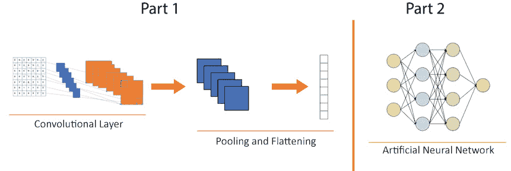
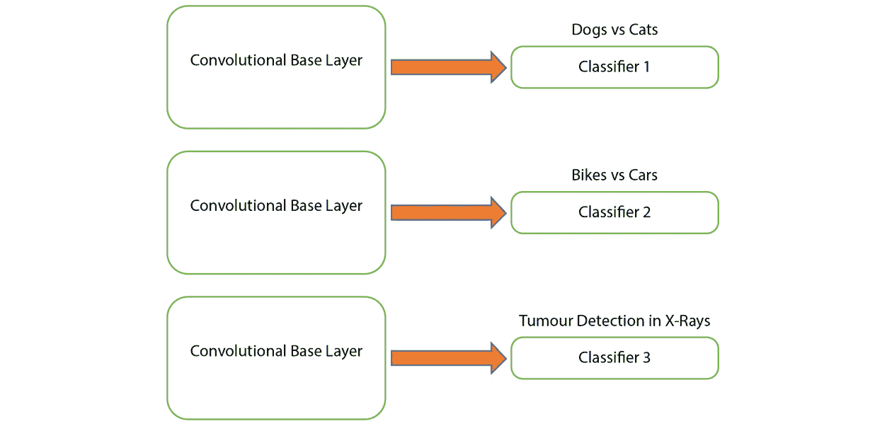
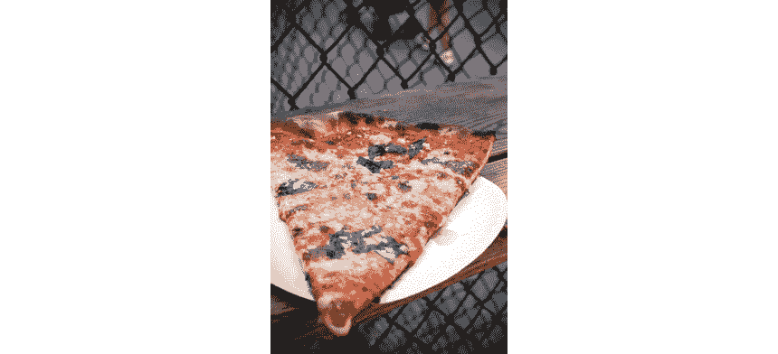
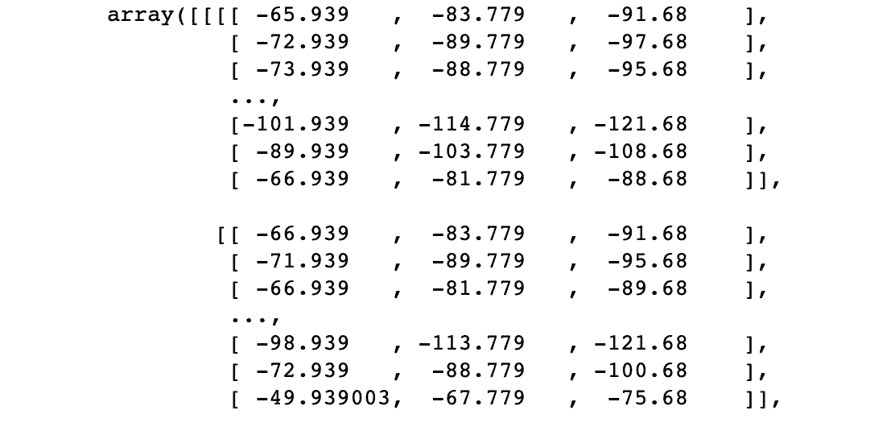
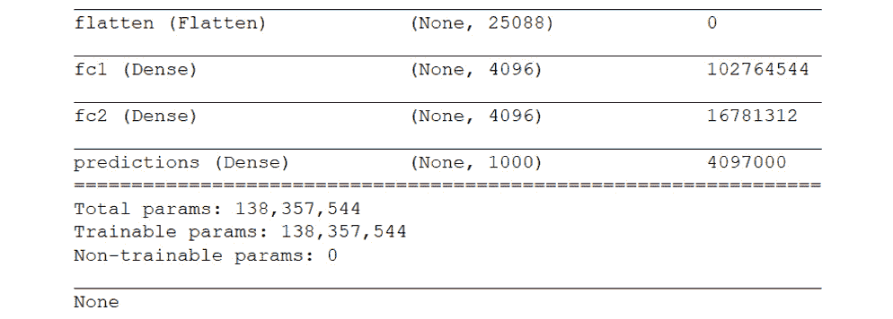
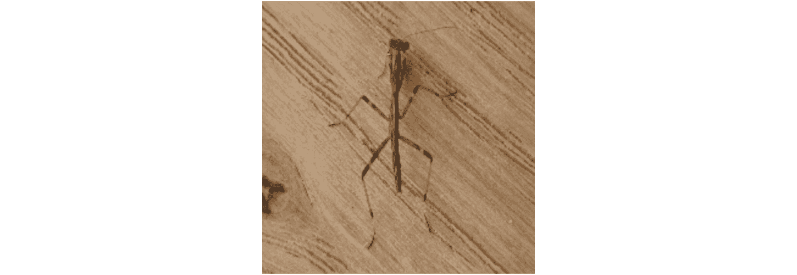
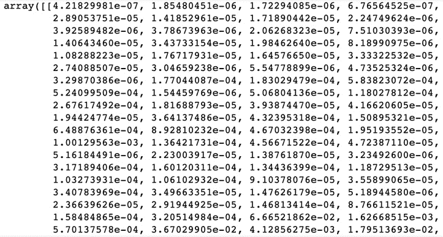
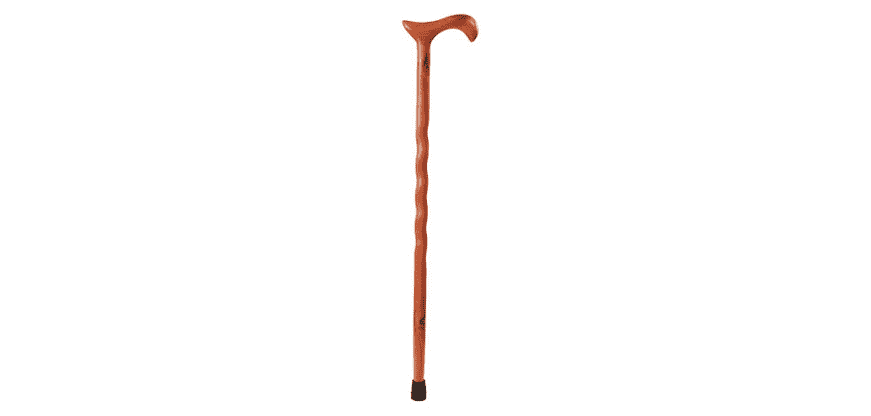
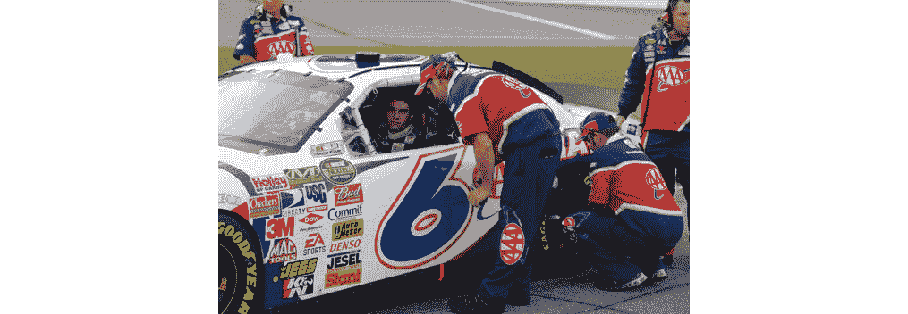

# 8. 迁移学习与预训练模型

概述

本章介绍了预训练模型的概念及其在不同应用中的使用，这种应用不同于它们最初训练时的目标，被称为迁移学习。到本章结束时，你将能够将特征提取应用于预训练模型，利用预训练模型进行图像分类，并通过微调预训练模型，将花卉和汽车图像分类到各自的类别中。我们将看到，这样做能够完成与上一章相同的任务，但准确度更高且训练时间更短。

# 介绍

在上一章中，我们学习了如何使用 Keras 从头创建**卷积神经网络**（**CNN**）。我们通过添加更多卷积层和全连接层、修改激活函数，来实验不同的架构。我们通过将汽车和花卉的图像分类到各自类别，并比较它们的准确率，来评估每个模型的性能。

然而，在实际项目中，你几乎从不从头开始编码一个卷积神经网络。你总是根据需求对其进行调整和训练。本章将向你介绍**迁移学习**和**预训练网络**（也称为**预训练模型**）这两个在行业中使用的重要概念。

我们将使用图像，并且不是从头开始构建 CNN，而是将这些图像与预训练模型匹配，尝试对其进行分类。我们还将调整模型，使其更加灵活。本章将使用的模型是**VGG16**和**ResNet50**，我们将在本章后续部分讨论它们。在开始使用预训练模型之前，我们需要了解迁移学习。

# 预训练集与迁移学习

人类通过经验学习。我们将从一个情境中获得的知识应用到未来面对的类似情境中。假设你想学习如何驾驶 SUV，你从未驾驶过 SUV，你所知道的仅仅是如何驾驶一辆小型掀背车。

SUV 的尺寸比掀背车大得多，因此在交通中驾驶 SUV 肯定是一个挑战。不过，一些基本系统（如离合器、油门和刹车）与掀背车相似。所以，学习驾驶 SUV 时，掌握了如何驾驶掀背车的技能肯定会对你大有帮助。在学习驾驶大型 SUV 时，所有你在驾驶掀背车时获得的知识都可以派上用场。

这正是迁移学习的概念。迁移学习在机器学习中是指在学习一个类似的活动时，我们存储并使用在另一个活动中获得的知识。从掀背车到 SUV 的学习模式完全符合这一定义。

假设我们想知道一张照片是狗还是猫；在这种情况下，我们可以有两种方法。其一是从头开始构建一个深度学习模型，然后将新的图片传递给网络。另一种选择是使用一个已经通过猫狗图片构建好的预训练深度学习神经网络模型，而不是从零开始创建神经网络。

使用预训练模型可以节省计算时间和资源。使用预训练网络可能会带来一些意想不到的好处。例如，几乎所有的狗和猫的照片中都会包含一些其他物体，如树木、天空和家具。我们甚至可以使用这个预训练网络来识别树木、天空和家具等物体。

因此，预训练网络是一个保存的网络（在深度学习的情况下是神经网络），它是在一个非常大的数据集上训练的，主要用于图像分类问题。要使用预训练网络，我们需要理解特征提取和微调的概念。

## 特征提取

要理解特征提取，我们需要回顾卷积神经网络的架构。

你可能还记得，`CNN`的完整架构在高层次上由以下几个部分组成：

+   一个**卷积层**

+   一个**池化和扁平化层**

+   一个**人工神经网络**（**ANN**）

下图展示了完整的 CNN 架构：


图 8.1: CNN 架构

现在，让我们将这个架构分为两个部分。第一部分包含除`ANN`之外的所有内容，而第二部分仅包含`ANN`。下图展示了一个拆分的`CNN`架构：



图 8.2: CNN 拆分架构 - 卷积基础层和分类器

第一部分称为**卷积基础层**，而第二部分称为**分类器**。

在特征提取中，我们不断重用卷积基础层，而分类器则被替换。所以，我们保留了卷积层的学习成果，并可以将不同的分类器添加到卷积层之上。分类器可以是狗与猫、摩托车与汽车，甚至是医学 X 光图像来分类肿瘤、感染等。下图展示了一些用于不同分类器的卷积基础层：



图 8.3: 可重用的卷积基础层

显而易见的下一个问题是，难道我们不能像基础层那样重用分类器吗？一般来说，答案是否定的。原因在于，从卷积基础部分学习可能更为通用，因此更具可重用性。然而，分类器的学习通常是特定于模型训练时所用的类别。因此，建议仅重用卷积基础层，而不是分类器。

从卷积基础层获得的泛化学习量取决于该层的深度。例如，在猫的情况下，模型的初始层学习一般的特征，如边缘和背景，而更高层可能学习更具体的细节，如眼睛、耳朵或鼻子的形状。因此，如果你的新数据集与原始数据集非常不同——例如，如果你想识别水果而不是猫——那么最好只使用卷积基础层的一些初始层，而不是使用整个层。

`CNN`)，网络顶部的许多全连接层是随机初始化的，并且可能由于反向传播的原因，网络的初始层学习会被完全破坏。

为了避免信息衰减，我们冻结了一些层。这是通过将这些层设为不可训练来实现的。冻结一些层并训练其他层的过程称为微调网络。

# 微调预训练网络

微调意味着调整我们的神经网络，使其更适应当前的任务。我们可以冻结网络的一些初始层，这样就不会丢失存储在这些层中的信息。这些信息是通用且有用的。然而，如果我们可以在分类器学习的同时冻结这些层，然后再解冻它们，我们可以稍微调整它们，使其更好地适应当前的问题。假设我们有一个预训练网络，可以识别动物。如果我们想要识别特定的动物，比如狗和猫，我们可以稍微调整这些层，让它们学习狗和猫的外观。这就像是使用整个预训练网络，然后在其上添加一个新层，其中包含狗和猫的图像。我们将通过使用一个预构建的网络并在其上添加一个分类器来做类似的活动，分类器将基于狗和猫的图片进行训练。

有一个三步法则来进行微调：

1.  在预训练系统的顶部添加一个分类器（`ANN`）。

1.  冻结 `卷积基础` 并训练网络。

1.  联合训练已添加的`分类器`和未冻结的`卷积基础`部分。

## ImageNet 数据集

在实际工作经验中，你几乎永远不需要自己构建基础卷积模型。你总是会使用预训练模型。但数据从哪里来呢？对于视觉计算，答案是 ImageNet。ImageNet 数据集是一个大型视觉数据库，用于视觉对象识别。它包含超过 1400 万张标注图像及其对象名称。ImageNet 包含超过 20,000 个类别。

## Keras 中的一些预训练网络

以下预训练网络可以被视为基础卷积层。你可以使用这些网络并为其拟合一个分类器（ANN）：

+   `VGG16`

+   `Inception V3`

+   `Xception`

+   `ResNet50`

+   `MobileNet`

不同的供应商创建了前面的预训练网络。例如，`ResNet50`是由`Microsoft`创建的，而`Inception V3`和`MobileNet`是由`Google`创建的。在本章中，我们将使用`VGG16`和`ResNet50`模型。

`VGG16`是一个具有 16 层的卷积神经网络模型，由牛津大学的 K. Simonyan 和 A. Zisserman 提出。该模型于 2014 年提交到`ImageNet 大规模视觉识别挑战赛`（`ILSVRC`）——这是一个用于测试最新技术的模型的挑战，模型使用了`ImageNet`数据集。`ResNet50`是另一种在`ImageNet`数据集上训练的卷积神经网络，具有 50 层，并在 2015 年的`ILSVRC`中获得了第一名。

现在我们了解了这些网络的原理，我们将练习利用这些预训练的神经网络，使用`VGG16`模型来分类一张披萨片的图像。

注意

本章中的所有练习和活动都将在 Jupyter 笔记本中开发。请从[`packt.live/2uI63CC`](https://packt.live/2uI63CC)下载本书的 GitHub 仓库以及所有准备好的模板。

## 练习 8.01：使用 VGG16 网络识别图像

我们有一张披萨片的图片。我们将使用`VGG16`网络来处理并识别这张图像。在完成以下步骤之前，请确保从 GitHub 下载了`pizza`图像并将其保存到你的工作目录中：

1.  导入库：

    ```py
    import numpy as np
    from keras.applications.vgg16 import VGG16
    from keras.preprocessing import image
    from keras.applications.vgg16 import preprocess_input
    ```

1.  初始化模型（这可能需要一些时间）：

    ```py
    classifier = VGG16()
    ```

    注意

    预测的最后一层（`Dense`）有 1000 个值。这意味着`VGG16`总共有 1000 个标签，我们的图像将是这 1000 个标签中的一个。

1.  加载图像。`'../Data/Prediction/pizza.jpg.jpg'`是我们系统中图像的路径；在你的系统中可能会有所不同：

    ```py
    new_image= image.load_img('../Data/Prediction/pizza.jpg', \
                              target_size=(224, 224))
    new_image
    ```

    下图显示了前面代码的输出：

    

    图 8.4：披萨片的图像

    目标大小应该是`224x224`，因为`VGG16`仅接受（`224,224`）大小。

1.  使用`img_to_array`函数将图像转换为数组：

    ```py
    transformed_image = image.img_to_array(new_image)
    transformed_image.shape
    ```

    前面的代码产生了以下输出：

    ```py
    (224, 224, 3)
    ```

1.  图像必须是四维形式，以便`VGG16`能够进行进一步处理。扩展图像的维度，如下所示：

    ```py
    transformed_image = np.expand_dims(transformed_image, axis=0)
    transformed_image.shape
    ```

    前面的代码产生了以下输出：

    ```py
    (1, 224, 224, 3)
    ```

1.  使用`preprocess_input`函数对图像进行预处理：

    ```py
    transformed_image = preprocess_input(transformed_image)
    transformed_image
    ```

    下图显示了前面代码的输出：

    

    图 8.5：图像预处理的屏幕截图

1.  创建`predictor`变量：

    ```py
    y_pred = classifier.predict(transformed_image)
    y_pred
    ```

1.  检查图像的形状。它应该是（`1,1000`）。`1000`是因为`ImageNet`数据库有`1000`个类别的图像。预测变量显示了我们图像属于这些图像之一的概率：

    ```py
    y_pred.shape
    ```

    前面的代码产生了以下输出：

    ```py
    (1, 1000)
    ```

1.  使用`decode_predictions`函数打印出我们的图像是什么的前五个概率，并传递预测变量`y_pred`的函数和预测数量及相应的标签输出：

    ```py
    from keras.applications.vgg16 import decode_predictions
    decode_predictions(y_pred,top=5)
    ```

    前述代码生成以下输出：

    ```py
    [[('n07873807', 'pizza', 0.97680503),
      ('n07871810', 'meat_loaf', 0.012848727),
      ('n07880968', 'burrito', 0.0019428912),
      ('n04270147', 'spatula', 0.0019108421),
      ('n03887697', 'paper_towel', 0.0009799759)]]
    ```

    数组的第一列是内部代码编号。第二列是可能的标签，第三列是图片为该标签的概率。

1.  将预测结果以人类可读的形式呈现。从`decode_predictions`函数的输出中打印出最有可能的标签：

    ```py
    label = decode_predictions(y_pred)
    """
    Most likely result is retrieved, for example, the highest probability
    """
    decoded_label = label[0][0]
    # The classification is printed 
    print('%s (%.2f%%)' % (decoded_label[1], \
          decoded_label[2]*100 ))
    ```

    前述代码生成以下输出：

    ```py
    pizza (97.68%)
    ```

在这个练习中，我们预测了一个图片，显示（以`97.68%`的概率）这张图片是披萨。显然，更高的准确率意味着我们的图片在 ImageNet 数据库中存在一个相对相似的对象，并且我们的算法成功识别了这张图片。

注意

要访问本节的源代码，请参阅[`packt.live/3dXqdsQ`](https://packt.live/3dXqdsQ)。

您还可以在[`packt.live/3dZMZAq`](https://packt.live/3dZMZAq)上在线运行这个示例。

在接下来的活动中，我们将通过使用`VGG16`网络来对不在 ImageNet 数据库中的图片进行分类，将我们的知识付诸实践。

## 活动 8.01：使用 VGG16 网络训练深度学习网络以识别图像

你有一张摩托车的图片。使用`VGG16`网络来预测这张图片。在开始之前，请确保已将图片（`test_image_1`）下载到你的工作目录中。要完成这个活动，请按照以下步骤操作：

1.  导入必要的库，包括`VGG16`网络。

1.  初始化预训练的`VGG16`模型。

1.  加载将要分类的图片。

1.  通过应用转换来预处理图片。

1.  创建一个预测变量来预测图像。

1.  给图片贴上标签并进行分类。

    注意

    这个活动的解决方案可以在第 444 页找到。

通过这些步骤，我们完成了这个活动。与*第七章*的*使用卷积神经网络进行计算机视觉*不同，我们没有从头开始构建`CNN`。相反，我们使用了一个预训练的模型。我们刚刚上传了一张需要分类的图片。从中可以看出，以`84.33%`的准确率预测它是一辆踏板车。在下一个练习中，我们将使用 ImageNet 数据库中没有匹配图片的图片。

## 练习 8.02：对不在 ImageNet 数据库中的图片进行分类

现在，让我们处理一张不在`VGG16`网络的`1000`个标签中的图像。在这个练习中，我们将处理一张竹节虫的图片，而我们的预训练网络中没有竹节虫的标签。让我们看看我们得到什么结果：

1.  导入`numpy`库和必要的`Keras`库：

    ```py
    import numpy as np
    from keras.applications.vgg16 import VGG16
    from keras.preprocessing import image
    from keras.applications.vgg16 import preprocess_input
    ```

1.  初始化模型并打印模型的摘要：

    ```py
    classifier = VGG16()
    classifier.summary()
    ```

    `classifier.summary()`显示了网络的架构。以下是需要注意的点 - 它具有四维输入形状（`None, 224, 224, 3`），并且具有三个卷积层。以下图显示了输出的最后四层：

    

    图 8.6：使用 VGG16 分类器对图像的摘要

    注意

    预测的最后一层（`Dense`）有`1000`个值。这意味着`VGG16`有`1000`个标签，而我们的图像将是这些标签中的一个。

1.  加载图像。`'../Data/Prediction/stick_insect.jpg'`是我们系统上的图像路径。在您的系统上可能会有所不同：

    ```py
    new_image = \
    image.load_img('../Data/Prediction/stick_insect.jpg', \
                   target_size=(224, 224))
    new_image
    ```

    以下图显示了前面代码的输出：

    

    图 8.7：用于预测的示例竹节虫图像

    目标大小应为`224x224`，因为`VGG16`仅接受（`224,224`）。

1.  使用`img_to_array`函数将图像转换为数组：

    ```py
    transformed_image = image.img_to_array(new_image)
    transformed_image.shape
    ```

1.  图像必须以四维形式存在，以便`VGG16`允许进一步处理。使用`expand_dims`函数沿着第 0 轴扩展图像的维度：

    ```py
    transformed_image = np.expand_dims(transformed_image, axis=0)
    transformed_image.shape
    ```

1.  使用`preprocess_input`函数预处理图像：

    ```py
    transformed_image = preprocess_input(transformed_image)
    transformed_image
    ```

    以下图显示了前面代码的输出：

    

    图 8.8：显示图像预处理的几个实例

1.  创建`predictor`变量：

    ```py
    y_pred = classifier.predict(transformed_image)
    y_pred
    ```

    以下图显示了前面代码的输出：

    

    图 8.9：创建预测变量

1.  检查图像的形状。它应该是（`1,1000`）。这是因为，正如我们之前提到的，ImageNet 数据库有`1000`个图像类别。预测变量显示了我们的图像属于这些图像之一的概率：

    ```py
    y_pred.shape
    ```

    前面的代码产生了以下代码：

    ```py
    (1, 1000)
    ```

1.  选择出`VGG16`网络具有的`1000`个标签中，我们图像标签的前五个最高概率：

    ```py
    from keras.applications.vgg16 import decode_predictions
    decode_predictions(y_pred, top=5)
    ```

    前面的代码产生了以下代码：

    ```py
    [[('n02231487', 'walking_stick', 0.30524516),
      ('n01775062', 'wolf_spider', 0.26035702),
      ('n03804744', 'nail', 0.14323168),
      ('n01770081', 'harvestman', 0.066652186),
      ('n01773549', 'barn_spider', 0.03670299)]]
    ```

    数组的第一列是内部代码编号。第二列是标签，而第三列是图像成为该标签的概率。

1.  将预测结果以人类可读的格式呈现出来。从`decode_predictions`函数的输出中打印出最可能的标签：

    ```py
    label = decode_predictions(y_pred)
    """
    Most likely result is retrieved, for example, the highest probability
    """
    decoded_label = label[0][0]
    # The classification is printed
    print('%s (%.2f%%)' % (decoded_label[1], decoded_label[2]*100 ))
    ```

    前面的代码产生了以下代码：

    ```py
    walking_stick (30.52%)
    ```

    在这里，您可以看到网络预测我们的图像是竹节虫，准确率为`30.52%`。显然，这张图像不是竹节虫，而是一只竹节虫；在`VGG16`网络包含的所有标签中，竹节虫是最接近的事物。以下图片展示了一只竹节虫：

    

图 8.10：竹节虫

为了避免这种输出，我们可以冻结`VGG16`现有的层，并添加我们自己的层。我们还可以添加一个包含拐杖和竹节虫图像的层，以便我们能够获得更好的输出。

如果你有大量的拐杖和竹节虫的图像，你可以进行类似的操作来提升模型在分类这些图像时的能力。然后你可以通过重新运行之前的练习来测试它。

注意

要访问此特定部分的源代码，请参见 [`packt.live/31I7bnR`](https://packt.live/31I7bnR)。

你也可以通过在线运行这个例子，访问 [`packt.live/31Hv1QE`](https://packt.live/31Hv1QE)。

为了更详细地理解这一点，我们来看一个不同的例子，在这个例子中，我们冻结网络的最后一层，并添加自己的层，包含汽车和花卉的图像。这将帮助网络提高分类汽车和花卉图像的准确性。

## 练习 8.03：微调 VGG16 模型

让我们来进行`VGG16`模型的微调。在这个练习中，我们将冻结网络并移除`VGG16`的最后一层，该层包含`1000`个标签。移除最后一层后，我们将建立一个新的花卉-汽车分类器`ANN`，就像我们在*第七章*《卷积神经网络与计算机视觉》中做的那样，并将这个`ANN`连接到`VGG16`，而不是原始的具有`1000`个标签的模型。基本上，我们所做的就是用用户自定义的层替换`VGG16`的最后一层。

在开始之前，请确保你已经从本书的 GitHub 仓库下载了图像数据集到自己的工作目录。你将需要一个`training_set`文件夹和一个`test_set`文件夹来测试你的模型。每个文件夹里都会包含一个`cars`文件夹，里面是汽车图像，还有一个`flowers`文件夹，里面是花卉图像。

完成此练习的步骤如下：

注意

与原始的新模型（具有`1000`个标签，涵盖`100`个不同的物体类别）不同，这个新的微调模型仅包含花卉或汽车的图像。因此，不管你向模型输入什么图像，它都会根据预测概率将其分类为花卉或汽车。

1.  导入`numpy`库、TensorFlow 的`random`库以及所需的`Keras`库：

    ```py
    import numpy as np
    import keras
    from keras.layers import Dense
    from tensorflow import random
    ```

1.  启动`VGG16`模型：

    ```py
    vgg_model = keras.applications.vgg16.VGG16()
    ```

1.  检查模型`summary`：

    ```py
    vgg_model.summary()
    ```

    下图展示了前述代码的输出：

    

    图 8.11：启动模型后的模型总结

1.  从模型总结中移除最后一层，即前述图像中的`labeled predictions`。创建一个新的 Keras 顺序模型，并遍历 VGG 模型的所有层。将所有层添加到新模型中，除了最后一层：

    ```py
    last_layer = str(vgg_model.layers[-1])
    np.random.seed(42)
    random.set_seed(42)
    classifier= keras.Sequential()
    for layer in vgg_model.layers:
        if str(layer) != last_layer:
            classifier.add(layer)
    ```

    在这里，我们创建了一个新的模型分类器名称，而不是`vgg_model`。所有层，除了最后一层，即`vgg_model`，都已经包含在分类器中。

1.  打印新创建模型的`summary`：

    ```py
    classifier.summary()
    ```

    以下图显示了上述代码的输出：

    

    图 8.12：移除最后一层后重新检查摘要

    最后一层的预测层（`Dense`）已被删除。

1.  通过遍历各层并将`trainable`参数设置为`False`来冻结这些层：

    ```py
    for layer in classifier.layers:
        layer.trainable=False
    ```

1.  添加一个大小为`1`的新输出层，使用`sigmoid`激活函数并打印模型摘要：

    ```py
    classifier.add(Dense(1, activation='sigmoid'))
    classifier.summary()
    ```

    以下函数显示了上述代码的输出：

    

    图 8.13：添加新层后重新检查摘要

    现在，最后一层是新创建的用户定义层。

1.  使用`adam`优化器和二元交叉熵损失函数来编译网络，并在训练过程中计算`accuracy`：

    ```py
    classifier.compile(optimizer='adam', loss='binary_crossentropy', \
                       metrics=['accuracy'])
    ```

    创建一些训练和测试数据生成器，就像我们在*第七章*，*使用卷积神经网络进行计算机视觉*中所做的那样。将训练和测试图像重新缩放为`1/255`，确保所有值都在`0`和`1`之间。仅为训练数据生成器设置以下参数：`shear_range=0.2`、`zoom_range=0.2` 和 `horizontal_flip=True`。

1.  接下来，从`training set`文件夹中创建训练集。`../Data/dataset/training_set`是我们存放数据的文件夹。我们的 CNN 模型的图像大小为`224x224`，所以这里也应该传入相同的大小。`batch_size`是每个批次中的图像数量，即`32`。`class_mode`是二进制的，因为我们正在创建一个二分类器。

    ```py
    from keras.preprocessing.image import ImageDataGenerator
    generate_train_data = \
    ImageDataGenerator(rescale = 1./255,\
                       shear_range = 0.2,\
                       zoom_range = 0.2,\
                       horizontal_flip = True)
    generate_test_data = ImageDataGenerator(rescale =1./255)
    training_dataset = \
    generate_train_data.flow_from_directory(\
        '../Data/Dataset/training_set',\
        target_size = (224, 224),\
        batch_size = 32,\
        class_mode = 'binary')
    test_datasetset = \
    generate_test_data.flow_from_directory(\
        '../Data/Dataset/test_set',\
        target_size = (224, 224),\
        batch_size = 32,\
        class_mode = 'binary')
    classifier.fit_generator(training_dataset,\
                             steps_per_epoch = 100,\
                             epochs = 10,\
                             validation_data = test_datasetset,\
                             validation_steps = 30,\
                             shuffle=False)
    ```

    这里有 100 张训练图像，所以设置`steps_per_epoch = 100`，设置`validation_steps=30`，并设置`shuffle=False`：

    ```py
    100/100 [==============================] - 2083s 21s/step - loss: 0.5513 - acc: 0.7112 - val_loss: 0.3352 - val_acc: 0.8539
    ```

1.  预测新图像（代码与*第七章*，*使用卷积神经网络进行计算机视觉*中的相同）。首先，从`'../Data/Prediction/test_image_2.jpg'`加载图像，并将目标大小设置为（`224, 224`），因为`VGG16`模型接受该大小的图像。

    ```py
    from keras.preprocessing import image
    new_image = \
    image.load_img('../Data/Prediction/test_image_2.jpg', \
                   target_size = (224, 224))
    new_image
    ```

    此时，你可以通过执行代码`new_image`来查看图像，通过运行`training_dataset.class_indices`来查看类标签。

    接下来，先通过`img_to_array`函数将图像转换为数组，再使用`expand_dims`函数沿着第 0 轴添加一个新的维度。最后，使用分类器的`predict`方法进行预测，并以人类可读格式打印输出：

    ```py
    new_image = image.img_to_array(new_image)
    new_image = np.expand_dims(new_image, axis = 0)
    result = classifier.predict(new_image)
    if result[0][0] == 1:
        prediction = 'It is a flower'
    else:
        prediction = 'It is a car'
    print(prediction)
    ```

    上述代码生成了以下输出：

    ```py
    It is a car
    ```

1.  最后一步，你可以通过运行`classifier.save('car-flower-classifier.h5')`来保存分类器。

在这里，我们可以看到算法通过识别汽车图像完成了正确的图像分类。我们仅使用了一个预先构建的`VGG16`模型，通过调整其层并根据我们的需求进行定制，完成了图像分类。这是一种非常强大的图像分类技术。

注意

若要访问此特定部分的源代码，请参考[`packt.live/2ZxCqzA`](https://packt.live/2ZxCqzA)

本节目前没有在线交互示例，需要在本地运行。

在下一个练习中，我们将使用另一个预训练模型 `ResNet50`，并展示如何使用该模型进行图像分类。

## 练习 8.04：使用 ResNet 进行图像分类

最后，在结束本章之前，让我们来做一个关于 `ResNet50` 网络的练习。我们将使用一张纳斯卡赛车手的图像并尝试通过网络预测。按照以下步骤完成该练习：

1.  导入必要的库：

    ```py
    import numpy as np
    from keras.applications.resnet50 import ResNet50, preprocess_input
    from keras.preprocessing import image 
    ```

1.  启动 `ResNet50` 模型并打印该模型的 `summary`：

    ```py
    classifier = ResNet50()
    classifier.summary()
    ```

    以下图表显示了前面代码的输出：

    

    图 8.14：模型的总结

1.  加载图像。`'../Data/Prediction/test_image_3.jpg'` 是我们系统中图像的路径。您系统中的路径会有所不同：

    ```py
    new_image = \
    image.load_img('../Data/Prediction/test_image_3.jpg', \
                   target_size=(224, 224))
    new_image
    ```

    以下图表显示了前面代码的输出：

    

    图 8.15：用于预测的纳斯卡赛车手图像示例

    请注意，目标大小应为 `224x224`，因为 `ResNet50` 仅接受 (`224,224`) 的输入。

1.  使用 `img_to_array` 函数将图像转换为数组：

    ```py
    transformed_image = image.img_to_array(new_image)
    transformed_image.shape
    ```

1.  为了让 `ResNet50` 进行进一步处理，图像必须是四维形式。使用 `expand_dims` 函数沿着第 0 轴扩展维度：

    ```py
    transformed_image = np.expand_dims(transformed_image, axis=0)
    transformed_image.shape
    ```

1.  使用 `preprocess_input` 函数预处理图像：

    ```py
    transformed_image = preprocess_input(transformed_image)
    transformed_image
    ```

1.  使用分类器的 `predict` 方法创建预测变量，通过该方法预测图像：

    ```py
    y_pred = classifier.predict(transformed_image)
    y_pred
    ```

1.  检查图像的形状。它应该是 (`1,1000`)：

    ```py
    y_pred.shape
    ```

    前面的代码会产生以下输出：

    ```py
    (1, 1000)
    ```

1.  使用 `decode_predictions` 函数选择图像的前五个概率，并通过传递预测变量 `y_pred` 作为参数，得到前几个预测和相应的标签：

    ```py
    from keras.applications.resnet50 import decode_predictions
    decode_predictions(y_pred, top=5)
    ```

    前面的代码会产生以下输出：

    ```py
    [[('n04037443', 'racer', 0.8013074),
      ('n04285008', 'sports_car', 0.06431753),
      ('n02974003', 'car_wheel', 0.024077434),
      ('n02504013', 'Indian_elephant', 0.019822922),
      ('n04461696', 'tow_truck', 0.007778575)]]
    ```

    数组的第一列是内部代码编号，第二列是标签，第三列是图像为该标签的概率。

1.  将预测结果以人类可读的格式输出。从 `decode_predictions` 函数的结果中打印最可能的标签：

    ```py
    label = decode_predictions(y_pred)
    """
    Most likely result is retrieved, for example, the highest probability
    """
    decoded_label = label[0][0]
    # The classification is printed
    print('%s (%.2f%%)' % (decoded_label[1], \
          decoded_label[2]*100 ))
    ```

    前面的代码会产生以下输出：

    ```py
    racer (80.13%)
    ```

在这里，模型明确显示（概率为`80.13%`）图片是赛车手的照片。这就是预训练模型的强大之处，Keras 使我们可以灵活地使用和调整这些模型。

注意

若要访问此特定部分的源代码，请参考[`packt.live/2BzvTMK`](https://packt.live/2BzvTMK)。

您也可以在[`packt.live/3eWelJh`](https://packt.live/3eWelJh) 上在线运行此示例。

在下一个活动中，我们将使用预训练的 `ResNet50` 模型分类另一张图像。

## 活动 8.02：使用 ResNet 进行图像分类

现在，让我们进行一个使用另一个预训练网络（`ResNet`）的活动。我们有一张电视图像，位于`../Data/Prediction/test_image_4`。我们将使用`ResNet50`网络来预测这张图像。要实现该活动，请按以下步骤操作：

1.  导入所需的库。

1.  启动`ResNet`模型。

1.  加载需要分类的图像。

1.  通过应用适当的转换来预处理图像。

1.  创建一个预测变量来预测图像。

1.  给图像贴上标签并进行分类。

    注意

    本活动的解决方案可以在第 448 页找到。

因此，网络以接近`100%`的准确率判断这张图像是电视的图像。这次，我们使用了`ResNet50`预训练模型来对电视图像进行分类，获得了与使用`VGG16`模型预测披萨切片图像时相似的结果。

# 总结

在本章中，我们讲解了迁移学习的概念以及它与预训练网络的关系。我们通过使用预训练的深度学习网络`VGG16`和`ResNet50`来预测各种图像，应用了这些知识。我们练习了如何利用预训练网络，通过特征提取和微调等技术，加速模型训练并提高准确性。最后，我们学习了通过调整现有模型并使其根据我们的数据集工作这一强大技术。构建自己的`ANN`基于现有的`CNN`，是业界最强大的技术之一。

在下一章，我们将通过研究一些 Google Assistant 的真实案例来学习顺序建模和顺序记忆。此外，我们还将学习顺序建模与`循环神经网络`（`RNN`）的关系。我们将详细了解消失梯度问题，并学习如何使用`LSTM`比简单的`RNN`更好地克服消失梯度问题。我们将把所学应用于时间序列问题，通过预测股票趋势，得出相当准确的结果。
