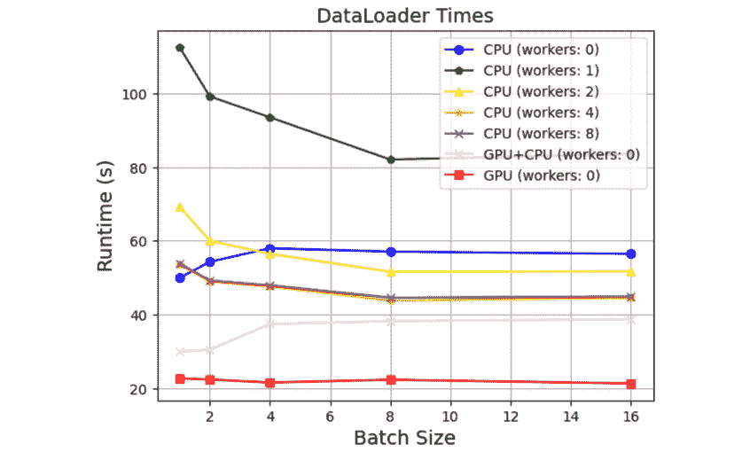
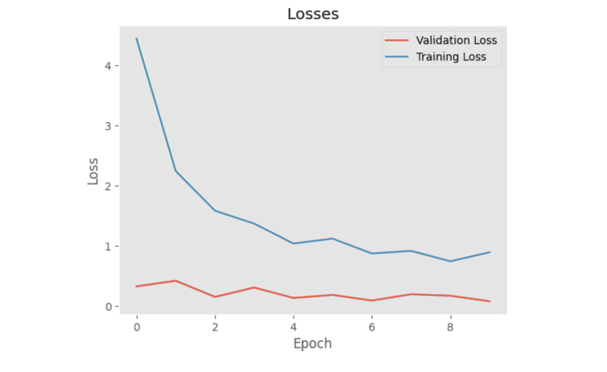
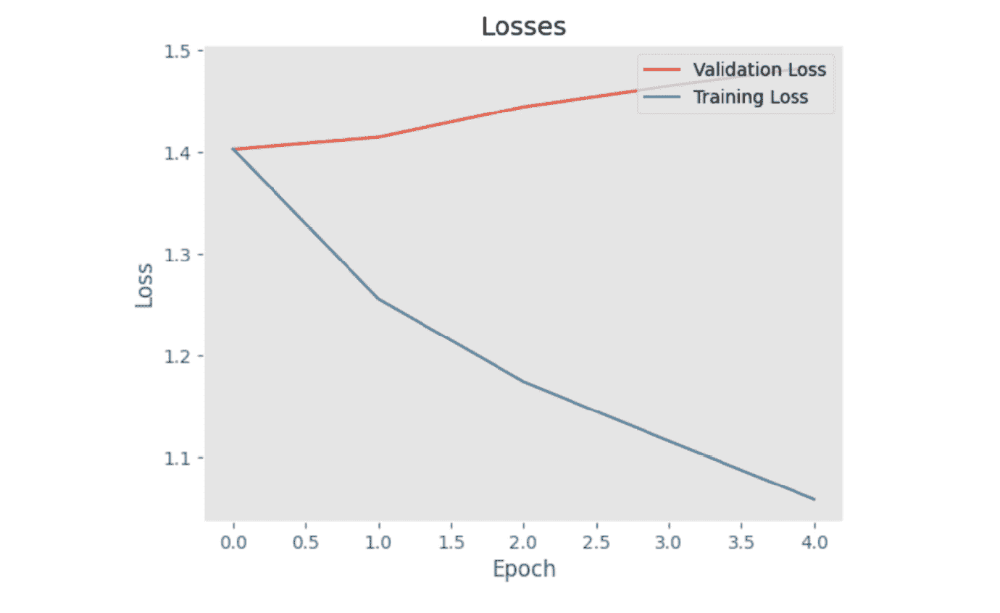
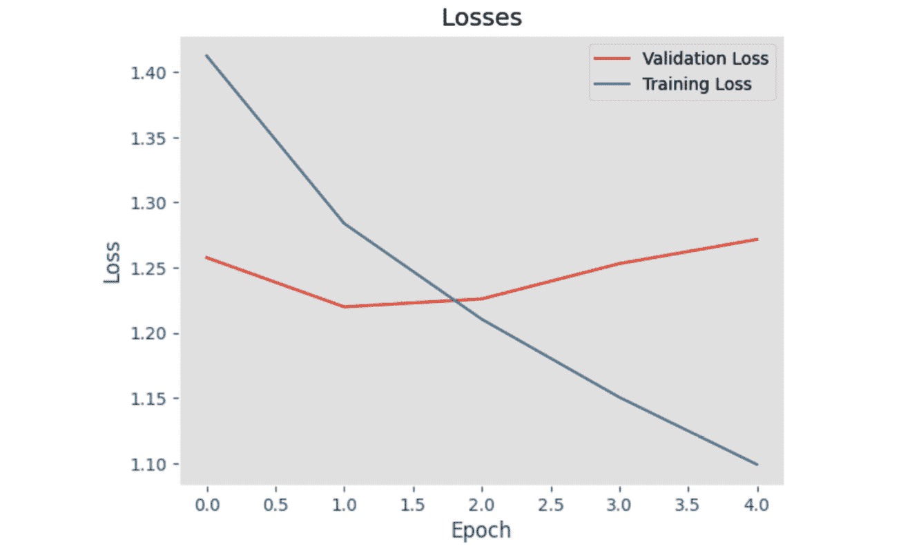

# 8

# 使用 MXNet 改进训练性能

在之前的章节中，我们利用 MXNet 的功能解决了计算机视觉和 `GluonCV`、`GluonNLP` 的问题。我们通过不同的方法训练了这些模型：*从头开始*、*迁移学习*和*微调*。在本章中，我们将重点关注如何提高训练过程的性能，并加速我们如何获得这些结果。

为了实现优化训练循环性能的目标，MXNet 提供了多种功能。我们已经简要使用了一些这些功能，例如 **延迟计算** 的概念，该概念在*第一章*中介绍过。我们将在本章中再次探讨这一点，并结合自动并行化来使用。此外，我们还将优化如何高效访问数据，利用 Gluon DataLoaders 在不同的环境（CPU、GPU）中执行数据转换。

此外，我们将探索如何结合多个 GPU 加速训练，利用诸如数据并行化等技术来获得最佳性能。我们还将探讨如何使用不同的数据类型与 `MXNet` 配合，以动态优化不同的数据格式。

最后，利用书中已探讨的问题，我们将通过示例应用所有这些技术。对于我们的计算机视觉任务，我们将选择图像分割，而对于 NLP 任务，我们将选择翻译英语到德语的文本。

具体来说，本章的结构包含以下食谱：

+   介绍训练优化功能

+   为图像分割优化训练

+   为英语到德语的文本翻译优化训练

# 技术要求

除了*前言*中指定的技术要求外，以下技术要求适用：

+   确保你已经完成了*安装 MXNet、Gluon、GluonCV 和 GluonNLP*的食谱。

+   确保你已经完成了*第五章*和*第六章*。

+   确保你已经完成了*第七章*。

本章的代码可以在以下 GitHub URL 找到：[`github.com/PacktPublishing/Deep-Learning-with-MXNet-Cookbook/tree/main/ch08`](https://github.com/PacktPublishing/Deep-Learning-with-MXNet-Cookbook/tree/main/ch08)。

此外，你可以直接从 Google Colab 访问每个食谱。例如，本章第一个食谱的代码可以在此找到：[`colab.research.google.com/github/PacktPublishing/Deep-Learning-with-MXNet-Cookbook/blob/main/ch08/8_1_Introducing_training_optimization_features.ipynb`](https://colab.research.google.com/github/PacktPublishing/Deep-Learning-with-MXNet-Cookbook/blob/main/ch08/8_1_Introducing_training_optimization_features.ipynb)。

# 介绍训练优化功能

在前几章中，我们展示了如何利用*MXNet*、*GluonCV*和*GluonNLP*来检索特定数据集（如**ImageNet**、**MS COCO**或**IWSLT2015**）中的预训练模型，并将其用于我们的特定任务和数据集。此外，我们还使用了迁移学习和微调技术来提高这些任务/数据集上的性能。

在本教程中，我们将介绍（并重温）几个概念和特性，这些将优化我们的训练循环，之后我们将分析其中的权衡。

## 准备工作

类似于前几章，在本教程中，我们将使用一些矩阵操作和线性代数，但这不会很困难，因为你会发现许多示例和代码片段来帮助你学习。

## 如何操作...

在本教程中，我们将通过以下步骤进行操作：

1.  使用懒评估和自动并行化

1.  优化 DataLoader：GPU 预处理和 CPU 线程

1.  使用`Float32`、`Float16`和自动混合精度进行训练

1.  使用多个 GPU 和数据并行化进行训练

让我们深入了解这些步骤。

### 使用懒评估和自动并行化

在*第一章*的*NumPy 和 MXNet NDArrays*教程中，我们介绍了懒评估，MXNet 在计算操作时采用的策略。这种策略对于大计算负载来说是最优的，因为实际的计算会被延迟，直到这些值真正需要时才会计算。

此外，MXNet 通过推迟操作计算，直到它们真正需要时，能够并行化一些计算，这意味着涉及的数据不会按顺序处理。这一过程是自动完成的，对于在多个硬件资源（如 CPU 和 GPU）之间共享数据时非常有用。

作为一个示例，我们可以进行一些矩阵乘法实验。我们的第一个实验将生成四个矩阵，然后进行它们之间的乘法组合。在每次计算后，我们将强制计算完成（通过添加`wait_to_read()`函数调用）。我们将计算两种配置下的结果。初始配置将强制 MXNet 使用一个线程（`NaiveEngine`）。在这种配置下，计算花费的时间是：

```py
Time (s): 134.3672107196594
```

第二种配置是测试 MXNet 的常规默认配置（`ThreadedEnginePerDevice`，四个 CPU 线程）。在这种配置下，计算花费的时间是：

```py
Time (s): 135.26983547210693
```

如我们所见，强制每次计算在进入下一步之前完成（通过调用`wait_to_read()`）在多线程配置中是适得其反的。

我们的第二次实验将非常相似；但是，这一次，我们将删除所有对`wait_to_read()`函数的调用。我们将只确保在计算时间之前，所有矩阵乘法的计算都已完成。对于初始配置（*NaiveEngine*），计算所需的时间如下：

```py
Time (s): 134.47382940625321
```

正如预期的那样，这个时长与仅使用一个线程时非常相似，因为所有计算都是按顺序进行的。

使用我们的第二种配置（*ThreadedEnginePerDevice*，具有四个 CPU 线程），第二次实验的计算时间如下：

```py
Time (s): 111.36750531196594
```

结果表明，使用多个线程（MXNet 的默认自动配置）时，我们获得了约 20%的提升（在更适合多线程的工作负载下，提升可能更高）。

重要提示

请注意，在代码中，我们使用了`mx.nd.waitall()`函数，以确保所有计算在计算操作所花费的时间之前都已严格完成。

### 优化 DataLoader——GPU 预处理与 CPU 线程

在*第二章*的*理解图像数据集——加载、管理和可视化时尚 MNIST 数据集*一节中，我们介绍了**Gluon DataLoader**，这是一种高效的机制，用于生成批次大小，供我们的模型用于训练和评估。

DataLoader 在我们的数据预处理过程中扮演着两个重要角色。首先，正如我们在前面的章节中探讨过的，我们的模型是为并行数据处理进行了优化，这意味着我们可以在同一时间处理多个样本（例如，图像分割任务中的图像），这些样本会在同一个*批次*中并行处理，且由*GPU*进行处理。这个参数称为*批次大小*。另一方面，样本通常需要进行预处理，以最大化模型的性能（例如，图像被调整大小，并将其值从`[0,` `255]`映射到`[0,` `1]`）。这些操作耗时，优化这些操作可以节省大量时间和计算资源。

让我们分析一下将数据预处理放在 GPU 上与使用 CPU 的常规默认行为之间的效果。作为基准，我们计算仅使用 CPU 加载数据集所需的时间。我们选择分割数据集的验证集，结果如下：

```py
Time (s): 24.319150686264038
```

然而，在加载数据集时，我们通常会应用某些`transform`操作，以最大化网络性能。常见的转换操作包括图像缩放、裁剪、转化为张量以及归一化，可以通过以下代码在 MXNet 中定义：

```py
input_transform_fn = mx.gluon.data.vision.transforms.Compose([
mx.gluon.data.vision.transforms.Resize(image_size, keep_ratio=True),
mx.gluon.data.vision.transforms.CenterCrop(image_size), mx.gluon.data.vision.transforms.ToTensor(),
mx.gluon.data.vision.transforms.Normalize([.485, .456, .406], [.229, .224, .225])
])
```

在仅使用 CPU 处理分割数据集的验证分割时，应用这些转换操作后的处理时间如下：

```py
Time (s): 38.973774433135986
```

正如我们所看到的，处理时间增加了超过 50%，从大约 24 秒增加到大约 39 秒。然而，当我们利用 GPU 进行数据预处理时，处理时间如下：

```py
Time (s): 25.39602303504944
```

正如我们所看到的，基于 GPU 的预处理操作几乎没有额外开销（<5%）。

此外，在 GPU 上执行预处理还有另一个优势：数据可以保存在 GPU 中供我们的模型处理，而使用 CPU 进行预处理时，我们需要将数据复制到 GPU 内存中，这可能会占用大量时间。如果我们实际测量端到端的预处理流水线，将数据预处理与复制操作到 GPU 内存结合起来，得到的结果如下：仅使用 CPU 时，端到端处理时间如下：

```py
Time (s): 67.73443150520325
```

正如我们所看到的，复制时间非常长，整个流水线需要超过 1 分钟。然而，使用 GPU 时的结果如下：

```py
Time (s): 23.22727918624878
```

这表明完整预处理所需的时间有了显著改善（<40%）。总的来说，这是由于两个因素：首先，预处理操作在 GPU 上更快；其次，数据需要在过程结束时复制到 GPU，这样我们的模型（也存储在 GPU 中）才能高效地处理数据。

这种方法最主要的缺点是需要将整个数据集保存在 GPU 中。通常，GPU 内存空间是为你在训练或推理中使用的每个批次进行优化的，而不是为整个数据集进行优化。这就是为什么这种方法通常会以将处理后的数据从 GPU 内存空间复制回 CPU 内存空间的方式结束。

然而，有些情况下，将数据保存在 GPU 内存空间可能是正确的做法——例如，当你在实验不同的数据集时，可能会加载多个数据集并测试不同的预处理流水线。在这种情况下，你希望实验能快速完成，因此速度是需要优化的变量。此外，有时你并不是在处理数据集的完整训练/验证/测试集，而只是其中的一部分（例如，为了实验）。在这种情况下，优化速度也是合理的。

对于其他更面向生产的环境，正确的方法是在 GPU 内存空间中进行预处理，但将数据（回复制）保留在 CPU 内存空间。在这种情况下，结果略有不同：

```py
Time (s): 34.58254957199097
```

正如我们所看到的，即使考虑到必要的数据移动（从 CPU 到 GPU，再从 GPU 回到 CPU），在 GPU 中进行预处理仍然能显著提高性能（约 50%）。

现在，我们将深入探讨如何利用 Gluon DataLoader 作为输入的两个重要参数：工作线程数和批量大小。工作线程数是 DataLoader 将并行启动的线程数量（多线程）用于数据预处理。批量大小，如前所述，是将并行处理的样本数量。

这些参数与 CPU 的核心数量直接相关，并且可以通过优化使用可用的硬件来实现最大性能。为了了解 CPU 的核心数，Python 提供了一个非常简单的 API：

```py
import multiprocessing
multiprocessing.cpu_count()
```

在所选环境中，显示的可用核心数如下：

```py
4
```

通过结合使用 CPU 和 GPU，我们可以计算最佳性能，考虑不同的工作线程数和批量大小值。为所选环境计算的结果如下：



图 8.1 – 不同计算模式下（CPU/GPU 和工作线程数）运行时间与批量大小的关系

从*图 8.1*中，我们可以得出以下三个重要结论：

+   GPU 预处理管道（数据处理加内存存储）要快得多（+50% 的运行时提升），即使是将数据复制回 CPU 时也是如此。

+   当结合使用 GPU 和 CPU 时，由于在这个环境下我们只使用一个 GPU，因此当将数据复制回 CPU 时会遇到瓶颈，因为数据是逐个样本复制的（而不是按批次）。

+   如果仅使用 CPU，增加工作线程可以改善处理时间。然而，限制因素是线程的数量。添加的工作线程数超过线程数（在我们的例子中为四个）将不会提高性能。增加批量大小能够提升性能，直到达到某一数量（在我们的例子中为 8），超过该数量后，性能不会进一步提高。

重要提示

使用 GPU 时，MXNet Gluon DataLoader 仅支持工作线程数为`0`（零）的值。

### 使用 Float32、Float16 和自动混合精度进行训练

在之前的示例中，我们已经看到了如何通过不同的方式优化训练循环，以最大限度地提高给定模型的 CPU 和 GPU 性能。在本示例中，我们将探讨如何计算我们的数据输入、模型参数及其周围的各种算术运算，并了解如何优化它们。

首先，让我们了解计算是如何进行的。数据输入和模型参数的默认数据类型是`Float32`，可以通过（参见示例代码）验证这一点，产生以下输出：

```py
Input data type: <class 'numpy.float32'> Model Parameters data type: <class 'numpy.float32'>
```

该输出结果如预期所示，表明我们的数据输入和模型参数的数据类型是`Float32`（单精度）。但这意味着什么呢？

`Float32` 表示两件事：一方面，它是一种支持使用浮动小数点表示十进制数的数据类型；另一方面，它使用 32 位来存储单个数字。此格式的最重要特性如下：

+   能够表示大数值，从 10^-45 到 10^+38

+   可变精度

使用 `Float32` 作为数据类型有很多优点，主要与其可变精度有关。然而，训练过程是一个迭代的优化过程，其中许多计算并不需要 `Float32` 数据类型的精度。如果能以受控的方式牺牲一些精度来加速训练过程，那是可以接受的。我们可以通过 `Float16` 数据类型（半精度）实现这种平衡的权衡。与 `Float32` 类似，`Float16` 的最重要特性如下：

+   能够表示大数值，从 2^-24 到 2^+16

+   可变精度

作为精度丧失的示例，我们可以通过以下代码片段显示 1/3 的近似值，以两种格式呈现：

```py
a = mx.nd.array([1/3], dtype=np.float32)
 b = a.astype(np.float16)
print("1/3 as Float32: {0:.30f}".format(a.asscalar()))
print("1/3 as Float16: {0:.30f}".format(b.asscalar()))
```

结果如下：

```py
1/3 as Float32: 0.333333343267440795898437500000
1/3 as Float16: 0.333251953125000000000000000000
```

如我们所见，所有表示都不是精确的，`Float32` 如预期一样提供了更高的精度，而 `Float16` 的精度更有限，但对于某些应用场景（如模型训练）可能足够，稍后我们会证明这一点。

如前所述，这种精度丧失是一种权衡，我们在训练循环中获得了巨大的速度提升。为了在训练循环中启用 `Float16`（半精度），我们需要对代码进行一些更改。首先，我们需要将模型参数更新为 `Float16`，这一操作只需一行简单的代码：

```py
deeplab_ft_direct_f16.cast('float16')
```

之后，当我们的模型处理数据和真实标签时，这些也需要更新为 `Float16`，因此在我们的训练循环中，我们加入了以下几行：

```py
data  = data.astype('float16', copy=False)
 label = label.astype('float16', copy=False)
```

通过这些更改，我们现在可以运行一个实验，比较两种训练循环的性能。例如，我们将微调一个 DeepLabv3 预训练模型，进行图像分割任务（参见 *第七章* 中的 *改善图像分割性能* 配方）。对于 `Float32`，我们得到以下结果：

```py
Training time for 10 epochs: 594.4833037853241 / Best validation loss: 0.6800425
```

对于 `Float16`，我们获得了以下结果：

```py
Training time for 10 epochs: 199.80901980400085 / Best validation loss: nan
```

不幸的是，对于 `Float16`，尽管我们的训练时间比 `Float32` 的训练循环少了约三分之一，但它并未收敛。这是由于几个原因：

+   对大数值的支持有限，因为任何大于 `65519` 的整数都表示为无穷大

+   对小数值的支持有限，因为任何小于 `1e-7` 的正十进制数都表示为 `0`（零）

幸运的是，MXNet 提供了一个解决方案，能够自动结合两者的优点：

+   在必要的地方应用 `Float32`（单精度）

+   在没有使用的地方应用 `Float16`（半精度），以优化运行时

这种方法被称为**自动混合精度**（**AMP**），为了启用它，我们只需要在代码中进行一些更改。首先，在创建模型之前，我们需要初始化库：

```py
amp.init()
```

然后，在初始化训练器/优化器之后，我们需要将其与 AMP 链接：

```py
amp.init_trainer(trainer)
```

最后，为了防止下溢或溢出，我们需要启用`Float16`数据类型。这在训练循环中非常方便地实现：

```py
with amp.scale_loss(loss, trainer) as scaled_loss:
mx.autograd.backward(scaled_loss)
```

当我们应用这些变化并为`Float16`（现在启用了 AMP）重复之前的实验时，得到了以下结果：

```py
Training time for 10 epochs: 217.64903020858765 / Best validation loss: 0.7082735
```

如我们所见，我们在更短的时间内获得了非常相似的验证损失结果（约 33%）。

由于我们的训练循环的内存占用大约是之前的一半，我们通常可以将模型的大小翻倍（更多的层和更大的分辨率），或者将批量大小翻倍，因为 GPU 内存的消耗在这种情况下与完整的`Float32`训练循环相比是相同的。使用双倍批量大小运行相同的实验得到以下结果：

```py
Training time for 10 epochs: 218.82141995429993 / Best validation loss: 0.18198483
```

如我们所见，增加批量大小对训练循环的性能有着非常好的影响，验证损失大大降低，并且训练时间也显著缩短（约 33%）。

然而，通常作为**机器学习工程师**（**MLE**）或**数据科学家**（**DS**），我们将处理大量数据和大型模型，运行训练循环，预计需要持续数小时或数天。因此，在工作中，MLEs/DSs 通常会在工作日结束前启动训练循环，留下训练在后台运行，并在下一个工作日回来分析和评估结果。在这种环境下，实际上优化预期训练时间以提升性能是一种更好的策略。使用 MXNet，我们也可以为此优化训练参数。例如，我们可以通过将训练轮数翻倍来调整训练时间。在这种情况下，实验得到了以下结果：

```py
Training time for 10 epochs: 645.7392318248749 / Best validation loss: 0.16439788
```

与标准的`Float32`训练循环相比，这些结果非常好。然而，我们不要忘记，实际结果取决于特定任务、数据集、模型、超参数等。建议您在玩具训练循环中尝试不同的选项和超参数，以找到每种情况的最佳解决方案。

### 使用多个 GPU 和数据并行化训练

在这个方案中，我们将利用环境中多个 GPU 进一步优化训练。MXNet 和 Gluon 让我们可以非常轻松地更新训练循环以包含多个 GPU。

从高层次来看，利用多个 GPU 有两种范式：

+   **模型并行化**：将模型分割成多个部分，并将每个部分部署到特定的 GPU 上。当模型无法适配单个 GPU 时，这种范式非常有用。

+   **数据并行化**：数据批次被拆分成多个部分，每个部分会被分配到一个特定的 GPU 上，该 GPU 能够完全使用这些数据进行前向和反向传播。

我们将只使用数据并行化，因为它是最常见的用例，能带来很高的加速，并且由于其方法的简单性，它也最为便捷。

为了应用数据并行化，我们需要对训练循环进行如下修改：

1.  **设置上下文**：上下文现在是一个列表，每个元素是一个特定的 GPU 上下文。

1.  **在这些上下文中初始化我们的模型**：在数据并行化中，每个 GPU 都会存储一份所有模型参数的副本。

1.  **调整超参数**：批量大小通常设置为尽可能大的值，而不填满 GPU 内存。当多个 GPU 并行工作时，这个数字通常可以乘以上下文中 GPU 的数量。然而，这也会对学习率产生副作用，必须将学习率乘以相同的数字，以保持梯度更新在相同的范围内。

1.  **分配数据**：每个 GPU 必须拥有每个批次的一部分，并使用它进行前向和反向传播。

1.  **计算损失并更新梯度**：每个 GPU 会计算与其批次切片相关的损失。MXNet 会自动结合这些损失并计算梯度，然后将其分发到每个 GPU，以更新它们的模型副本。

1.  **显示结果**：训练损失和验证损失等统计信息通常会在每个批次中计算并积累，并在每个周期结束时进行可视化。

让我们看一些如何应用这些步骤的例子。

例如，在一个包含四个 GPU 的环境中设置上下文非常简单，使用 MXNet 只需要一行代码：

```py
ctx_list = [mx.gpu(0), mx.gpu(1), mx.gpu(2), mx.gpu(3)]
```

初始化模型和自定义层就这么简单。对于我们的环境，以下是如何初始化带有 `ResNet-101` 主干的 Deeplabv3 网络：

```py
deeplab_ft_direct_f32 = gcv.model_zoo.get_model('deeplab_resnet101_coco', pretrained=True, ctx=ctx_list)
 [...]
deeplab_ft_direct_f32.head.initialize(ctx=ctx_list)
```

为了更新超参数，我们只需要计算上下文中的 GPU 数量，并更新之前计算的批量大小和学习率。对于我们的示例，这意味着只需添加或修改几行代码：

```py
num_gpus = len(ctx_list)
 [...]
batch_size_per_gpu = 4
batch_size = len(ctx_list) * batch_size_per_gpu
 [...]
trainer = mx.gluon.Trainer(deeplab_ft_direct_f32.collect_params(), "sgd", {"learning_rate": 0.5})
```

为了将数据均匀地分配到每个 GPU 上，MXNet 和 Gluon 提供了一个非常方便的函数 `split_and_load()`，它会根据上下文中的 GPU 数量自动分配数据。在我们的环境中，操作如下：

```py
data_list   = mx.gluon.utils.split_and_load(data, ctx_list=ctx_list)
 label_list  = mx.gluon.utils.split_and_load(label, ctx_list=ctx_list)
```

为了计算损失并更新梯度，分布在每个 GPU 上的数据会通过循环并行处理。由于 MXNet 提供了自动并行化，这些调用是非阻塞的，每个 GPU 独立计算其输出和损失。此外，MXNet 会将这些损失结合起来生成完整的梯度更新，并将其重新分配给每个 GPU，所有这些操作都是自动完成的。我们只需要几行代码即可完成这一切：

```py
with mx.autograd.record():
outputs = [model(data_slice) for data_slice in data_list]
losses = [loss_fn(output[0], label_slice) for output, label_slice in zip(outputs, label_list)]
for loss in losses:
loss.backward()
trainer.step(batch_size)
```

最后，为了显示损失计算，需要处理每个 GPU 的损失并将其组合。使用自动并行化，可以通过一行代码轻松实现这一点：

```py
current_loss = sum([l.sum().asscalar() for l in losses])
```

通过这些简单的步骤，我们已经能够修改我们的训练循环以支持多个 GPU，并且现在可以测量这些变化带来的性能提升。

作为提醒，使用一个 GPU，我们达到了以下性能（批处理大小为四）:

```py
Training time for 10 epochs: 647.753002166748 / Best validation loss: 0.0937674343585968
```

在我们的环境中，使用 4 个 GPU，我们可以将批处理大小增加到 16，其结果如下：

```py
Training time for 10 epochs: 177.23532104492188 / Best validation loss: 0.082047363743186
```

如预期的那样，我们已经能够将训练时间减少到约 25%（从 1 个 GPU 到 4 个 GPU 时的预期减少量，由于数据分布的预期损失而稍微改善了验证分数）。

## 工作原理如下…

在这个配方中，我们深入探讨了如何利用 MXNet 和 Gluon 优化我们的训练循环。我们利用我们的硬件（CPU 和 GPU）来处理训练循环中的每一个步骤：

+   我们重新审视了惰性评估和自动并行化机制如何共同作用以优化所有基于 MXNet 的流程。

+   我们利用所有的 CPU 线程来加载数据，并通过 GPU 中的预处理进一步优化该过程。我们还比较了速度和内存优化之间的权衡。

+   我们分析了不同的数据类型，并在可能的情况下将`Float32`的精度与`Float16`的加速结合起来，使用 AMP。

+   我们通过使用多个 GPU（假设我们的硬件有这些设备可用）提升了训练循环的性能。

我们通过运行两个实验比较了每种场景，在特定优化之前和之后的性能，并强调了在使用这些优化时需要考虑的潜在权衡。在接下来的配方中，我们将同时应用所有这些优化技术，优化两个熟悉的任务：**图像分割**和**文本翻译**。

## 还有更多内容…

此配方中展示的所有优化特性都已在研究文献中进行了详细描述。以下是一些入门链接，以深入了解每个特性：

+   **惰性评估和自动** **并行化:** [`cljdoc.org/d/org.apache.mxnet.contrib.clojure/clojure-mxnet-linux-cpu/1.4.1/doc/ndarray-imperative-tensor-operations-on-cpu-gpu#lazy-evaluation-and-automatic-parallelization`](https://cljdoc.org/d/org.apache.mxnet.contrib.clojure/clojure-mxnet-linux-cpu/1.4.1/doc/ndarray-imperative-tensor-operations-on-cpu-gpu#lazy-evaluation-and-automatic-parallelization)

+   **Gluon** **DataLoaders:** [**https:**//mxnet.apache.org/versions/master/api/python/docs/tutorials/getting-started/crash-course/5-datasets.html](https://mxnet.apache.org/versions/master/api/python/docs/tutorials/getting-started/crash-course/5-datasets.html)

+   **AMP:** [`medium.com/apache-mxnet/simplify-mixed-precision-training-with-mxnet-amp-dc2564b1c7b0`](https://medium.com/apache-mxnet/simplify-mixed-precision-training-with-mxnet-amp-dc2564b1c7b0)

+   **使用多个 GPU 进行训练:** [`mxnet.apache.org/versions/1.7/api/python/docs/tutorials/getting-started/crash-course/6-use_gpus.html`](https://mxnet.apache.org/versions/1.7/api/python/docs/tutorials/getting-started/crash-course/6-use_gpus.html)

# 优化图像分割的训练

在之前的食谱中，我们展示了如何利用 MXNet 和 Gluon 通过各种技术来优化模型的训练。我们了解了如何联合使用懒惰求值和自动并行化来进行并行处理。我们看到如何通过结合在 CPU 和 GPU 上进行预处理来提高 DataLoader 的性能，以及如何使用半精度（`Float16`）与 AMP 结合来减少训练时间。最后，我们探索了如何利用多个 GPU 进一步减少训练时间。

现在，我们可以重新审视一个贯穿全书的课题：**图像分割**。我们在前几章的食谱中曾处理过这个任务。在*第五章*中的*使用 MXNet Model Zoo 进行语义化物体分割——PSPNet 和 DeepLabv3*食谱中，我们学习了如何使用 GluonCV Model Zoo 中的预训练模型，并介绍了我们将在本食谱中使用的任务和数据集：**MS COCO**和**Penn-Fudan Pedestrian**数据集。此外，在*第七章*中的*提高图像分割性能*食谱中，我们比较了处理目标数据集时可以采取的不同方法——是从头开始训练模型，还是利用预训练模型的现有知识并通过不同的迁移学习和微调方式进行调整。

在本食谱中，我们将应用所有这些优化技术，以训练图像分割模型为具体任务。

## 准备工作

与之前的章节类似，在本食谱中，我们将使用一些矩阵运算和线性代数，但这并不难，因为你会发现很多示例和代码片段来帮助你学习。

## 如何做...

在本食谱中，我们将探讨以下步骤：

1.  重新审视我们当前的预处理和训练流程

1.  应用训练优化技术

1.  分析结果

让我们深入了解每个步骤。

### 重新审视我们当前的预处理和训练流程

在*第七章*中的*提高图像分割性能*食谱中，我们使用以下方法处理数据：

1.  将数据从存储加载到*CPU* *内存空间*

1.  使用*CPU*预处理数据

1.  使用**默认参数**在训练过程中处理数据

这种方法是一个有效的途径，用来比较我们可用的不同训练方案（从头开始训练、预训练模型、迁移学习和微调），而无需为实验增加复杂性。例如，这种方法在直接引入并评估微调技术时效果很好。

按照上述方法，在为此食谱选择的数据集（*Penn-Fudan Pedestrian*）上，基于 CPU 的预处理花费了以下时间：

```py
Pre-processing time (s): 0.12470602989196777
```

此外，当与必要的步骤结合使用，如将数据批量重新加载并复制到 GPU 时，我们获得了以下性能：

```py
Data-Loading in GPU time (s): 0.4085373878479004
```

在预处理之后，下一步是训练过程。如前所述，我们将通过直接使用微调技术来评估训练优化的效果。结合这种方法，我们将使用以下超参数：

```py
# Epochs & Batch Size
epochs = 10
batch_size = 4
# Define Optimizer and Hyper Parameters
trainer = mx.gluon.Trainer(deeplab_ft_direct_naive.collect_params(), "sgd", {"learning_rate": 0.1})
```

在这些条件下，训练过程的持续时间和所达到的性能如下：

```py
Training time for 10 epochs (s): 638.9948952198029 / Best validation loss: 0.09416388
```

如我们所见，在 10 分钟多一点的时间内，我们获得了优秀的验证性能（约为 0.09）。

每个 epoch 中训练损失和验证损失的演变如下：


图 8.2 – 回顾训练：训练损失与验证损失

从*图 8.2*中，我们可以看到训练损失和验证损失的演变。正如本书各章节所探讨的那样，我们选择提供最小验证损失的模型（在这种情况下，这是在最后一个 epoch，即 epoch 10 中实现的）。

在训练完成后，我们可以验证数据集测试集上的整体性能。从定量角度来看，以下是我们获得的结果：

```py
PixAcc:  0.9627800347222222
mIoU  :  0.9070747450272697
```

正如预期的那样，通过仅训练有限的 epoch 数（此处为 10），我们获得了优异的结果。

从定性角度来看，结果如下：


图 8.3 – 回顾训练：GroundTruth 示例和训练后的预测

正如预期的那样，结果展示了模型如何学会将焦点集中在前景中的人身上，避免背景中的人。

### 应用训练优化技术

在本章开头的*引入训练优化功能*食谱中，我们展示了不同的优化技术如何提高训练机器学习模型过程中各个步骤的性能，包括数据预处理、模型训练和评估。

在本节中，我们将展示如何通过使用 MXNet 和 Gluon，仅用几行代码，我们可以轻松应用所有我们已经介绍过的技术。

如本章第一个示例所示，MXNet 默认应用最佳策略（`ThreadedEnginePerDevice`）来优化惰性求值和自动并行化，考虑到可用的 CPU 线程数，因此我们无需在此进行任何更改（请注意，当使用多个 GPU 时，这项技术也会自动应用）。

我们还展示了如何通过结合使用 CPU 线程和 GPU 来优化数据预处理管道，考虑到每种设备的数量，并据此进行优化。为了进行此实验，选择了具有以下特征的特定硬件：

```py
Number of CPUs: 16
Number of GPUs: 4
```

为了使用这种优化技术，我们需要对代码做一些更改。具体来说，我们需要定义可供使用的 GPU：

```py
# Context variable is now a list,
 # with each element corresponding to a GPU device
ctx_list = [mx.gpu(0), mx.gpu(1), mx.gpu(2), mx.gpu(3)]
 num_gpus = len(ctx_list)
```

此外，在我们的预处理管道中，我们现在需要一个特定的步骤，将数据从 CPU 内存空间复制到 GPU 内存空间：

```py
p_train_gpu = mx.gluon.data.SimpleDataset(
    [(data.as_in_context(ctx_list[idx % num_gpus]), label.as_in_context(ctx_list[idx % num_gpus]))
     for idx, (data, label) in enumerate(pedestrian_train_dataset)])
 p_val_gpu   = mx.gluon.data.SimpleDataset(
    [(data.as_in_context(ctx_list[idx % num_gpus]), label.as_in_context(ctx_list[idx % num_gpus]))
     for idx, (data, label) in enumerate(pedestrian_val_dataset)])
 p_test_gpu  = mx.gluon.data.SimpleDataset(
    [(data.as_in_context(ctx_list[idx % num_gpus]), label.as_in_context(ctx_list[idx % num_gpus]))
     for idx, (data, label) in enumerate(pedestrian_test_dataset)])
p_train_opt = p_train_gpu.transform(train_val_transform, lazy=False)
 p_val_opt   = p_val_gpu.transform(train_val_transform, lazy=False)
 p_test_opt  = p_test_gpu.transform(test_transform, lazy=False)
```

如本章第一个示例所讨论的，在典型的面向生产的环境中，我们不希望将数据保留在 GPU 中，以免占用宝贵的 GPU 内存。通常会根据 GPU 可用内存优化批量大小，并使用*MXNet Gluon DataLoaders*将数据从 CPU 内存空间批量加载到 GPU 内存空间。因此，为了使我们的基于 GPU 的预处理管道完整，我们需要一个最终步骤，将数据复制回 CPU 内存空间：

```py
to_cpu_fn = lambda x: x.as_in_context(mx.cpu())
```

通过这些代码更改，我们的最佳预处理管道已经准备就绪，可以继续进行下一个优化技术：应用`Float16`优化，包括 AMP。

如本章第一个示例所示，为了启用这项技术，我们只需要对代码进行一些更改。首先，我们初始化库：

```py
# AMP
amp.init()
```

其次，我们将训练器/优化器附加到库中：

```py
amp.init_trainer(trainer)
```

最后，由于`Float16`数据类型的局限性，存在梯度溢出/下溢的风险；因此，我们需要根据情况调整（缩放）损失，这可以通过以下几行代码自动完成：

```py
with amp.scale_loss(losses, trainer) as scaled_losses: mx.autograd.backward(scaled_losses)
```

通过这三项简单的更改，我们已经更新了训练循环，使其能够有效地使用`Float16`数据类型（在适当的情况下）。

请注意在前面的代码片段中，我们现在正使用一个损失列表，而不是单一的实例。这是由于我们的下一个也是最后一个训练优化技术：使用*多个 GPU*。

正如我们将看到的，优化地使用多个 GPU 意味着将它们并行工作，因此，需要并行计算损失并执行训练的反向传播，从而生成前述段落中描述的损失列表。

为了并行使用多个 GPU，我们需要将新的上下文定义为一个列表（之前在预处理部分出现过，这里为了方便再次展示）：

```py
# Context variable is now a list,
 # with each element corresponding to a GPU device
ctx_list = [mx.gpu(0), mx.gpu(1), mx.gpu(2), mx.gpu(3)
 num_gpus = len(ctx_list)
```

由于现在我们有多个 GPU，我们可以增加批量大小，以便最佳利用可用的 GPU 内存空间：

```py
batch_size = len(ctx_list) * batch_size_per_gpu
```

此外，在从 Gluon DataLoader 读取数据时，我们需要将数据批次分配到多个 GPU 上。幸运的是，Gluon 还提供了一个简化该操作的功能。我们只需要添加以下几行代码（对于每个训练和验证批次）：

```py
data_list  = mx.gluon.utils.split_and_load(data , ctx_list=ctx_list)
label_list = mx.gluon.utils.split_and_load(label, ctx_list=ctx_list)
```

如前所述，这种跨 GPU 的划分使我们能够并行计算模型输出及与这些输出相关的损失（衡量实际输出与预期输出之间的差异）。这可以通过以下几行代码实现：

```py
outputs = [model(data_slice) for data_slice in data_list]
losses = [loss_fn(output[0], label_slice) for output, label_slice in zip(outputs, label_list)]
```

最后，我们计算用于更新模型权重的反向传播过程（结合 AMP 的缩放损失）：

```py
with amp.scale_loss(losses, trainer) as scaled_losses:
mx.autograd.backward(scaled_losses)
```

通过这些最小的代码更改，我们现在拥有了一个最佳的预处理和训练管道，可以运行实验以分析性能变化。

### 分析结果

在前面的部分，我们回顾了预处理和训练管道的先前性能，并回顾了我们如何应用必要的更改以实现训练优化技术，特别是针对我们的图像分割任务。

我们的预处理管道步骤现在如下：

1.  从存储中加载数据到 CPU 内存空间。

1.  使用 GPU 预处理数据。

1.  将数据复制回 CPU 内存空间。

1.  使用优化的参数在训练过程中处理数据。

对于我们的实验，我们将直接使用微调技术。

将之前描述的方法应用于为本方案选择的数据集（*Penn-Fudan Pedestrian*），预处理的时间如下：

```py
Pre-processing time (s): 0.10713815689086914
```

端到端的预处理管道必须考虑使用*Gluon DataLoader*加载数据的批处理过程——在我们的情况下，将数据加载到多个 GPU 中，如下所示：

```py
Data-Loading in GPU time (s): 0.18216562271118164
```

与本方案的初始部分相比（当时预处理需要`0.4`秒），我们可以看到，即使在将数据复制回 CPU 内存空间的额外开销下，我们仍然将预处理性能提高了>2 倍。

在预处理之后，下一步是训练过程。正如前面所描述的，我们将直接使用微调技术来评估我们训练优化的效果。结合这种方法，我们使用以下超参数：

```py
# Epochs & Batch Size
epochs = 10
batch_size_per_gpu = 4
batch_size = len(ctx_list) * batch_size_per_gpu
# Define Optimizer and Hyper Parameters
trainer = mx.gluon.Trainer(deeplab_ft_direct_opt.collect_params(), "sgd", {"learning_rate": 0.5})
```

请注意，通过将多个 GPU 添加到训练过程中，我们可以增加批量大小（乘以 GPU 的数量），还可以增加学习率（从 0.1 增加到 0.5）。在这些条件下，训练过程的持续时间和实现的性能如下：

```py
Training time for 10 epochs: 59.86336851119995 / Best validation loss: 0.08904324161509672
```

如图所示，我们在不到 1 分钟的时间内就得到了优秀的验证表现（约 0.09）。与配方中获得的结果相比，我们可以看到损失的减少非常小（这将通过我们的性能分析进一步确认），但迄今为止最大的一项改进是训练时间减少了>10 倍。这个改进归功于我们应用的所有训练优化技术。简而言之，每项优化都提供了以下改进：

+   **使用 4 个 GPU**：提供了 4 倍的时间缩短

+   **使用 Float16 和 AMP**：提供了 2 倍的时间减少（合计 8 倍）

+   **预处理数据集**：提供了 1.25 倍的时间减少（合计>10 倍）

每个 epoch 中的训练损失和验证损失的变化如下：



图 8.4 – 优化训练：训练损失与验证损失

从*图 8.4*中，我们可以看到训练损失和验证损失的变化。正如本章至今所探讨的，我们选择提供最小验证损失的模型（在这种情况下，在最后一个 epoch，即第 10 个 epoch 中取得）。

训练完成后，我们可以在数据集的测试分割上验证整体性能。从定量的角度来看，我们获得的结果如下：

```py
PixAcc:  0.9679262152777778
mIoU  :  0.9176786683400912
```

正如预期的那样，仅通过训练有限的 epoch（本例中为 10 个 epoch），我们就得到了优秀的结果。我们还可以确认，验证损失的最小改善带来了测试指标的微小改进（与我们初始实验中的 0.96/0.91 相比）。

从定性的角度来看，我们得到了以下结果：


图 8.5 – 优化训练：GroundTruth 示例与训练后预测

正如预期的那样，结果显示模型已经学会了将注意力集中在前景中的不同人物上，避免了背景中的人物。

## 工作原理...

在本配方中，我们应用了本章第一部分中的不同训练优化技术，利用我们的硬件（CPU 和 GPU）来解决训练循环中的每个步骤：

+   我们重新审视了惰性评估和自动并行化机制如何协同工作，以优化所有基于 MXNet 的流程。

+   我们利用所有 CPU 线程加载数据，并通过在 GPU 上进行预处理进一步优化了该过程。我们还比较了速度和内存优化之间的权衡。

+   我们分析了不同的数据类型，并结合了`Float32`的准确性与`Float16`的加速效果（在可能的情况下），并使用了 AMP。

+   我们通过使用多个 GPU 提高了训练循环的性能（假设我们的硬件有这些设备）。

我们将这些场景分别应用于图像分割任务，并进行了两次实验。在第一次实验中，我们没有应用前面章节中描述的任何训练优化技术，而是遵循了书中前几章提到的方法。在第二次实验中，我们并行应用了所有技术，尽可能进行优化。

这一方法非常有用，提供了类似的算法性能，同时将训练时间提高了 10 倍（从 10 分钟缩短到 1 分钟）。这主要得益于使用了多个 GPU（减少了 4 倍），利用`Float16` AMP（减少了 2 倍）以及优化的预处理（减少了 1.25 倍）。

## 还有更多内容……

我们已经描述、实现、执行并评估了几种训练优化技术。然而，还有更多先进的技术可以用来实现最佳的训练循环。

其中一种技术是**学习率调度**。在本书中，我们一直使用常数学习率。然而，使用动态调整的学习率有多个优点，其中一些如下：

+   **预热**：在使用预训练模型时，不建议从较大的学习率开始。初始的几个 epoch 必须用于梯度的调整。这可以看作是*将模型从源任务调整到目标任务*的方式，保留并利用来自前一个任务的知识，因此推荐使用较小的学习率。

+   **衰减**：在最佳训练循环中，当模型学习到输入到输出的预期表示时，训练的目标是产生越来越精细的改进。较小的学习率在这些阶段能获得更好的性能（更小、更稳定的权重更新）。因此，经过几个 epoch 后，衰减学习率是首选。

*Dive into Deep Learning* 书中提供了关于如何在 MXNet 中实现这些技术的深入见解：[`d2l.ai/chapter_optimization/lr-scheduler.html.`](https://d2l.ai/chapter_optimization/lr-scheduler.html)

# 优化训练以将文本从英语翻译为德语

在本章的第一个示例中，我们展示了如何利用 MXNet 和 Gluon 优化我们的模型训练，应用不同的技术。我们理解了如何联合使用惰性计算和自动并行化进行并行处理，并通过将预处理分配到 CPU 和 GPU 上提高了 DataLoader 的性能。我们还看到，结合使用半精度（`Float16`）和 AMP 可以将训练时间缩短一半，并探索了如何利用多个 GPU 进一步缩短训练时间。

现在，我们可以重新审视我们在整本书中一直在处理的问题，即**从英语到德语的翻译**。我们在之前的章节中已经处理了翻译任务。在*第六章*中的*从越南语到英语的翻译*示例中，我们介绍了翻译任务，并学习了如何使用来自 GluonCV 模型库的预训练模型。此外，在*第七章*中的*提高从英语到德语翻译性能*示例中，我们介绍了本示例中将要使用的数据集：*WMT2014*和*WMT2016*，并比较了我们在处理目标数据集时可以采取的不同方法：从头开始训练我们的模型，或利用预训练模型的过去知识并进行调整，采用不同的迁移学习和微调策略。

因此，在本示例中，我们将应用所有这些优化技术，专门用于训练一个*英语到德语的文本* *翻译模型*。

## 准备工作

与之前的章节一样，在本示例中我们将使用一些矩阵运算和线性代数，但理解起来一点也不难。

## 如何实现...

在本示例中，我们将按以下步骤进行操作：

1.  重新审视我们当前的数据预处理和训练流程

1.  应用训练优化技术

1.  分析结果

让我们深入了解每一步。

### 重新审视我们当前的数据预处理和训练流程

在*第七章*中的*提高从英语到德语翻译性能*的示例中，我们使用以下方法处理数据：

+   将数据从存储加载到 CPU 内存中

+   使用 CPU 对数据进行了预处理

+   在训练过程中使用了默认参数来处理数据

这是一个有效的方法，可以比较我们可用的不同训练选择（从头开始训练、预训练模型、迁移学习和微调），而不会增加实验的复杂性。例如，这种方法非常适合介绍和评估微调技术，这是我们在本示例中选择的技术。

在应用前面描述的方法到本示例所选数据集（*WMT2016*）时，基于 CPU 的预处理需要以下时间：

```py
Pre-processing time (s): 2.697735548019409
```

此外，当与必要的批量重新加载数据并将其复制到 GPU 的步骤结合时，我们将获得以下性能：

```py
Data-Loading in GPU time (s): 27.328779935836792
```

预处理完成后，下一步是训练过程。如前所述，我们将直接评估使用微调技术对训练优化的影响。结合这种方法，我们使用以下超参数：

```py
# Epochs & Batch Size
hparams.epochs = 5
hparams.lr = 0.00003
# hparam.batch_size = 256
```

在这些条件下，训练过程的持续时间和所取得的性能如下：

```py
Training time for 5 epochs: 11406.558312892914 / Best validation loss: 1.4029905894300159
```

如我们所见，在训练时间大约为 3 小时的情况下，我们获得了优秀的验证性能（~1.4）。

每轮训练损失和验证损失的变化情况如下所示：



图 8.6 – 重新审视训练：训练损失与验证损失

从*图 8.6*中，我们可以看到训练损失和验证损失的变化。正如在各章节中探讨的那样，我们选择提供最小验证损失的模型（在这个案例中，最小验证损失出现在第一轮训练，即第 1 轮）。

训练完成后，我们可以在数据集的测试分割中验证整体性能。从定量角度来看，以下是我们获得的结果：

```py
WMT16 test loss: 1.28; test bleu score: 27.05
```

正如预期的那样，通过仅仅训练有限的时期（在此为 10 轮），我们就获得了优异的结果。

从定性角度来看，我们还可以通过测试一个示例句子来检查模型的表现。在我们的案例中，我们选择了`I learn new things every day`，并且得到的输出如下：

```py
Qualitative Evaluation: Translating from English to German
Expected translation:
 Ich lerne neue Dinge jeden Tag.
 In English:
 I learn new things every day.
 The German translation is:
 Immer wieder erfährt ich Neues.
```

输出结果中的德语句子（`Immer wieder erfährt ich Neues`）的意思是`我总是学习新东西`，因此，从结果中可以看出，文本几乎已从英语完美翻译成德语。

### 应用训练优化技术

在本章开头的*引入训练优化特性*配方中，我们展示了不同的优化技术如何提高我们在训练机器学习模型时所采取的不同步骤的性能，包括数据预处理、训练和评估模型。

在本节中，我们将展示如何通过使用 MXNet 和 Gluon 以及仅仅几行代码，轻松应用我们已介绍的所有技术。

如本章的第一种配方所示，MXNet 默认应用最佳策略（`ThreadedEnginePerDevice`）来优化懒评估和自动并行化，考虑到可用的 CPU 线程数，因此我们无需在此处进行任何修改（请注意，当使用多个 GPU 时，这项技术也会自动应用）。

我们已经展示了如何通过结合使用 CPU 线程和 GPU，优化我们的数据预处理管道，考虑到每个设备的可用数量并进行相应优化。对于这次实验，选择了具有以下特征的特定硬件：

```py
Number of CPUs: 16
Number of GPUs: 4
```

为了应用这种优化技术，我们不得不对代码进行一些修改。具体来说，我们定义了可用的 GPU：

```py
# Context variable is now a list,
 # with each element corresponding to a GPU device
ctx_list = [mx.gpu(0), mx.gpu(1), mx.gpu(2), mx.gpu(3)]
 num_gpus = len(ctx_list)
```

此外，在我们的预处理管道中，我们现在需要一个特定的步骤，将数据从 CPU 内存空间复制到 GPU 内存空间：

```py
wmt2016_train_data_processed_gpu = mx.gluon.data.SimpleDataset([(mx.nd.array(data).as_in_context(ctx_list[idx % num_gpus]), mx.nd.array(label).as_in_context(ctx_list[idx % num_gpus])) for idx, (data, label) in enumerate(wmt2016_train_data_processed)])
wmt2016_train_data_processed_gpu = mx.gluon.data.SimpleDataset([(mx.nd.array(data).as_in_context(ctx_list[idx % num_gpus]), mx.nd.array(label).as_in_context(ctx_list[idx % num_gpus])) for idx, (data, label) in enumerate(wmt2016_train_data_processed)])
wmt2016_val_data_processed_gpu = mx.gluon.data.SimpleDataset([(mx.nd.array(data).as_in_context(ctx_list[idx % num_gpus]), mx.nd.array(label).as_in_context(ctx_list[idx % num_gpus])) for idx, (data, label) in enumerate(wmt2016_val_data_processed)])
wmt2016_ test _data_processed_gpu = mx.gluon.data.SimpleDataset([(mx.nd.array(data).as_in_context(ctx_list[idx % num_gpus]), mx.nd.array(label).as_in_context(ctx_list[idx % num_gpus])) for idx, (data, label) in enumerate(wmt2016_ test _data_processed)])
```

如本章第一个例子所讨论的，在典型的生产环境中，我们并不希望将数据保留在 GPU 中，因为它会占用宝贵的 GPU 内存。通常会根据 GPU 可用内存优化批次大小，并通过 MXNet Gluon DataLoaders 从 CPU 内存空间批量加载数据到 GPU 内存空间。因此，为了使我们的基于 GPU 的预处理管道完整，我们需要一个最终步骤，将数据复制回 CPU 内存空间。正如在*第七章*中的*提高英德翻译性能*一节中介绍的，我们使用的是来自 MXNet `GluonNLP` 库的 `ShardedDataLoader` 类。这个类会自动执行数据的回传到 CPU 内存空间。

然而，正如我们在实验中将看到的，当使用多个 GPU 时，直接使用 MXNet Gluon DataLoaders 会更高效，因为它们设计上可以在后续进行最佳并行化。

通过这些代码修改，我们的最佳预处理管道已经准备好，接下来可以继续进行下一个优化技术：应用 `Float16` 优化，包括 AMP。

正如本章第一个例子所示，为了启用该技术，我们只需要在代码中做几个修改。首先，我们初始化库：

```py
# AMP
amp.init()
```

其次，我们将训练器/优化器附加到库中：

```py
amp.init_trainer(trainer)
```

在前面的例子中，当处理图像时，我们描述了由于梯度可能出现过度/欠流动的问题，因此需要相应地调整（缩放）损失。这在我们的用例中并不必要，因此我们在这里不进行**损失** **缩放**。

通过这两个简单的修改，我们已更新训练循环，以便在适当时使用 `Float16` 数据类型高效工作。

最后，我们可以应用下一个也是最后一个训练优化技术：使用多个 GPU。

正如我们将看到的，优化地使用多个 GPU 意味着并行处理它们，因此并行计算损失并执行训练的反向传递，从而得到上一段描述的损失列表。

为了在多个 GPU 上并行工作，我们需要将新上下文定义为一个列表（之前在预处理时见过，这里再次展示以便于参考）：

```py
# Context variable is now a list,
 # with each element corresponding to a GPU device
ctx_list = [mx.gpu(0), mx.gpu(1), mx.gpu(2), mx.gpu(3)]
 num_gpus = len(ctx_list)
```

由于我们现在有了多个 GPU，我们可以增加批次大小，以最优化使用可用的 GPU 内存空间：

```py
batch_size = len(ctx_list) * batch_size_per_gpu
```

此外，当从 Gluon DataLoaders 中读取数据时，我们需要将数据批次分配到各个 GPU 上。幸运的是，Gluon 也提供了一个简化该操作的函数。我们只需为每个训练和验证批次添加以下几行代码：

```py
src_seq_list = mx.gluon.utils.split_and_load(src_seq, ctx_list=ctx_list, even_split=False)
 tgt_seq_list = mx.gluon.utils.split_and_load(tgt_seq, ctx_list=ctx_list, even_split=False)
 src_valid_length_list = mx.gluon.utils.split_and_load(src_valid_length, ctx_list=ctx_list, even_split=False)
 tgt_valid_length_list = mx.gluon.utils.split_and_load(tgt_valid_length, ctx_list=ctx_list, even_split=False)
```

如前所述，GPU 之间的分割使我们能够并行计算模型的输出及其相关的损失（即实际输出与预期输出之间的差异度量）。这可以通过以下几行代码实现：

```py
out_slice, _ = wmt_transformer_model_ft_direct_opt(
src_seq_slice,
tgt_seq_slice[:, :-1],
src_valid_length_slice,
tgt_valid_length_slice - 1)
loss = loss_function(out_slice, tgt_seq_slice[:, 1:], tgt_valid_length_slice - 1)
```

通常，为了使我们的更新能够在训练循环中与多个 GPU 一起工作，我们需要对损失缩放进行进一步修改。然而，正如前面所讨论的，对于我们的使用案例，这是不必要的。

通过这些最小的代码更改，我们现在拥有了一个最佳的预处理和训练管道，可以运行所需的实验来分析性能变化。

### 分析结果

在前面的部分中，我们回顾了我们预处理和训练管道的先前性能，并回顾了如何为我们的训练优化技术应用必要的更改，特别是针对我们将英文翻译成德文的任务。

我们的预处理管道步骤现在如下：

1.  将数据从存储加载到 CPU 内存空间。

1.  使用 GPU 预处理数据（尽管正如我们将看到的，我们会将其改为 CPU）。

1.  将数据复制回 CPU 内存空间（此操作不必要）。

1.  在训练过程中使用优化的参数处理数据。

对于我们的实验，我们将直接使用微调技术。

按照前述方法，在为本食谱选择的数据集（*WMT2016*）上，基于 GPU 的预处理花费了以下时间：

```py
Pre-processing time (s): 50.427586793899536
```

端到端的预处理管道必须考虑使用 Gluon DataLoader 进行批处理的过程（在我们的案例中，将数据加载到多个 GPU 中），从而为我们提供以下性能：

```py
Data-Loading in GPU time (s): 72.83465576171875
```

与本食谱的初始部分（预处理花费了 27 秒）相比，我们可以看到，在这种情况下，GPU 上的预处理效果并不显著。这是由于文本数据的特性，它不像图像那样容易并行化。

在这种情况下，基于 CPU 的预处理管道是最佳选择，避免使用 Gluon NLP`ShardedDataLoader` 类，而改用 `Gluon DataLoader` 类（它更适合并行化）。应用此管道后，我们得到了以下结果：

```py
Data-Loading in CPU with Gluon DataLoaders time (s): 24.988255500793457
```

这为我们提供了一个最小的优势（2 秒），但如前所述，这是使用 Gluon DataLoader 及其并行化功能时我们能得到的最佳结果。

经过预处理后，下一步是训练过程。如前所述，我们将使用微调技术直接评估我们训练优化的效果。结合这种方法，我们使用以下超参数：

```py
# Epochs & Batch Size
hparams.epochs = 5
hparams.lr = 0.0001
# hparams.batch_size = num_gpus * 256
```

请注意，通过在训练过程中增加多个 GPU，我们可以增加批处理大小（乘以 GPU 数量），并且还可以增加学习率（从 0.00003 增加到 0.0001）。在这些条件下，训练过程的持续时间和达到的性能如下：

```py
Training time for 5 epochs: 1947.1244320869446 / Best validation loss: 1.2199710432327155
```

如我们所见，在训练时间约为 3 小时的情况下，我们获得了出色的验证表现（约 1.4）。与本食谱初始部分获得的结果相比，我们可以看到损失有了最小的下降（这是一个积极的变化，我们将在接下来的性能分析中确认），但迄今为止最大的改进是训练时间减少了 5.5 倍。这个改进归功于我们应用的所有训练优化技术。简而言之，每个优化提供了以下改进：

+   **使用 4 个 GPU**：提供了 4 倍的降低（如预期）。

+   `Float16` 在不影响算法性能的情况下使用。

+   **预处理数据集**：在这种情况下，改进几乎可以忽略不计。

每一轮训练中的训练损失和验证损失的演变如下所示：



图 8.7 – 优化训练：训练损失与验证损失

从*图 8.7*中，我们可以看到训练损失和验证损失的变化过程。如本书各章节所述，我们选择了提供最小验证损失的模型（在这种情况下，这是在第一轮训练时实现的）。

训练完成后，我们可以在数据集的测试分区中验证整体性能。从量化角度来看，这些是我们获得的结果：

```py
WMT16 test loss: 1.27; test bleu score: 28.20
```

正如预期的那样，仅通过训练有限数量的轮次（在本例中为 5 次），我们就获得了优异的结果。我们还可以确认，验证损失的最小改进为我们的测试指标提供了最小的提升（与最初获得的 27.05 相比）。

从定性角度来看，我们也可以通过用一个示例句子测试模型来检查它的表现。在我们的例子中，我们选择了 `I learn new things every day`，得到的输出如下：

```py
Qualitative Evaluation: Translating from English to German
Expected translation:
 Ich lerne neue Dinge.
 In English:
 I learn new things every day.
 The German translation is:
 Ich lerne jedes Mal Neues.
```

输出中得到的德语句子（`Ich lerne jedes Mal Neues`）的意思是 `I learn something new every time`，因此从结果来看，文本几乎已经被完美地从英语翻译成德语。

## 它是如何工作的...

在本食谱中，我们应用了本章第一个食谱中看到的不同训练优化技术，利用我们的硬件（CPU 和 GPU）来解决训练循环中的每个步骤：

+   我们重新审视了懒惰求值和自动并行化机制如何协同工作，以优化所有基于 MXNet 的流程。

+   我们利用了所有 CPU 线程来加载数据，并通过在 GPU 上进行预处理进一步优化了该过程。在这种情况下，展示了结合 Gluon DataLoader 的基于 CPU 的预处理管道是最优方案。

+   我们分析了不同的数据类型，并结合了 `Float32` 的准确性和精度，以及 `Float16` 的加速效果，并在可能的情况下，使用了 AMP。

+   我们通过使用多个 GPU（假设我们的硬件具备这些设备）提高了训练循环的性能。

我们将每种具体应用于*将英文文本翻译成德文*的情景进行了比较，进行了两项实验。在第一项实验中，我们没有应用书中描述的任何训练优化技术，而是采用了之前章节中的方法。在第二项实验中，我们同时应用了所有技术，试图尽可能优化。

这证明非常有用，提供了类似的算法性能，训练时间缩短了 5.5 倍（从 3 小时缩短到 30 分钟）。这主要是由于使用了多个 GPU（减少了 4 倍）和利用了`Float16`和 AMP（减少了 1.4 倍），而优化的预处理提供了微不足道的改进。

## 还有更多内容…

我们描述、实施、执行和评估了几种训练优化技术。然而，还有更高级的技术可以利用，以实现最佳的训练循环。

其中一种技术是**人类反馈强化学习**（**RLHF**），引入了*人在回路中*的过程。在这个过程中，模型训练完成后，会向人员展示模型的不同输出选项（例如，不同的潜在翻译），并根据这些人员对哪个最好地表达原始句子进行排序。这些人类输入然后用于训练一个评分模型，评分模型会对模型的输出进行评分，并选择分数最高的输出。这种技术已被证明非常强大。例如，**OpenAI**利用**RLHF**在**GPT-3**语言模型之上开发了**ChatGPT**。

要了解更多关于*ChatGPT*和*RLHF*的信息，推荐阅读以下文章：[`huyenchip.com/2023/05/02/rlhf.html`](https://huyenchip.com/2023/05/02/rlhf.html)。
