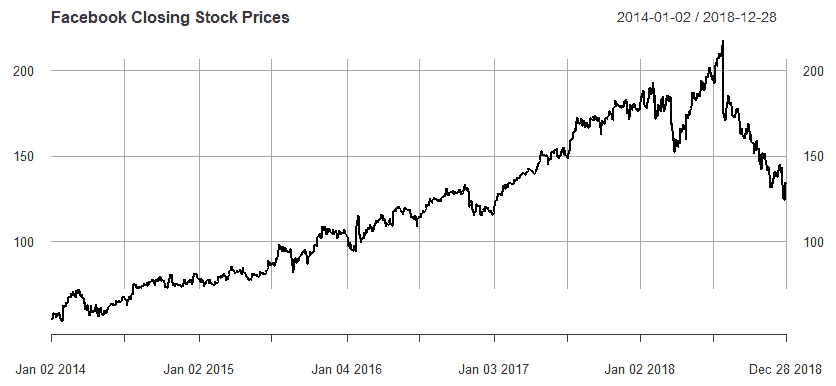
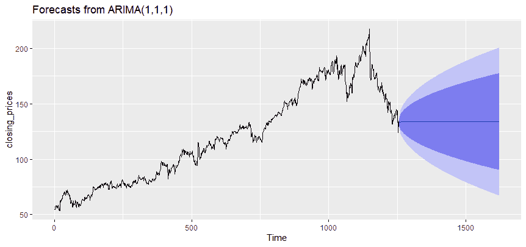
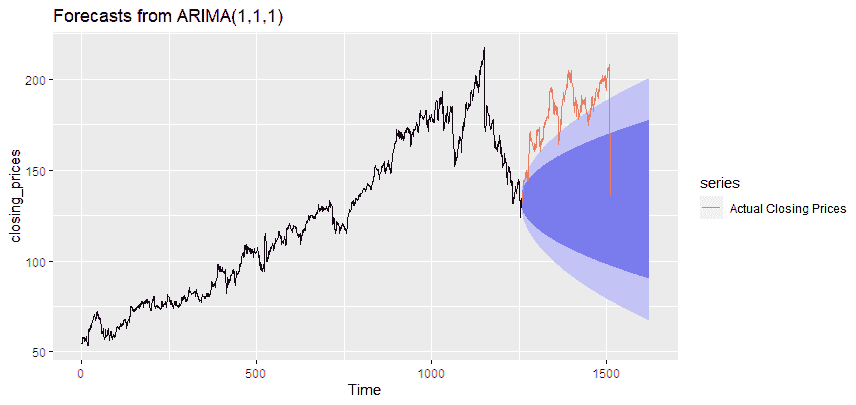
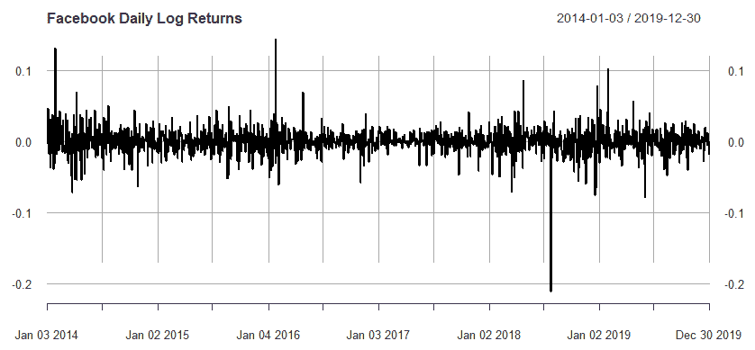
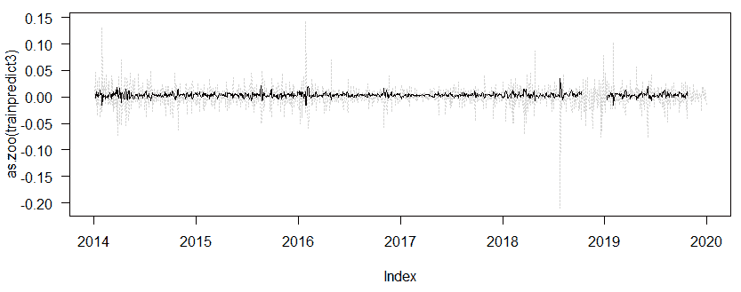
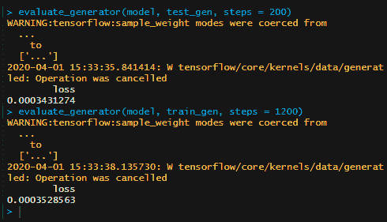
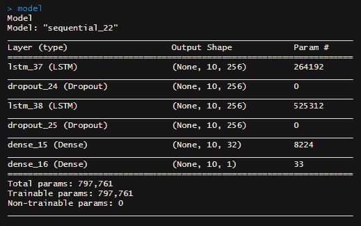
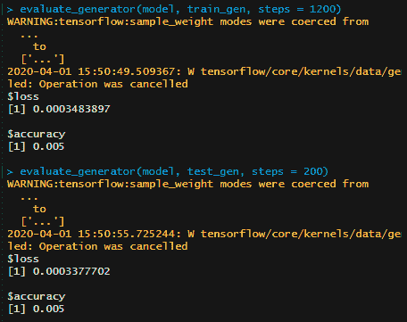

# 用于股市预测的长短期记忆网络

本章将展示如何使用**长短期记忆**（**LSTM**）模型预测股价。这种模型特别适用于基于时间序列的预测任务。LSTM 模型是**递归神经网络**（**RNN**）的一种特殊类型。这些模型具有特殊的特点，允许你将最近的输出作为输入重复使用。通过这种方式，这些类型的模型通常被描述为具有记忆。我们将从创建一个简单的基准模型开始，预测股价。从这里出发，我们将创建一个最小化的 LSTM 模型，并深入探讨这种模型类型相较于我们的基准模型的优势，以及它如何在某种程度上优于更传统的 RNN。最后，我们将讨论一些调整模型的方式，以进一步提高其性能。

在本章中，我们将涵盖以下主题：

+   了解股票市场预测的常见方法

+   准备和预处理数据

+   配置数据生成器

+   训练和评估模型

+   调整超参数以提高性能

# 技术要求

你可以在[`github.com/PacktPublishing/Hands-on-Deep-Learning-with-R`](https://github.com/PacktPublishing/Hands-on-Deep-Learning-with-R)找到本章使用的代码文件。

# 了解股票市场预测的常见方法

在本章中，我们将学习一种不同类型的神经网络，叫做 RNN。特别地，我们将应用一种 RNN 模型，称为 LSTM 模型，来预测股价。在我们开始之前，首先让我们了解一些常见的股票价格预测方法，以更好地理解这个问题。

预测股价是一个时间序列问题。与大多数其他机器学习问题不同，变量可以随机分割并用于训练和测试数据集，但在解决时间序列问题时，这种做法不可行。变量必须保持顺序。解决问题的特征可以在事件的序列中找到，因此，事件发生的时间顺序必须保持，以生成有意义的预测，预测接下来会发生什么。虽然这对可用方法施加了限制，但也提供了一个机会，可以使用一些特别适合这些任务的模型。

在我们构建深度学习解决方案之前，让我们先从一些相对简单的方法开始，创建一个基准模型，之后可以用来比较结果。我们将构建的第一个模型是**自回归积分滑动平均**（**ARIMA**）模型。实际上，这个模型名称中的概念解释了时间序列数据建模的许多特殊挑战。

**AR** 在 ARIMA 中代表**自回归**，指的是模型的输入将是给定观测值和一组滞后观测值。**MA** 在 ARIMA 中代表**移动平均**，指的是模型的自回归特性，表示变量将包含在给定时间点的观测值和一组滞后变量。移动平均部分考虑了随时间变化的一组变量的平均值，从而捕捉到解释趋势的更一般化的值。

**I** 在 ARIMA 中代表**积分**，在这个上下文中意味着整个时间序列被视为一个整体。更具体地说，它指的是解决方案必须能够在整个序列上进行推广，这就像我们在其他机器学习解决方案中追求的一样。为此，在时间序列问题中，我们会对数据进行转换，使其成为平稳序列。对于 ARIMA，我们会查看一个观测值与前一个观测值之间的差异，并使用这些相对差异。通过使用相对差异，我们可以保持更广义的形状，从而有助于控制均值和方差，这对于预测未来状态至关重要。

有了这个背景，接下来我们将创建一个 ARIMA 模型。首先，我们将使用`quantmod`包加载股票信息。这个包中的`getSymbols`函数是一个非常方便的方式，可以从多个来源在设定的时间框架内提取任何公司股票的价格信息。我们将`auto.assign`设置为`FALSE`，因为我们会自己分配这个对象。对于我们的例子，我们将加载 5 年的 Facebook 股票数据：

1.  在以下代码中，我们将读取数据并加载我们将使用的所有库：

```py
library(quantmod)
library(tseries) 
library(ggplot2)
library(timeSeries)
library(forecast)
library(xts)
library(keras)
library(tensorflow)

FB <- getSymbols('FB', from='2014-01-01', to='2018-12-31', source = 'google', auto.assign=FALSE)
```

运行此代码后，我们会看到在环境中有一个`FB`对象，它的类类型是`xts`。这个对象的类类型类似于标准的数据框，但行名是日期。让我们查看几行`xts`数据。

1.  我们可以通过以下代码查看`FB`对象的前五行：

```py
FB[1:5,]
```

运行此代码后，你将在控制台中看到以下输出：


从这些选定的行中我们可以看到，数据中包含了来自当天的多个股票价格点，包括开盘价、收盘价、以及当天的最高价和最低价。同时也包含了股票交易量。对于我们的目的，我们将使用收盘时的价格。

1.  我们从数据中只选择收盘价，并通过运行以下代码将其存储在一个新对象中：

```py
closing_prices <- FB$FB.Close
```

1.  现在我们可以使用`plot.xts`函数来绘制股价数据。通常，绘制这些数据需要将日期存储在一个列中，但这个绘图函数提供了一种便捷的方式来绘制时间序列数据，而无需在数据框中保留日期列。我们可以通过运行以下代码来绘制 Facebook 过去五年的收盘股价：

```py
plot.xts(closing_prices,main="Facebook Closing Stock Prices")
```

在我们运行这一行代码后，我们将在**Plots**选项卡中看到如下生成的图表：



1.  现在我们可以看到 Facebook 股价在这个时间段内的变化，让我们来构建一个 ARIMA 模型。之后，我们将使用该 ARIMA 模型创建一个预测，并绘制这些预测值。我们通过运行以下代码来创建模型、进行预测并绘制图形：

```py
arima_mod <- auto.arima(closing_prices)

forecasted_prices <- forecast(arima_mod,h=365)

autoplot(forecasted_prices)
```

在运行前面的代码后，我们将在**Plots**选项卡中看到如下图表：



ARIMA 模型没有找到规律，反而给出了一个上下边界，在这个范围内预测股价，这并不特别有用。ARIMA 是一个流行的基准模型，用于预测时间序列数据，通常表现不错。然而，在这个案例中，我们可以看到我们的 ARIMA 模型似乎没有提供太多有用的信息。

1.  在继续之前，我们可以将这个数据框中的实际股价值添加进来，看看股价是否落在 ARIMA 模型预测的范围内。为了将数据拉入并添加到我们的图表中，我们运行以下代码：

```py
fb_future <- getSymbols('FB', from='2019-01-01', to='2019-12-31', source = 'google', auto.assign=FALSE)

future_values <- ts(data = fb_future$FB.Close, start = 1258, end = 1509)

autoplot(forecasted_prices) + autolayer(future_values, series="Actual Closing Prices")
```

在我们运行前面的代码后，我们将在**Plots**选项卡中看到如下图表：



如前所述，这些日期的值超出了 ARIMA 模型的预测范围。我们可以看到，我们选择了一个比较复杂的时间序列数据集来进行建模，因为股价呈现下降趋势，然后又开始上升。话虽如此，整个五年期间，股价整体呈现上升趋势。我们能否构建一个能够学习这种上升趋势并在预测结果中正确反映的模型呢？让我们利用我们学到的关于时间序列数据建模的特殊挑战，看看是否能通过深度学习方法来改进我们的基准结果。

# 数据准备与预处理

在处理时间序列数据时，有多种数据类型格式可以选择并进行转换。我们已经使用了其中的两种格式，实际上有三种格式是最常用的。在进入深度学习模型之前，让我们简要回顾一下这些数据类型。

当我们希望将实际数据作为叠加层添加到 ARIMA 模型图中时，我们使用了`ts`函数来创建时间序列数据对象。对于此对象，索引值必须是整数。在使用`autolayer`函数与`arima`图结合时，也需要一个时间序列数据对象。这是更简单的时间序列数据类型，它在**环境**标签中看起来像一个向量。然而，这仅适用于常规时间序列。

另一种数据类型是`zoo`。`zoo`数据类型适用于常规和不规则的时间序列，且 zoo 对象还可以包含不同的数据类型作为索引值。`zoo`对象的缺点是**环境**窗格中提供的信息较少，唯一的细节是日期范围。有时，`zoo`数据在绘图时表现更好，尤其是在叠加多个时间序列对象时，这也是我们在本章后面将使用它的原因。

最后一种时间序列数据类型是`xts`。这种数据类型是`zoo`的扩展。与`zoo`一样，索引值是日期。然而，此外，数据被存储在一个矩阵中，并且在**环境**窗格中会显示许多属性，使得检查数据对象的大小和内容更加容易。这通常是处理时间序列数据的好选择，除非有特别的理由使用我们已经涵盖的其他类型。`xts`的另一个好处是，默认的绘图函数使用不同于基础绘图的格式。

在处理时间序列数据时，除了数据类型转换之外，还有另一个常用于建模的预处理步骤：将数据转换为增量值，而非绝对值，以便使数据平稳。在这种情况下，我们还将对价格值进行对数变换，以进一步控制异常值。当我们完成此过程时，我们还需要去除我们引入的缺失值。让我们通过运行以下代码，将我们的合并股票价格数据从收盘价转换为收盘价对数值的日变化：

```py
future_prices <- fb_future$FB.Close

closing_deltas <- diff(log(rbind(closing_prices,future_prices)),lag=1)
closing_deltas <- closing_deltas[!is.na(closing_deltas)]
```

运行此代码后，我们得到了比之前处理的数据更为平稳的数据。现在，让我们通过运行以下代码查看我们的数据现在是什么样的：

```py
plot(closing_deltas,type='l', main='Facebook Daily Log Returns')
```

当我们运行前面的代码时，我们将在**图形**窗格中看到以下生成的图表：



我们正在处理的值约束更多，一个部分的模式看起来能够更好地概括并解释不同部分的运动。尽管我们可以看到这里的值已经更好地进行了缩放，但我们还可以进行一个快速测试，证明数据现在是平稳的。为了检查平稳性，我们可以使用**扩展的迪基-富勒检验**，我们可以通过以下代码行在我们的数据上运行该检验：

```py
adf.test(closing_deltas)
```

运行此代码后，我们将在控制台中看到以下输出：


尽管在运行此函数时不会输出实际的 p 值，但我们可以看到 p 值足够小，因此我们可以接受数据是平稳的备择假设。完成此预处理后，我们现在可以继续为深度学习模型设置`train`和`test`数据集。

# 配置数据生成器

类似于 ARIMA，对于我们的 LSTM 模型，我们希望模型使用滞后的历史数据来预测给定时间点的实际数据。然而，为了将这些数据传递给 LSTM 模型，我们必须将数据格式化，使得一定数量的列包含所有滞后的值，而一列包含目标值。在过去，这个过程略显繁琐，但现在我们可以使用数据生成器使这一任务变得更加简单。在我们的案例中，我们将使用一个时间序列生成器，它生成一个我们可以用于 LSTM 模型的张量。

在生成数据时，我们将包括的数据参数是我们将使用的数据对象及其目标。在这种情况下，我们可以将相同的数据对象作为这两个参数的值。之所以可以这样做，是因为下一个参数`length`，它配置了回溯的时间步数，用来填充滞后价格值。然后，我们定义采样率和步幅，它们分别决定目标值每行的连续时间步数以及每个序列的滞后值的时间步数。我们还定义了起始索引值和结束索引值。我们还需要确定数据是否应被打乱，或保持按时间顺序排列，或者是否应按逆时间顺序排列，或保持当前排序。最后，我们选择批量大小，这决定了每批模型中应包含多少时间序列样本。

对于这个模型，我们将创建生成的时间序列数据，其`length`值为`3`，意味着我们将回溯 3 天以预测给定的那一天。我们将保持采样率和步幅为`1`，以包括所有数据。接下来，我们将通过`1258`作为索引点来拆分`train`和`test`数据集。我们不会打乱数据或反转数据，而是保持其时间顺序，并将批量大小设置为`1`，以便一次建模一个价格。我们通过以下代码使用这些参数值来创建`train`和`test`数据集：

```py
train_gen <- timeseries_generator(
  closing_deltas,
  closing_deltas,
  length = 3,
  sampling_rate = 1,
  stride = 1,
  start_index = 1,
  end_index = 1258,
  shuffle = FALSE,
  reverse = FALSE,
  batch_size = 1
)

test_gen <- timeseries_generator(
  closing_deltas,
  closing_deltas,
  length = 3,
  sampling_rate = 1,
  stride = 1,
  start_index = 1259,
  end_index = 1507,
  shuffle = FALSE,
  reverse = FALSE,
  batch_size = 1
)
```

运行此代码后，你将在**环境**面板中看到两个张量对象。现在我们已经配置了数据生成器并使用它创建了两个序列张量，我们可以开始使用 LSTM 模型对数据进行建模了。

# 训练和评估模型

我们的数据已正确格式化，现在可以训练我们的模型。为了这个任务，我们使用 LSTM。这是一种特殊类型的 RNN。此类神经网络非常适合时间序列数据，因为它们能够在建模过程中考虑时间因素。

大多数神经网络被归类为**前馈** **网络**。在这些模型架构中，信号从输入节点开始，传递到任意数量的隐藏层，直到它们到达输出节点。前馈网络之间有一些变化。多层感知机模型由所有密集的全连接层组成，而卷积神经网络则包含在到达密集层和随后的输出层之前，作用于输入数据特定部分的层。在这些类型的模型中，反向传播步骤将从成本函数中传递回导数，但这发生在整个前馈传递完成之后。循环神经网络（RNN）在一个非常重要的方面有所不同。它们不是等到整个前馈传递完成，而是将某个时间点的数据传递到前面并通过隐藏层单元的激活函数进行评估。该激活函数的输出随后会反馈到节点，并与下一个基于时间的数据元素一起计算。通过这种方式，RNN 能够利用它们刚学到的内容来指导如何处理下一个数据点。现在我们可以看到，为什么在考虑包含时间因素的数据时，这些方法表现得如此有效。

虽然 RNN 被设计成能够很好地处理时间序列数据，但它们确实存在一个重要的限制。模型中的递归元素仅考虑它前面紧接的时间段，并且在反向传播过程中，当隐藏层数量很大时，传递回来的信号可能会衰减。这两种模型特性意味着，给定节点无法使用它在远期时间范围内学到的信息，尽管这些信息可能是有用的。LSTM 模型解决了这个问题。

在 LSTM 模型中，数据进入节点有两条路径。一条与 RNN 中相同，包含给定的基于时间的数据点以及之前时间点的输出。然而，如果该向量的激活函数输出大于 `0`，则它会被传递到前方。在下一个节点，它会走上一条独立的路径，通向一个被称为**遗忘门**的激活函数。如果数据通过这个函数时值为正，那么它将与取当前状态和紧接着的过去输出作为输入的激活函数的输出相结合。通过这种方式，我们可以看到，来自过去多个时间段的数据可以继续作为输入，传递到更远处的节点。通过这种模型设计，我们可以克服传统 RNN 的局限性。让我们开始训练我们的模型吧：

1.  首先，我们运行以下代码行来初始化一个 Keras 顺序模型：

```py
model <- keras_model_sequential()
```

1.  运行此行代码后，我们将添加 LSTM 层。在我们的 LSTM 层中，我们将选择隐藏层的单元数量，并定义输入形状，这里输入形状的一个维度是之前定义的回溯长度，另一个维度是`1`。然后，我们将添加一个具有一个单元的全连接层，该单元将赋予我们的预测价格。我们通过以下代码定义我们的 LSTM 模型：

```py
model %>%
  layer_lstm(units = 4,
             input_shape = c(3, 1)) %>%
  layer_dense(units = 1)
```

1.  在定义模型后，我们接下来进行`compile`步骤。在这种情况下，我们将使用均方误差（`mse`）作为损失函数，因为这是一个回归任务，我们将使用`adam`作为优化器。我们通过以下代码定义`compile`步骤并查看我们的模型：

```py
model %>%
  compile(loss = 'mse', optimizer = 'adam')

model
```

运行此代码块后，您将在控制台中看到以下输出：


1.  现在，我们可以开始训练模型。为了训练模型，我们使用生成的`train`数据集。我们将初步运行 100 轮，每轮只取一个时间步。我们将设置 verbose 参数，打印每一轮的结果。我们使用以下代码训练我们的 LSTM 模型：

```py
history <- model %>% fit_generator(
  train_gen,
  epochs = 100,
  steps_per_epoch=1,
  verbose=2
)
```

1.  既然模型已经训练完成，我们可以进行预测。在`predict`步骤中，我们为`train`和`test`数据选择一个给定的时间步数。之后，我们可以将这些预测结果与实际值进行比较。我们通过运行以下代码，使用 LSTM 模型预测股票价格：

```py
testpredict <- predict_generator(model, test_gen, steps = 200)
trainpredict <- predict_generator(model, train_gen, steps = 1200)
```

运行前面的代码后，我们现在得到了预测结果。

1.  我们的下一步是将这些与实际值一起绘制，看看模型的效果如何。这一步需要在多个格式之间转换数据。我们的第一步是将预测向量转换为`xts`对象。为此，我们需要定义索引值。我们将使用`trainpredict`数据的`4`到`1203`索引值。之所以从 4 开始，是因为我们有三个滞后值用于预测第四个索引点的值。我们将对测试数据做同样的处理，但从`1263`索引点开始。我们通过运行以下代码从预测中创建`xts`数据对象：

```py
trainpredict <- data.frame(pred = trainpredict)
rownames(trainpredict) <- index(closing_deltas)[4:1203]
trainpredict <- as.xts(trainpredict)

testpredict <- data.frame(pred = testpredict)
rownames(testpredict) <- index(closing_deltas)[1262:1461]
testpredict <- as.xts(testpredict)
```

1.  现在，我们将这些`xts`对象中的值添加到`closing_deltas`对象中。接下来，我们绘制实际值，并将预测值叠加上去。为了做到这一点，我们首先为所有的 NA 添加列，然后仅填充那些与预测对象中的索引点匹配的行。我们通过运行以下代码，向`closing_delta`和`xts`对象中添加反映`train`和`test`集预测值的额外列：

```py
closing_deltas$trainpred <- rep(NA,1507)
closing_deltas$trainpred[4:1203] <- trainpredict$pred

closing_deltas$testpred <- rep(NA,1507)
closing_deltas$testpred[1262:1461] <- testpredict$pred
```

1.  现在，我们将预测结果与实际数据合并在一起，可以绘制结果。我们将预测值绘制为实心的深色线条，实际值则用浅灰色的虚线表示，使用以下代码：

```py
plot(as.zoo(closing_deltas), las=1, plot.type = "single", col = c("light gray","black","black"), lty = c(3,1,1))
```

运行此代码后，您将在**Plots**标签页中看到以下图表：



虽然预测结果略显保守，但请注意，模型在不同时间点捕捉到了细微差别。这个模型发现了更多的模式，输出的波动比我们的 ARIMA 模型更大。

1.  除了绘制数据图表外，我们还可以打印调用`evaluate_generator`函数计算误差率的结果。为了打印模型的误差率，我们运行以下代码：

```py
evaluate_generator(model, test_gen, steps = 200)
evaluate_generator(model, train_gen, steps = 1200)
```

运行上述代码后，我们会看到以下误差率值：



控制台中打印的警告可以忽略。到目前为止，这个问题是 TensorFlow 通过 Keras 的已知问题。我们的 LSTM 模型到目前为止相对简单。接下来，让我们看看如何调整一些超参数。我们将尝试调整哪些参数，以期实现更好的性能。

# 调整超参数以提高性能

为了改进我们的模型，我们现在将调整超参数。调整 LSTM 模型有很多选项。我们将专注于在创建时间序列数据时调整`length`值。在此基础上，我们还会添加额外的层，调整层中的单元数，并修改优化器。

我们将通过以下步骤来实现：

1.  为了开始，我们将把传递给`timeseries_generator`函数中`length`参数的值从`3`改为`10`，这样我们的模型就有了更长的价格窗口来进行预测计算。为了做这个更改，我们运行以下代码：

```py
train_gen <- timeseries_generator(
  closing_deltas,
  closing_deltas,
  length = 10,
  sampling_rate = 1,
  stride = 1,
  start_index = 1,
  end_index = 1258,
  shuffle = FALSE,
  reverse = FALSE,
  batch_size = 1
)

test_gen <- timeseries_generator(
  closing_deltas,
  closing_deltas,
  length = 10,
  sampling_rate = 1,
  stride = 1,
  start_index = 1259,
  end_index = 1507,
  shuffle = FALSE,
  reverse = FALSE,
  batch_size = 1
)
```

我们保持此代码与之前相同，只做了`length`的一个更改。

1.  接下来，我们将通过添加一个额外的 LSTM 层、丢弃层和一个额外的全连接层来加深我们的 LSTM 模型。我们还将更改输入形状，以反映生成器中的下一个`length`参数。最后，我们将第一层的`return_sequences`设置为`True`，这样信号就可以流向额外的层。如果没有将其设置为`True`，您将遇到与数据进入第二个 LSTM 层时期望和实际维度相关的错误。我们通过运行以下代码为 LSTM 模型添加额外的层：

```py
model <- keras_model_sequential()

model %>%
 layer_lstm(units = 256,input_shape = c(10, 1),return_sequences="True") %>%
 layer_dropout(rate = 0.3) %>%
 layer_lstm(units = 256,input_shape = c(10, 1),return_sequences="False") %>%
 layer_dropout(rate = 0.3) %>%
 layer_dense(units = 32, activation = "relu") %>%
 layer_dense(units = 1, activation = "linear")
```

1.  我们的最后一个修改将是对优化器进行调整。在这种情况下，我们将降低优化器的学习率。这样做是为了避免预测值出现大的波动。我们可以通过运行以下代码来调整优化器：

```py
model %>%
  compile(
    optimizer = optimizer_adam(lr = 0.001), 
    loss = 'mse',
    metrics = 'accuracy')

model
```

运行上述代码后，以下内容将打印到控制台：



1.  接下来，我们可以像以前一样使用以下代码来训练我们的模型：

```py
history <- model %>% fit_generator(
 train_gen,
 epochs = 100,
 steps_per_epoch=1,
 verbose=2
)
```

1.  训练完我们的模型后，我们可以评估它的表现，并与我们的第一个模型进行对比。我们通过以下代码来评估模型并将结果打印到控制台：

```py
evaluate_generator(model, train_gen, steps = 1200)
evaluate_generator(model, test_gen, steps = 200)
```

当我们运行此代码时，我们将看到以下结果：



我们的修改产生了混合的结果。虽然`train`数据的损失值稍微变差，但`test`数据的误差率有所改善。

到此为止，我们已经完成了创建 LSTM 模型所需的所有步骤，并且初步调整了参数以提高性能。创建深度学习模型往往既是一门艺术，也是一门科学，因此我们鼓励你继续进行调整，看看是否能进一步提升模型的表现。你可能想尝试除了`adam`之外的其他优化器，或者尝试加入额外的隐藏层。有了这些基础，你已经准备好进行更多的修改，或者将这种方法应用到不同的数据集上。

# 总结

在这一章中，我们首先创建了一个基准模型来预测股价。为此，我们使用了 ARIMA 模型。基于这个模型，我们探索了使用时间序列数据进行机器学习的一些重要组成部分，包括使用滞后变量值来预测当前变量值以及平稳性的重要性。从这里开始，我们使用 Keras 构建了一个深度学习解决方案，组合了 LSTM，然后进一步调优了这个模型。在这个过程中，我们观察到，与其他传统模型如 ARIMA 相比，这种深度学习方法具有一些显著的优势。在下一章中，我们将使用生成对抗网络来创建一个合成的人脸图像。
