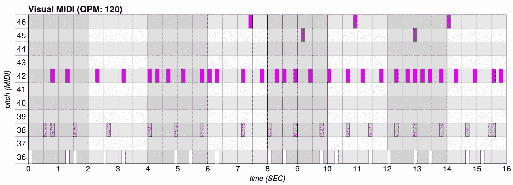
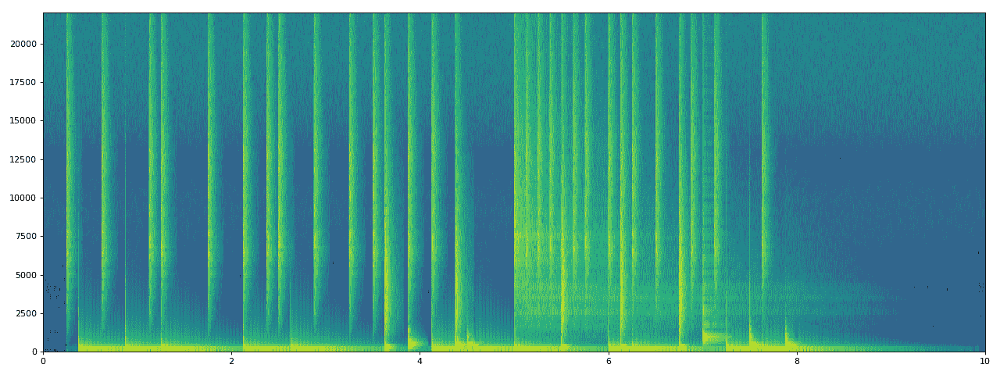
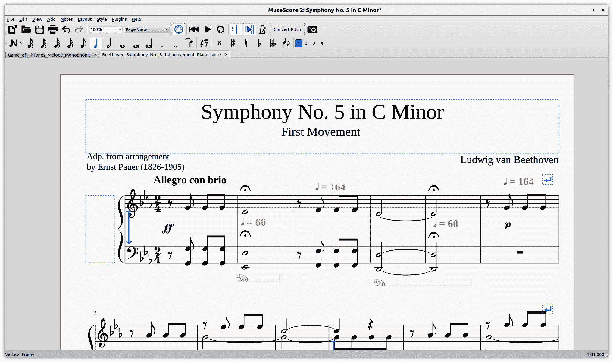
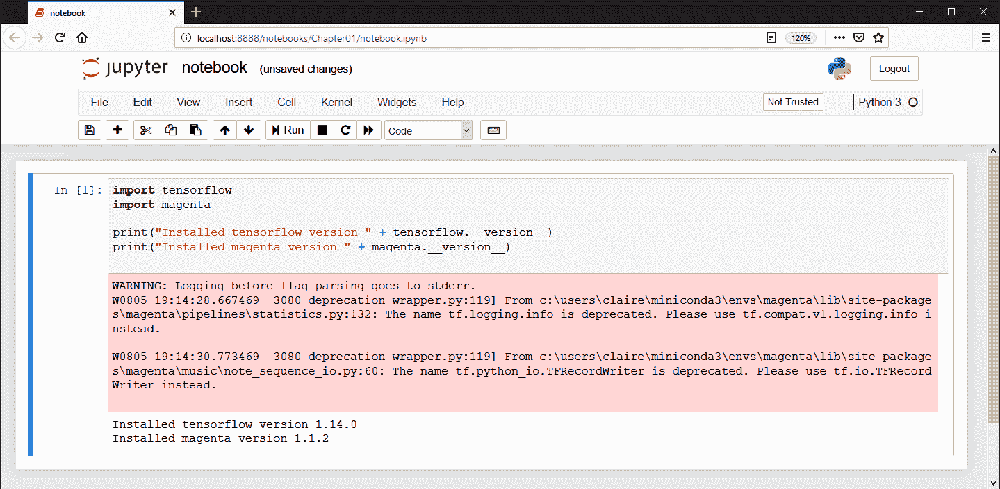

# Magenta 和生成艺术简介

在本章中，您将学习生成音乐的基础知识以及现有的相关技术。您将了解生成艺术的新技术，例如机器学习，以及如何将这些技术应用于音乐和艺术创作。我们将介绍 Google 的 Magenta 开源研究平台，Google 的开源机器学习平台 TensorFlow，并概述其不同的部分，以及为本书安装所需的软件。最后，我们将通过命令行生成一个简单的 MIDI 文件来完成安装。

本章将涵盖以下主题：

+   生成艺术概述

+   机器学习的新技术

+   Magenta 和 TensorFlow 在音乐生成中的应用

+   安装 Magenta

+   安装音乐软件和合成器

+   安装代码编辑软件

+   生成基本的 MIDI 文件

# 技术要求

在本章中，我们将使用以下工具：

+   **Python**、**Conda** 和 **pip**，用于安装和执行 Magenta 环境

+   **Magenta**，通过执行音乐生成来测试我们的设置

+   **Magenta GPU**（**可选**）、CUDA 驱动程序和 cuDNN 驱动程序，使 Magenta 在 GPU 上运行

+   **FluidSynth**，通过软件合成器收听生成的音乐样本

+   本书中可能会使用的其他可选软件，例如用于音频编辑的 **Audacity**，用于乐谱编辑的 **MuseScore**，以及用于代码编辑的 **Jupyter Notebook**。

强烈建议在阅读本书章节时，遵循书中的源代码。源代码还提供了有用的脚本和技巧。按照以下步骤，在您的用户目录中查看代码（如果您愿意，也可以选择其他位置）：

1.  首先，您需要安装 Git，可以通过下载并执行 [git-scm.com/downloads](https://git-scm.com/downloads) 上的安装程序，在任何平台上安装。然后，按照提示操作，确保将该程序添加到您的 PATH 中，以便在命令行上使用。

1.  然后，打开新的终端并执行以下命令，克隆源代码库：

```py
> git clone https://github.com/PacktPublishing/hands-on-music-generation-with-magenta
> cd hands-on-music-generation-with-magenta
```

每个章节都有自己的文件夹；`Chapter01`、`Chapter02` 等。例如，本章的代码位于 [`github.com/PacktPublishing/hands-on-music-generation-with-magenta/tree/master/Chapter01`](https://github.com/PacktPublishing/hands-on-music-generation-with-magenta/tree/master/Chapter01)。示例和代码片段将位于本章的文件夹中。在开始之前，您应该打开 `cd Chapter01`。

我们不会使用很多 Git 命令，除了 `git clone`，该命令将代码库复制到您的机器上，但如果您不熟悉 Git 并想学习更多内容，一个很好的起点是优秀的 Git 书籍 ([git-scm.com/book/en/v2](https://git-scm.com/book/en/v2))，它支持多种语言。

查看以下视频，观看代码实践：

[`bit.ly/2O847tW`](http://bit.ly/2O847tW)

# 生成艺术概览

**生成艺术**一词是在计算机出现后被创造的，早期的计算机科学中，艺术家和科学家们使用技术作为工具来创作艺术。有趣的是，生成艺术早于计算机的出现，因为生成系统本来可以手工制作。

在本节中，我们将通过展示一些来自艺术史的有趣例子，概述生成音乐，例子可以追溯到 18 世纪。这将帮助你通过具体的示例了解不同类型的生成音乐，并为后续章节的学习奠定基础。

# 钢笔和纸上的生成音乐

人类历史上有很多生成艺术的例子。一个流行的例子可以追溯到 18 世纪，当时一款名为 Musikalisches Würfelspiel（德语为*音乐骰子游戏*）的游戏在欧洲广受欢迎。该游戏的概念由尼古劳斯·辛梅罗克于 1792 年归功于莫扎特，尽管没有证实这确实是他的创作。

游戏的玩家掷骰子，并从结果中选择一个预定义的 272 个音乐乐句中的一个。通过反复掷骰，玩家可以创作出一整分钟（该游戏生成的音乐类型），并且遵循该音乐类型的规则，因为它是通过这样的方式创作的，生成的音乐编排听起来非常和谐。

在下面的表格和随后的图片中，可以看到一个音乐骰子游戏的小部分。在表格中，y 轴代表骰子投掷结果，而 x 轴代表你当前生成的乐句。玩家将掷两颗骰子 16 次：

1.  在两颗骰子的第一次掷骰中，我们读取第一列。两个骰子的总和为二时，输出的是第 96 号乐句（第一行），两个骰子的总和为二时，输出的是第 32 号乐句（第二行），以此类推。

1.  在两颗骰子的第二次掷骰中，我们读取第二列。两个骰子的总和为二时，输出的是第 22 号乐句（第一行），总和为三时，输出的是第 6 号乐句（第二行），以此类推。

经过 16 次投掷后，游戏将为该指标输出 16 个乐句：

|  | 1 | 2 | 3 | 4 | 5 | 6 | 7 | 8 | 9 | 10 | 11 | 12 | 13 | 14 | 15 | 16 |
| --- | --- | --- | --- | --- | --- | --- | --- | --- | --- | --- | --- | --- | --- | --- | --- | --- |
| 2 | 96 | 22 | 141 | 41 | 105 | 122 | 11 | 30 | 70 | 121 | 26 | 9 | 112 | 49 | 109 | 14 |
| 3 | 32 | 6 | 128 | 63 | 146 | 46 | 134 | 81 | 117 | 39 | 126 | 56 | 174 | 18 | 116 | 83 |
| 4 | 69 | 95 | 158 | 13 | 153 | 55 | 110 | 24 | 66 | 139 | 15 | 132 | 73 | 58 | 145 | 79 |
| 5 | 40 | 17 | 113 | 85 | 161 | 2 | 159 | 100 | 90 | 176 | 7 | 34 | 67 | 160 | 52 | 170 |
| 6 | 148 | 74 | 163 | 45 | 80 | 97 | 36 | 107 | 25 | 143 | 64 | 125 | 76 | 136 | 1 | 93 |
| 7 | 104 | 157 | 27 | 167 | 154 | 68 | 118 | 91 | 138 | 71 | 150 | 29 | 101 | 162 | 23 | 151 |
| 8 | 152 | 60 | 171 | 53 | 99 | 133 | 21 | 127 | 16 | 155 | 57 | 175 | 43 | 168 | 89 | 172 |
| 9 | 119 | 84 | 114 | 50 | 140 | 86 | 169 | 94 | 120 | 88 | 48 | 166 | 51 | 115 | 72 | 111 |
| 10 | 98 | 142 | 42 | 156 | 75 | 129 | 62 | 123 | 65 | 77 | 19 | 82 | 137 | 38 | 149 | 8 |
| 11 | 3 | 87 | 165 | 61 | 135 | 47 | 147 | 33 | 102 | 4 | 31 | 164 | 144 | 59 | 173 | 78 |
| 12 | 54 | 130 | 10 | 103 | 28 | 37 | 106 | 5 | 35 | 20 | 108 | 92 | 12 | 124 | 44 | 131 |

上表显示了整个乐谱的一小部分，每一小节都有索引标注。对于每一个生成的 16 个索引，我们按顺序选取相应的小节，这就构成了我们的华尔兹舞曲（华尔兹是这个游戏生成的风格——基本上，它是一首遵循特定规则的音乐乐谱）。

生成属性有不同的类型：

+   **偶然性或随机性**，例如骰子游戏就是一个很好的例子，其中生成的艺术结果部分或完全由偶然性定义。有趣的是，向艺术过程中添加随机性通常被认为是*人性化*这一过程，因为一个底层的刚性算法可能会生成一些听起来*人造*的东西。

+   **算法生成**（或基于规则的生成），在这种情况下，生成的规则将定义其结果。这种生成的典型例子包括像著名的康威生命游戏这样的细胞自动机，这是一种每次迭代时，网格中的细胞根据预定规则变化的游戏：每个细胞可能是开或关，邻近的细胞根据网格的状态和规则进行更新。这种生成的结果是完全确定的；其中不涉及随机性或概率。

+   **基于随机过程的生成**，其中序列由元素的概率派生。一个例子是马尔科夫链，这是一种随机模型，其中序列的每个元素的结果概率仅由当前系统状态定义。另一个很好的基于随机过程的生成例子是机器学习生成，这将在本书中多次涉及。

在本书中，我们将采用生成艺术的简单定义：

<q>“生成艺术是一种部分或完全由自主系统创作的艺术作品”</q>。

到现在为止，你应该明白我们实际上并不需要计算机来生成艺术，因为一个系统的规则可以手工推导出来。但使用计算机使得定义复杂的规则并处理大量数据成为可能，正如我们在接下来的章节中将看到的。

# 计算机生成的音乐

计算机生成艺术的首次实例可以追溯到 1957 年，当时使用马尔科夫链在电子计算机 ILLIAC I 上生成了一个乐谱，由作曲家 Lejaren Hiller 和 Leonard Issacson 创作。他们的论文《使用高速数字计算机的音乐创作》描述了用于创作音乐的技术。这部名为《Illac Suite》的作品由四个乐章组成，每个乐章都探索了一种特定的音乐生成技巧，从基于规则的*cantus firmus*生成到使用马尔科夫链的随机生成。

随后出现了许多著名的生成作曲实例，例如 1962 年泽纳基斯的*Atrées*，它探索了随机作曲的理念；埃布齐奥格罗（Ebcioglo）的作曲软件 CHORAL，内含手工编写的规则；以及大卫·科普（David Cope）的 EMI 软件，它扩展了这一概念，能够从大量乐谱中学习。

截至今天，生成音乐无处不在。许多工具允许音乐家基于我们之前描述的生成技术创作原创音乐。一个名为**算法派对**（algorave）的全新音乐流派和音乐社区就是由这些技术衍生出来的。源于地下电子音乐场景，音乐家们使用生成算法和软件在舞台上实时创作舞曲，因此这个流派被命名为“算法派对”。如*TidalCycles*和*Orca*等软件允许音乐家即时定义规则，让系统自主生成音乐。

回顾这些技术，随机模型（如马尔可夫链）已被广泛应用于生成音乐。这是因为它们在概念上简单，容易表示，因为该模型是一个转移概率表，并且可以从少量实例中学习。马尔可夫模型的问题在于表示长期时间结构非常困难，因为大多数模型只会考虑*前 n*个状态，其中*n*是一个较小的数字，用以定义结果的概率。让我们看看有哪些其他类型的模型可以用来生成音乐。

在 2012 年的一篇题为*关于生成计算机艺术的十个问题*的论文中，作者讨论了机器创作的可能性、人类美学的形式化以及随机性。更重要的是，它定义了此类系统的局限性。生成系统能够产生什么？机器只能做它们被指示去做的事吗？

# 机器学习的新技术

机器学习对于计算机科学至关重要，因为它可以在无需明确编写的情况下对复杂功能进行建模。这些模型是通过从实例中自动学习得到的，而不是手动定义的。这对艺术领域有着巨大的意义，因为明确编写绘画或音乐乐谱的规则本身就非常困难。

近年来，深度学习的出现将机器学习推向了新的高度，尤其在效率方面。深度学习对于我们音乐生成的应用尤为重要，因为使用深度学习技术不需要像传统机器学习那样进行*特征提取*的预处理步骤，而特征提取在处理图像、文本以及——你猜到了——音频等原始数据时非常困难。换句话说，传统的机器学习算法在音乐生成中并不适用。因此，本书中所有的网络都会是深度神经网络。

在本节中，我们将学习深度学习的进展如何推动音乐生成，并介绍本书中将要使用的概念。我们还将探讨这些算法的不同类型的音乐表示方法，这一点很重要，因为它将为本书中的数据处理提供基础。

# 深度学习的进展

我们都知道，深度学习最近已经成为计算机科学中一个快速发展的领域。就在不久前，没有任何深度学习算法能够超越传统技术。那是在 2012 年之前，当时第一次有一个深度学习算法——AlexNet，通过使用在 GPU 上训练的深度神经网络，在图像分类比赛中表现得更好（有关 AlexNet 论文的详细信息，请参见*进一步阅读*部分，它是计算机视觉领域最具影响力的论文之一）。神经网络技术已经有超过 30 年的历史，但其近期的复兴可以通过大数据的可用性、高效的计算能力以及技术进步来解释。

最重要的是，深度学习技术是*通用的*，即与我们之前指定的音乐生成技术不同，机器学习系统是与音乐类型无关的，可以从任意的音乐语料库中学习。我们将在本书中看到同一系统可以用于多种音乐风格，例如在第六章中，我们会训练一个现有模型来处理爵士乐，*训练数据准备*。

深度学习中的许多技术早在很久以前就被发现了，但直到今天才找到了有意义的应用。在与音乐生成相关的技术进展方面，这些技术在 Magenta 中得到了应用，并将在本书后面进行解释：

+   **递归神经网络**（**RNNs**）在音乐生成中非常有趣，因为它们允许我们对输入和输出的向量序列进行操作。当使用经典神经网络或卷积网络（这些网络用于图像分类）时，你只能使用固定大小的输入向量来产生固定大小的输出向量，这对于音乐处理来说非常有限，但在某些类型的图像处理上效果良好。RNN 的另一个优势是每次迭代时可以通过将一个函数与前一个状态向量结合来生成新的状态向量，这是一种描述复杂行为和长期状态的强大手段。在第二章中，我们将讨论 RNNs，*用 Drums RNN 生成鼓点序列*。

+   **长短期记忆**（**LSTM**）是一个具有稍微不同特性的 RNN。它解决了 RNN 中存在的梯度消失问题，这使得网络即使在理论上可以学习长期依赖关系，也无法做到。Douglas Eck 和 Jurgen Schmidhuber 于 2002 年在一篇名为《在音乐中寻找时间结构：基于 LSTM 递归网络的蓝调即兴演奏》的论文中提出了 LSTM 在音乐生成中的应用。我们将在第三章《生成复调旋律》中讨论 LSTM。

+   **变分自编码器**（**VAE**）类似于经典的自编码器，其架构相似，包含编码器（将输入转换为隐藏层）、解码器（将隐藏层转换为输出）以及损失函数，模型通过特定的约束学习重建原始输入。VAE 在生成模型中的应用较为新颖，但已显示出有趣的结果。我们将在第四章《基于音乐 VAE 的潜在空间插值》中讨论 VAE。

+   **生成对抗网络**（**GANs**）是一类机器学习系统，其中两个神经网络相互竞争：一个生成网络生成候选项，而一个判别网络对其进行评估。我们将在第五章《使用 NSynth 和 GANSynth 进行音频生成》中讨论 GAN。

最近的深度学习进展不仅深刻改变了音乐生成，还影响了音乐风格分类、音频转录、音符检测、作曲等领域。我们在这里不会讨论这些主题，但它们都有一个共同点：音乐表示。

# 音乐处理过程中的表示方式

这些系统可以使用不同的表示方式：

+   **符号表示**，例如**MIDI**（**音乐仪器数字接口**（**MIDI**）），通过包含音乐音符和节奏的符号描述音乐，但不涉及实际声音的音质或音色。一般来说，乐谱是这一表示方式的典型例子。音乐的符号表示本身没有声音；它必须通过乐器演奏出来。

+   **子符号表示**，例如原始音频波形或频谱图，描述了音乐的实际声音。

不同的处理过程需要不同的表示方式。例如，大多数语音识别和合成模型使用频谱图，而本书中大部分示例使用 MIDI 来生成音乐乐谱。集成这两种表示方式的过程比较少见，但一个例子可能是乐谱转录，它将音频文件转换为 MIDI 或其他符号表示。

# 使用 MIDI 表示音乐

还有其他符号化表示法，如 MusicXML 和 AbcNotation，但 MIDI 无疑是最常见的表示方式。MIDI 规范本身也充当了一种协议，因为它被用来传输音符消息，这些消息可以用于实时演奏，也可以用于控制消息。

让我们考虑一下在本书中会用到的一些 MIDI 消息的部分：

+   **通道 [0-15]**：这表示消息发送的轨道

+   **音符编号 [0-127]**：这表示音符的音高

+   **速度 [0-127]**：这表示音符的音量

要在 MIDI 中表示一个音乐音符，你必须发送两种不同的消息类型，并且确保适当的时间顺序：一个`Note On`事件，紧接着一个`Note Off`事件。这隐含了**音符的时长**，但 MIDI 消息中并未包含此信息。之所以如此重要，是因为 MIDI 最初是为了实时演奏定义的，所以使用两条消息——一条用于按键，另一条用于释放按键——是合理的。

从数据角度来看，我们要么需要将 MIDI 音符转换为一种编码了音符时长的格式，要么保持按键和释放按键的方式，具体取决于我们想做什么。对于 Magenta 中的每个模型，我们将看到 MIDI 音符是如何被编码的。

下图显示了生成的鼓文件的 MIDI 表示，它以时间和音高的图形形式展示。每个 MIDI 音符由一个矩形表示。由于打击乐数据的特点，所有音符的时长相同（"note on"后跟"note off"消息），但通常情况下，这个时长可能会有所不同。由于鼓文件本质上是复音的，这意味着多个音符可以同时演奏。我们将在接下来的章节中讨论单音和复音。

请注意，横坐标以秒为单位表示，但通常也可以用小节（bars）来表示。该图中未显示 MIDI 通道：



绘制生成的 MIDI 文件的脚本可以在本章节的 GitHub 代码中的`Chapter01/provided`文件夹里找到。这个脚本的名字叫做`midi2plot.py`。

在音乐生成的过程中，目前大多数深度学习系统使用符号化表示法，Magenta 也采用了这种方式。这背后有几个原因：

+   用符号数据表示音乐的本质，特别是在作曲和和声方面，是更为简便的。

+   处理这两种表示方式并使用深度学习网络进行训练是类似的，因此选择其中一种表示方式，归根结底取决于哪一种更快、更方便。一个很好的例子是，WaveNet 音频生成网络也有一个 MIDI 实现，称为 MidiNet 符号生成网络。

我们会看到，MIDI 格式并未直接被 Magenta 使用，而是被转换为`NoteSequence`，这是一种**协议缓冲区**（**Protobuf**）实现的音乐结构，之后由 TensorFlow 使用。这一过程对最终用户是透明的，因为输入和输出数据始终是 MIDI 格式。`NoteSequence`的实现之所以有用，是因为它实现了一种数据格式，可以供模型进行训练。例如，在`NoteSequence`中的`Note`有一个长度属性，而不是使用两个消息来定义音符的长度。我们将在接下来的讲解中详细说明`NoteSequence`的实现。

# 将音乐表示为波形

音频波形是一个显示振幅随时间变化的图表。从远距离看，波形看起来相当简单和平滑，但放大后，我们可以看到微小的变化——这些变化代表了声音。

为了说明波形是如何工作的，假设扬声器锥体在振幅为 0 时处于静止状态。如果振幅变化到负值 1，例如，扬声器就会向后移动一点，或者在振幅为正值时，扬声器则会向前移动。每次振幅变化时，扬声器都会移动，进而推动空气流动，从而使耳膜发生震动。

波形中的振幅越大，扬声器锥体的位移距离就越大，声音也就越响。这用**分贝**（**dB**）表示，是声音压力的度量。

运动越快，音高越高。这用**赫兹**（**Hz**）表示。

在以下的图像中，我们可以看到上一部分的 MIDI 文件由乐器演奏，并制作成 WAV 录音。使用的乐器是 1982 年款的 Roland TR-808 鼓样本包。你可以通过图像大致匹配一些乐器，例如，在大约 4.5 秒时，看到双倍 Conga Mid（MIDI 音符 48）。在右上角，你可以看到一个缩放的波形图，精确到百分之一秒，用来显示实际的振幅变化：


绘制 WAV 文件的脚本可以在本章的 GitHub 代码中找到，位于`Chapter01/provided`文件夹中。该脚本名为`wav2plot.py`。

在机器学习中，使用原始音频波形作为数据源曾经并不常见，因为与其他转换过的表示方式相比，原始波形的计算负担更大，无论是在内存使用还是处理速度上。但随着该领域的最新进展，例如 WaveNet 模型，原始波形与其他音频表示方法（如频谱图）已不相上下，后者在机器学习算法中，尤其是在语音识别和合成中，历史上更为流行。

请记住，对音频进行训练是非常昂贵的，因为原始音频是一种密集的媒介。基本上，波形是动态电压随时间变化的数字重建。简单来说，一个叫做**脉冲编码调制**（**PCM**）的过程为你所运行的采样率下的每个样本分配一个比特值。录音用的采样率相当标准：44,100 Hz，这就是所谓的奈奎斯特频率。但是你并不总是需要 44,100 Hz 的采样率；例如，16,000 Hz 就足够覆盖人类语音频率了。在这个频率下，音频的第一秒由 16,000 个样本表示。

如果你想了解更多关于 PCM、音频采样理论以及奈奎斯特频率的内容，请查看本章末尾的*进一步阅读*部分。

选择这个频率是有特定目的的。得益于奈奎斯特定理，它可以让我们在不丢失人耳能够听到的声音的情况下重建原始音频。

人耳能够听到的声音频率最高为 20,000 Hz，因此你需要 40,000 Hz 来表示它，因为你需要一个负值和一个正值来产生声音（参见本小节开头的解释）。然后，你可以为非常低和非常高频率的舍入误差加上 4,100 Hz，得到 44,100 Hz。

这是一个很好的采样（离散）表示的例子，它可以被反转回原始的连续表示，因为人耳能听到的音高范围是有限的。

我们将在第五章中更详细地探讨音频表示问题，*使用 NSynth 和 GANSynth 进行音频生成*，因为我们将使用 NSynth，这是一个 Wavenet 模型，用于生成音频样本。

# 用频谱图表示音乐

从历史上看，频谱图一直是机器学习处理中常用的音频表示方式，原因有两个——它既紧凑又容易从中提取特征。为了说明这一点，假设我们有上一节中的原始音频流，并将其切割成每段 1/50 秒（20 毫秒）的块进行处理。现在，你将得到 882 个样本的音频块，这些样本很难表示；它们是一个混合的振幅集合，实际上并没有代表任何东西。

频谱图是对音频流进行傅里叶变换的结果。傅里叶变换将一个信号（时间的函数）分解为其组成频率。对于音频信号，这为我们提供了每个频带的强度，其中频带是整个频谱的小块，例如 50 Hz。在对我们之前的例子进行傅里叶变换并取 882 个样本中的第 1 个样本后，我们将得到每个频带的强度：

+   *[0 Hz - 50 Hz]：a[1]*

+   *[50 Hz - 100 Hz]：a[2]*

+   *...*

+   *[22000 Hz - 22050 Hz]：a[n]*

你将为每个 50 Hz 到 22,050 Hz 的频带得到强度 *[a[1], a[2], ..., a[n]]*，作为 y 轴，并为不同强度分配颜色谱。通过对每 20 毫秒的时间段重复这个过程，直到覆盖整个音频，便得到一个频谱图。频谱图的有趣之处在于，你可以实际看到音乐的内容。如果演奏了 C 大调和弦，你将在频谱图中看到 C、E 和 G 出现，并在对应的频率上显示。

以下频谱图是从上一节的波形生成的。从中，你可以清楚地看到 TR 808 在给定 MIDI 文件中播放的频率。你应该能够在视觉上将上一节的波形与频谱图对应起来：



绘制 WAV 文件频谱图的脚本可以在本章 GitHub 代码的 `Chapter01/provided` 文件夹中找到，脚本名为 `wav2spectrogram.py`。

频谱图主要用于语音识别，也应用于语音合成：首先，训练一个与文本对齐的频谱图模型，之后该模型便能生成与给定文本相对应的频谱图。Griffin-Lim 算法用于从频谱图中恢复音频信号。

本书中不会使用频谱图，但了解其工作原理和应用领域非常重要，因为它们被广泛应用于许多场景中。

趣味小知识：音乐家们有时会在音乐中隐藏图片，这些图片在查看音频的频谱图时会显现出来。一个著名的例子是 Aphex Twin 的*Windowlicker*专辑，他在第二首曲目中嵌入了自己笑脸的图像。

到目前为止，我们已经了解了在音乐生成中哪些深度学习技术进展是重要的，并学习了这些算法中的音乐表示。这两个主题很重要，因为我们将在本书中持续关注它们。

在下一节中，我们将介绍 Magenta，在这里你会看到本节的许多内容得以应用。

# 谷歌的 Magenta 和 TensorFlow 在音乐生成中的应用

自推出以来，TensorFlow 因其*面向所有人的开源机器学习框架*而成为数据科学家社区的重要工具。基于 TensorFlow 的 Magenta 也可以这样看待：即使它采用了最先进的机器学习技术，仍然可以被任何人使用。无论是音乐家还是计算机科学家，都可以安装它，并在短时间内创作新音乐。

在这一节中，我们将通过介绍 Magenta 的功能和限制，来深入探讨它的内容，并参考章节内容以获得更详细的解释。

# 创建一个音乐生成系统

Magenta 是一个艺术生成框架，但它也涉及注意力机制、讲故事和生成音乐的评估。随着本书的推进，我们将看到并理解这些元素在令人愉悦的音乐生成中的重要性。

评估和解释生成模型本质上是困难的，尤其是对于音频。机器学习中一个常见的标准是平均对数似然（average log-likelihood），它计算生成的样本与训练数据的偏差，这可能给你提供两个元素的接近度，但无法体现生成音乐的音乐性。

即使 GAN 在这种评估中有了很大的进展，我们往往只能依靠我们的耳朵来进行评估。我们也可以想象一个音乐作品的图灵测试：将一首作品演奏给观众，观众需要判断这首作品是否是由计算机生成的。

我们将使用 Magenta 来实现两个不同的目的：辅助和自主音乐创作：

+   **辅助音乐系统**有助于作曲过程。这类系统的例子包括 Magenta 界面 `magenta_midi.py`，在这里，音乐家可以输入一个 MIDI 序列，Magenta 会生成一个基于提供序列的音乐灵感。此类系统可以与传统系统一起使用，帮助作曲并获得新的灵感。我们将在第九章《让 Magenta 与音乐应用互动》中讨论这一点，Magenta Studio 可以集成到传统的音乐制作工具中。

+   **自主音乐系统**能在没有操作员输入的情况下持续生成音乐。在本书的最后，你将掌握构建一个自主音乐生成系统所需的所有工具，这个系统由 Magenta 的各种构建模块组成。

# 查看 Magenta 的内容

回顾上一节的内容，音乐可以通过多种方式表示：符号数据、谱图数据和原始音频数据。Magenta 主要处理符号数据，这意味着我们将主要关注音乐中的基础乐谱，而不是直接处理音频。让我们逐个模型地了解 Magenta 的内容。

# 区分模型、配置和预训练模型

在 Magenta 和本书中，**模型**一词指的是一个特定任务的深度神经网络。例如，Drums RNN 模型是一个带有注意力配置的 LSTM 网络，而 MusicVAE 模型是一个变分自编码器网络。Melody RNN 模型也是一个 LSTM 网络，但它专门用于生成旋律，而不是打击乐模式。

每个模型都有不同的 **配置**，这些配置会改变数据如何被编码进网络以及网络的配置方式。例如，Drums RNN 模型有一个 `one_drum` 配置，它将序列编码为单一类别；还有一个 `drum_kit` 配置，它将序列映射到九种打击乐器，并将注意力长度配置为 32。

最后，每种配置都配有一个或多个 **预训练模型**。例如，Magenta 提供了一个预训练的 Drums RNN `drum_kit` 模型，以及多个预训练的 MusicVAE `cat-drums_2bar_small` 模型。

本书中我们将使用这些术语。在前几章，我们将使用 Magenta 预训练模型，因为它们已经非常强大。之后，我们将创建自己的配置并训练自己的模型。

# 生成和风格化图像

图像生成和风格化可以通过 Magenta 中的*Sketch RNN*和*Style Transfer*模型分别实现。Sketch-RNN 是一个**序列到序列**（**Seq2Seq**）变分自编码器。

Seq2Seq 模型用于将一个领域的序列转换为另一个领域的序列（例如，将一句英语句子翻译为法语句子），这些序列的长度不一定相同，这是传统模型结构无法实现的。网络将把输入序列编码成一个向量，称为潜在向量，解码器将尽可能准确地重现输入序列。

图像处理不属于本书的内容，但我们将在第四章《*使用 MusicVAE 进行潜在空间插值*》中看到潜在空间的应用，当时我们会使用 MusicVAE 模型。如果你对 SketchRNN 模型感兴趣，请参阅*进一步阅读*部分了解更多信息。

# 生成音频

在 Magenta 中，音频生成是通过*NSynth*（一个基于 WaveNet 的自编码器）和*GANSynth*模型完成的。WaveNet 的有趣之处在于，它是一种卷积架构，广泛应用于图像领域，但在音乐应用中很少使用，反而更多使用递归网络。**卷积神经网络**（**CNNs**）主要通过卷积阶段定义，在这个阶段中，滤波器在图像中滑动，计算图像的特征图。可以使用不同的滤波器矩阵来检测不同的特征，如边缘或曲线，这对图像分类非常有用。

我们将在第五章《*使用 NSynth 和 GANSynth 生成音频*》中看到这些模型的应用。

# 生成、插值和转换乐谱

乐谱生成是 Magenta 的主要部分，可以分为代表乐谱不同部分的不同类别：

+   **节奏生成**：这可以通过"Drums RNN"模型完成，该模型是一个应用 LSTM 进行语言建模的 RNN 网络。鼓轨道从定义上来说是多声部的，因为多个鼓可以同时击打。这个模型将在第二章《*使用 Drums RNN 生成鼓序列*》中介绍。

+   **旋律生成**：也称为单声部生成，这可以通过"Melody RNN"和"Improv RNN"模型完成，这些模型同样实现了注意力机制，允许模型学习更长的依赖关系。这些模型将在第三章《*生成多声部旋律*》中介绍。

+   **多声部生成**：可以使用*Polyphony RNN*和*Performance RNN*模型完成，其中后者还实现了表现力的时序（有时称为 groove，即音符并非完全按照网格开始和停止，给人一种人类演奏的感觉）和动态（或速度）。这些模型将在第三章，*生成多声部旋律*中介绍。

+   **插值**：可以使用 MusicVAE 模型完成，它是一个变分自编码器，可以学习音乐序列的潜在空间，并在现有序列之间进行插值。这个模型将在第四章，*使用 Music VAE 进行潜在空间插值*中介绍。

+   **转换**：可以使用*GrooVAE*模型完成，这是 MusicVAE 模型的一个变种，可以为现有的鼓表演添加节奏感。这个模型将在第四章，*使用 Music VAE 进行潜在空间插值*中介绍。

# 安装 Magenta 和适用于 GPU 的 Magenta

安装机器学习框架并非易事，且通常是一个较大的入门障碍，主要是因为 Python 在依赖管理方面有着恶名。我们将通过提供清晰的指引和版本信息来简化这一过程。我们将覆盖 Linux、Windows 和 macOS 的安装指引，因为这些系统的命令和版本大多相同。

在本节中，我们将安装 Magenta 以及适用于 GPU 的 Magenta 版本（如果你有合适的硬件）。为 GPU 安装 Magenta 需要多一些步骤，但如果你希望训练模型（我们将在第七章，*训练 Magenta 模型*中进行），这是必要的。如果你不确定是否进行此操作，可以跳过本节并稍后再回来。我们还将提供一种解决方案，帮助你在没有 GPU 的情况下，通过云端解决方案完成这一章节。

TensorFlow 将通过 Magenta 的依赖项进行安装。我们还将介绍一些可选但有用的程序，帮助你可视化和播放音频内容。

# 选择正确的版本

截至本文撰写时，已有更新版的 Python 和 CUDA 可供使用，但由于与 TensorFlow 和 TensorFlow GPU 的不兼容，我们将使用以下版本。我们将使用 Magenta 1.1.7 版本，因为这是本文撰写时 Magenta 的稳定版本。你可以尝试使用更新版本进行示例操作，如果不工作可以回退到当前版本：

+   Magenta: 1.1.7

+   TensorFlow: 1.15.0（此版本在安装 Magenta 时会自动安装）

这意味着我们需要使用以下版本，才能让 TensorFlow 正常工作：

+   Python: 3.6.x

+   CUDA 库：10.0

+   CudRNN: 7.6.x（最新版本可以）

让我们来看一下如何安装这些版本。

# 使用 Conda 创建 Python 环境

在本书的整个过程中，我们将使用一个 Python 环境，这是一个独立的、与系统安装分开的 Python 环境，你可以在处理特定软件时切换到它，比如在编写本书或处理其他软件时。这样也确保了系统范围的安装保持安全。

有许多 Python 环境管理工具，但我们在这里使用 Conda，它会随一个名为 **Miniconda** 的独立 Python 安装包一起安装。你可以将 Miniconda 理解为一个包含打包好的 Python、一部分依赖和 Conda 的程序。

要安装 Miniconda，请访问 [docs.conda.io/en/latest/miniconda.html](https://docs.conda.io/en/latest/miniconda.html)，下载适合你平台的安装程序，选择 Python 3.7 作为 Python 版本（这不是 Magenta 将运行的 Python 版本），并选择 32 位或 64 位（你可能是后者）。

对于 Windows，请按照以下步骤操作：

1.  双击安装程序。然后，按照提示操作，保持默认设置不变。

1.  通过进入 `控制面板 > 系统 > 高级系统设置 > 环境变量... > Path > 编辑... > 新建` 来将 `conda` 添加到 PATH 中，并将 `condabin` 文件夹添加到 Miniconda 安装文件夹（通常是 `C:\Users\Packt\Miniconda3\condabin`）。

如果你在 Windows 上安装 Miniconda 时遇到问题，你也可以使用 **Anaconda**，它是相同的软件，但捆绑了更多的工具。

首先，从 [www.anaconda.com/distribution](https://www.anaconda.com/distribution/) 下载 Anaconda，双击安装程序，按照提示操作，保持默认设置不变。

然后，从开始菜单启动 **Anaconda Prompt** 而不是 **命令提示符**，这将启动一个新的命令行窗口，并初始化 Conda。

对于 macOS 和 Linux，请打开终端，进入下载文件的目录，按以下步骤操作：

1.  通过将 `<platform>` 替换为你下载的平台，使脚本对你的用户可执行：

```py
chmod u+x Miniconda3-latest-<platform>
```

+   现在，执行脚本，安装软件：

```py
./Miniconda3-latest-<platform>
```

现在 Conda 已经安装好了，让我们检查它是否正常工作：

1.  打开一个新的终端并输入以下命令：

```py
> conda info

 active environment : None
 shell level : 0
 user config file : C:\Users\Packt\.condarc
 populated config files :
 conda version : 4.7.5
 conda-build version : not installed
 python version : 3.7.3.final.0
 virtual packages : __cuda=10.1
 base environment : C:\Users\Packt\Miniconda3  (writable)
[...]
 envs directories : C:\Users\Packt\Miniconda3\envs
 C:\Users\Packt\.conda\envs
 C:\Users\Packt\AppData\Local\conda\conda\envs
 platform : win-64
 user-agent : conda/4.7.5 requests/2.21.0 CPython/3.7.3 Windows/10 Windows/10.0.18362
 administrator : False
 netrc file : None
 offline mode : False
```

你的输出可能有所不同，但原理是一样的。

1.  现在，我们需要为本书创建一个新的环境。我们将其命名为“magenta”：

```py
> conda create --name magenta python=3.6
```

注意，Python 版本为 3.6，正如我们在本节开头提到的那样。

你已经创建了一个包含正确版本 Python 和一些依赖项的新环境。现在你有三个不同的 Python 环境，每个环境都有自己版本的 Python 和依赖：

+   **None**：这是系统范围的 Python 安装（在 Windows 上可能不存在），你可以通过 `conda deactivate` 切换到它。

+   **base**：这是我们下载的 Python 3.7 的 Miniconda 安装版本，你可以通过 `conda activate base` 切换到它。

+   **magenta**：这是我们为本项目安装的新的 Python 3.6 环境，你可以通过 `conda activate magenta` 切换到它。

由于我们仍然处于基础环境中，我们需要激活“magenta”环境。

1.  使用`activate`标志来切换环境：

```py
> conda activate magenta
```

从此开始，你的终端行前缀会显示“(magenta)”，这意味着你执行的命令是在此特定环境中运行的。

1.  让我们检查一下 Python 版本：

```py
> python --version
Python 3.6.9 :: Anaconda, Inc.
```

如果你这里有其他内容（你应该安装 Python 版本 3.6.x 和 Anaconda 打包工具），请停止操作并确保你已正确按照安装说明进行安装。

这里提醒一下，你**需要 Python 3.6.x**。较旧的 Python 版本无法运行本书中的代码，因为我们使用了 3.6 版本的语言特性，而较新的版本则无法运行 TensorFlow，因为它尚不支持 3.7。

# 安装先决软件

现在我们已经启动并运行了 Python 环境，你将需要一些本书中会用到的先决软件。让我们开始吧：

1.  首先，我们需要安装 `curl`，在 Windows 和 macOS 上默认预装，但 Linux 上通常没有（至少并非所有发行版都预装）。在 Debian 发行版上，使用以下命令。在其他发行版上，使用你的包管理工具：

```py
> sudo apt install curl
```

1.  现在，我们需要安装 Visual MIDI，这是一种 MIDI 可视化库，我们将用它来生成我们创建的乐谱的图表。在 Magenta 环境中，运行以下命令：

```py
> pip install visual_midi 
```

1.  最后，我们将安装表格模块，这对于稍后读取存储在 H5 数据库中的外部数据集非常有用：

```py
> pip install tables
```

# 安装 Magenta

在我们安装了环境和所需的软件后，现在可以安装 Magenta 版本 1.1.7。你也可以使用 Magenta 的更新版本，但请自行承担风险：本书的代码是基于 1.1.7 版本编写的，并且 Magenta 源代码有变化的趋势。让我们开始吧：

1.  在 Magenta 环境中，运行以下命令：

```py
> pip install magenta==1.1.7
```

如果你想尝试更新版本的 Magenta，只需在`pip`命令中去掉版本信息。这样，它将安装最新版本。如果使用更新版本时遇到问题，你可以使用`pip install 'magenta==1.1.7' --force-reinstall`命令重新安装 1.1.7 版本。

1.  然后，通过在 Python shell 中导入 Magenta 并打印版本来测试安装：

```py
> python -c "import magenta; print(magenta.__version__)"
```

# 安装适用于 GPU 的 Magenta（可选）

现在我们已经安装了 Magenta，接下来我们将安装适用于 GPU 的 Magenta，这是让 Magenta 在 GPU 上执行所必需的。如果你没有 GPU、没有计划训练模型，或希望使用基于云的训练解决方案，则可以选择不安装。继续之前，我们需要确保我们的 GPU 支持 CUDA，并且计算能力大于 3.0，检查方法是访问 NVIDIA 网站：[developer.nvidia.com/cuda-gpus](https://developer.nvidia.com/cuda-gpus)。

在 Windows 上，你需要从 [visualstudio.microsoft.com](https://visualstudio.microsoft.com/) 下载并安装 Visual Studio Community IDE，它应该会为我们安装所有所需的依赖项。

然后，对于所有平台，按照以下步骤进行操作：

1.  从 [developer.nvidia.com/cuda-10.0-download-archive](https://developer.nvidia.com/cuda-10.0-download-archive) 下载 **CUDA 工具包**，并使用提供的任何安装方法启动安装向导。

在安装 CUDA 驱动程序时，可能会出现一条消息，提示“您的显示驱动程序比此安装包提供的驱动程序更新”。这是正常的，因为此 CUDA 版本不是最新的。您可以选择**仅安装 CUDA 驱动程序**来保留当前的显示驱动程序。

1.  现在 CUDA 已经安装完成，您可能需要重新启动计算机以加载 NVIDIA 驱动程序。您可以使用以下命令来测试您的安装是否成功：

```py
> nvcc --version
nvcc: NVIDIA (R) Cuda compiler driver
Copyright (c) 2005-2018 NVIDIA Corporation
Built on Sat_Aug_25_21:08:04_Central_Daylight_Time_2018
Cuda compilation tools, release 10.0, V10.0.130
```

1.  现在，我们需要安装 **cuDNN 库**，它是一个用于在 GPU 上使用 CUDA 驱动程序执行深度学习命令的工具包。您应该能够从 [developer.nvidia.com/rdp/cudnn-download](https://developer.nvidia.com/rdp/cudnn-download) 获取适用于 CUDA 10.0 的最新 cuDNN 版本。选择 `Download cuDNN v7.6.x (...)，for CUDA 10.0`。

    确保使用 `cuDNN Library for Platform` 这个链接，以便我们可以获得完整的库存档进行操作（例如，不要下载 `.deb` 文件）。

1.  下载后，我们需要从正确的位置复制文件；请查看每个平台的以下命令：

    +   Linux: [docs.nvidia.com/deeplearning/sdk/cudnn-install/index.html#installlinux-tar](https://docs.nvidia.com/deeplearning/sdk/cudnn-install/index.html#installlinux-tar)

    +   macOS: [docs.nvidia.com/deeplearning/sdk/cudnn-install/index.html#install-mac](https://docs.nvidia.com/deeplearning/sdk/cudnn-install/index.html#install-mac)

    +   Windows: [docs.nvidia.com/deeplearning/sdk/cudnn-install/index.html#installwindows](https://docs.nvidia.com/deeplearning/sdk/cudnn-install/index.html#installwindows)

1.  现在，我们准备好为 GPU 安装 Magenta 了：

```py
> pip install magenta-gpu===1.1.7
```

请查看 *生成基本 MIDI 文件* 部分的提示，以验证 TensorFlow 是否与您的 GPU 正常工作。

# 安装音乐软件和合成器

在本书的过程中，我们将处理 MIDI 和音频文件。处理 MIDI 文件需要特定的软件，您现在应该安装它，因为在整个本书中您都会用到它。

# 安装 FluidSynth 软件合成器

软件合成器是一个能够用虚拟乐器（来自音色库，即 SoundFont）或通过合成音频使用波形来播放输入的 MIDI 音符或 MIDI 文件的软件。我们将需要一个软件合成器来播放我们模型生成的音符。

对于本书，我们将使用 FluidSynth，这是一款强大且跨平台的命令行软件合成器。本节将介绍每个平台的安装过程。

# 安装 SoundFont

SoundFont 安装在所有平台上都是相同的。我们将下载并将 SoundFont 文件保存在一个便于访问的位置，因为我们将在本书中需要它。请按照以下步骤操作：

1.  下载 SoundFont 文件：[ftp.debian.org/debian/pool/main/f/fluid-soundfont/fluid-soundfont_3.1.orig.tar.gz](http://ftp.debian.org/debian/pool/main/f/fluid-soundfont/fluid-soundfont_3.1.orig.tar.gz)。

1.  解压 `.tar.gz` 文件。

1.  将 `FluidR3_GM.sf2` 文件复制到一个便于访问的位置。

# 安装 FluidSynth

不幸的是，对于**Windows**，FluidSynth 核心团队没有维护二进制文件。我们需要从 GitHub 项目中获取二进制文件（尽管这些版本可能略微滞后于发布计划）。请按照以下步骤操作：

1.  下载 [github.com/JoshuaPrzyborowski/FluidSynth-Windows-Builds/archive/master.zip](https://github.com/JoshuaPrzyborowski/FluidSynth-Windows-Builds/archive/master.zip) 的压缩包。

1.  解压文件并进入 `bin64` 文件夹。

1.  将 `fluidsynth-2.0.x` 文件夹（包含最新版本的 FluidSynth）复制到一个便于访问的位置。

1.  将 `fluidsynth-required-dlls` 文件的内容复制到 `C:\Windows\System32`。

1.  通过进入 `控制面板 > 系统 > 高级系统设置 > 环境变量... > Path > 编辑... > 新建` 来将 FluidSynth 添加到 `PATH`，然后添加步骤 3 中复制的文件夹的 `bin` 文件夹。

对于**Linux**，大多数发行版都维护着 FluidSynth 包。在这里，我们提供针对基于 Debian 的发行版的安装说明。对于其他发行版，请参考你的包管理器。在终端中，使用 `sudo apt install fluidsynth` 命令来下载 FluidSynth。

对于 **MacOS X**，我们将使用 Homebrew 安装 FluidSynth。在开始之前，请确保你已安装了最新版本的 Homebrew。在终端中，使用 `brew install fluidsynth` 命令来下载 FluidSynth。

# 测试你的安装

现在，你可以测试你的 FluidSynth 安装（通过将 `PATH_SF2` 替换为我们之前安装的 SoundFont 路径）：

+   Linux: `fluidsynth -a pulseaudio -g 1 -n -i PATH_TO_SF2`

+   macOS: `fluidsynth -a coreaudio -g 1 -n -i PATH_TO_SF2`

+   Windows: `fluidsynth -g 1 -n -i PATH_TO_SF2`

你应该看到类似以下的输出，且没有任何错误：

```py
FluidSynth runtime version 2.0.3
Copyright (C) 2000-2019 Peter Hanappe and others.
Distributed under the LGPL license.
SoundFont(R) is a registered trademark of E-mu Systems, Inc
```

# 使用硬件合成器（可选）

除了使用软件合成器，你还可以使用硬件合成器来聆听生成的 MIDI 文件。我们将在第九章《让 Magenta 与音乐应用程序互动》中更详细地讲解这一点，但你可以通过 USB 将合成器连接到电脑；该设备应该会作为一个新的输入 MIDI 端口注册。Magenta 可以使用这个端口来发送传入的 MIDI 音符。

# 安装 Audacity 作为数字音频编辑器（可选）

我们不会处理音频，直到 第五章，*使用 NSynth 和 GANSynth 生成音频*，所以你可以等到那一章再安装 Audacity。Audacity 是一款出色的开源跨平台（Windows、Linux、macOS）音频剪辑编辑软件。它没有数字音频工作站的全部功能（有关更多信息，请参见*安装数字音频工作站*部分），但它易于使用且功能强大。

Audacity 可用于轻松录制音频、剪切和拆分音频片段、添加简单效果、进行简单的均衡调整，并导出各种格式：


我们将在 第五章，*使用 NSynth 和 GANSynth 生成音频* 中详细解释如何使用 Audacity。

# 安装 MuseScore 用于乐谱（可选）

在本书中，我们将大量使用乐谱，尤其是 MIDI。我们将使用命令行工具生成表示乐谱的静态图像，但在 GUI 中查看和编辑乐谱并使用数字乐器播放它们也是非常有用的。请注意，MuseScore 无法播放实时 MIDI，因此它与软件合成器不同。它也不太适用于表现性节奏（即音符不在开始和结束的精确时刻）。我们将在下一章中说明何时不使用 MuseScore。

MuseScore 是一款免费的优秀乐谱软件，网址为 [musescore.org](https://musescore.org)，适用于所有平台。如果你愿意，现在就可以安装，或者等到需要时再安装。

MuseScore 还充当了一个协作的乐谱数据库，网址为 [musescore.com](https://musescore.com)，我们将在本书中贯穿使用：



# 安装数字音频工作站（可选）

本书不需要安装 DAW，除非是 第九章，*让 Magenta 与音乐应用程序互动*。这类软件有不同的形式和复杂性，并且在音乐制作中非常重要，因为它能处理音乐制作的所有必要任务，如音频和 MIDI 处理、作曲、效果、母带处理、VST 插件等。

Ardour ([ardour.org](https://ardour.org)) 是唯一一款开源且跨平台的 DAW，它要求你为预构建版本支付一小笔费用。根据你的平台，你可能想尝试不同的 DAW。在 Linux 上，你可以使用 Ardour；在 macOS 和 Windows 上，你可以使用 Ableton Live，这是一款成熟的 DAW。我们不会为这一部分推荐任何特定软件，因此你可以使用任何你习惯的软件。在 第九章，*让 Magenta 与音乐应用程序互动* 中，我们会通过具体例子详细介绍各个 DAW，因此你可以等到那时再安装新的 DAW。

# 安装代码编辑软件

在本节中，我们将推荐一些关于代码编辑的可选软件。虽然不是必需的，但对于初学者来说，使用这些软件会有很大帮助，因为纯文本代码编辑软件可能让他们感到困惑。

# 安装 Jupyter Notebook（可选）

Notebooks 是一种很好的方式来共享包含文本、解释、图表和其他丰富内容的代码。它在数据科学社区中被广泛使用，因为它可以存储和显示长时间运行操作的结果，同时还提供一个动态的运行时环境，以便编辑和执行内容。

本书的代码可以在 GitHub 上以普通 Python 代码的形式获得，也可以以 Jupyter Notebook 的形式提供。每个章节都有一个自己的笔记本，作为示例。

要安装 Jupyter 并启动你的第一个笔记本，请按照以下步骤操作：

1.  在 Magenta 环境中，执行以下命令：

```py
> pip install jupyter
```

1.  现在，我们可以通过执行以下命令来启动 Jupyter 服务器（也是在 Magenta 环境中执行）：

```py
> jupyter notebook
```

Jupyter 界面将在 Web 浏览器中显示。之前的命令应该已经启动了默认浏览器。如果没有，请使用命令输出中的 URL 打开它。

1.  进入笔记本 UI 后，你应该能看到磁盘内容。导航到本书的代码并加载 `Chapter01/notebook.ipynb` 笔记本。

1.  确保选择的内核是 **Python 3**。这个内核对应于已经安装在你 Magenta 环境中的 Python 解释器。

1.  使用 **运行** 按钮运行每个单元的代码块。这将确保 Jupyter 在正确的环境中执行，并通过打印 TensorFlow 和 Magenta 的版本来验证。

这是笔记本应该显示的样子：



# 安装和配置 IDE（可选）

本书并不要求必须使用 **集成开发环境**（**IDE**），因为所有示例都可以从命令行运行。然而，IDE 是一个很好的工具，因为它提供了自动补全、集成开发工具、重构选项等功能。它在调试时也非常有用，因为你可以直接进入代码进行调试。

本书推荐的一个好 IDE 是 JetBrains 的 PyCharm（[www.jetbrains.com/pycharm](https://www.jetbrains.com/pycharm)），这是一个 Python IDE，提供社区版（开源版），它提供了你所需要的一切。

无论你使用 PyCharm 还是其他 IDE，都需要将 Python 解释器更改为我们之前安装的那个。这相当于使用 Conda 激活我们的 Magenta 环境。在 IDE 的项目设置中，找到 Python 解释器设置，并将其更改为我们环境的安装路径。

如果你忘记了它的位置，可以使用以下命令：

```py
> conda activate magenta
> conda info
...
 active env location : C:\Users\Packt\Miniconda3\envs\magenta
...
```

在 Windows 上，Python 解释器位于根文件夹，而在 Linux 或 macOS 上，它位于根目录下的 `bin` 目录中。

# 生成基本的 MIDI 文件

Magenta 提供了多个命令行脚本（安装在 Magenta 环境的 `bin` 文件夹中）。基本上，每个模型都有自己的控制台脚本，用于数据集准备、模型训练和生成。让我们来看看：

1.  在 Magenta 环境中，下载 Drums RNN 预训练模型 `drum_kit_rnn`：

```py
> curl --output "drum_kit_rnn.mag" "http://download.magenta.tensorflow.org/models/drum_kit_rnn.mag"
```

1.  然后，使用以下命令生成你的第一个几个 MIDI 文件：

```py
> drums_rnn_generate --bundle_file="drum_kit_rnn.mag"

```

默认情况下，前面的命令会在 `/tmp/drums_rnn/generated` 目录生成文件（在 Windows 上是 `C:\tmp\drums_rnn\generated`）。你应该会看到 10 个新的 MIDI 文件，以及时间戳和生成索引。

如果你正在使用 GPU，可以通过在脚本输出中搜索“Created TensorFlow device ... -> **physical GPU** (name: ..., compute capability: ...)”来验证 TensorFlow 是否正确使用了它。如果没有找到，说明它正在你的 CPU 上执行。

你还可以在 Magenta 执行时检查 GPU 的使用情况，如果 Magenta 正确使用 GPU，这个值应该会增加。

1.  最后，为了听到生成的 MIDI，你可以使用软件合成器或 MuseScore。对于软件合成器，请根据你的平台参考以下命令，并将 `PATH_TO_SF2` 和 `PATH_TO_MIDI` 替换为正确的值：

    +   Linux: `fluidsynth -a pulseaudio -g 1 -n -i PATH_TO_SF2 PATH_TO_MIDI`

    +   macOS: `fluidsynth -a coreaudio -g 1 -n -i PATH_TO_SF2 PATH_TO_MIDI`

    +   Windows: `fluidsynth -g 1 -n -i PATH_TO_SF2 PATH_TO_MIDI`

恭喜！你已经使用机器学习模型生成了你的第一个音乐乐谱！你将在本书中学到如何生成更多的内容。

# 总结

本章很重要，因为它介绍了使用机器学习生成音乐的基本概念，所有这些内容将在本书中进一步展开。

在本章中，我们了解了什么是生成音乐，并且它的起源甚至早于计算机的出现。通过查看具体示例，我们看到了不同类型的生成音乐：随机的、算法的和随机过程的。

我们还学习了机器学习如何快速改变我们生成音乐的方式。通过引入音乐表示和各种处理方法，我们了解了 MIDI、波形和频谱图，以及本书中将要接触的各种神经网络架构。

最后，我们回顾了在生成和处理图像、音频以及乐谱方面，Magenta 可以做些什么。通过这些内容，我们介绍了本书中将要使用的主要模型，即 Drums RNN、Melody RNN、MusicVAE、NSynth 等。

你还为本书安装了开发环境，并生成了你的第一个音乐乐谱。现在，我们准备开始了！

下一章将深入探讨我们在本章中介绍的一些概念。我们将解释什么是 RNN，以及它在音乐生成中的重要性。然后，我们将在线命令行和 Python 中使用 Drums RNN 模型，并解释其输入和输出。最后，我们将创建我们自主音乐生成系统的第一个构建模块。

# 问题

1.  *音乐骰子游戏*依赖于什么生成原理？

1.  在第一部计算机生成的音乐作品《*Illiac Suite*》中，使用了什么基于随机的生成技术？

1.  现场程序员在现场实现生成音乐的音乐类型叫什么名字？

1.  什么样的模型结构对于追踪音乐乐谱中时间上相距较远的事件很重要？

1.  自主音乐系统和辅助音乐系统有什么区别？

1.  什么是符号表示和子符号表示的例子？

1.  音符在 MIDI 中是如何表示的？

1.  在 96 kHz 的采样率下，能表示哪些频率范围而不会失真？这对听音频有帮助吗？

1.  在频谱图中，440 Hz 频率处显示一个 1 秒钟的强烈颜色块。这代表着什么音符？

1.  使用 Magenta 可以生成音乐乐谱中的哪些不同部分？

# 进一步阅读

+   **关于生成计算机艺术的十个问题：** 一本关于生成计算机艺术的有趣论文（2012 年） ([users.monash.edu/~jonmc/research/Papers/TenQuestionsLJ-Preprint.pdf](http://users.monash.edu/~jonmc/research/Papers/TenQuestionsLJ-Preprint.pdf))。

+   **脉冲编码调制（PCM）：** 简短的 PCM 介绍 ([www.technologyuk.net/telecommunications/telecom-principles/pulse-code-modulation.shtml](https://www.technologyuk.net/telecommunications/telecom-principles/pulse-code-modulation.shtml))。

+   **用计算机制作音乐：** 这是一本关于采样理论和奈奎斯特频率的良好入门书籍 ([legacy.earlham.edu/~tobeyfo/musictechnology/4_SamplingTheory.html](http://legacy.earlham.edu/~tobeyfo/musictechnology/4_SamplingTheory.html))。

+   **Magenta 中发布的 SketchRNN 模型：** Magenta 团队发布的一篇关于 SketchRNN 的博客文章，并附有相应论文的链接 ([magenta.tensorflow.org/sketch_rnn](https://magenta.tensorflow.org/sketch_rnn))。

+   **通过改进创造：梯度下降学习网络的创造力范式：** 一本关于使用梯度下降搜索生成内容的早期论文（1988 年） ([ieeexplore.ieee.org/document/23933](https://ieeexplore.ieee.org/document/23933))。

+   **使用 LSTM 递归神经网络进行音乐创作初探：** 一本关于使用 LSTM 生成音乐的重要论文（2002 年） ([www.semanticscholar.org/paper/A-First-Look-at-Music-Composition-using-LSTM-Neural-Eck-Schmidhuber/3b70fbcd6c0fdc7697c93d0c3fb845066cf34487](https://www.semanticscholar.org/paper/A-First-Look-at-Music-Composition-using-LSTM-Neural-Eck-Schmidhuber/3b70fbcd6c0fdc7697c93d0c3fb845066cf34487))。

+   **使用深度卷积神经网络进行 ImageNet 分类：** AlexNet 论文，计算机视觉领域最具影响力的论文之一（[papers.nips.cc/paper/4824-imagenet-classification-with-deep-convolutional-neural-networks.pdf](https://papers.nips.cc/paper/4824-imagenet-classification-with-deep-convolutional-neural-networks.pdf)）。

+   **WaveNet: 一种原始音频生成模型：** 一篇关于 WaveNet 的论文（2016 年）（[arxiv.org/abs/1609.03499](https://arxiv.org/abs/1609.03499)）。

+   **DeepBach: 一种可操控的巴赫合唱生成模型：** 一篇关于生成巴赫风格的复调音乐的论文（2016 年）（[arxiv.org/abs/1612.01010](https://arxiv.org/abs/1612.01010)）。

+   **SampleRNN: 一种无条件端到端神经音频生成模型：** 一篇关于生成音频的论文（2017 年）（[arxiv.org/abs/1612.07837](https://arxiv.org/abs/1612.07837)）。
