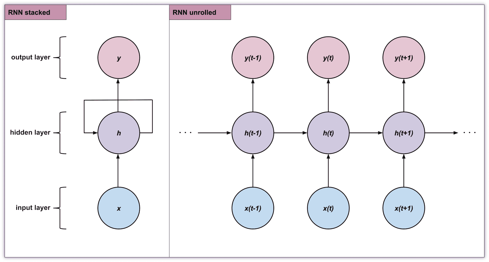
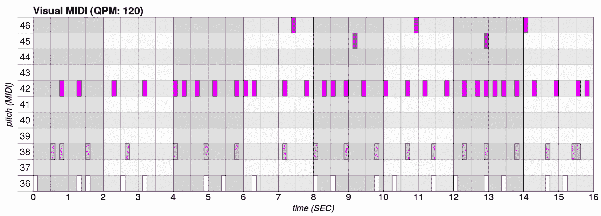
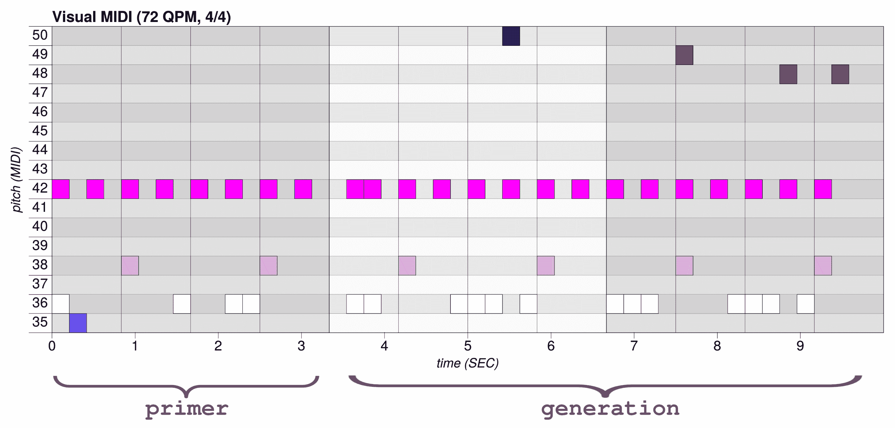
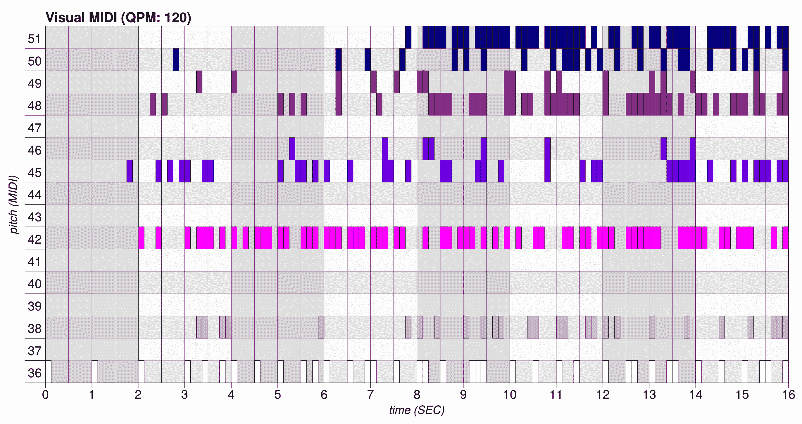
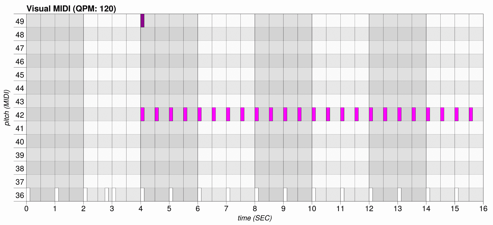
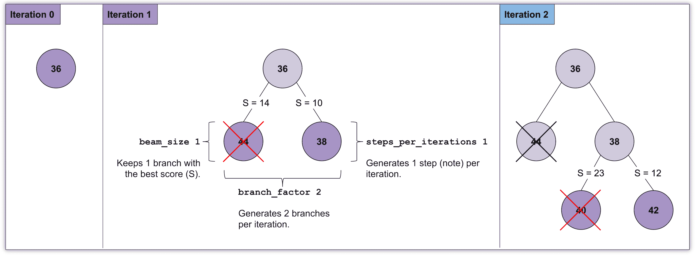
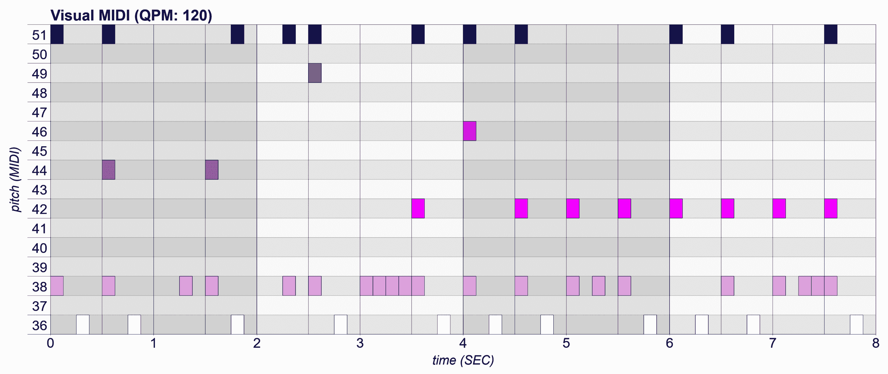
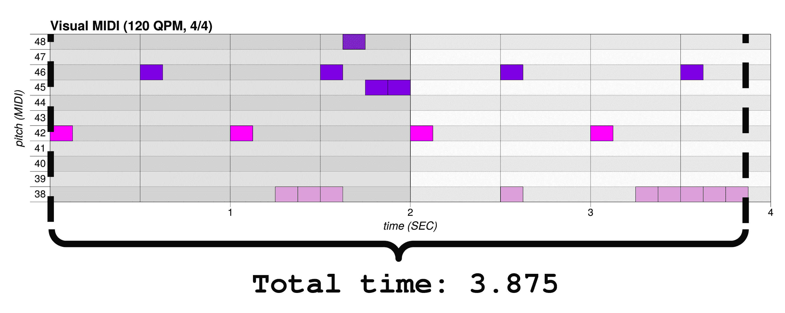

# 使用 Drums RNN 生成鼓序列

在这一章中，你将学习到许多人认为音乐的基础——打击乐。我们将展示**递归神经网络**（**RNNs**）在音乐生成中的重要性。然后，你将学习如何使用预训练的鼓套件模型，调用它在命令行窗口中以及直接在 Python 中使用 Drums RNN 模型，来生成鼓序列。我们将介绍不同的模型参数，包括模型的 MIDI 编码，并展示如何解读模型的输出。

本章将涵盖以下主题：

+   RNN 在音乐生成中的重要性

+   在命令行中使用 Drums RNN

+   在 Python 中使用 Drums RNN

# 技术要求

在本章中，我们将使用以下工具：

+   使用**命令行**或**bash**从终端启动 Magenta

+   使用**Python**及其库来编写使用 Magenta 生成音乐的代码

+   使用**Magenta**生成 MIDI 格式的音乐

+   使用**MuseScore**或**FluidSynth**来听生成的 MIDI

在 Magenta 中，我们将使用**Drums RNN**模型。我们将深入解释这个模型，但如果你觉得需要更多信息，Magenta 源代码中的模型 README（[github.com/tensorflow/magenta/tree/master/magenta/models/drums_rnn](https://github.com/tensorflow/magenta/tree/master/magenta/models/drums_rnn)）是一个很好的起点。你也可以查看 Magenta 的 GitHub 代码，它有很好的文档。我们还在最后一节提供了额外的内容，*进一步阅读*。

本章的代码位于本书的 GitHub 仓库中的`Chapter02`文件夹，位置在[github.com/PacktPublishing/hands-on-music-generation-with-magenta/tree/master/Chapter02](https://github.com/PacktPublishing/hands-on-music-generation-with-magenta/tree/master/Chapter02)。对于本章，你应该在命令行窗口中运行`cd Chapter02`，然后再开始。

查看以下视频，查看代码如何运作：

[`bit.ly/37G0mmW`](http://bit.ly/37G0mmW)

# RNN 在音乐生成中的重要性

特定的神经网络架构是为特定问题设计的。这并不意味着某一种架构比另一种更好——它只是更适合某一特定任务。

在这一节中，我们将关注我们特定的问题——生成音乐，并了解为什么 RNN 非常适合这项任务。在本书中，我们将通过每一章介绍特定的概念，逐步构建关于音乐的神经网络架构的知识。

对于音乐生成，我们关注的是 RNN 解决的两个具体问题——在输入和输出方面处理序列，以及保持过去事件的内部状态。让我们来看看这些特性。

音乐谱预测类似于生成音乐。通过预测输入序列中的下一个音符，你可以通过在每次迭代中选择预测来逐步生成一个新的序列。这个过程在本章的*理解生成算法*部分进行了描述。

# 操作一个向量序列

在许多神经网络架构中，**输入大小**和**输出大小**是固定的。以**卷积神经网络**（**CNN**）为例。该神经网络可用于图像分类，输入是表示图像的像素数组，输出则是每个类别集的预测（例如，“猫”，“狗”等）。请注意，输入和输出的大小是固定的。

RNN 的优点在于输入和输出的大小可以是任意长度。对于音乐谱预测网络，输入可以是一个任意长度的音符序列，输出则是基于该输入的预测音符序列。

这在 RNN 中是可能的，因为它是基于**序列**向量进行操作的。表示 RNN 类型的方式有很多：

+   **一**-**对**-**一**：在这里，有固定输入和输出；一个例子是图像分类。

+   **一**-**对**-**多**：在这里，有固定输入到序列输出；一个例子是图像标注，其中网络会基于图像内容生成文本。

+   **多**-**对**-**一**：在这里，有序列输入到固定输出；一个例子是情感分析，其中网络会输出一个描述输入句子的单一词汇（情感）。

+   **多**-**对**-**多**：在这里，有序列输入到序列输出；一个例子是语言翻译，其中网络会根据另一种语言的完整句子输出一种语言的完整句子。

表示 RNN 的经典方式如下图所示。在图表的左侧，你可以看到网络的简洁表示——隐藏层输出馈送到自身。在右侧，你可以看到相同网络的详细表示——在每一步，隐藏层接收输入和前一个状态，并产生输出：



图表的底部行展示了输入向量，中间行展示了隐藏层，顶部行展示了输出层。这个表示展示了 RNN 如何表示多对多输入输出，如下所示：

+   输入的向量序列：*{ ..., x(t - 1), x(t), x(t + 1), ... }*

+   输出的向量序列：*{ ..., y(t - 1), y(t), y(t + 1), ... }*

# 记住过去，以便更好地预测未来

正如我们在前一部分所看到的，在 RNN 中，输入向量与其状态向量结合，产生输出，并用于更新下一个步骤的状态向量。这与卷积神经网络（CNN）等前馈神经网络不同，后者是将信息从输入传递到输出，并且只在那个方向上进行传播，意味着输出仅仅是输入的函数，而不是前一个事件的结果。

让我们来看一下如何定义一个简单的 RNN。我们实现一个单一操作，`step` 操作，该操作接受一个输入向量 `x`，并返回一个输出向量 `y`。每次调用 `step` 操作时，RNN 需要更新其状态，即隐向量 `h`。

需要注意的是，我们可以**堆叠**任意数量的 RNN，通过将一个 RNN 的输出作为下一个 RNN 的输入，就像前面的图示所示。例如，我们可以这样操作：`y1 = rnn1.step(x1)`，`y2 = rnn2.step(y1)`，依此类推。

在训练 RNN 时，在前向传播过程中，我们需要更新状态，计算输出向量，并更新损失。那么我们如何更新状态呢？让我们看看需要遵循的步骤：

1.  首先，我们进行隐状态矩阵（`Whh`）与前一个隐状态（`hs[t-1]`）的矩阵乘法，即`np.dot(Whh, hs[t-1])`。

1.  然后，我们将其与当前输入矩阵（`Wxh`）和输入向量（`xs[t]`）的矩阵乘法相加，即`np.dot(Wxh, xs[t])`。

1.  最后，我们对结果矩阵使用 `tanh` 激活函数，将激活值限制在 -1 到 1 之间。

我们在每一步都进行更新，这意味着，在训练的每一步，网络都能保持**最新的**上下文信息，以应对它正在处理的序列。

为了理解 RNN 如何处理序列数据，例如音符序列，我们以 RNN 在断开和弦上的训练为例，断开和弦是将和弦分解成一系列音符。我们有输入数据 "A"、"C"、"E" 和 "G"，它们被编码为向量，例如，第一个音符的编码是 *[1, 0, 0, 0]*（对应于前图中的`x(t - 1)`），第二个音符的编码是 *[0, 1, 0, 0]*（对应于前图中的`x(t)`），依此类推。

在第一步中，使用第一个输入向量时，RNN 输出的结果是，例如，"A"的下一个音符的置信度为 0.5，"C"为 1.8，"E"为-2.5，"G"为 3.1。由于我们的训练数据告诉我们，正确的下一个音符是"C"，所以我们希望增加 1.8 的置信度，并减少其他音符的置信度。类似地，对于每一步（对于四个输入音符），我们都有一个正确的音符需要预测。记住，在每一步中，RNN 都会使用隐向量和输入向量来进行预测。在反向传播过程中，参数会通过一个小的调整被推向正确的方向，经过多次重复训练后，我们得到的预测将与训练数据匹配。

在推理过程中，如果网络第一次接收到输入“C”，它不一定会预测“E”，因为它还没有看到“A”，这与用于训练模型的示例和弦不符。RNN 的预测基于其**递归连接**，该连接跟踪上下文，而不仅仅依赖于输入。

要从训练好的 RNN 中进行采样，我们将一个音符输入到网络中，网络会输出下一个音符的分布。通过**从分布中采样**，我们得到一个可能的下一个音符，然后可以将其反馈回网络。我们可以重复这个过程，直到生成足够长的序列。这个生成过程将在下一节中详细描述，*理解生成算法*。

在反向传播中，我们看到我们在网络中向后更新参数。假设网络正在学习一个很长的音符序列：梯度能在网络中反向传播多远，以便序列中很远的音符与序列开头的音符之间的联系仍然成立？事实证明，这是传统 RNN 的一个难题。为此，有一个答案是**长短期记忆**（**LSTM**）单元，它使用一种不同的机制来保持当前状态。

# 使用正确的 RNN 术语

现在我们已经理解了 RNN，我们可以说大多数 RNN 都使用 LSTM 单元。这些 RNN 有时被称为**LSTM 网络**，但更常见的是直接称其为 RNN。不幸的是，这两个术语经常互换使用。在 Magenta 中，所有的 RNN 都是 LSTM，但并没有专门以此命名。这就是我们在本章中所看到的鼓乐 RNN 模型以及接下来章节中我们将使用的所有模型的情况。

我们将在第三章中解释 LSTM，即*生成多声部旋律*。现在，只需要记住我们在前一部分所看到的内容仍然成立，但隐藏状态的更新比我们之前描述的要复杂。

# 在命令行中使用鼓乐 RNN

现在我们已经了解了 RNN 如何成为强大的音乐生成工具，我们将使用鼓乐 RNN 模型来实现这一点。Magenta 中的预训练模型是直接开始音乐生成的好方法。对于鼓乐 RNN 模型，我们将使用`drum_kit`预训练包，它是基于成千上万的打击乐 MIDI 文件训练的。

本节将深入讲解如何在命令行中使用 Magenta。我们主要使用 Python 代码来调用 Magenta，但使用命令行有一些优势：

+   它使用简单，适合快速使用的场景。

+   它不需要编写任何代码或具备编程知识。

+   它将参数封装在有用的命令和标志中。

在本节中，我们将使用命令行中的鼓乐 RNN 模型，并学习通过标志来配置生成过程。我们将解释生成算法如何工作，并查看其参数和输出。

# Magenta 的命令行工具

Magenta 配备了多个命令行工具。这些命令行工具是可以直接从命令行调用的 Python 脚本，作为控制台入口点，并在安装 Magenta 时被安装到你的 Conda 环境中（如果使用 Windows，请查看 Magenta 环境中的`bin`文件夹或`scripts`文件夹）。命令行工具的完整列表位于 Magenta 源代码中的`setup.py`文件内的`CONSOLE_SCRIPTS`部分。

你可以随时查看 Magenta 的源代码并进行浏览。刚开始可能会觉得有些令人生畏，但源代码有很好的文档，并提供了关于软件内部工作原理的宝贵洞察。使用 Git，执行`git clone https://github.com/tensorflow/magenta`命令，并在你喜欢的 IDE 中打开该仓库。拥有源代码的另一个优势是，可以查看某些未打包在应用程序中的文件。

对于我们将使用的鼓 RNN 模型，我们有三个命令行工具（就像大多数模型一样）：

+   `drums_rnn_create_dataset` 将帮助创建训练命令所需的数据集。我们将在第六章，*训练数据准备*中进一步探讨这个命令。

+   `drums_rnn_generate` 将在本章中用于生成乐谱。

+   `drums_rnn_train` 将在输入数据集上训练模型。我们将在第七章，*训练 Magenta 模型*中进一步探讨这个命令。

# 生成一个简单的鼓序列

在上一章，我们生成了一个简单的 MIDI 文件来测试我们的安装。我们将使用这个示例并稍作修改。

在开始之前，返回终端到主书籍文件夹，然后切换到`Chapter02`目录。确保你在 Magenta 环境中。如果不是，请使用`conda activate magenta`来激活环境：

1.  首先，我们下载鼓 RNN 捆绑文件`drum_kit_rnn.mag`，并将其放入`bundles`文件夹。你只需执行一次此操作：

```py
> curl --output bundles/drum_kit_rnn.mag http://download.magenta.tensorflow.org/models/drum_kit_rnn.mag
```

捆绑文件是包含模型检查点和元数据的文件。这是一个预训练模型，包含来自训练阶段的权重，将用于初始化 RNN 网络。我们将在第七章，*训练 Magenta 模型*中详细介绍这种格式。

1.  然后，我们可以使用捆绑文件通过`--output-dir`生成 MIDI 文件到输出目录：

```py
> drums_rnn_generate --bundle_file=bundles/drum_kit_rnn.mag --output_dir output
```

1.  打开`output`文件夹中生成的一个文件，在 MuseScore 或 Visual MIDI 中查看。对于后者，你需要将 MIDI 文件转换为图表，并渲染为 HTML 文件，然后可以在浏览器中打开。要将 MIDI 文件转换为图表，使用以下命令：

```py
# Replace GENERATED by the name of the file
> visual_midi "output/GENERATED.mid"
```

1.  然后，打开`output/GENERATED.html` HTML 文件，其中包含图表：



1.  要聆听生成的 MIDI，可以使用你的软件合成器或 MuseScore。对于软件合成器，根据你的平台使用以下命令，并将 `PATH_TO_SF2` 和 `PATH_TO_MIDI` 替换为正确的值：

    +   Linux: `fluidsynth -a pulseaudio -g 1 -n -i PATH_TO_SF2 PATH_TO_MIDI`

    +   macOS: `fluidsynth -a coreaudio -g 1 -n -i PATH_TO_SF2 PATH_TO_MIDI`

    +   Windows: `fluidsynth -g 1 -n -i PATH_TO_SF2 PATH_TO_MIDI`

# 理解模型的参数

从上一节的截图中，你已经可以看到模型使用了一些默认配置来生成乐谱：生成的步数、节奏等等。现在，让我们看看还有哪些其他标志是可用的。要查看模型支持的标志，请使用 `--helpfull` 标志：

```py
> drums_rnn_generate --helpfull

    USAGE: drums_rnn_generate [flags]
    ...

magenta.models.drums_rnn.drums_rnn_config_flags:
    ...

magenta.models.drums_rnn.drums_rnn_generate:
    ...
```

你将看到许多可能的标志。我们感兴趣的部分是 `drums_rnn_config_flags` 和 `drums_rnn_generate`，这些标志是针对 Drums RNN 模型的特定标志。

以下小节将解释最重要的部分。因为大多数内容也适用于其他模型，所以你可以将学到的内容应用到接下来的章节中。我们会在后续章节中根据需要解释其他模型特定的标志。

# 更改输出大小

更改生成样本数量的一个简单标志是 `--num_outputs`：

```py
--num_outputs: The number of drum tracks to generate. One MIDI file will be created for each. (default: '10')
```

你还可以使用 `--num_steps` 标志来更改生成样本的大小：

```py
--num_steps: The total number of steps the generated drum tracks should be, priming drum track length + generated steps. Each step is a 16th of a bar. (default: '128')
```

我们生成的最后一个例子有 128 步长，因为我们使用默认值生成它。从之前的截图中，你可以数出竖条线的数量，共计 8 bars。这是因为，128 步，每 bar 16 步，得到 *128/16 = 8* bars。如果你想生成 1 bar，你需要请求 16 步，例如。你可以将单个步骤视为一个音符插槽，因为生成器每个步骤最多生成一个音符。这是一种方便的时间划分方式。

本书将使用术语 **bar**，这是英国英语中更为常用的词，但读者可能更习惯使用 **measure**，这是美国英语中更常见的说法。两者在使用上有一些差异，具体取决于上下文，可能会有一个词使用得更多。不过，两者主要具有相同的含义。

本书始终使用 bar 的主要原因是遵循 Magenta 的代码约定，在该约定中，bar 的使用比 measure 更为一致。

我们可以通过放大之前例子的最后两 bars 来展示步骤：


你可以在这个图示中看到，有 2 个小节，每个小节为 2 秒（参见下一节获取节奏信息），每个小节都有不同的背景。你还可以看到每个小节有 16 步长；我们已用不同的背景标记了其中的一步。如果模型是多音的（如鼓 RNN 模型），则每个步长可以包含多个音符。根据模型的不同，一个音符可能会产生多个步长，但这里并非如此。对于这个模型，音符总是会在步长的开始和结束时准确起止，因为模型输出的是量化的序列。

# 更改节奏

节奏是乐谱播放的速度。请注意，它不会改变音符的数量或生成时长——它只会将信息写入生成的 MIDI 中，以便 MIDI 播放器能够以正确的速度播放。

Magenta 中的节奏以 **每分钟四分音符数**（**QPM**）表示。**四分音符**是一个小节划分为四个——如果你有 16 步长的小节，那么四分音符就包含 4 步。因此，如果你的节奏是 120 QPM，那么你每秒播放 *120 四分音符/60 秒 = 2* 四分音符。这意味着每 2 秒播放 1 小节（参考之前的图示）。

QPM 是一种与**BPM**（**每分钟拍数**）相似但不应混淆的节奏度量，因为在后者中，拍子的意义可能会随着某些节拍类型而改变。此外，拍子的概念可能会根据听众的不同而有所变化。QPM 在 MIDI 和 MusicXML 格式中得到了明确定义和使用。

要更改节奏，请使用 `--qpm` 标志：

```py
--qpm: The quarters per minute to play generated output at. If a primer MIDI is given, the qpm from that will override this flag. (default: '120')
```

在以下图示中，我们使用 `--qpm 150` 生成了一个 150 QPM 的鼓文件：


你可以看到小节不再与 2 秒、4 秒等对齐。这是因为在 120 QPM 下，一个小节正好是 2 秒长，但现在稍微短了一点。我们生成的样本仍然有 `--num_steps 128`，但现在时长为 12.8 秒（仍然是 8 小节），因为我们仍然有相同数量的步长——它们只是以更快的速度播放。

要找到特定 QPM（如 150）序列的时长（秒），我们首先计算每步长的时长（秒）。方法是将一分钟的秒数（60）除以 QPM（150），再除以每四分音符的步长数（4）。这样我们得到每步长 0.1 秒。对于 128 步长，序列的时长为 12.8 秒。

# 更改模型类型

`--config` 标志改变模型的配置。每个 Magenta 配置都附带一个预训练的模型。在本章节中，我们使用 `drum_kit_rnn.mag` 预训练模型（或模型包）作为 `drum_kit` 配置。选择的预训练模型必须与其训练时的配置匹配：

```py
--config: Which config to use. Must be one of 'one_drum' or 'drum_kit'. (default: 'drum_kit')
```

现在这对我们没有用处，但在第三章，*生成复调旋律*时它将派上用场。这还会改变鼓点的映射，其中生成的编码向量在两种情况下是不同的。当我们查看 Python 代码时，我们将在下一节讨论向量编码。

# 用 Led Zeppelin 来引导模型

可以给模型提供一个引导序列，以在生成之前**准备**它。这在 Magenta 中被广泛使用，如果你希望模型生成一些受到你提供的引导启发的内容，这非常有用。你可以用硬编码的序列或者直接从 MIDI 文件中引导模型。引导序列在生成开始前被输入到模型中。

`--primer_drums`标志的字符串表示如下：你输入一系列元组，每个元组对应一个步骤，每个元组包含在同一时刻播放的 MIDI 音符。在这个例子中，在第一步中，MIDI 音符 36 和 42 同时播放，接着是 3 步的静默，然后 MIDI 音符 42 单独在其自己的步骤中播放：

```py
--primer_drums: A string representation of a Python list of tuples containing drum pitch values. For example: "[(36,42),(),(),(),(42,),(),(),()]". If specified, this drum track will be used as the priming drum track. If a priming drum track is not specified, drum tracks will be generated from scratch. (default: ''
```

正如你可能还记得从上一章，MIDI 音符也有音量信息，但这里没有给出。因为 Drums RNN 不支持音量，所以这不是必需的。每个生成的音符会默认音量值为 100（最大值为 127）。

Magenta 中的一些模型支持音量（velocity），正如我们在接下来的章节中将看到的那样。由于音量必须被编码到在训练过程中输入到网络的向量中，因此是否包含它们是一个设计选择。我们也将在接下来的章节中讨论编码问题。

要提供一个与小节对应的引导序列，你需要提供 16 个元组，因为每小节有 16 步。之前的引导序列只有半小节长。

你也可以使用`--primer_midi`标志提供一个 MIDI 文件的路径：

```py
--primer_midi: The path to a MIDI file containing a drum track that will  be used as a priming drum track. If a primer drum track is not specified, drum tracks will be generated from scratch. (default: '')
```

引导的 MIDI 文件会提供节奏，如果你同时提供`--qpm`标志，它将覆盖该标志。

当使用引导初始化模型时，你还会在生成的输出序列中看到引导序列。这意味着`--num_steps`需要大于引导的长度，否则 Magenta 就没有足够的空间来生成。例如，下面的命令会报错，因为步数不足：

```py
> drums_rnn_generate --bundle_file=bundles/drum_kit_rnn.mag --output_dir=output --primer_drums="[(36,),(36,),(36,),(36,)]" --num_steps=4
```

这会生成以下输出：

```py
CRITICAL - Priming sequence is longer than the total number of steps requested: Priming sequence length: 0.625, Generation length requested: 0.62
```

让我们生成一些基于 Jon Bonham（Led Zeppelin）*When The Levee Breaks*曲目的小鼓部分的内容。这里是一个两小节的引导序列：


然后，我们通过设置引导序列、温度和适当的步数来生成一些 MIDI 文件。记住，步数是总步数，包括引导部分：

```py
drums_rnn_generate --bundle_file bundles/drum_kit_rnn.mag --output_dir output --num_steps 46 --primer_midi primers/When_The_Levee_Breaks_Led_Zeppelin.mid --temperature 1.1
```

我们得到了一个有趣的序列，如下图所示：



你仍然可以在大约前 3 秒钟内找到前导音符，然后我们注意到模型保留了轨道的音乐结构，但在此基础上进行即兴创作，加入了几次低音鼓、镲片和小军鼓的音效。我们将在下一节中讨论打击乐序列的 MIDI 映射，包括每个音高与对应乐器的映射，*将 MIDI 音符映射到现实世界*。

现在，我们验证 Magenta 是否知道如何计数：你有 16 步前导音符，1 步静音，然后是 29 步生成，总共 46 步，这是我们要求的。静音步长来自 Magenta 生成起始的方式。我们将在 Python 代码中看到如何更好地处理这一点。

我们还注意到，前导音符在生成的乐谱中的音符时值不同。你可以看到相同的前导音符存在，但时长不同。这是因为 Magenta 会**在将前导音符输入到模型之前进行量化**，并生成量化后的序列。这取决于模型。**量化**是指将音符的开始和结束时间调整到某些小节的子分割点上。在这种情况下，Magenta 将音符的结束位置调整到最接近的步骤上。

# 配置生成算法

`--temperature`标志非常重要，因为它决定了生成序列的随机性：

```py
--temperature: The randomness of the generated drum tracks. 1.0 uses the unaltered softmax probabilities, greater than 1.0 makes tracks more random, less than 1.0 makes tracks less random. (default: '1.0')
```

让我们尝试使用`--temperature 1.5`生成一个更具随机性的鼓点轨道：



这真是太疯狂了！记住，温度为 1.5 时比较高，因此你可以选择一个更保守的值，比如 1.1，来生成一个更加一致的样本。

现在，要生成一个随机性较小的轨道，使用`--temperature 0.9`：



你可以明显看到，这里的生成结果更加保守。选择温度值取决于个人口味，并且与你想要实现的效果有关。尝试不同的温度值，看看哪些最适合你想要生成的音乐。此外，一些模型可能在较为极端的温度值下效果更好。

# 其他 Magenta 和 TensorFlow 的标志

还有一些我们没有提到的标志，比如用`--hparams`配置模型的超参数，但我们会在第七章《训练 Magenta 模型》中讨论这些内容，*训练 Magenta 模型*。

# 理解生成算法

在前面的章节中，我们介绍了生成算法的工作原理——通过在每个生成步骤中预测序列中的下一个音符，我们可以迭代地生成完整的乐谱。生成的预测结果取决于模型在训练阶段学到的内容。本节将通过逐步执行的示例深入探讨生成算法的运作。

我们还将解释一些修改生成执行过程的参数：

```py
--beam_size: The beam size to use for beam search when generating drum tracks. (default: '1')
--branch_factor: The branch factor to use for beam search when generating drum tracks. (default: '1')
--steps_per_iteration: The number of steps to take per beam search iteration. (default: '1')
```

# 生成序列分支和步骤

让我们使用这个命令来启动生成：

```py
drums_rnn_generate --bundle_file=bundles/drum_kit_rnn.mag --output_dir=output --temperature 1.1 --beam_size 1 --branch_factor 2 --steps_per_iteration 1 --num_steps 64
```

Magenta 将执行以下操作：

1.  它将启动器序列转换为模型能够理解的格式（这称为 **编码**——请参阅 *将打击乐事件编码为类别* 部分）。

1.  它使用该编码的启动器来初始化模型状态。

1.  它会循环直到生成所有步骤（`--num_steps 64`）：

    1.  它会循环生成 *N* 个分支（`--branch_factor 2`）：

        1.  它通过使用 **温度**（`--temperature 1.1`）运行模型及其当前状态，生成 *X* 步（`--steps_per_iterations 1`）。这会返回预测的序列以及结果的 **softmax 概率**。softmax 概率是每个类别（即编码音符）在网络最后一层的实际概率分数。

        1.  它计算结果序列的 **负对数似然值**，这是从 softmax 概率中得出的整个序列的评分评估。

        1.  它更新模型状态以便进行下一次迭代。

    1.  它通过使用计算得分来修剪生成的分支，保留最佳的 *K* 个分支（`--beam_size 1`）。

该图展示了生成过程，最终序列为 **36**、**38** 和 **42**：



在图中，**S** 值表示整个序列的计算得分（见 *步骤 3.1.2* 和 *3.2*）。这里展示的束搜索算法在输出序列长度（即树的深度）上的复杂度是线性的，因此它相当快速。`--beam_size 1` 的默认值是有用的，因为该算法变成了一个最佳优先搜索算法，你实际上并没有进行广度优先搜索，因为你只保留最好的候选。

# 理解随机性

当我们启动一个使用束搜索（beam search）的生成时，Magenta 会显示整个序列的对数似然值：

```py
Beam search yields sequence with log-likelihood: -16.006279
```

如果使用 `--temperature 1.25` 而不是 1.1 会发生什么？对数似然值会更小（远离零），因为生成过程更具随机性：

```py
Beam search yields sequence with log-likelihood: -57.161125
```

如果我们只生成 1 个分支，使用 `--branch_factor 1` 但保持温度为 1.25，会发生什么？对数似然值会更小：

```py
Beam search yields sequence with log-likelihood: -140.033295
```

为什么对数似然值更小？因为我们减少了分支因子，算法每次迭代生成的分支会更少，这意味着每次迭代中可供选择的分支更少，从而导致全局上序列更随机。

现在，让我们利用我们学到的 Drums RNN 模型的知识，创建一个使用这些概念的小型 Python 应用程序。

# 在 Python 中使用 Drums RNN

在前一节中，我们已经看到我们可以通过命令行使用 Drums RNN 模型做多少事情。在本节中，你将创建一个小应用程序，使用该模型在 Python 中生成音乐。

在 Python 中使用 Magenta 有些困难，原因如下：

+   它要求你编写代码并理解 Magenta 的架构。

+   它需要更多的样板代码，且不那么直观。

但它也有我们认为很重要的优点：

+   你在使用模型时有更多的自由度。

+   你可以创建新的模型并修改现有的模型。

+   你可以超越生成单一的序列。

最后一项对我们很重要，因为我们将构建一个小型的音乐应用程序，该应用能够自主生成音乐。在命令行上调用 Magenta 的脚本非常方便，但仅凭这一点无法构建应用程序。你将在本章最后一节*创建音乐生成应用*中开始这个工作，并在后续章节中继续扩展它。

让我们通过重现我们在命令行中做的操作来深入了解代码，然后再从这里开始构建。

# 使用 Python 生成鼓序列

我们将使用 Python 从引导生成一个 MIDI 文件，就像我们在上一节做的那样。

你可以在本章的源代码中的 `chapter_02_example_01.py` 文件中查看这个示例。源代码中有更多的注释和内容，你应该去看看。

1.  让我们首先下载捆绑包。`magenta.music` 包中有很多有用的工具，我们将在许多示例中使用它：

```py
import os
import magenta.music as mm

mm.notebook_utils.download_bundle("drum_kit_rnn.mag", "bundles")
bundle = mm.sequence_generator_bundle.read_bundle_file(
 os.path.join("bundles", "drum_kit_rnn.mag"))
```

1.  然后，我们使用鼓组生成器来初始化生成器类，并使用`drum_kit`配置。我们从自己的包中导入了鼓 RNN 模型，接下来我们会对每个模型做同样的操作：

```py
from magenta.models.drums_rnn import drums_rnn_sequence_generator

generator_map = drums_rnn_sequence_generator.get_generator_map()
generator = generator_map"drum_kit"
generator.initialize()
```

1.  通过声明节奏，我们还可以计算小节的长度（单位为秒）。我们需要这个值，因为生成的开始和结束时间是以秒为单位传递给 Magenta 的。

我们首先计算每步的秒数，这等于一分钟的秒数除以每分钟的四分音符数（即节奏），再除以每四分音符的步数。这个值依赖于生成器，但通常等于 4：

```py
from magenta.music import constants

qpm = 120
seconds_per_step = 60.0 / qpm / generator.steps_per_quarter
```

1.  接着，我们计算每小节的秒数，这等于每小节的步数乘以我们之前计算的每步的秒数。每小节的步数根据拍号有所不同，但目前我们将使用默认值 16，用于以每四分音符四步采样的 4/4 拍音乐：

```py
num_steps_per_bar = constants.DEFAULT_STEPS_PER_BAR
seconds_per_bar = num_steps_per_bar * seconds_per_step

print("Seconds per step: " + str(seconds_per_step))
print("Seconds per bar: " + str(seconds_per_bar))
```

1.  我们现在准备初始化我们的引导序列。我们将使用一个简单的 1 小节爵士鼓序列作为引导（你可以在本书的源代码中，`Chapter02` 文件夹中的 `primers/Jazz_Drum_Basic_1_bar.mid` 文件中查看），因此我们需要一个包含 16 个步骤的列表。引导定义将在下一节解释。

我们将已经定义的 QPM 用来将该引导鼓轨道转换为引导序列：

```py
primer_drums = mm.DrumTrack(
 [frozenset(pitches) for pitches in
   [(38, 51),     (), (36,),    (),
    (38, 44, 51), (), (36,),    (),
    (),           (), (38,),    (),
    (38, 44),     (), (36, 51), (),]])
primer_sequence = primer_drums.to_sequence(qpm=qpm)
```

1.  我们可以计算引导的时长（单位为秒），因为引导只有 1 小节，所以它的时长仅等于每小节的秒数：

```py
primer_start_time = 0
primer_end_time = primer_start_time + seconds_per_bar
```

1.  我们现在计算生成器部分的开始和结束时间。首先，我们定义生成的节拍数为 3，然后从引导的结束开始生成，并在秒数上扩展三小节的时长：

```py
num_bars = 3
generation_start_time = primer_end_time
generation_end_time = generation_start_time + (seconds_per_bar * num_bars)

print("Primer start and end: [" + str(primer_start_time) + ", " 
 + str(primer_end_time) + "]")
print("Generation start and end: [" + str(generation_start_time) + ", " 
 + str(generation_end_time) + "]")
```

1.  现在我们可以使用开始和结束时间来配置我们的生成器选项。生成选项还包含温度，我们将其设置为 1.1，以增加一些随机性。生成器接口对于所有模型都是通用的：

```py
from magenta.protobuf import generator_pb2

generator_options = generator_pb2.GeneratorOptions()
generator_options.args['temperature'].float_value = 1.1
generator_options.generate_sections.add(
 start_time=generation_start_time,
 end_time=generation_end_time)
```

1.  现在是生成的时候了！你现在可以使用初始序列作为输入来调用生成器的生成方法。该方法的返回值是一个`NoteSequence`实例：

```py
sequence = generator.generate(primer_sequence, generator_options)
```

1.  有许多工具可以将生成的`NoteSequence`实例转换为其他格式，如 PrettyMidi。我们现在将转换结果，并将文件和图表写入磁盘：

```py
from visual_midi import Plotter

# Write the resulting midi file to the output directory
midi_file = os.path.join("output", "out.mid")
mm.midi_io.note_sequence_to_midi_file(sequence, midi_file)
print("Generated midi file: " + str(os.path.abspath(midi_file)))

# Write the resulting plot file to the output directory
from visual_midi import Plotter
plot_file = os.path.join("output", "out.html")
print("Generated plot file: " + str(os.path.abspath(plot_file)))
pretty_midi = mm.midi_io.note_sequence_to_pretty_midi(sequence)
plotter = Plotter()
plotter.show(pretty_midi, plot_file)
```

1.  让我们打开`output/out.html`文件：



请注意，你的初始序列应该保持不变（因为它是硬编码的），但你生成的 3 个小节应该与这些不同。

1.  要听生成的 MIDI，请使用你的软件合成器或 MuseScore。对于软件合成器，请根据你的平台使用以下命令，并将`PATH_TO_SF2`和`PATH_TO_MIDI`替换为正确的值：

    +   Linux: `fluidsynth -a pulseaudio -g 1 -n -i PATH_TO_SF2 PATH_TO_MIDI`

    +   macOS: `fluidsynth -a coreaudio -g 1 -n -i PATH_TO_SF2 PATH_TO_MIDI`

    +   Windows: `fluidsynth -g 1 -n -i PATH_TO_SF2 PATH_TO_MIDI`

# 将检查点打包为捆绑文件

在上一个示例中，我们看到了捆绑文件的使用。在 Magenta 中，捆绑文件是一种方便的方式，用于将**TensorFlow 检查点**和元数据打包成一个单独的文件。检查点用于 TensorFlow 中保存训练过程中模型的状态，使得稍后能够轻松地重新加载模型状态。

捆绑文件的另一个好处是，它为多个生成器定义了一个**通用接口**。你可以查看 Magenta 源代码中的`generator.proto`文件，该文件位于`magenta/protobuf`文件夹中，定义了该接口，包括生成器的`id`和`description`，以及生成器选项，如我们将在许多示例中使用的`generate_sections`，它用来提供生成长度。

这个通用接口涵盖了许多模型，包括第二章和第三章中的所有模型。遗憾的是，第四章的 MusicVAE 模型没有使用捆绑文件，但我们将在第七章 *训练 Magenta 模型*中看到更多的捆绑文件。

# 使用 Protobuf 对 MIDI 进行编码在 NoteSequence 中

在上一个示例中，我们看到了一个名为**`NoteSequence`**的类的使用，这是 Magenta 中的一个重要部分，因为每个处理乐谱的模型都会使用它来表示一系列 MIDI 音符。`NoteSequence`和`GeneratorOptions`是 Protobuf（协议缓冲区）的一部分，Protobuf 是一种语言中立、平台中立的可扩展机制，用于序列化结构化数据。在 Magenta 的源代码中，你可以在`magenta/protobuf/music.proto`文件中看到`NoteSequence`的消息定义。

`NoteSequence`的定义基于 MIDI 消息内容，因此你会看到以下内容：

+   一个`TimeSignature`变化的列表：根据 MIDI 标准，默认假设为 4/4。

+   一个`KeySignature`变化的列表：根据 MIDI 标准，默认假设为 C 大调。

+   一个`Tempo`变化的列表：根据 MIDI 标准，默认假设为 120 QPM。

+   一个`Note`变化的列表。

还有更多内容，包括注释、量化信息、音高弯曲和控制变化，但在本书中我们不会深入探讨这些内容。

`Note`列表是我们主要使用的，它包含了`pitch`（即 MIDI 音符，基于 MIDI 音准标准）、`start_time`和`end_time`属性，表示一个音符。

将`NoteSequence`转换为其他格式以及从其他格式转换为`NoteSequence`非常重要。在前面的示例中，我们使用了以下函数：

+   `magenta.music.midi_io.note_sequence_to_midi_file`：用于将音符序列转换为 MIDI 文件。你也可以转换为`PrettyMIDI`，这是一种在内存中编辑 MIDI 的有用格式。

+   `magenta.music.midi_io.midi_file_to_note_sequence`：用于将 MIDI 文件转换为音符序列；在我们之前的示例中，这会非常有用。我们本可以使用`midi_file_to_note_sequence("primers/Jazz_Drum_Basic_1_bar.mid")`，而不是在 Python 代码中硬编码引导。

关于`NoteSequence`的另一个重要点是，它并没有明确地定义开始和结束；它只是假定从第一个音符的开始开始，到最后一个音符的结束结束。换句话说，不能定义以静音开始或结束的序列。

在下图中，预计序列为 2 小节，共 32 步，但在第 31 步时停止，这意味着最后一个音符的结束时间是 3.875 秒，而不是 4 秒：



将这个序列与另一个序列连接可能会导致意外的结果序列长度。幸运的是，处理音符序列的方法有选项可以确保这正常工作。

# 将 MIDI 音符映射到现实世界。

在前面的示例中，我们展示了以下的 1 小节引导，但我们并没有解释这些音高对应的内容：

```py
[(38, 51),     (), (36),     (),
 (38, 44, 51), (), (36),     (),
 (),           (), (38),     (),
 (38, 44),     (), (36, 51), (),]
```

我们不会详细讲解 MIDI 规范，因为它非常庞大（你可以在[www.midi.org/specifications](https://www.midi.org/specifications)查看），但我们会关注与本书相关的部分。有两个规范对我们来说非常有趣：

+   **MIDI 规范**定义了不同乐器之间的低级通信和编码协议。

    +   **通用 MIDI 规范**（**GM**）定义了一个更高级别的协议，规定了符合要求的乐器标准，并指定了乐器的声音。

2019 年 1 月标志着 MIDI 规范自 1983 年标准化以来的第一次重大更新，发布了 MIDI 2.0 规范。这是在超过 25 年的使用后，数百万设备和用户使用的成果。

MIDI 2.0 引入了更高的分辨率值，精度为 16 位而非 7 位，并增加了 MIDI 能力查询功能，使得工具之间的集成更加顺畅。MIDI 的新版本与旧版本完全向后兼容。

乐器声音定义对我们来说很有趣，我们将研究**GM 1 音色集**规范，它定义了每个 MIDI 音符应该播放的声音。在 GM 1 音色集中，每个 MIDI 程序变化（PC#）对应合成器中的一个特定乐器。例如，PC# 1 是**原声大钢琴**，PC# 42 是**中提琴**。记住，这些声音是由实现 GM 1 规范的合成器定义的，可能会因合成器不同而有所变化。

打击乐键盘映射有些不同。在 MIDI 通道 10 上，每个 MIDI 音符编号（音高）对应一个特定的鼓声。我们之前的示例可以如下解读：

+   **36**：低音鼓 1

+   **38**：木质军鼓

+   **44**：踏板高帽

+   **51**：踩镲 1

你可以随时参考[www.midi.org/specifications-old/item/gm-level-1-sound-set](https://www.midi.org/specifications-old/item/gm-level-1-sound-set)上的完整表格。

# 将打击乐事件编码为类别

上一部分解释了按 MIDI 映射的打击乐映射。那么，我们如何为鼓 RNN 模型编码打击乐呢？为了将 MIDI 映射编码为一个向量，我们将使用所谓的**独热编码**，这基本上是将每个可能的输入事件映射到类别，然后映射到二进制向量。

为了实现这一点，我们需要首先减少鼓类的数量，将 MIDI 中所有可能的鼓（46 种不同的鼓实在太多）减少到更易管理的 9 个类别。你可以在`DEFAULT_DRUM_TYPE_PITCHES`属性中看到该映射，它位于`magenta.music.drums_encoder_decoder`模块中。然后，我们在一个向量中进行按位翻转，索引由将类索引的 2 的幂相加所定义。

例如，我们的音高集合*{51, 38}*，对于第一步映射到类别*{8, 1}*。这个值会在向量中的索引 258 处按位翻转，因为*2⁸ + 2¹ = 258*。该向量对于每一步的大小是 2⁹，还包含一些二进制计数器和标志，我们在这里不讨论这些。

这张图展示了初始示例第一步的编码部分，如所述：


在这个特定的编码中，有些信息会丢失，因为类别比 MIDI 音符少。这意味着，例如，如果 MIDI 音符 35 和 36 都映射到相同的类别索引 0，那么 35 和 36 之间的区别就丢失了。在这种特定情况下，36 被任意选择（你实际上可以从上一篇文章《为模型做初步训练（Led Zeppelin）》中的示例看到，MIDI 音符 35 丢失了）。

这种编码用于训练时将数据集转换为序列，在生成过程中，如果使用了引导序列来初始化模型时也会用到。使用引导序列时，引导序列会被编码为模型的输入。然后，模型状态会使用该输入进行初始化。

该操作的逆过程对于生成同样重要：当模型进行新生成时，需要解码以找到它所代表的序列。

有多种方法用于编码事件，而 Magenta 中使用了不同的编码方式。这是该模型的 "drum_kit" 配置的编码方式，使用 `LookbackEventSequenceEncoderDecoder`，通过二进制计数器实现重复事件的编码。`one_drum` 配置的编码方式则不同且更简单，你可以在 `OneHotEventSequenceEncoderDecoder` 中查看。

鼓类的 one-hot 编码实现于 `MultiDrumOneHotEncoding` 类中，这个类也被其他模型使用，例如我们将在第四章中看到的 MusicVAE 模型。当没有鼓音高被传入时，它将使用我们在本节中看到的 9 类简化鼓编码，这种编码足够表达多种乐器，同时保持模型的可管理性。

我们将在接下来的章节中进一步讨论编码的相关内容。

# 将 MIDI 文件发送到其他应用程序

虽然生成 MIDI 文件并将其写入磁盘是不错的，但是将 MIDI 音符动态地发送到另一个软件会更有用，这样我们的 Python Magenta 应用程序就能直接与其他音乐软件互动。我们将为此话题专门设立一个章节，因为有很多内容需要讨论。

如果你现在想了解更多关于这个话题的信息，可以去查看第九章，*让 Magenta 与音乐应用程序互动*，然后再回来这里。

# 总结

在本章中，我们介绍了 RNN 以及它在音乐生成中的作用，展示了在处理序列和记忆过去信息方面，RNN 是音乐生成的必要属性。

我们还使用命令行中的 Drums RNN 模型生成了一个 MIDI 文件。我们已经涵盖了大部分参数，并学习了如何配置模型的输出。通过查看生成算法，我们解释了它是如何工作的，以及不同的标志如何改变其执行过程。

通过在 Python 中使用 Drums RNN 模型，我们展示了如何构建一个多功能的应用程序。通过这个过程，我们了解了 MIDI 规范、Magenta 如何使用 Protobuf 编码 `NoteSequence`，以及如何将序列编码为 one-hot 向量。我们还介绍了将生成的 MIDI 发送到其他应用程序的概念，这个话题将在第九章，*让 Magenta 与音乐应用程序互动*中进一步探讨。

在下一章，我们将使用其他模型来生成旋律。我们还将继续编写 Python 代码，完成对 RNN 的学习。

# 问题

1.  如果你想生成一段乐谱，你需要训练你的模型去做什么？

1.  在音乐预测中，RNN 的哪些特性是有趣的？

1.  给定一个 RNN 的隐藏层表示*h(t + 2)*，该隐藏层接收到的两个输入是什么？

1.  给定生成的以下参数，`--num_steps 32`和`--qpm 80`，生成的 MIDI 文件会有多长时间？它会有多少小节？

1.  如果在生成阶段增加`--branch_factor`并提高`--temperature`，会发生什么？

1.  在生成 3 步的过程中，使用`--branch_factor 4`和`--beam_size 2`参数，束搜索算法在最后一次迭代中会经过多少个节点？

1.  Magenta 中用于表示 MIDI 音符序列的 Protobuf 消息类是什么？（NoteSequence）

1.  使用编码部分描述的独热编码，对于播放 MIDI 音符*{36, 40, 42}*的一个步骤，其编码向量是什么？

1.  使用相同的编码，从一个索引为 131 的编码向量中，解码得到的 MIDI 音符是什么？

# 进一步阅读

+   **循环神经网络的非凡效力**：关于 RNN 的优秀文章（[karpathy.github.io/2015/05/21/rnn-effectiveness/](https://karpathy.github.io/2015/05/21/rnn-effectiveness/))

+   **理解 softmax 和负对数似然**：关于对数似然的补充信息（[ljvmiranda921.github.io/notebook/2017/08/13/softmax-and-the-negative-log-likelihood/](https://ljvmiranda921.github.io/notebook/2017/08/13/softmax-and-the-negative-log-likelihood/))

+   **时间中的结构发现**：关于 RNN 的原创论文（1990）（[crl.ucsd.edu/~elman/Papers/fsit.pdf](https://crl.ucsd.edu/~elman/Papers/fsit.pdf)）

+   **基于梯度的学习在文档识别中的应用**：关于 CNN 的原创论文（1998）（[yann.lecun.com/exdb/publis/pdf/lecun-98.pdf](http://yann.lecun.com/exdb/publis/pdf/lecun-98.pdf)）

+   **神经网络动物园**：一个惊人的神经网络架构列表，你可以在整本书中参考（[asimovinstitute.org/neural-network-zoo/](https://www.asimovinstitute.org/neural-network-zoo/)）
