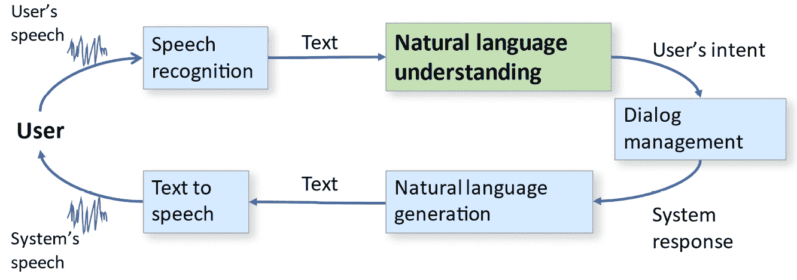
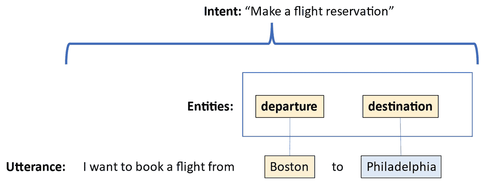
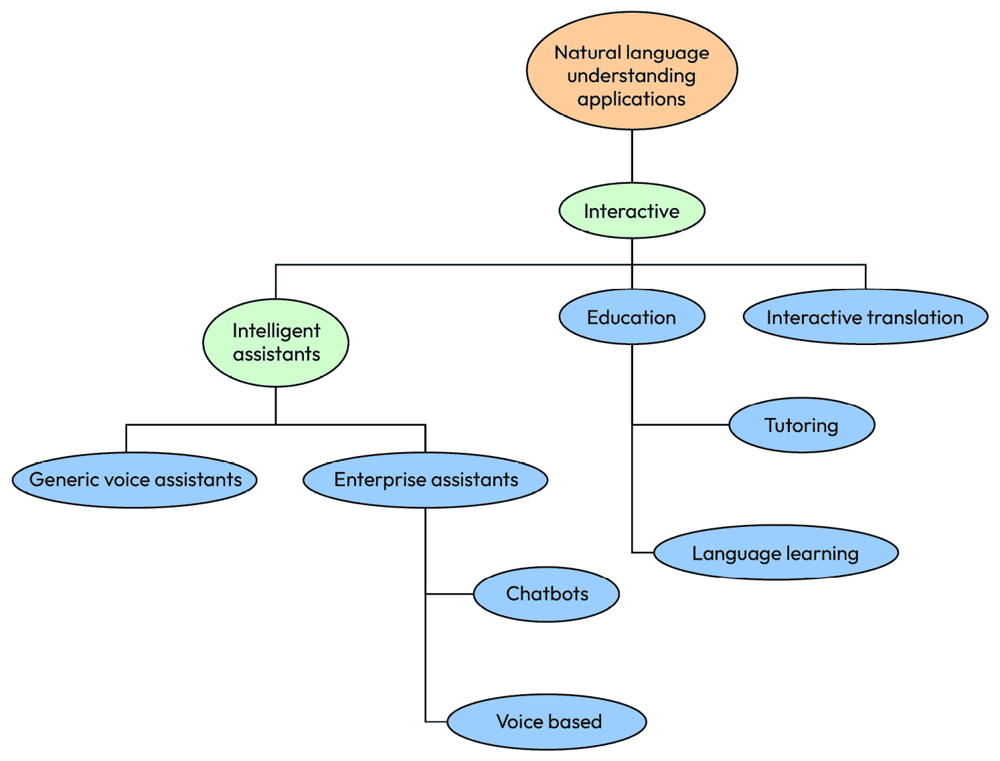
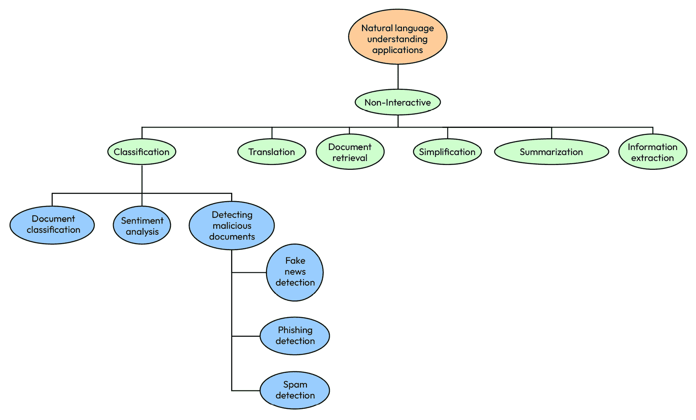

# 1

# 自然语言理解、相关技术和自然语言应用

自然语言，无论是口语还是书面语言，都是我们与他人沟通的方式。使用自然语言与他人交流的能力是使我们成为社区完整成员的重要部分。年轻孩子的第一句话是全球范围内的庆祝事件。理解自然语言通常看起来毫不费力，除非出了什么问题。当我们在使用语言时遇到困难，无论是因为疾病、受伤，还是处在外国，它都让我们深刻意识到语言在我们生活中的重要性。

在本章中，我们将描述自然语言及其处理所能获得的有用结果。我们还将把**自然语言处理**（**NLP**）置于相关对话式 AI 技术的生态系统中。我们将讨论自然语言出现的地方（文档、语音、数据库中的自由文本字段等），谈论特定的自然语言（英语、中文、西班牙语等），并介绍 NLP 的技术，介绍用于 NLP 的 Python。

本章将涵盖以下主题：

+   理解自然语言的基础

+   全球考虑因素

+   对话式 AI 与自然语言处理（NLP）之间的关系

+   探索互动应用

+   探索非互动应用

+   展望未来 – Python 在 NLP 中的应用

学习这些主题将帮助你对 NLP 领域有一个总体的了解。你将学习它的应用场景，它与其他对话式 AI 主题的关系，以及它能解决的各种问题。你还将了解到 NLP 应用对最终用户和组织的众多潜在好处。

阅读完本章后，你将能够识别适用于你感兴趣问题的 NLP 技术领域。无论你是企业家、组织开发者、学生，还是研究人员，都能将 NLP 应用于你的具体需求。

# 理解自然语言的基础

我们尚未拥有能够提取人类理解自然语言时所体验的丰富意义的技术；然而，在特定的目标和应用下，我们会发现目前的技术水平可以通过 NLP 帮助我们实现许多实用、有益且具有社会效益的结果。

口语和书面语言无处不在，丰富多彩。*口语*出现在人们与智能系统之间的日常对话中，也出现在广播、电影和播客等媒体中。*书面语言*则出现在网页上、书籍中以及人们之间的通信中，例如电子邮件。书面语言还出现在表单和数据库的自由文本字段中，这些文本可能在线上可用，但未被搜索引擎索引（**隐形网络**）。

所有这些语言形式，在分析时，都可以成为无数类型应用的基础。本书将奠定基本的分析技术基础，帮助你在许多不同的应用中利用自然语言。

# 全球化考虑因素 – 语言、编码和翻译

世界上有成千上万种自然语言，包括口语和书面语言，尽管根据[Babbel.com](http://Babbel.com)的资料（[`www.babbel.com/en/magazine/the-10-most-spoken-languages-in-the-world`](https://www.babbel.com/en/magazine/the-10-most-spoken-languages-in-the-world)），世界上大多数人说的是排名前十的语言。在本书中，我们将重点关注主要的世界语言，但必须注意，不同的语言可能会为自然语言处理（NLP）应用带来不同的挑战。例如，书面汉语不在单词之间添加空格，而大多数 NLP 工具依赖空格来识别文本中的单词。这意味着，在处理汉语时，除了识别空格之外，还需要额外的步骤来分隔汉字。这在以下由 Google 翻译的示例中得到了体现，其中汉字之间没有空格：

图 1.1 – 书面汉语不通过空格来分隔单词，与大多数西方语言不同

另一个需要注意的考虑因素是，一些语言中的同一个词会有许多不同的形式，这些形式通过不同的词尾提供关于其特定属性的信息，例如词在句子中所扮演的角色。如果你主要说英语，可能习惯了很少有词尾变化的词汇。这使得应用程序相对容易检测到同一个词的多次出现。然而，这并不适用于所有语言。

例如，在英语中，词汇*walked*可以在不同的语境中使用，保持相同的形式但含义不同，比如*I walked*（我走了），*they walked*（他们走了），或者*she has walked*（她已经走了）；而在西班牙语中，同一个动词（*caminar*）则有不同的形式，如*Yo caminé*（我走了），*ellos caminaron*（他们走了），或者*ella ha caminado*（她已经走了）。这对 NLP 的影响是，可能需要额外的预处理步骤，才能成功分析这些语言中的文本。我们将在*第五章*讨论如何为需要这些步骤的语言添加预处理步骤。

另一个需要记住的事情是，不同语言的处理工具的可用性和质量差异很大。对于主要的世界语言，如西欧语言和东亚语言，通常有相对较好的工具可用。然而，讲者少于 1000 万的语言可能没有任何工具，或者现有的工具可能不太好。这是由于训练数据的可用性以及商业利益较少等因素造成的。

资源相对较少的语言被称为**低资源语言**。对于这些语言，缺乏足够的书面语言示例来以标准方式训练大型机器学习模型。此外，能够提供语言工作原理见解的讲者也很少。这些语言可能是濒危语言，或者仅由少数人群使用。针对这些语言开发自然语言技术的技术正在积极研究中，尽管对于某些语言，开发自然语言技术可能不可行，或代价过高。

最后，许多广泛使用的语言并不使用罗马字母，例如中文、俄语、阿拉伯语、泰语、希腊语和印地语等。处理使用非罗马字母的语言时，重要的是要认识到工具必须能够接受不同的字符编码。**字符编码**用于表示不同书写系统中的字符。在许多情况下，文本处理库中的函数有参数，允许开发者指定他们打算处理的文本所需的编码。在选择适用于使用非罗马字母的语言的工具时，必须考虑处理所需编码的能力。

# 对话式 AI 与 NLP 之间的关系

**对话式人工智能**是一个广泛的术语，用于指代一系列协作技术，旨在使系统能够与人进行语音和基于文本的对话。这些技术包括语音识别、NLP、对话管理、自然语言生成和语音合成。区分这些技术非常重要，因为它们常常被混淆。尽管本书将重点关注 NLP，但我们将简要定义其他相关技术，以便了解它们如何协同工作：

+   **语音识别**：这也被称为**语音转文本**或**自动语音识别**（**ASR**）。语音识别技术从语音音频开始，并将其转换为文本。

+   **NLP**：这一技术从书面语言开始，生成可以被计算机处理的结构化表示。输入的书面语言可以是语音识别的结果，也可以是原本以书面形式生成的文本。结构化格式可以被认为表达了用户的**意图**或目的。

+   **对话管理**：这始于自然语言处理的结构化输出，并决定系统应如何反应。系统的反应可以包括提供信息、播放媒体或获取更多用户信息，以满足其意图。

+   **自然语言生成**：这是创建文本信息的过程，用于表达对话管理器对用户发言的反馈。

+   **文本转语音**：基于自然语言生成过程创建的文本输入，文本转语音组件在给定文本时生成语音输出。

这些组件之间的关系如下图所示，展示了一个完整的语音对话系统。本书重点讨论自然语言处理组件。然而，由于许多自然语言应用会使用其他组件，如语音识别、文本转语音、自然语言生成和对话管理，因此我们偶尔也会提到它们：

图 1.2 – 完整的语音对话系统

在接下来的两个部分，我们将总结一些重要的自然语言应用。这将让你了解本书将涉及的技术的潜力，并希望能激发你对使用广泛可用工具所能实现的成果的兴趣。

# 探索互动应用——聊天机器人和语音助手

我们可以将自然语言处理应用大致分为两类，即**互动应用**，其分析的基本单元通常是对话；以及**非互动应用**，其分析的单元通常是文档或一组文档。

互动应用包括用户与系统实时对话或文本交流的应用。熟悉的互动应用包括聊天机器人和语音助手，如智能音响和客户服务应用。由于其互动性，这些应用要求系统提供非常快速、几乎是即时的响应，因为用户在等待系统的回应。用户通常不能容忍超过几秒钟的延迟，因为这是他们与他人交谈时所习惯的。另一个特点是这些应用的用户输入通常非常简短，在语音互动的情况下，通常只有几个词或几秒钟长。这意味着依赖于大量文本进行分析的技术在这些应用中并不适用。

互动应用的实现很可能需要前述系统图中的其他一个或多个组件，除了自然语言处理（NLP）本身。显然，具有语音输入的应用需要语音识别，而以语音或文本回应用户的应用则需要自然语言生成和语音合成（如果系统的响应是语音）。任何超出回答单一问题的应用也需要某种形式的对话管理，以便跟踪用户在先前话语中所说的内容，在解释后续话语时考虑这些信息。

**意图识别**是互动自然语言应用中的一个重要方面，我们将在*第九章*和*第十四章*中详细讨论。意图本质上是用户发出话语时的目标或目的。显然，了解用户的意图对于提供正确信息至关重要。除了意图，互动应用通常还需要识别用户输入中的**实体**，实体是系统需要的附加信息，以便满足用户的意图。例如，如果用户说：“我想从波士顿预定一班飞往费城的航班”，意图是*进行航班预订*，相关实体是出发地和目的地城市。由于预订航班还需要旅行日期，因此这些也是实体。由于用户在此话语中未提及旅行日期，系统应该询问用户日期，这是一个称为**槽位填充**的过程，将在*第八章*中讨论。实体、意图和话语之间的关系可以在*图 1.3*中看到：

图 1.3 – 旅行规划话语的意图和实体

请注意，意图适用于话语的整体含义，而实体则仅代表话语中具体部分的含义。这一区别很重要，因为它影响了用于处理这些话语的机器学习技术的选择。*第九章*将更详细地讨论这一主题。

## 通用语音助手

通过智能音响或手机访问的**通用语音助手**，如亚马逊 Alexa、苹果 Siri 和谷歌助手，大多数人都很熟悉。通用助手能够为用户提供一般性的信息，包括体育比分、新闻、天气以及有关知名公众人物的信息。它们还可以播放音乐并控制家庭环境。与这些功能相对应，通用助手识别的意图类型包括*获取<location>的天气预报*，其中*<location>*代表一个有助于完成*获取天气预报*意图的实体。类似地，*“<team name>比赛的比分是多少？”*具有*获取比赛比分*的意图，特定团队的名称是该意图的实体。这些应用程序具有广泛但通常较为浅显的知识。在大多数情况下，它们与用户的互动仅基于一个或最多几个相关的输入——也就是说，它们大多数情况下无法进行长时间的对话。

通用语音助手主要是封闭和专有的。这意味着开发者几乎没有机会向助手添加通用功能，例如添加新的语言。然而，除了前面提到的专有助手外，还有一个名为**Mycroft**的开源助手，它允许开发者向底层系统添加功能，而不仅仅是使用平台提供的工具。

## 企业助手

与通用语音助手不同，一些交互式应用程序具有关于特定公司或其他组织的深度信息。这些被称为**企业助手**。它们旨在执行与公司相关的特定任务，如客户服务，或提供有关政府或教育组织的信息。它们可以执行的操作包括检查订单状态、为银行客户提供账户信息，或让公用事业客户了解停电情况。它们通常连接到大量的客户或产品信息数据库；因此，基于这些信息，它们可以提供深度但主要是狭窄的专业领域知识。例如，它们可以告诉你某个公司产品是否有库存，但它们不知道你最喜欢的体育队最新比赛的结果，而通用助手在这方面做得非常好。

企业语音助手通常使用如 Alexa 技能包、Microsoft LUIS、Google Dialogflow 或 Nuance Mix 等工具包开发，尽管也有像 RASA 这样的开源工具包（[`rasa.com/`](https://rasa.com/)）。这些工具包非常强大且易于使用。它们只需要开发者提供工具包需要在用户话语中找到的意图和实体的示例，以便理解他们想要做什么。

类似地，基于文本的聊天机器人可以执行与语音助手相同的任务，但它们通过文本而非语音的形式从用户那里获取信息。聊天机器人在网站上变得越来越普遍。它们可以提供网站上可用的大部分信息，但由于用户可以直接表明自己感兴趣的内容，它们避免了用户必须在可能非常复杂的网站中进行搜索。用于语音助手的工具包在许多情况下也可以用来开发基于文本的聊天机器人。

在本书中，我们不会花太多时间讨论商业工具包，因为创建可用应用所需的编码非常少。相反，我们将重点介绍支撑商业工具包的技术，这将使开发人员能够在不依赖商业系统的情况下实现应用。

## 翻译

交互式应用的第三大类是**翻译**。与前面描述的助手不同，翻译应用用于帮助用户与其他人进行沟通——即，用户不是在与助手对话，而是在与另一个人对话。实际上，这些应用充当了翻译员的角色。该应用在两种不同的人类语言之间进行翻译，以使两位不讲共同语言的人能够相互交流。这些应用可以基于语音或输入的文本。尽管语音输入更快且更自然，但如果发生语音识别错误（这是常见的情况），则可能会显著干扰两人之间沟通的流畅性。

当对话内容较为简单，例如旅游信息时，交互式翻译应用最为实用。对于更复杂的话题——例如商务谈判——成功的可能性较低，因为其复杂性导致了更多的语音识别和翻译错误。

## 教育

最后，**教育**是交互式自然语言处理（NLP）的一个重要应用。语言学习可能是最自然的教育应用。例如，有些应用帮助学生与他们正在学习的新语言进行对话。这些应用相较于与其他人练习对话具有优势，因为应用不会感到无聊，且它们是持续一致的，用户在犯错时也不会感到尴尬。其他教育应用包括帮助学生学习阅读、学习语法，或者在任何学科上进行辅导。

*图 1.4* 是不同种类交互式应用及其关系的图示总结：

图 1.4 – 交互式应用的层级

到目前为止，我们已经讨论了交互式应用，其中终端用户与 NLP 系统直接进行实时对话或输入文字。这些应用的特点是用户输入短小，需要快速响应。现在，我们将转向非交互式应用，在这些应用中，语音或文本在没有用户在场的情况下进行分析。要分析的材料可以是任意长的，但处理时间不必是即时的。

# 探索非交互式应用程序

另一种主要的自然语言应用类型是非交互式应用，或称离线应用。这些应用中的主要工作由 NLP 组件完成。系统图中的其他组件通常不需要。这些应用是在现有文本上执行的，不需要用户在场。这意味着实时处理不是必需的，因为用户不在等待答案。同样，系统也不需要等待用户决定说什么，因此，在许多情况下，处理可以比交互式应用更快速地进行。

## 分类

一类非常重要且广泛应用的非交互式自然语言应用是文档**分类**，即根据文档内容将其分配到不同的类别。分类一直是自然语言处理（NLP）中的一个重要应用领域，并且已经采用了多种方法来解决。

分类的一个简单例子是一个网页应用程序，通过将查询分类到给定类别之一来回答客户的**常见问题**（**FAQs**），然后提供每个类别的预先准备好的答案。对于这种应用程序，分类系统比仅允许客户从列表中选择问题更为合适，因为分类系统可以自动将问题分类到数百个 FAQ 类别中，节省了客户必须浏览一个庞大的类别列表的时间。另一个有趣的分类问题是自动为电影分配类别——例如，根据评论或情节摘要来进行分类。

## 情感分析

`concern`、`break`、`problem`、`issues`、`send back` 和 `hurt my back`），这段评论实际上是积极的：

*“我曾担心这张椅子虽然很舒适，但由于椅腿很细，可能在我使用不久后就会坏掉。结果这并没有成为问题。我曾想着可能需要退货。到目前为止我没有遇到任何问题，它是我拥有的唯一一把不会伤害* *我背部的椅子。”*

需要更复杂的自然语言处理（NLP）技术，考虑上下文才能识别这是一条正面评价。情感分析是一个非常有价值的应用，因为如果有成千上万条现有的产品评价，并且新的产品评价不断加入，企业很难手动完成此任务。公司不仅希望了解他们的产品如何被客户看待，而且了解竞争产品的评价与自己产品的评价相比如何，也是非常宝贵的。如果有几十种类似的产品，相关评价的数量将大大增加。文本分类应用可以自动化很多这个过程。这是学术 NLP 领域一个非常活跃的研究方向。

## 垃圾邮件和网络钓鱼检测

**垃圾邮件检测**是另一个非常有用的分类应用，其目标是将电子邮件消息分为用户希望查看的消息和应被丢弃的垃圾邮件。这个应用不仅非常实用，而且具有挑战性，因为垃圾邮件发送者不断尝试绕过垃圾邮件检测算法。这意味着垃圾邮件检测技术必须与创建垃圾邮件的新方式同步发展。例如，垃圾邮件发送者经常故意拼写错误那些通常会被用来标示垃圾邮件的关键词，例如将数字*1*替换字母*l*，或将数字*0*替换字母*o*。虽然人类很容易理解这样拼写错误的单词，但计算机寻找的关键词将不再匹配，因此垃圾邮件检测技术必须被开发出来，以发现这些技巧。

与垃圾邮件检测密切相关的是检测那些试图通过网络钓鱼欺骗用户，或诱使他们点击链接或打开文档，从而使恶意软件被加载到其系统中的消息。在大多数情况下，垃圾邮件仅仅是一个烦恼，但网络钓鱼则更加严重，因为如果用户点击了网络钓鱼链接，可能会带来极具破坏性的后果。因此，任何能提高网络钓鱼消息检测的技术都会非常有益。

## 假新闻检测

另一个非常重要的分类应用是**假新闻检测**。假新闻是指看起来非常像真实新闻，但包含不真实的信息，旨在误导读者。像垃圾邮件检测和网络钓鱼检测一样，假新闻检测也充满挑战，因为制造假新闻的人会积极避免被检测到。检测假新闻不仅对于保护用户安全很重要，而且从平台角度来看也很重要，因为如果平台不断发布假新闻，用户将开始不信任这些平台。

## 文档检索

**文档检索**是找到解决用户搜索查询的文档的任务。最好的例子就是我们每天进行的常规网页搜索。网页搜索是文档检索的最著名例子，但文档检索技术也用于在任何文档集合中寻找信息——例如，在数据库或表单的自由文本字段中。

文档检索是基于找到用户查询与存储文档之间的良好匹配，因此需要分析用户的查询和文档。文档检索可以通过关键词搜索来实现，但简单的关键词搜索容易出现两种错误。首先，查询中的关键词可能与文档中的匹配关键词有不同的含义。例如，如果用户正在寻找一副新的眼镜，想到的是*眼镜*，他们不想看到饮用杯的结果。另一种错误类型是由于关键词不匹配，导致找不到相关结果。如果用户只使用了关键词*眼镜*，而使用*眼镜*或*眼镜配件*等关键词可能找到的结果却被遗漏，即使用户对这些信息感兴趣。使用 NLP 技术代替简单的关键词搜索可以帮助提供更精确的结果。

## 分析

另一个重要且广泛的自然语言应用领域是分析。**分析**是一个总括性术语，用于描述那些试图从文本中获取见解的 NLP 应用程序，这些文本通常是从口语交互转录出来的。一个好的例子是查看客户与呼叫中心代理之间的互动转录，以发现代理是否因客户的提问而感到困惑或提供了错误的信息。分析结果可以用于呼叫中心代理的培训。分析还可以用于检查社交媒体帖子，以找出当前的热门话题。

## 信息提取

**信息提取**是一种应用类型，其中结构化信息（如可用于填充数据库的信息）从文本中提取出来，例如从报纸文章中提取的信息。关于事件的重要信息，如日期、时间、参与者和地点，可以从报道新闻的文本中提取出来。这些信息与我们之前讨论的聊天机器人和语音助手中的意图和实体非常相似，我们会发现许多相同的处理技术对于这两种应用都很相关。

信息提取应用中的一个额外问题是**命名实体识别**（**NER**），它用于识别指代真实人物、组织和地点的内容。在像报纸文章这样的扩展文本中，通常会有多种方式来指代同一个人。例如，乔·拜登可能会被称为*总统*、*拜登先生*、*他*，甚至是*前副总统*。在识别乔·拜登的指代时，信息提取应用还必须避免将*拜登博士*的指代误解为乔·拜登的指代，因为那实际上指的是他的妻子。

## 翻译

**翻译**，也称为**机器翻译**，自 NLP 领域开始以来，一直是最重要的应用之一。机器翻译尚未完全解决，但在过去几年中已经取得了巨大进展。像 Google 翻译和 Bing 翻译这样的常见 Web 应用程序通常在网页等文本的翻译上做得非常好，尽管仍然有改进的空间。

像 Google 和 Bing 这样的机器翻译应用在翻译其他类型文本时效果较差，例如包含大量专业词汇的技术文本或朋友之间可能使用的口语化文本。根据维基百科（[`en.wikipedia.org/wiki/Google_Translate`](https://en.wikipedia.org/wiki/Google_Translate)），Google 翻译可以翻译 109 种语言。然而，应该记住的是，较少使用的语言的翻译准确度低于更常用语言的准确度，正如在*全球* *考虑因素*部分所讨论的那样。

## 摘要、写作、语法纠正和其他应用

就像人类有很多理由阅读和理解文本一样，能够读取和理解文本的系统也有许多应用场景可以发挥作用。检测抄袭、纠正语法、评分学生作文以及确定文本的作者身份只是其中的一些应用。总结长文本也非常有用，简化复杂文本也是如此。当原始输入是非交互式语音时，比如播客、YouTube 视频或广播，文本的总结和简化同样可以应用。

*图 1.5* 是对非交互式应用讨论的图形总结：

图 1.5 – 非交互式应用的层级结构

*图 1.5* 显示了我们所讨论的非交互式 NLP 应用程序之间的关系。很明显，分类是一个主要的应用领域，我们将在*第九章*、*第十章*和*第十一章*中深入探讨它。

## 应用类型的总结

在前面的章节中，我们看到不同类型的交互式和非交互式应用是如何相互关联的。显然，NLP 可以应用于解决许多不同且重要的问题。在本书的其余部分，我们将深入探讨适用于解决不同类型问题的具体技术，你将学会如何为每个问题选择最有效的技术。

# 展望未来——Python 在 NLP 中的应用

传统上，NLP 是通过多种计算机语言来实现的，从早期的专用语言，如 Lisp 和 Prolog，到更现代的语言，如 Java 和如今的 Python。目前，Python 可能是 NLP 最受欢迎的语言，部分原因是有趣的应用可以相对快速地实现，开发人员可以迅速获得他们想法的反馈结果。

Python 的另一个主要优势是有大量有用、经过充分测试且文档完备的 Python 库可以应用于 NLP 问题。这些库包括 NLTK、spaCy、scikit-learn 和 Keras，仅举几例。在接下来的章节中，我们将详细探讨这些库。除了这些库，我们还将使用开发工具，如 JupyterLab。你还会发现像 Stack Overflow 和 GitHub 这样的资源非常有价值。

# 总结

在这一章中，我们学习了自然语言的基础知识以及全球性考虑因素。我们还探讨了对话式人工智能与 NLP 之间的关系，并深入了解了交互式和非交互式应用。

在下一章中，我们将讨论选择 NLP 应用时需要考虑的因素。尽管这项技术有许多应用方式，但某些可能的应用对于当前的技术水平来说过于复杂。而其他看似适合 NLP 的应用，实际上可以通过更简单的技术来解决。在下一章中，你将学习如何识别这些应用。
