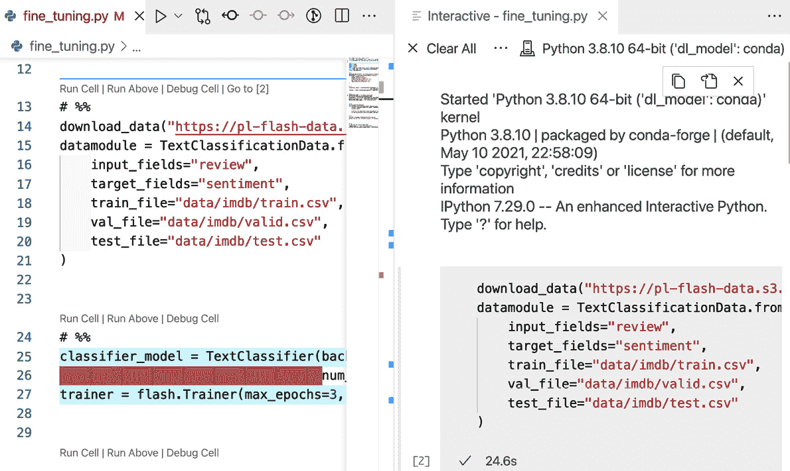
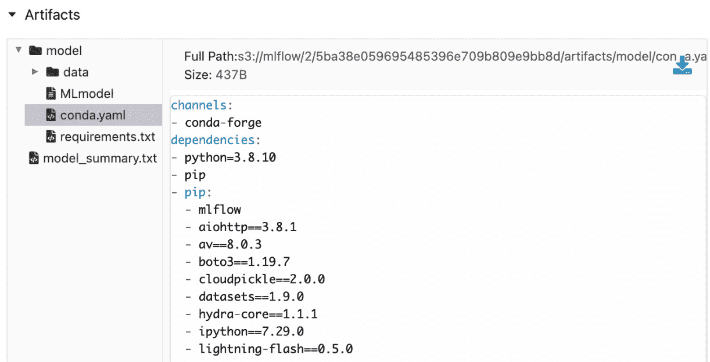
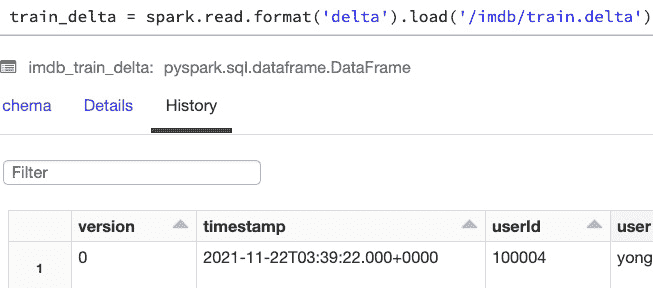

# *第四章*：跟踪代码和数据版本

深度学习（DL）模型不仅仅是模型——它们与训练和测试模型的代码，以及用于训练和测试的数据密切相关。如果我们不跟踪用于模型的代码和数据，就无法重现模型或改进它。此外，近期在整个行业范围内对**数据中心 AI**的觉醒和范式转变（[`www.forbes.com/sites/gilpress/2021/06/16/andrew-ng-launches-a-campaign-for-data-centric-ai/?sh=5cbacdc574f5`](https://www.forbes.com/sites/gilpress/2021/06/16/andrew-ng-launches-a-campaign-for-data-centric-ai/?sh=5cbacdc574f5)）使得数据在构建机器学习（ML）和特别是深度学习（DL）模型中的重要性被提升为首要要素。因此，在本章节中，我们将学习如何使用 MLflow 跟踪代码和数据版本。我们将学习如何跟踪代码和管道版本，并了解如何使用 Delta Lake 进行数据版本管理。在本章节结束时，您将能够理解并实现使用 MLflow 跟踪代码和数据的技巧。

在本章中，我们将涵盖以下主要主题：

+   跟踪笔记本和管道版本

+   跟踪本地私有构建的 Python 库

+   在 Delta Lake 中跟踪数据版本

# 技术要求

本章节的技术要求如下：

+   使用 Jupyter Notebook 扩展的 VS Code：[`github.com/microsoft/vscode-jupyter/wiki/Setting-Up-Run-by-Line-and-Debugging-for-Notebooks`](https://github.com/microsoft/vscode-jupyter/wiki/Setting-Up-Run-by-Line-and-Debugging-for-Notebooks)。

+   本章节的代码可以在本书的 GitHub 仓库中找到：[`github.com/PacktPublishing/Practical-Deep-Learning-at-Scale-with-MLFlow/tree/main/chapter04`](https://github.com/PacktPublishing/Practical-Deep-Learning-at-Scale-with-MLFlow/tree/main/chapter04)。

+   访问 Databricks 实例，以便学习如何使用 Delta Lake 来实现版本化的数据访问。

# 跟踪笔记本和管道版本

数据科学家通常从离线实验 Python 笔记本开始，交互式执行是其主要优势之一。自 `.ipynb` 时代以来，Python 笔记本已经取得了长足的进展。你可能也无法在 MLflow 跟踪服务器中看到每次使用 Jupyter 笔记本运行的确切 Git 哈希值。关于是否以及何时应该在生产环境中使用 Jupyter 笔记本，存在许多有趣的争论（可以在这里查看讨论：[`medium.com/mlops-community/jupyter-notebooks-in-production-4e0d38803251`](https://medium.com/mlops-community/jupyter-notebooks-in-production-4e0d38803251)）。我们不应在生产环境中使用 Jupyter 笔记本的原因有很多，尤其是在我们需要端到端管道中的可复现性时，单元测试、代码版本控制和依赖管理在大量笔记本的情况下可能会变得困难。Netflix 的开源工具 **papermill**（[`papermill.readthedocs.io/en/latest/index.html`](https://papermill.readthedocs.io/en/latest/index.html)）在调度、参数化和按工作流方式执行 Jupyter 笔记本方面做出了一些早期创新。然而，Databricks 和 VS Code 的最近创新使得笔记本更容易进行版本控制并与 MLflow 集成。让我们来看一下这两个工具引入的笔记本特性：

+   **交互式执行**：Databricks 的笔记本和 VS Code 的笔记本可以像传统的 Jupyter 笔记本一样运行，采用逐单元格执行模式。通过这种方式，你可以立即看到结果的输出。

+   `.py` 文件扩展名。这允许对笔记本应用常规的 Python 代码检查（代码格式和风格检查）。

+   **渲染代码单元格和 Markdown 单元格的特殊符号**：Databricks 和 VS Code 都利用一些特殊符号将 Python 文件渲染为交互式笔记本。在 Databricks 中，用于将代码分隔成不同可执行单元格的特殊符号如下：

    ```py
    # COMMAND ---------- 
    import mlflow
    import torch
    from flash.core.data.utils import download_data
    from flash.text import TextClassificationData, TextClassifier
    import torchmetrics
    ```

特殊的 `COMMAND` 行下方的代码将在 Databricks Web UI 门户中作为可执行单元格进行渲染，如下所示：


图 4.1 – Databricks 可执行单元格

要执行此单元格中的代码，你只需通过右上方的下拉菜单点击 **运行单元格**。

要向 Databricks 中添加大量文本以描述和评论代码（也称为 Markdown 单元格），你可以在行的开头使用 `# MAGIC` 符号，如下所示：

```py
# MAGIC %md
# MAGIC #### Notebooks for fine-tuning a pretrained language model to do text-based sentiment classification
```

然后，这将在 Databricks 笔记本中渲染为一个 Markdown 注释单元格，如下所示：


图 4.2 – Databricks Markdown 文本单元格

在 VS Code 中，这两种类型的单元格使用略有不同的符号集。对于代码单元格，`# %%` 符号用于单元格块的开头：

```py
# %%
download_data("https://pl-flash-data.s3.amazonaws.com/imdb.zip", "./data/")
datamodule = TextClassificationData.from_csv(
    input_fields="review",
    target_fields="sentiment",
    train_file="data/imdb/train.csv",
    val_file="data/imdb/valid.csv",
    test_file="data/imdb/test.csv"
)
```

然后，这将在 VS Code 的编辑器中呈现，如下所示：


图 4.3 – VS Code 代码单元格

如您所见，在代码块前面有一个**运行单元格**按钮，您可以点击该按钮以交互式地运行代码块。如果点击**运行单元格**按钮，代码块将在编辑器窗口的侧边面板中开始执行，如下所示：



图 4.4 – 在 VS Code 中交互式运行代码

要添加一个包含注释的 Markdown 单元格，请在行的开头添加以下内容，并使用必要的符号：

```py
# %% Notebook for fine-tuning a pretrained language model and sentiment classification
```

这将确保文本在 VS Code 中不是一个可执行的代码块。

鉴于 Databricks 和 VS Code 笔记本的优点，我们建议使用其中任意一种进行版本控制。我们可以使用 GitHub 来跟踪任何一种类型笔记本的版本，因为它们使用的是常规的 Python 文件格式。

使用 Databricks 笔记本版本控制的两种方法

对于托管的 Databricks 实例，笔记本版本可以通过两种方式进行跟踪：通过查看 Databricks Web UI 中笔记本侧边面板的修订历史，或者通过链接到远程 GitHub 仓库。详细描述可以参考 Databricks 笔记本文档：[`docs.databricks.com/notebooks/notebooks-use.html#version-control`](https://docs.databricks.com/notebooks/notebooks-use.html#version-control)。

虽然 Databricks Web 门户为笔记本版本控制和与 MLflow 实验追踪的集成提供了出色的支持（参见本章中的*两种使用 Databricks 笔记本版本控制的方法*和*Databricks 笔记本中的两种 MLflow 实验类型*的提示框），但是在 Databricks 笔记本 Web UI 中编写代码有一个主要的缺点。这是因为与 VS Code 相比，Web UI 不是一个典型的**集成开发环境**（**IDE**），在 VS Code 中，代码样式和格式化工具如 **flake8**（[`flake8.pycqa.org/en/latest/`](https://flake8.pycqa.org/en/latest/)）和 autopep8（[`pypi.org/project/autopep8/`](https://pypi.org/project/autopep8/)）可以轻松执行。这对代码质量和可维护性有重大影响。因此，强烈建议使用 VS Code 来编写笔记本代码（无论是 Databricks 笔记本还是 VS Code 笔记本）。

Databricks 笔记本中的两种 MLflow 实验类型

对于一个托管的 Databricks Web 门户实例，您可以执行两种类型的 MLflow 实验：工作区实验和 notebook 实验。工作区实验主要用于一个共享的实验文件夹，该文件夹不绑定到单个 notebook。如果需要，远程代码执行可以写入工作区实验文件夹。另一方面，notebook 范围实验绑定到特定的 notebook，并且可以在 Databricks Web 门户的 notebook 页面上直接通过右上角的 **Experiment** 菜单项找到。有关更多细节，请查看 Databricks 文档网站：[`docs.databricks.com/applications/mlflow/tracking.html#experiments`](https://docs.databricks.com/applications/mlflow/tracking.html#experiments)。

使用本章的 VS Code notebook `fine_tuning.py`，该文件可以在本章的 GitHub 仓库中找到（[`github.com/PacktPublishing/Practical-Deep-Learning-at-Scale-with-MLFlow/blob/main/chapter04/notebooks/fine_tuning.py`](https://github.com/PacktPublishing/Practical-Deep-Learning-at-Scale-with-MLFlow/blob/main/chapter04/notebooks/fine_tuning.py)），您将能够在 VS Code 编辑器中交互式运行它，并在我们在 *第三章* 中设置的 MLflow Docker 服务器中记录实验，章节名称为 *追踪模型、参数和指标*。提醒一下，成功在 VS Code 中运行这个 notebook，您需要按照本章 GitHub 仓库中的 `README.md` 文件描述的步骤设置虚拟环境 `dl_model`。它包括以下三个步骤：

```py
conda create -n dl_model python==3.8.10
```

```py
conda activate dl_model
```

```py
pip install -r requirements.txt
```

如果您从头到尾逐个运行此 notebook 单元格，您的实验页面将如下所示：


图 4.5 – 在 VS Code 中交互式运行 notebook 后记录的实验页面

您可能会立即注意到前面的截图中的问题 —— `fine_tuning.py` 文件。这是因为 VS Code notebook 并未与 MLflow 跟踪服务器原生集成以进行源文件跟踪；它只能显示 VS Code 用于执行 notebook 的 **ipykernel**（[`pypi.org/project/ipykernel/`](https://pypi.org/project/ipykernel/)）（[`github.com/microsoft/vscode-jupyter`](https://github.com/microsoft/vscode-jupyter)）。不幸的是，这是一个限制，在撰写本文时，无法通过交互式运行 VS Code notebook 来解决实验代码跟踪问题。托管在 Databricks Web UI 中运行的 Databricks notebook 则没有此类问题，因为它们与 MLflow 跟踪服务器有原生集成，该服务器与 Databricks Web 门户捆绑在一起。

然而，由于 VS Code notebook 只是 Python 代码，我们可以在命令行中以 *非交互式* 方式运行 notebook，如下所示：

```py
python fine_tuning.py
```

这将在 MLflow 实验页面上无任何问题地记录实际源代码的文件名和 Git 提交哈希，如下所示：


图 4.6 – 在命令行运行 VS Code 笔记本后的已记录实验页面

上面的截图显示了正确的源文件名（`fine_tuning.py`）和正确的 git 提交哈希（**661ffeda5ae53cff3623f2fcc8227d822e877e2d**）。这个解决方法不需要我们修改笔记本的代码，并且如果我们已经完成了初步的交互式笔记本调试，并且希望获得完整的笔记本运行结果，同时在 MLflow 跟踪服务器中进行正确的代码版本跟踪，这个方法会非常有用。请注意，所有其他参数、指标和模型都会被正确跟踪，无论我们是否以交互式方式运行笔记本。

## 管道跟踪

在讨论完笔记本代码跟踪（版本和文件名）之后，让我们转到管道跟踪的话题。然而，在讨论管道跟踪之前，我们首先需要了解管道在 ML/DL 生命周期中的定义。从概念上讲，管道是一个多步骤的数据处理和任务工作流。然而，数据/任务工作流的实现可能有很大的不同。管道可以在一些机器学习包中被定义为一流的 Python API。最著名的两个管道 API 如下：

+   `sklearn.pipeline.Pipeline` ([`scikit-learn.org/stable/modules/generated/sklearn.pipeline.Pipeline.html`](https://scikit-learn.org/stable/modules/generated/sklearn.pipeline.Pipeline.html)): 这是广泛用于构建紧密集成的多步骤管道，用于经典机器学习或数据 **提取、转换和加载**（**ETL**）管道，使用 **pandas DataFrames**（https://pandas.pydata.org/docs/reference/api/pandas.DataFrame.html）。

+   `pyspark.ml.Pipeline` ([`spark.apache.org/docs/latest/api/python/reference/api/pyspark.ml.Pipeline.html`](https://spark.apache.org/docs/latest/api/python/reference/api/pyspark.ml.Pipeline.html)): 这是 PySpark 版本的工具，用于构建简单且紧密集成的多步骤管道，适用于机器学习或数据 ETL 管道，使用 **Spark DataFrames**（https://spark.apache.org/docs/latest/api/python/reference/api/pyspark.sql.DataFrame.html）。

然而，当我们构建一个深度学习（DL）模型管道时，我们需要在管道的不同步骤中使用多个不同的 Python 包，因此，使用一个通用的单一管道 API 通常无法满足需求。此外，前面提到的管道 API 都不原生支持当前流行的深度学习包，如**Huggingface**或**PyTorch-Lightning**，这些需要额外的集成工作。尽管存在一些开源的深度学习管道 API，如**Neuraxle**（[`github.com/Neuraxio/Neuraxle`](https://github.com/Neuraxio/Neuraxle)），它尝试提供类似 sklearn 的管道接口和框架，但并未得到广泛使用。此外，使用这些基于 API 的管道意味着当你需要向管道中添加更多步骤时，可能会被限制，从而降低了你在新需求出现时扩展或发展深度学习管道的灵活性。

在本书中，我们将采用不同的方法来定义并构建一个基于 MLflow 的`fine_tuning.py`的深度学习管道，并将其转变为一个多步骤管道。这个管道可以被可视化为一个三步流程图，如下所示：


](img/B18120_Figure_4.7.jpg)

图 4.7 – 一个三步的深度学习管道

这个三步流程如下：

1.  将数据下载到本地执行环境

1.  微调模型

1.  注册模型

这些模块化步骤可能对我们当前的示例来说有些过于复杂，但当涉及更多复杂性或每个步骤需要更改时，具有独立功能步骤的优势就显现出来。如果我们定义了需要在步骤之间传递的参数，每个步骤都可以独立修改，而不会影响其他步骤。每个步骤都是一个独立的 Python 文件，可以通过一组输入参数独立执行。将会有一个主管道 Python 文件，可以运行整个管道或管道的一个子部分。在`MLproject`文件中，这是一个没有文件扩展名的标准 YAML 文件，我们可以定义四个入口点（`main`、`download_data`、`fine_tuning_model` 和 `register_model`），它们所需的输入参数、参数类型和默认值，以及执行每个入口点的命令行。在我们的示例中，这些入口点将通过 Python 命令行执行命令提供。然而，如果某些步骤需要特定的执行方式，你也可以调用其他执行方式，比如批处理脚本。例如，本章中的`MLproject`文件的以下行（[`github.com/PacktPublishing/Practical-Deep-Learning-at-Scale-with-MLFlow/blob/main/chapter04/MLproject`](https://github.com/PacktPublishing/Practical-Deep-Learning-at-Scale-with-MLFlow/blob/main/chapter04/MLproject)）描述了项目的名称、`conda`环境定义文件的文件名以及主入口点：

```py
name: dl_model_chapter04
```

```py
conda_env: conda.yaml
```

```py
entry_points:
```

```py
  main:
```

```py
    parameters:
```

```py
      pipeline_steps:
```

```py
        description: Comma-separated list of dl pipeline steps to execute 
```

```py
        type: str
```

```py
        default: all
```

```py
    command: "python main.py --steps {pipeline_steps}"
```

这里，项目名称是 `dl_model_chapter04`。`conda_env` 指的是本地 conda 环境的 YAML 定义文件 `conda.yaml`，该文件与 `MLproject` 文件位于同一目录。`entry_points` 部分列出了第一个入口点，名为 `main`。在 `parameters` 部分，有一个名为 `pipeline_steps` 的参数，允许用户定义一个逗号分隔的 DL 流水线步骤列表以供执行。该参数的类型是 `str`，默认值是 `all`，意味着所有流水线步骤都会执行。最后，`command` 部分列出了如何在命令行中执行此步骤。

`MLproject` 文件的其余部分通过遵循与主入口点相同的语法规则来定义另外三个流水线步骤入口点。例如，以下几行在同一个 `MLproject` 文件中定义了 `download_data` 的入口点：

```py
  download_data:
```

```py
    parameters:
```

```py
      download_url:
```

```py
        description: a url to download the data for fine tuning a text sentiment classifier
```

```py
        type: str
```

```py
        default: https://pl-flash-data.s3.amazonaws.com/imdb.zip
```

```py
      local_folder:
```

```py
        description: a local folder to store the downloaded data
```

```py
        type: str
```

```py
        default: ./data
```

```py
      pipeline_run_name:
```

```py
        description: an mlflow run name
```

```py
        type: str
```

```py
        default: chapter04
```

```py
    command:
```

```py
      "python pipeline/download_data.py --download_url {download_url} --local_folder {local_folder} \
```

```py
      --pipeline_run_name {pipeline_run_name}"
```

`download_data` 部分，类似于主入口点，也定义了参数列表、类型和默认值，以及执行此步骤的命令行。我们可以像在本书的 GitHub 仓库中查看的 `MLproject` 文件一样，按相同的方式定义其余步骤。更多详细信息，请查看该 `MLproject` 文件的完整内容。

在定义了 `MLproject` 文件后，很明显我们已经以声明的方式定义了一个多步骤的流水线。这就像是一个流水线的规范，说明了每个步骤的名称、期望的输入参数以及如何执行它们。现在，下一步是实现 Python 函数来执行流水线的每个步骤。所以，让我们看看主入口点的 Python 函数的核心实现，它叫做 `main.py`。以下代码行（不是 `main.py` 中的整个 Python 代码）展示了只用一个流水线步骤（`download_data`）来实现整个流水线的核心组件：

```py
@click.command()
```

```py
@click.option("--steps", default="all", type=str)
```

```py
def run_pipeline(steps):
```

```py
    with mlflow.start_run(run_name='pipeline', nested=True) as active_run:
```

```py
        download_run = mlflow.run(".", "download_data", parameters={})
```

```py
if __name__ == "__main__":
```

```py
    run_pipeline()
```

此主函数代码片段包含一个`run_pipeline`函数，在命令行中执行`main.py`文件时将运行该函数。有一个称为`steps`的参数，在提供时将传递给该函数。在此示例中，我们使用了`click` Python 包 ([`click.palletsprojects.com/en/8.0.x/`](https://click.palletsprojects.com/en/8.0.x/)) 来解析命令行参数。`run_pipeline`函数通过调用`mlflow.start_run`启动一个 MLflow 实验运行，并传递两个参数（`run_name`和`nested`）。我们之前使用过`run_name`，它是此运行的描述性短语。然而，`nested`参数是新的，这意味着这是一个父实验运行。这个父实验运行包含一些将在 MLflow 中层次跟踪的子实验运行。每个父运行可以包含一个或多个子运行。在示例代码中，这包含管道运行的一个步骤，称为`download_data`，通过调用`mlflow.run`来调用。这是调用 MLproject 入口点的关键 MLflow 函数。一旦调用了`download_data`并且运行已完成，父运行也将完成，从而结束管道的运行。

执行 MLproject 入口点的两种方式

执行 MLproject 入口点有两种方式。首先，您可以使用 MLflow 的 Python API，称为`mlflow.run` ([`www.mlflow.org/docs/latest/python_api/mlflow.projects.html#mlflow.projects.run`](https://www.mlflow.org/docs/latest/python_api/mlflow.projects.html#mlflow.projects.run))。另外，您可以使用 MLflow 的命令行界面工具，称为`mlflow run`，可以在命令行 shell 环境中直接调用以执行任何入口点 ([`www.mlflow.org/docs/latest/cli.html#mlflow-run`](https://www.mlflow.org/docs/latest/cli.html#mlflow-run))。

现在，让我们学习如何通用地实现管道中的每个步骤。对于每个管道步骤，我们将 Python 文件放在一个`pipeline`文件夹中。在本例中，我们有三个文件：`download_data.py`、`fine_tuning_model.py`和`register_model.py`。因此，成功构建支持 MLflow 的管道项目所需的相关文件如下：

```py
MLproject
```

```py
conda.yaml
```

```py
main.py
```

```py
pipeline/download_data.py
```

```py
pipeline/fine_tuning_model.py
```

```py
pipeline/register_model.py
```

对于每个管道步骤的实现，我们可以使用以下 Python 函数模板。一个占位符部分用于实现实际的管道步骤逻辑：

```py
import click
```

```py
import mlflow
```

```py
@click.command()
```

```py
@click.option("input")
```

```py
def task(input):
```

```py
    with mlflow.start_run() as mlrun:
```

```py
        # Implement pipeline step logic here 
```

```py
        mlflow.log_parameter('parameter', parameter)
```

```py
        mlflow.set_tag('pipeline_step', __file__)
```

```py
        mlflow.log_artifacts(artifacts, artifact_path="data")
```

```py
if __name__ == '__main__':
```

```py
    task()
```

此模板允许我们标准化实施管道步骤任务的方式。主要思想是，对于每个管道步骤任务，需要从`mlflow.start_run`开始启动一个 MLflow 实验运行。一旦我们在函数中实现了具体的执行逻辑，我们需要使用`mlflow.log_parameter`记录一些参数，或者在工件存储中使用`mlflow.log_artifacts`记录一些工件，这些参数和工件可以传递并由管道的下一步使用。这就是所谓的`mlflow.set_tag`。

例如，在`download_data.py`步骤中，核心实现如下：

```py
import click
```

```py
import mlflow
```

```py
from flash.core.data.utils import download_data
```

```py
@click.command()
```

```py
@click.option("--download_url")
```

```py
@click.option("--local_folder")
```

```py
@click.option("--pipeline_run_name")
```

```py
def task(download_url, local_folder, pipeline_run_name):
```

```py
    with mlflow.start_run(run_name=pipeline_run_name) as mlrun:
```

```py
        download_data(download_url, local_folder)
```

```py
        mlflow.log_param("download_url", download_url)
```

```py
        mlflow.log_param("local_folder", local_folder)
```

```py
        mlflow.set_tag('pipeline_step', __file__)
```

```py
        mlflow.log_artifacts(local_folder, artifact_path="data")
```

```py
if __name__ == '__main__':
```

```py
    task()
```

在这个`download_data.py`实现中，任务是将模型构建所需的数据从远程 URL 下载到本地文件夹（`download_data(download_url, local_folder)`）。完成这一步后，我们将记录一些参数，比如`download_url`和`local_folder`。我们还可以使用`mlflow.log_artifacts`将新下载的数据记录到 MLflow 工件存储中。对于这个例子来说，可能看起来不太必要，因为我们只是在本地开发环境中执行下一步。然而，在一个更现实的分布式执行环境中，每个步骤可能会在不同的执行环境中运行，这种做法是非常有用的，因为我们只需要将工件 URL 路径传递给管道的下一步使用；我们不需要知道上一步是如何以及在哪里执行的。在这个例子中，当`mlflow.log_artifacts(local_folder, artifact_path="data")`语句被调用时，下载的数据文件夹会被上传到 MLflow 工件存储。然而，在本章中，我们不会使用这个工件路径来执行下游管道步骤。稍后在本书中，我们将探讨如何使用这种工件存储将工件传递到管道的下一步。在这里，我们将使用日志记录的参数将下载的数据路径传递给管道的下一步（`mlflow.log_param("local_folder", local_folder)`）。所以，让我们看看如何通过扩展`main.py`，使其包含下一步，即`fine_tuning_model`入口点，如下所示：

```py
        with mlflow.start_run(run_name='pipeline', nested=True) as active_run:
```

```py
            download_run = mlflow.run(".", "download_data", parameters={})
```

```py
            download_run = mlflow.tracking.MlflowClient().get_run(download_run.run_id)
```

```py
            file_path_uri = download_run.data.params['local_folder']
```

```py
            fine_tuning_run = mlflow.run(".", "fine_tuning_model", parameters={"data_path": file_path_uri})
```

我们使用`mlflow.tracking.MlflowClient().get_run`来获取`download_run`的 MLflow 运行对象，然后使用`download_run.data.params`来获取`file_path_uri`（在这个例子中，它只是一个本地文件夹路径）。然后将其作为键值参数（`parameters={"data_path": file_path_uri}`）传递给下一个`mlflow.run`，即`fine_tuning_run`。通过这种方式，`fine_tuning_run`管道步骤可以使用这个参数来作为数据源路径的前缀。这是一个非常简化的场景，用来说明我们如何将数据从一个步骤传递到下一个步骤。使用由 MLflow 提供的`mlflow.tracking.MlflowClient()`API（[`www.mlflow.org/docs/latest/python_api/mlflow.tracking.html`](https://www.mlflow.org/docs/latest/python_api/mlflow.tracking.html)），可以轻松访问运行信息（参数、指标和工件）。

我们还可以通过添加`register_model`步骤，扩展`main.py`文件中的管道第三步。这次，我们需要日志记录的模型 URI 来注册已训练的模型，这取决于`fine_tuning_model`步骤的`run_id`。因此，在`fine_tuning_model`步骤中，我们需要获取`fine_tuning_model`运行的`run_id`属性，然后将其作为输入参数传递给`register_model`运行，如下所示：

```py
fine_tuning_run_id = fine_tuning_run.run_id
```

```py
register_model_run = mlflow.run(".", "register_model", parameters={"mlflow_run_id": fine_tuning_run_id})
```

现在，`register_model` 步骤可以使用 `fine_tuning_run_id` 来定位已注册的模型。`register_model` 步骤的核心实现如下：

```py
    with mlflow.start_run() as mlrun:
```

```py
        logged_model = f'runs:/{mlflow_run_id}/model'
```

```py
        mlflow.register_model(logged_model, registered_model_name)
```

这将在由 `logged_model` 变量定义的 URI 中注册一个微调模型到 MLflow 模型注册表。

如果您已经按照这些步骤操作，那么您应该已经有了一个可以由 MLflow 端到端跟踪的工作管道。提醒一下，前提条件是您已经设置好本地完整的 MLflow 服务器，如在 *第三章**，跟踪模型、参数和指标* 中所示。您应该已经在上一节中设置了虚拟环境 `dl_model`。要测试这个管道，请访问本章的 GitHub 仓库 [`github.com/PacktPublishing/Practical-Deep-Learning-at-Scale-with-MLFlow/tree/main/chapter04`](https://github.com/PacktPublishing/Practical-Deep-Learning-at-Scale-with-MLFlow/tree/main/chapter04) 并运行以下命令：

```py
python main.py
```

这将运行整个三步管道，并将管道的 `run_id`（即父运行）以及每个步骤的运行作为子运行记录在 MLflow 跟踪服务器中。当运行完成时，控制台屏幕的最后几行输出会显示如下内容（运行管道时，您将看到许多屏幕输出）：


图 4.8 – 运行带有 MLflow run_ids 的管道的控制台输出

这显示了管道的 `run_id`，它是 `f8f21fdf8fff4fd6a400eeb403b776c8`；最后一步是 `fine_tuning_model` 的 `run_id` 属性，它是 `5ba38e059695485396e709b809e9bb8d`。如果我们通过点击 `http://localhost` 进入 MLflow 跟踪服务器的 UI 页面，我们应该能看到如下在 `dl_model_chapter04` 实验文件夹中的嵌套实验运行：


图 4.9 – 一个包含三步嵌套子步骤运行的管道在 MLflow 跟踪服务器中运行

上面的截图展示了管道运行，以及源 `main.py` 文件和管道三步的嵌套运行。每个步骤都有一个在 `MLproject` 中定义的对应入口点名称，并带有 `register_model` 运行页面的 GitHub 提交哈希代码版本，您将看到以下信息：


图 4.10 – 在 MLflow 跟踪服务器上，入口点 `register_model` 的运行页面

上面的截图不仅展示了我们已经看到的一些熟悉信息，还展示了一些新信息，例如 `file:///`、GitHub 哈希码版本、入口点 `(-e register_model)`、执行环境（本地开发环境 `-b local`）以及 `register_model` 函数的预期参数（`-P`）。我们将在本书后面学习如何使用 MLflow 的 `MLproject` 运行命令来远程执行任务。这里，我们只需要理解源代码是通过入口点（`register_model`）引用的，而不是通过文件名本身，因为该引用在 `MLproject` 文件中已声明为入口点。

如果你在 MLflow 跟踪服务器中看到了*图 4.9*和*图 4.10*中显示的输出，那么是时候庆祝了——你已经成功地使用 MLflow 执行了一个多步骤的深度学习管道！

总结一下，要在 MLflow 中跟踪一个多步骤的深度学习管道，我们可以使用 `MLproject` 来定义每个管道步骤的入口点以及主管道的入口点。在主管道函数中，我们实现方法以便可以在管道步骤之间传递数据。然后，每个管道步骤使用已经共享的数据以及其他输入参数来执行特定任务。主管道级别的函数以及管道的每个步骤都通过 MLflow 跟踪服务器进行跟踪，该服务器生成一个父级 `run_id` 来跟踪主管道的运行，并生成多个嵌套的 MLflow 运行来跟踪每个管道步骤。我们为每个管道步骤介绍了一个模板，以标准化地实现此任务。我们还通过 MLflow 的 `run` 参数和工件存储探索了强大的管道链式操作，学习了如何在管道步骤之间传递数据。

现在你已经知道如何跟踪笔记本和管道，接下来我们来学习如何跟踪 Python 库。

# 跟踪本地私有构建的 Python 库

现在，让我们将注意力转向跟踪本地私有构建的 Python 库。对于公开发布的 Python 库，我们可以在 `requirements` 文件或 `conda.yaml` 文件中明确指定其发布的版本，这些版本通常发布在 PyPI 上。例如，本章的 `conda.yaml` 文件 ([`github.com/PacktPublishing/Practical-Deep-Learning-at-Scale-with-MLFlow/blob/main/chapter04/conda.yaml`](https://github.com/PacktPublishing/Practical-Deep-Learning-at-Scale-with-MLFlow/blob/main/chapter04/conda.yaml)) 定义了 Python 版本，并提供了对 `requirements` 文件的引用，如下所示：

```py
name: dl_model 
```

```py
channels:
```

```py
  - conda-forge
```

```py
dependencies:
```

```py
  - python=3.8.10
```

```py
  - pip
```

```py
  - pip:
```

```py
    - -r requirements.txt
```

Python 版本被定义为 `3.8.10`，并且被强制执行。该 `conda.yaml` 文件还引用了一个 `requirements.txt` 文件，其中包含以下版本化的 Python 包，该文件位于与 `conda.yaml` 文件相同的目录中：

```py
ipykernel==6.4.1
```

```py
lightning-flash[all]==0.5.0
```

```py
mlflow==1.20.2
```

```py
transformers==4.9.2
```

```py
boto3==1.19.7
```

```py
pytorch-lightning==1.4.9
```

```py
datasets==1.9.0
```

```py
click==8.0.3
```

如我们所见，所有这些包都在显式地使用它们发布的 PyPI（[`pypi.org/`](https://pypi.org/)）版本号进行追踪。当你运行 MLflow 的`MLproject`时，MLflow 将使用`conda.yaml`文件和引用的`requirements.txt`文件动态创建 conda 虚拟环境。这确保了执行环境的可重现性，并且所有的深度学习模型管道都能够成功运行。你可能注意到，第一次运行上一节的 MLflow 管道项目时，已经为你创建了这样的虚拟环境。你可以通过运行以下命令再次执行此操作：

```py
conda env list
```

这将生成当前机器中 conda 虚拟环境的列表。你应该能够找到一个以`mlflow-`为前缀，后跟一串字母和数字的虚拟环境，如下所示：

```py
mlflow-95353930ddb7b60101df80a5d64ef8bf6204a808
```

这是由 MLflow 动态创建的虚拟环境，它遵循在`conda.yaml`和`requirements.txt`中指定的依赖项。随后，当你记录经过微调的模型时，`conda.yaml`和`requirements.txt`将自动记录到 MLflow 工件存储中，如下所示：



图 4.11 – Python 包正在被记录并追踪到 MLflow 工件存储中

如我们所见，`conda.yaml`文件已自动扩展，包含了`requirements.txt`的内容，以及 conda 决定要包含的其他依赖项。

对于私有构建的 Python 包（即未公开发布到 PyPI 供公众使用和引用的 Python 包），推荐的方式是使用`git+ssh`来包含该 Python 包。假设你有一个名为`cool-dl-utils`的私有构建项目，你所在的组织叫做`cool_org`，并且你的项目仓库已在 GitHub 上设置。如果你想在 requirements 文件中包含该项目的 Python 包，你需要确保将你的公钥添加到 GitHub 设置中。如果你想了解如何生成公钥并将其加载到 GitHub，请参考 GitHub 的指南：[`docs.github.com/en/authentication/connecting-to-github-with-ssh/adding-a-new-ssh-key-to-your-github-account`](https://docs.github.com/en/authentication/connecting-to-github-with-ssh/adding-a-new-ssh-key-to-your-github-account)。在`requirements.txt`文件中，你可以添加如下内容，这将引用一个特定的 GitHub 哈希（`81218891bbf5a447103884a368a75ffe65b17a44`）和从该私有仓库构建的 Python `.egg` 包（如果愿意，也可以引用`.whl`包）：

```py
cool-dl-utils @ git+ssh://git@github.com/cool_org/cool-dl-utils.git@81218891bbf5a447103884a368a75ffe65b17a44#egg=cool-dl-utils
```

如果你在自己构建的包中有一个数字版本，你也可以直接在`requirements.txt`文件中引用该版本号，如下所示：

```py
git+ssh://git@github.com/cool_org/cool-dl-utils.git@2.11.4
```

这里`cool-dl-utils`的发布版本是`2.11.4`。这使得 MLflow 能够将这个私有构建的包拉入虚拟环境中执行`MLproject`。在这一章中，我们不需要引用任何私有构建的 Python 包，但值得注意的是，MLflow 可以利用`git+ssh`方式来实现这一点。

现在，让我们学习如何跟踪数据版本。

# 在 Delta Lake 中跟踪数据版本

在这一部分，我们将学习如何在 MLflow 中跟踪数据。历史上，数据管理和版本控制通常被视为与机器学习和数据科学不同的领域。然而，数据驱动的 AI 的兴起在深度学习中扮演着越来越重要的角色。因此，了解数据如何以及用于何种目的来改进深度学习模型是至关重要的。在 2021 年夏季，由 Andrew Ng 组织的第一届数据驱动 AI 竞赛中，获胜的要求并不是改变和调优模型，而是改进一个固定模型的数据集（[`https-deeplearning-ai.github.io/data-centric-comp/`](https://https-deeplearning-ai.github.io/data-centric-comp/)）。这是竞赛网页上的一句话：

"数据驱动的 AI 竞赛颠覆了传统格式，要求你在给定固定模型的情况下改进数据集。我们将提供一个数据集，供你通过应用数据驱动的技术来改进，比如修正错误标签、添加代表边缘案例的示例、应用数据增强等。"

这一范式的转变突显了数据在深度学习中的重要性，尤其是在监督学习中，标签数据尤为重要。一个潜在的假设是，不同的数据将产生不同的模型指标，即使使用相同的模型架构和参数。这要求我们仔细跟踪数据版本控制过程，以便知道哪个版本的数据正在用来生成获胜的模型。

在 ML/DL 生命周期中，出现了几个用于跟踪数据版本的框架。**DVC**（[`dvc.org`](http://dvc.org)）是这个领域的早期先驱之一。它使用类似 GitHub 的命令来拉取/推送数据，就像操作代码一样。它允许将数据远程存储在 S3 或 Google Drive 等多个流行存储中。然而，存储在远程存储中的数据会被哈希化，并且无法被人类阅读。这会产生“锁定”问题，因为访问数据的唯一方法是通过 DVC 工具和配置。此外，追踪数据及其架构如何变化也很困难。尽管可以将 MLflow 与 DVC 集成，但其可用性和灵活性不如我们所期望的那样好。因此，在本书中我们不会深入探讨这种方法。如果你对此感兴趣，我们建议你参考本章末尾的*使用 DVC 和 AWS 进行 ML 项目中的数据和模型版本管理*，以获得有关 DVC 的更多细节。

最近开源且基于开放格式的**Delta Lake**（[`delta.io/`](https://delta.io/)）是一个集成数据管理和版本控制的实际解决方案，特别是因为 MLflow 可以直接支持这种集成。这也是基础数据管理层，称为**Lakehouse**（[`databricks.com/blog/2020/01/30/what-is-a-data-lakehouse.html`](https://databricks.com/blog/2020/01/30/what-is-a-data-lakehouse.html)），它将数据仓库和流数据统一到一个数据基础层。它支持模式变更跟踪和数据版本控制，非常适合深度学习/机器学习数据使用场景。Delta 表是基于一种名为**Parquet**（[`parquet.apache.org/`](https://parquet.apache.org/)）的开放标准文件格式，它在大规模数据存储中得到了广泛支持。

Databricks 中的 Delta 表

请注意，本节假设你可以访问 Databricks 服务，允许你在**Databricks 文件系统**（**DBFS**）中实验 Delta Lake 格式。你可以通过访问 Databricks 门户：[`community.cloud.databricks.com/login.html`](https://community.cloud.databricks.com/login.html)来获取社区版的试用账户。

请注意，本节需要使用**PySpark**通过读取/写入数据与存储（如 S3）进行数据操作。Delta Lake 具有一个称为**时间旅行（Time Travel）**的功能，可以自动对数据进行版本控制。通过传递像时间戳或版本号这样的参数，你可以读取该特定版本或时间戳的任何历史数据。这使得重现和追踪实验变得更加容易，因为数据的唯一时间元数据就是数据的版本号或时间戳。查询 Delta 表有两种方式：

+   `timestampAsOf`：此选项让你能够读取 Delta 表，同时读取具有特定时间戳的版本。以下代码展示了如何使用 `timestampAsOf` 来读取数据：

    ```py
    df = spark.read \
      .format("delta") \
      .option("timestampAsOf", "2020-11-01") \
      .load("/path/to/my/table")
    ```

+   `versionAsOf`：此选项定义了 Delta 表的版本号。你也可以选择读取具有特定版本的版本，从版本 0 开始。以下 PySpark 代码使用 `versionAsOf` 选项读取版本 `52` 的数据：

    ```py
    df = spark.read \
      .format("delta") \
      .option("versionAsOf", "52") \
      .load("/path/to/my/table")
    ```

拥有这种带有时间戳或版本的访问权限是使用 Delta 表追踪任何文件版本的关键优势。所以，让我们在 MLflow 中看一个具体的例子，这样我们就可以追踪我们一直在使用的 IMDb 数据集。

## 使用 MLflow 追踪数据的示例

对于我们一直用来微调情感分类模型的 IMDb 数据集，我们将这些 CSV 文件上传到 Databricks 的数据存储中，或者上传到你可以从 Databricks 门户访问的任何 S3 存储桶中。完成后，按照以下步骤创建一个支持版本化和时间戳数据访问的 Delta 表：

1.  将以下 CSV 文件读取到数据框中（假设你已将 `train.csv` 文件上传到 Databricks 的 `FileStore/imdb/` 文件夹）：

    ```py
    imdb_train_df = spark.read.option('header', True).csv('dbfs:/FileStore/imdb/train.csv')
    ```

1.  将 `imdb_train_df` 数据框写入 DBFS 作为 Delta 表，如下所示：

    ```py
    imdb_train_df.write.format('delta').option("mergeSchema", "true").mode("overwrite").save('/imdb/training.delta')
    ```

1.  使用以下命令将 `training.delta` 文件重新读入内存：

    ```py
    imdb_train_delta = spark.read.format('delta').load('/imdb/training.delta')
    ```

1.  现在，通过 Databricks UI 查看 Delta 表的历史记录。在从存储读取 Delta 表到内存后，点击 **History** 标签：



](img/B18120_Figure_4.12.jpg)

图 4.12 – train_delta 表的历史记录，包含版本和时间戳列

上述截图显示版本为 **0**，时间戳为 **2021-11-22**。这是我们在传递版本号或时间戳给 Spark DataFrame 阅读器时，可以用来访问版本化数据的值。

1.  使用以下命令读取版本化的`imdb/train_delta`文件：

    ```py
    train_data_version = spark.read.format("delta").option("versionAsOf", "0").load('/imdb/train.delta')  
    ```

这将读取 `train.delta` 文件的版本 `0`。如果我们有其他版本的此文件，可以传递不同的版本号。

1.  使用以下命令读取带时间戳的 `imdb/train_delta` 文件：

    ```py
    train_data_timestamped = spark.read.format("delta").option("timestampAsOf", "2021-11-22T03:39:22").load('/imdb/train.delta')  
    ```

这将读取带有时间戳的数据。在写作时，这是我们拥有的唯一时间戳，没问题。如果我们有更多带时间戳的数据，可以传递不同的版本。

1.  现在，如果我们需要在 MLflow 跟踪实验运行中记录这个数据版本，我们只需使用 `mlflow.log_parameter()` 记录数据的路径、版本号和/或时间戳。这将作为实验参数键值对的一部分进行记录：

    ```py
    mlflow.log_parameter('file_path', '/imdb/train.delta')
    mlflow.log_parameter('file_version', '0')
    mlflow.log_parameter('file_timestamp', '2021-11-22T03:39:22') 
    ```

使用 Delta 表的唯一要求是数据需要存储在支持 Delta 表的存储形式中，例如 Databricks 支持的 Lakehouse。这对企业级 ML/DL 场景具有重要价值，因为我们可以与代码和模型版本一起跟踪数据版本。

总结一下，Delta Lake 提供了一种简单而强大的方式来进行数据版本管理。MLflow 可以轻松地将这些版本号和时间戳作为实验参数列表的一部分进行记录，以便一致地跟踪数据，以及所有其他参数、指标、工件、代码和模型。

# 总结

在本章中，我们深入探讨了如何在 MLflow 实验运行中跟踪代码和数据版本。我们首先回顾了不同类型的笔记本：Jupyter 笔记本、Databricks 笔记本和 VS Code 笔记本。我们对比了它们，并推荐使用 VS Code 来编写笔记本，因为它具有 IDE 支持，以及 Python 风格、自动补全和许多其他丰富功能。

然后，在回顾现有 ML 管道 API 框架的局限性之后，我们讨论了如何使用 MLflow 的`run_id`创建一个多步骤的 DL 管道，并为每个管道步骤使用子`run_id`。通过将参数或工件存储位置传递到下一个步骤，可以使用`mlflow.run()`和`mlflow.tracking.MlflowClient()`来进行管道链式操作和跟踪。我们成功地使用 MLflow 的嵌套运行跟踪功能运行了一个端到端的三步管道。这也为我们未来章节中分布式方式运行不同步骤的 MLproject 使用扩展提供了可能。

我们还学习了如何使用`git+ssh`方法跟踪私有构建的 Python 包。然后，我们使用 Delta Lake 方法获得了版本化和时间戳的数据访问权限。这使得数据可以通过版本号或时间戳两种方式进行跟踪。然后，MLflow 可以在实验运行期间将这些版本号或时间戳作为参数记录。由于我们正进入数据驱动的 AI 时代，能够跟踪数据版本对于可重复性和时间旅行至关重要。

至此，我们已经完成了使用 MLflow 全面跟踪代码、数据和模型的学习。在下一章，我们将学习如何以分布式方式扩展我们的 DL 实验。

# 进一步阅读

关于本章所涵盖主题的更多信息，请查看以下资源：

1.  在 Databricks 中使用 MLflow 笔记本实验跟踪：[`docs.databricks.com/applications/mlflow/tracking.html#create-notebook-experiment`](https://docs.databricks.com/applications/mlflow/tracking.html#create-notebook-experiment)

1.  *构建多步骤工作流*：[`www.mlflow.org/docs/latest/projects.html#building-multistep-workflows`](https://www.mlflow.org/docs/latest/projects.html#building-multistep-workflows)

1.  *使用 MLflow 项目的端到端机器学习管道*：[`dzlab.github.io/ml/2020/08/09/mlflow-pipelines/`](https://dzlab.github.io/ml/2020/08/09/mlflow-pipelines/)

1.  安装私有构建的 Python 包：`medium.com/@ffreitasalves/pip-installing-a-package-from-a-private-repository-b57b19436f3e`

1.  *在 ML 项目中使用 DVC 和 AWS 进行数据和模型版本控制*：[`medium.com/analytics-vidhya/versioning-data-and-models-in-ml-projects-using-dvc-and-aws-s3-286e664a7209`](https://medium.com/analytics-vidhya/versioning-data-and-models-in-ml-projects-using-dvc-and-aws-s3-286e664a7209)

1.  *为大规模数据湖引入 Delta 时间旅行*：[`databricks.com/blog/2019/02/04/introducing-delta-time-travel-for-large-scale-data-lakes.html`](https://databricks.com/blog/2019/02/04/introducing-delta-time-travel-for-large-scale-data-lakes.html)

1.  *我们如何赢得首届数据中心人工智能竞赛：Synaptic-AnN*：[`www.deeplearning.ai/data-centric-ai-competition-synaptic-ann/`](https://www.deeplearning.ai/data-centric-ai-competition-synaptic-ann/)

1.  *重现任何事物：机器学习遇上数据湖屋*：[`databricks.com/blog/2021/04/26/reproduce-anything-machine-learning-meets-data-lakehouse.html`](https://databricks.com/blog/2021/04/26/reproduce-anything-machine-learning-meets-data-lakehouse.html)

1.  *DATABRICKS COMMUNITY EDITION：初学者指南*：[`www.topcoder.com/thrive/articles/databricks-community-edition-a-beginners-guide`](https://www.topcoder.com/thrive/articles/databricks-community-edition-a-beginners-guide)
