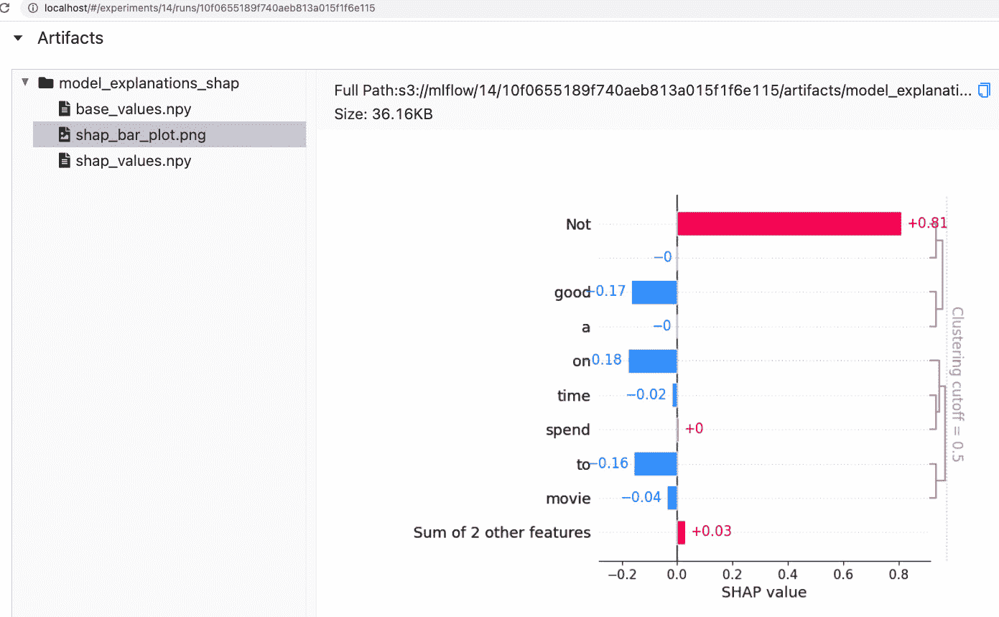
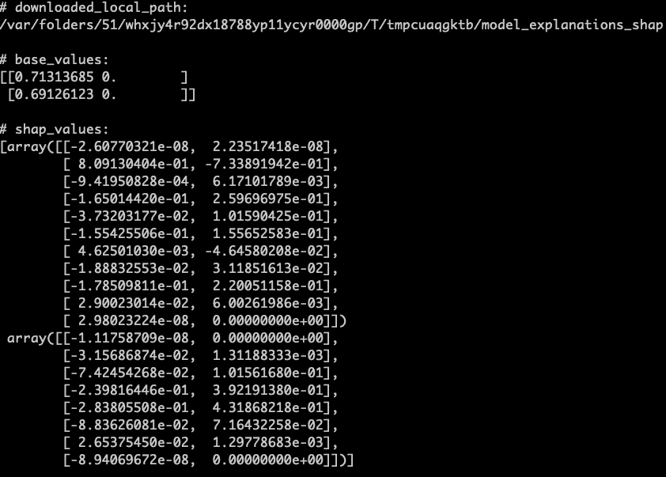
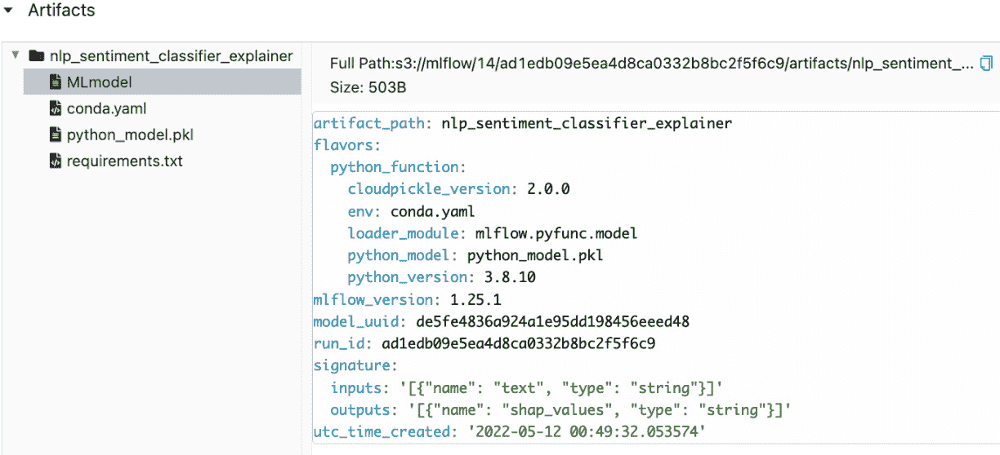
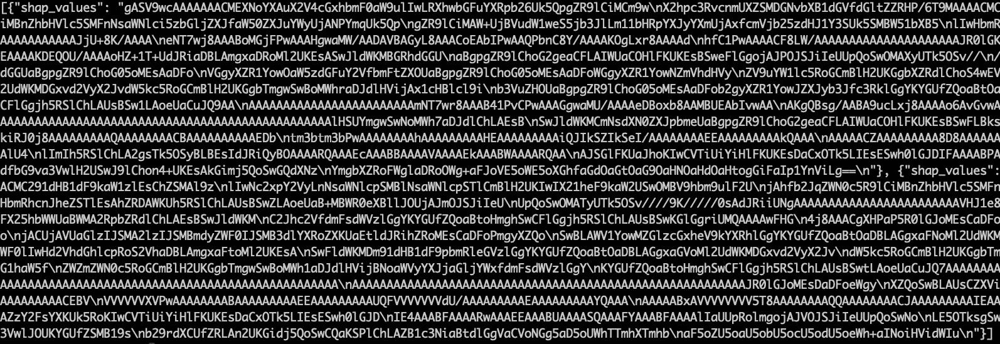

# *第十章*：使用 MLflow 实现深度学习可解释性

**深度学习**（**DL**）可解释性的重要性在前一章中已有充分讨论。为了在实际项目中实现深度学习可解释性，最好像其他模型工件一样，将解释器和解释作为工件记录在 MLflow 服务器中，这样我们就可以轻松跟踪和重现解释。将 SHAP（[`github.com/slundberg/shap`](https://github.com/slundberg/shap)）等深度学习可解释性工具与 MLflow 集成，可以支持不同的实现机制，理解这些集成如何应用于我们的深度学习可解释性场景是非常重要的。本章将探讨通过使用不同的 MLflow 功能将 SHAP 解释集成到 MLflow 中的几种方法。由于可解释性工具和深度学习模型都在快速发展，我们还将重点介绍使用 MLflow 实现深度学习可解释性时的当前限制和解决方法。到本章结束时，你将能够使用 MLflow API 实现 SHAP 解释和解释器，从而实现可扩展的模型可解释性。

本章将涵盖以下主要内容：

+   理解当前的 MLflow 可解释性集成

+   使用 MLflow 工件日志记录 API 实现 SHAP 解释

+   使用 MLflow pyfunc API 实现 SHAP 解释器

# 技术要求

完成本章所需的以下要求：

+   完整的 MLflow 本地服务器：这与我们自*第三章*以来一直使用的服务器相同，*跟踪模型、参数和指标*。

+   SHAP Python 库：[`github.com/slundberg/shap`](https://github.com/slundberg/shap)。

+   Spark 3.2.1 和 PySpark 3.2.1：请参阅本章 GitHub 仓库中的 `README.md` 文件了解详细信息。

+   本章 GitHub 仓库中的代码：[`github.com/PacktPublishing/Practical-Deep-Learning-at-Scale-with-MLFlow/tree/main/chapter10`](https://github.com/PacktPublishing/Practical-Deep-Learning-at-Scale-with-MLFlow/tree/main/chapter10)。

# 理解当前的 MLflow 可解释性集成

MLflow 支持多种可解释性集成方式。在实现可解释性时，我们提到两种类型的工件：解释器和解释：

+   解释器是一个可解释性模型，常见的模型是 SHAP 模型，其中可能有多种 SHAP 解释器，如 **TreeExplainer**、**KernelExplainer** 和 **PartitionExplainer**（[`shap.readthedocs.io/en/latest/generated/shap.explainers.Partition.html`](https://shap.readthedocs.io/en/latest/generated/shap.explainers.Partition.html)）。为了提高计算效率，我们通常选择 **PartitionExplainer** 来处理深度学习模型。

+   解释是一个产物，它展示了某种形式的输出，可能是文本、数值或图表。解释可以发生在离线训练或测试中，或者发生在在线生产中。因此，如果我们想知道模型为何给出某些预测，我们应该能够提供一个离线评估的解释器或一个在线查询的解释器端点。

在这里，我们简要概述了截至 MLflow 版本 1.25.1（[`pypi.org/project/mlflow/1.25.1/`](https://pypi.org/project/mlflow/1.25.1/)）的当前功能。使用 MLflow 进行可解释性的方式有四种，如下所示：

+   使用 `mlflow.log_artifact` API（[`www.mlflow.org/docs/latest/python_api/mlflow.html#mlflow.log_artifact`](https://www.mlflow.org/docs/latest/python_api/mlflow.html#mlflow.log_artifact)）记录相关的解释产物，如条形图和 Shapley 值数组。这为记录解释提供了最大的灵活性。无论是离线批处理处理，还是在线自动记录某一预测的 SHAP 条形图，都可以使用该功能。需要注意的是，在在线生产场景中为每个预测记录解释是非常昂贵的，因此我们应为按需查询提供一个单独的解释 API。

+   使用 `mlflow.pyfunc.PythonModel` API（[`www.mlflow.org/docs/latest/python_api/mlflow.pyfunc.html#mlflow.pyfunc.PythonModel`](https://www.mlflow.org/docs/latest/python_api/mlflow.pyfunc.html#mlflow.pyfunc.PythonModel)）来创建一个解释器，该解释器可以通过 MLflow 的 `pyfunc` 方法进行记录和加载，`mlflow.pyfunc.log_model` 用于记录，`mlflow.pyfunc.load_model` 或 `mlflow.pyfunc.spark_udf` 用于加载解释器。这为我们提供了最大灵活性，可以将自定义解释器作为 MLflow 通用的 `pyfunc` 模型创建，并且可以用于离线批处理解释或在线提供**解释即服务**（**EaaS**）。

+   使用`mlflow.shap` API（[`www.mlflow.org/docs/latest/python_api/mlflow.shap.html`](https://www.mlflow.org/docs/latest/python_api/mlflow.shap.html)）。该 API 存在一些限制。例如，`mlflow.shap.log_explainer`方法仅支持 scikit-learn 和 PyTorch 模型。`mlflow.shap.log_explanation`方法仅支持`shap.KernelExplainer`（[`shap-lrjball.readthedocs.io/en/latest/generated/shap.KernelExplainer.html`](https://shap-lrjball.readthedocs.io/en/latest/generated/shap.KernelExplainer.html)）。这非常消耗计算资源，因为计算时间会随着特征数量的增加呈指数增长；因此，甚至对于中等规模的数据集，也无法计算解释（请参阅已发布的 GitHub 问题[`github.com/mlflow/mlflow/issues/4071`](https://github.com/mlflow/mlflow/issues/4071)）。MLflow 提供的现有示例仅适用于 scikit-learn 包中的经典机器学习模型，如线性回归或随机森林，并没有提供深度学习模型的解释示例（[`github.com/mlflow/mlflow/tree/master/examples/shap`](https://github.com/mlflow/mlflow/tree/master/examples/shap)）。我们将在本章后面的章节中展示，当前该 API 不支持基于 transformers 的 SHAP 解释器和解释，因此在本章中我们将不使用该 API。我们将在讲解本章示例时突出一些问题。

+   使用`mlflow.evaluate` API（[`www.mlflow.org/docs/latest/python_api/mlflow.html#mlflow.evaluate`](https://www.mlflow.org/docs/latest/python_api/mlflow.html#mlflow.evaluate)）。该 API 可以在模型训练和测试之后用于评估。这是一个实验性功能，未来可能会有所变化。它支持 MLflow `pyfunc`模型。然而，它有一些限制：评估数据集的标签值必须是数字或布尔值，所有特征值必须是数字，每个特征列必须只包含标量值（[`www.mlflow.org/docs/latest/models.html#model-evaluation`](https://www.mlflow.org/docs/latest/models.html#model-evaluation)）。同样，MLflow 提供的现有示例仅适用于 scikit-learn 包中的经典机器学习模型（[`github.com/mlflow/mlflow/tree/master/examples/evaluation`](https://github.com/mlflow/mlflow/tree/master/examples/evaluation)）。我们可以使用该 API 仅记录 NLP 情感模型的分类器指标，但该 API 会自动跳过解释部分，因为它要求特征列包含标量值（NLP 模型的输入是文本输入）。因此，这不适用于我们需要的深度学习模型可解释性。所以，我们在本章中将不使用该 API。

鉴于某些 API 仍处于实验阶段并且还在不断发展，用户应注意限制和解决方法，以便成功实现 MLflow 的可解释性。在本章中，我们将学习如何实现深度学习模型的可解释性，使用 MLflow 来实现这一点相当具有挑战性，因为 MLflow 与 SHAP 的集成仍在进行中（截至 MLflow 版本 1.25.1）。在接下来的章节中，我们将学习何时以及如何使用这些不同的 API 来实现解释，并记录和加载深度学习模型的解释器。

# 使用 MLflow 工件记录 API 实现 SHAP 解释

MLflow 有一个通用的跟踪 API，可以记录任何工件：`mlflow.log_artifact`。然而，MLflow 文档中给出的示例通常使用 scikit-learn 和表格型数值数据进行训练、测试和解释。在这里，我们希望展示如何使用`mlflow.log_artifact`来记录与 NLP 情感分析深度学习模型相关的工件，如 Shapley 值数组和 Shapley 值条形图。您可以查看本章 GitHub 仓库中的 Python VS Code 笔记本`shap_mlflow_log_artifact.py`（[`github.com/PacktPublishing/Practical-Deep-Learning-at-Scale-with-MLFlow/blob/main/chapter10/notebooks/shap_mlflow_log_artifact.py`](https://github.com/PacktPublishing/Practical-Deep-Learning-at-Scale-with-MLFlow/blob/main/chapter10/notebooks/shap_mlflow_log_artifact.py)），以便按照步骤操作：

1.  请确保您已准备好相关的前提条件，包括本地完整的 MLflow 服务器和 conda 虚拟环境。请按照`README.md`文件中的说明（[`github.com/PacktPublishing/Practical-Deep-Learning-at-Scale-with-MLFlow/blob/main/chapter10/README.md`](https://github.com/PacktPublishing/Practical-Deep-Learning-at-Scale-with-MLFlow/blob/main/chapter10/README.md)）中的步骤，确保这些内容已就绪，文件位于 *第十章* 文件夹中。

1.  在开始运行本章任何代码之前，请确保按照如下方式激活`chapter10-dl-explain`虚拟环境：

    ```py
    conda activate chapter10-dl-explain
    ```

1.  在笔记本开头导入相关库，如下所示：

    ```py
    import os
    import matplotlib.pyplot as plt
    import mlflow
    from mlflow.tracking import MlflowClient
    from mlflow.utils.file_utils import TempDir
    import shap
    import transformers
    from shap.plots import *
    import numpy as np
    ```

1.  下一步是设置一些环境变量。前三个环境变量用于本地 MLflow URI，第四个用于禁用由于已知 Hugging Face 标记化问题而产生的 Hugging Face 警告：

    ```py
    os.environ["AWS_ACCESS_KEY_ID"] = "minio"
    os.environ["AWS_SECRET_ACCESS_KEY"] = "minio123"
    os.environ["MLFLOW_S3_ENDPOINT_URL"] = "http://localhost:9000"
    os.environ["TOKENIZERS_PARALLELISM"] = "False"
    ```

1.  我们还需要设置 MLflow 实验，并将 MLflow 实验 ID 作为输出显示在屏幕上：

    ```py
    EXPERIMENT_NAME = "dl_explain_chapter10"
    mlflow.set_tracking_uri('http://localhost')
    mlflow.set_experiment(EXPERIMENT_NAME)
    experiment = mlflow.get_experiment_by_name(EXPERIMENT_NAME)
    print("experiment_id:", experiment.experiment_id)
    ```

如果您已经运行了该笔记本，应该能看到类似如下的输出：

```py
experiment_id: 14
```

这意味着实验名称为`dl_explain_chapter10`的 MLflow 实验 ID 是`14`。请注意，您也可以按照如下方式将 MLflow 跟踪 URI 设置为环境变量：

```py
export MLFLOW_TRACKING_URI=http://localhost
```

在这里，我们使用 MLflow 的`mlflow.set_tracking_uri` API 来定义 URI 位置。两种方式都可以。

1.  现在我们可以创建一个 DL 模型，使用 Hugging Face 的 transformer pipeline API 将一句话分类为正面或负面情感。由于这个模型已经进行过微调，我们将重点放在如何获取该模型的解释器和解释内容，而不是如何训练或微调模型：

    ```py
    dl_model = transformers.pipeline('sentiment-analysis', return_all_scores=False)
    explainer = shap.Explainer(dl_model)
    shap_values = explainer(["Not a good movie to spend time on.", "This is a great movie."])
    ```

这些代码片段创建了一个情感分析模型`dl_model`，然后为该模型创建一个 SHAP `explainer`。接着，我们为这个解释器提供了一个包含两句话的列表，以获取 `shap_values` 对象。该对象将用于在 MLflow 中记录。

给定 `shap_values` 对象，我们现在可以开始一个新的 MLflow 运行，并记录 Shapley 值和我们在上一章中看到的条形图（*第九章**，深度学习可解释性基础*）。第一行代码确保所有活跃的 MLflow 运行都已结束。如果我们想多次交互性地重新运行这段代码，这非常有用：

```py
mlflow.end_run()
```

然后我们定义两个常量。一个是`artifact_root_path`，用于 MLflow 工件存储中的根路径，将用于存储所有 SHAP 解释对象。另一个是`shap_bar_plot`，用于工件文件名，将用于条形图图形：

```py
artifact_root_path = "model_explanations_shap"
artifact_file_name = 'shap_bar_plot'
```

1.  然后我们开始一个新的 MLflow 运行，在该运行中，我们将生成并记录三个 SHAP 文件到 MLflow 工件存储中，路径为 `model_explanations_shap`：

    ```py
    with mlflow.start_run() as run:
       with TempDir() as temp_dir:
            temp_dir_path = temp_dir.path()
            print("temp directory for artifacts: {}".format(temp_dir_path))
    ```

我们还需要一个临时的本地目录，如前面的代码片段所示，用来先保存 SHAP 文件，然后再将这些文件记录到 MLflow 服务器。如果你已经运行到此步骤，你应该在输出中看到一个类似以下的临时目录：

```py
temp directory for artifacts: /var/folders/51/whxjy4r92dx18788yp11ycyr0000gp/T/tmpgw520wu1
```

1.  现在我们准备生成并保存 SHAP 文件。第一个是条形图，这个稍微有点复杂，保存和记录起来有点难度。让我们一起看看以下代码，了解我们是如何做到的：

    ```py
    try:
         plt.clf()
         plt.subplots_adjust(bottom=0.2, left=0.4)
         shap.plots.bar(shap_values[0, :, "NEGATIVE"],
                        show=False)
         plt.savefig(f"{temp_dir_path}/{artifact_file_name}")
    finally:
         plt.close(plt.gcf())
    mlflow.log_artifact(f"{temp_dir_path}/{artifact_file_name}.png", artifact_root_path)
    ```

请注意，我们使用了 `matplotlib.pyplot`，并将其导入为 `plt`，首先通过 `plt.clf()` 清除图形，然后创建一个具有一些调整的子图。在这里，我们定义了 `bottom=0.2`，意味着子图底部边缘的位置位于图形高度的 20%。同样，我们调整了子图的左边缘。然后，我们使用 `shap.plots.bar` SHAP API 绘制第一句话的特征贡献的条形图，但将 `show` 参数设置为 `False`。这意味着我们在交互式运行中看不到该图，但图形会存储在 pyplot `plt` 变量中，然后可以使用 `plt.savefig` 将其保存到本地临时目录，文件名前缀为 `shap_bar_plot`。`pyplot` 会在文件保存后自动添加文件扩展名 `.png`。因此，这会将名为 `shap_bar_plot.png` 的本地图像文件保存到临时文件夹中。最后的语句调用了 MLflow 的 `mlflow.log_artifact`，将此 PNG 文件上传到 MLflow 跟踪服务器的工件存储的根文件夹 `model_explanations_shap`。我们还需要确保通过调用 `plt.close(plt.gcf())` 来关闭当前图形。

1.  除了将 `shap_bar_plot.png` 日志记录到 MLflow 服务器外，我们还希望将 Shapley `base_values` 数组和 `shap_values` 数组作为 NumPy 数组记录到 MLflow 跟踪服务器中。这可以通过以下语句实现：

    ```py
    np.save(f"{temp_dir_path}/shap_values", 
            shap_values.values)
    np.save(f"{temp_dir_path}/base_values", 
            shap_values.base_values)
            mlflow.log_artifact(
                f"{temp_dir_path}/shap_values.npy", 
                artifact_root_path)
            mlflow.log_artifact(
                f"{temp_dir_path}/base_values.npy", 
                artifact_root_path)      
    ```

这将首先在本地临时文件夹中保存 `shap_values.npy` 和 `base_values.npy` 的本地副本，然后将其上传到 MLflow 跟踪服务器的工件存储中。

1.  如果你按照笔记本的步骤操作到这里，你应该能够在本地 MLflow 服务器中验证这些工件是否成功存储。前往本地主机上的 MLflow UI – `http://localhost/`，然后找到实验 `dl_explain_chapter10`。你应该能够找到刚刚运行的实验。它应该类似于 *图 10.1*，在那里你可以在 `model_explanations_shap` 文件夹中找到三个文件：`base_values.npy`、`shap_bar_plot.png` 和 `shap_values.npy`。*图 10.1* 显示了句子 `Not a good movie to spend time on` 的预测结果的不同标记或词汇的特征贡献条形图。此实验页面的 URL 类似于以下内容：

    ```py
    http://localhost/#/experiments/14/runs/10f0655189f740aeb813a015f1f6e115
    ```



图 10.1 – MLflow log_artifact API 将 SHAP 条形图作为图像保存到 MLflow 跟踪服务器

或者，您也可以使用代码以编程方式下载存储在 MLflow 跟踪服务器中的这些文件并在本地查看。我们在笔记本的最后一个单元格中提供了这样的代码。

1.  如果你运行笔记本代码中的最后一个单元格，该单元格用于从我们刚才保存的 MLflow 服务器下载这三个文件并打印它们，你应该能够看到以下输出，如*图 10.2*所示。从 MLflow 跟踪服务器下载工件的机制是使用`MlflowClient().download_artifacts` API，你需要提供 MLflow 运行 ID（在我们的示例中是`10f0655189f740aeb813a015f1f6e115`）和工件根路径`model_explanations_shap`作为 API 的参数：

    ```py
    downloaded_local_path = MlflowClient().download_artifacts(run.info.run_id, artifact_root_path)
    ```

这将把`model_explanations_shap`文件夹中的所有文件从 MLflow 跟踪服务器下载到本地路径，返回的变量为`downloaded_local_path`：



图 10.2 – 从 MLflow 跟踪服务器下载 SHAP 的 base_values 和 shap_values 数组到本地路径并显示它们

要显示这两个 NumPy 数组，我们需要调用 NumPy 的`load` API 来加载它们，然后打印它们：

```py
base_values = np.load(os.path.join(downloaded_local_path, "base_values.npy"), allow_pickle=True)
shap_values = np.load(os.path.join(downloaded_local_path, "shap_values.npy"), allow_pickle=True)
```

请注意，当调用`np.load` API 时，我们需要将`allow_pickle`参数设置为`True`，以便 NumPy 可以正确地将这些文件加载回内存。

虽然你可以在 VS Code 环境中交互式运行这个笔记本，但你也可以按如下方式在命令行中运行它：

```py
python shap_mlflow_log_artifact.py
```

这将产生所有控制台输出，并将所有工件记录到 MLflow 服务器中，正如我们在交互式运行笔记本时所看到的。

如果你已经运行了到目前为止的代码，恭喜你成功实现了使用 MLflow 的`mlflow.log_artifact` API 将 SHAP 解释记录到 MLflow 跟踪服务器！

尽管记录所有解释的过程看起来有些冗长，但这种方法确实有一个优点，即不依赖于使用何种解释器，因为解释器是在 MLflow 工件日志 API 之外定义的。

在下一节中，我们将看到如何使用内置的`mlflow.pyfunc.PythonModel` API 将 SHAP 解释器记录为 MLflow 模型，然后将其部署为端点或像通用的 MLflow `pyfunc`模型一样在批处理模式中使用。

# 使用 MLflow pyfunc API 实现 SHAP 解释器

正如我们在前一节中了解到的，SHAP 解释器可以在需要时离线使用，只需通过 SHAP API 创建一个新的解释器实例。然而，由于底层的深度学习模型通常会被记录到 MLflow 服务器中，因此希望将相应的解释器也记录到 MLflow 服务器中，这样我们不仅可以跟踪深度学习模型，还能跟踪它们的解释器。此外，我们还可以使用通用的 MLflow pyfunc 模型日志和加载 API 来处理解释器，从而统一访问深度学习模型及其解释器。

在本节中，我们将一步一步学习如何将 SHAP 解释器实现为一个通用的 MLflow pyfunc 模型，并如何将其用于离线和在线解释。我们将把过程分为三个小节：

+   创建并记录 MLflow pyfunc 解释器

+   部署 MLflow pyfunc 解释器用于 EaaS

+   使用 MLflow pyfunc 解释器进行批量解释

让我们从创建和记录 MLflow pyfunc 解释器的第一小节开始。

## 创建并记录 MLflow pyfunc 解释器

为了跟随本节内容，请查看 GitHub 仓库中的`nlp_sentiment_classifier_explainer.py`文件（[`github.com/PacktPublishing/Practical-Deep-Learning-at-Scale-with-MLFlow/blob/main/chapter10/pipeline/nlp_sentiment_classifier_explainer.py`](https://github.com/PacktPublishing/Practical-Deep-Learning-at-Scale-with-MLFlow/blob/main/chapter10/pipeline/nlp_sentiment_classifier_explainer.py)）：

1.  首先，通过子类化`mlflow.pyfunc.PythonModel`，我们可以创建一个定制的 MLflow 模型，该模型封装了一个 SHAP 解释器。因此，按如下方式声明此类：

    ```py
    class SentimentAnalysisExplainer(mlflow.pyfunc.PythonModel):
    ```

1.  接下来，我们需要实例化一个解释器。我们将不在这个类的`init`方法中创建解释器，而是使用`load_context`方法为 Hugging Face NLP 情感分析分类器加载一个 SHAP 解释器，如下所示：

    ```py
    def load_context(self, context):
      from transformers import pipeline
      import shap
      self.explainer = shap.Explainer(pipeline('sentiment-analysis', return_all_scores=True))
    ```

这将在每次执行`SentimentAnalysisExplainer`类时创建一个 SHAP 解释器。请注意，情感分类器是一个 Hugging Face 管道对象，`return_all_scores`参数设置为`True`。这意味着它将返回每个输入文本的正负情感标签和概率得分。

避免 SHAP 解释器的运行时错误

如果我们在此类的`init`方法中实现`self.explainer`，则会遇到与 SHAP 包的`_masked_model.py`文件相关的运行时错误，该错误抱怨`init`方法将被 MLflow 序列化，因此很明显，这个运行时错误来自 MLflow 的序列化。然而，在`load_context`函数中实现`self.explainer`可以避免 MLflow 的序列化，并且在运行时调用这个解释器时能正常工作。

1.  然后我们将实现`sentiment_classifier_explanation`方法，该方法接收一个 pandas DataFrame 行作为输入，并生成一个已保存的`shap_values`输出，作为单行文本输入的解释：

    ```py
    def sentiment_classifier_explanation(self, row):
      shap_values = self.explainer([row['text']])
      return [pickle.dumps(shap_values)]
    ```

请注意，我们需要使用一对方括号将 `row['text']` 的值括起来，使其成为一个列表，而不仅仅是单一的值。这是因为这个 SHAP 解释器期望的是一个文本列表，而不是单一的字符串。如果我们不将值放入方括号中，解释器会按字符拆分整个字符串，将每个字符当作一个单词，这不是我们想要的。一旦我们从解释器获得了作为 `shap_values` 的 Shapley 值输出，我们就需要使用 `pickle.dumps` 对其进行序列化，然后再返回给调用方。MLflow pyfunc 模型的输入输出签名不支持未序列化的复杂对象，因此这一步的 pickling 确保了模型输出签名符合 MLflow 的要求。稍后我们将在 *第 5 步* 中看到这个 MLflow pyfunc 解释器的输入输出签名的定义。

1.  接下来，我们需要为这个类实现所需的 `predict` 方法。这将应用 `sentiment_classifier_explanation` 方法到整个输入的 pandas DataFrame，如下所示：

    ```py
    def predict(self, context, model_input):
      model_input[['shap_values']] = model_input.apply(
        self.sentiment_classifier_explanation, axis=1, 
        result_type='expand')
      model_input.drop(['text'], axis=1, inplace=True)
      return model_input
    ```

这将为输入 pandas DataFrame 中的 `text` 列的每一行生成一个新的列，命名为 `shap_values`。然后我们删除 `text` 列，返回一个单列的 `shap_values` DataFrame 作为最终的预测结果：在这种情况下，解释结果以 DataFrame 的形式呈现。

1.  现在我们已经实现了 `SentimentAnalysisExplainer` 类，可以使用标准的 MLflow pyfunc 模型日志记录 API 将此模型记录到 MLflow 跟踪服务器中。在进行 MLflow 日志记录之前，让我们确保声明此解释器的模型签名，如下所示：

    ```py
    input = json.dumps([{'name': 'text', 'type': 'string'}])
    output = json.dumps([{'name': 'shap_values', 'type': 'string'}])
    signature = ModelSignature.from_dict({'inputs': input, 'outputs': output})
    ```

这些语句声明了输入是一个包含单一 `string` 类型 `text` 列的 DataFrame，输出是一个包含单一 `string` 类型 `shap_values` 列的 DataFrame。回想一下，这个 `shap_values` 列是一个经过 pickled 序列化的字节串，包含了 Shapley 值对象。

1.  最后，我们可以在任务方法中使用 `mlflow.pyfunc.log_model` 方法实现解释器日志记录步骤，如下所示：

    ```py
    with mlflow.start_run() as mlrun:          
      mlflow.pyfunc.log_model(
        artifact_path=MODEL_ARTIFACT_PATH, 
        conda_env=CONDA_ENV,                           
        python_model=SentimentAnalysisExplainer(), 
        signature=signature)
    ```

我们在 `log_model` 方法中使用了四个参数。`MODEL_ARTIFACT_PATH` 是 MLflow 跟踪服务器中存储解释器的文件夹名称。这里，值在你查看的 Python 文件中定义为 `nlp_sentiment_classifier_explainer`。`CONDA_ENV` 是本章根目录中的 `conda.yaml` 文件。`python_model` 参数是我们刚刚实现的 `SentimentAnalysisExplainer` 类，`signature` 是我们定义的解释器输入输出签名。

1.  现在我们已经准备好按如下方式在命令行运行整个文件：

    ```py
    python nlp_sentiment_classifier_explainer.py
    ```

假设你已经根据 GitHub 仓库中本章的 `README.md` 文件正确设置了本地 MLflow 跟踪服务器和环境变量，那么在控制台输出中将生成以下两行：

```py
2022-05-11 17:49:32,181 Found credentials in environment variables.
2022-05-11 17:49:32,384 finished logging nlp sentiment classifier explainer run_id: ad1edb09e5ea4d8ca0332b8bc2f5f6c9
```

这意味着我们已经成功地将解释器记录到本地的 MLflow 跟踪服务器中。

1.  在 Web 浏览器中访问 `http://localhost/`，然后点击 `dl_explain_chapter10` 实验文件夹。你应该能在 `nlp_sentiment_classifier_explainer` 下的 `Artifacts` 文件夹中找到此运行和记录的解释器，它应该如*图 10.3*所示：



图 10.3 – SHAP 解释器作为 MLflow pyfunc 模型被记录

请注意，*图 10.3* 中显示的 `MLmodel` 元数据与我们之前记录为 MLflow pyfunc 模型的普通 DL 推理流水线差别不大，除了 `artifact_path` 名称和 `signature`。这就是使用这种方法的优势，因为现在我们可以使用通用的 MLflow pyfunc 模型方法来加载此解释器或将其作为服务部署。

mlflow.shap.log_explainer API 的问题

正如我们之前提到的，MLflow 提供了一个 `mlflow.shap.log_explainer` API，它提供了一种记录解释器的方法。然而，这个 API 不支持我们的 NLP 情感分类器解释器，因为我们的 NLP 流水线不是 MLflow 当前支持的已知模型类型。因此，即使 `log_explainer` 能将该解释器对象写入跟踪服务器，当通过 `mlflow.shap.load_explainer` API 将解释器加载回内存时，它会因以下错误消息而失败：`mlflow.shap.log_explainer` API 在本书中的问题。

现在我们有了已记录的解释器，可以通过两种方式使用它：将其部署到 Web 服务中，以便我们可以创建一个端点来建立 EaaS，或者直接通过 MLflow pyfunc 的 `load_model` 或 `spark_udf` 方法使用 MLflow 的 `run_id` 加载解释器。让我们从设置本地 Web 服务来开始部署。

## 部署 MLflow pyfunc 解释器以进行 EaaS

由于现在 SHAP 解释器就像一个通用的 MLflow pyfunc 模型，我们可以按标准 MLflow 方式设置一个本地 EaaS。请按照以下步骤查看如何在本地实现：

1.  运行以下 MLflow 命令，以为我们刚刚记录的解释器设置本地 Web 服务。此示例中的 `run_id` 是 `ad1edb09e5ea4d8ca0332b8bc2f5f6c9`：

    ```py
    mlflow models serve -m runs:/ ad1edb09e5ea4d8ca0332b8bc2f5f6c9/nlp_sentiment_classifier_explainer
    ```

这将产生以下控制台输出：


图 10.4 – SHAP EaaS 控制台输出

请注意，在*图 10.4*中，默认的预训练语言模型在 `gunicore` HTTP 服务器启动并运行后加载。这是因为我们实现的解释器位于 `load_context` 方法中，这正是预期的行为：在 Web 服务启动并运行后立即加载解释器。

1.  在另一个终端窗口中，输入以下命令以调用本地主机端口 `5000` 上的解释器 Web 服务，并输入两个示例文本：

    ```py
    curl -X POST -H "Content-Type:application/json; format=pandas-split" --data '{"columns":["text"],"data":[["This is meh weather"], ["This is great weather"]]}' http://127.0.0.1:5000/invocations
    ```

这将产生以下输出：



图 10.5 - 调用我们的 SHAP EaaS 后 DataFrame 中的响应

请注意，在*图 10.5*中，列名为 `shap_values`，而其值为 pickle 序列化的字节十六进制数据。这些数据并不易于阅读，但可以在调用方使用`pickle.loads`方法将其转换回原始的 `shap_values`。因此，如果您看到类似*图 10.5*的响应输出，恭喜您已经设置了本地 EaaS！您可以像其他 MLflow 服务部署一样部署此解释器服务，正如*第八章**，在规模上部署 DL 推理管道*中描述的那样，因为此解释器现在可以像通用的 MLflow pyfunc 模型服务一样调用。

接下来，我们将看到如何使用 MLflow pyfunc 解释器进行批量解释。

## 使用 MLflow pyfunc 解释器进行批量解释

有两种方法可以使用 MLflow pyfunc 解释器实现离线批量解释：

+   将 pyfunc 解释器加载为 MLflow pyfunc 模型，以解释给定的 pandas DataFrame 输入。

+   将 pyfunc 解释器加载为 PySpark UDF 以解释给定的 PySpark DataFrame 输入。

让我们从将解释器作为 MLflow pyfunc 模型加载开始。

### 将 MLflow pyfunc 解释器加载为 MLflow pyfunc 模型

正如我们之前提到的，消费 MLflow 记录的解释器的另一种方法是直接在本地 Python 代码中使用 MLflow 的 pyfunc `load_model`方法加载解释器，而不是将其部署为 Web 服务。这非常直接，我们将向您展示如何完成。您可以在 GitHub 存储库中的`shap_mlflow_pyfunc_explainer.py`文件中查看代码（[`github.com/PacktPublishing/Practical-Deep-Learning-at-Scale-with-MLFlow/blob/main/chapter10/notebooks/shap_mlflow_pyfunc_explainer.py`](https://github.com/PacktPublishing/Practical-Deep-Learning-at-Scale-with-MLFlow/blob/main/chapter10/notebooks/shap_mlflow_pyfunc_explainer.py))：

1.  第一步是将记录的解释器加载回内存。以下代码使用 `mlflow.pyfunc.load_model` 和解释器 `run_id` URI 来实现这一点：

    ```py
    run_id = "ad1edb09e5ea4d8ca0332b8bc2f5f6c9"
    logged_explainer = f'runs:/{run_id}/nlp_sentiment_classifier_explainer'
    explainer = mlflow.pyfunc.load_model(logged_explainer)
    ```

这应该加载解释器，就像它只是一个通用的 MLflow pyfunc 模型一样。我们可以通过运行以下代码打印解释器的元数据：

```py
explainer
```

这将显示以下输出：

```py
mlflow.pyfunc.loaded_model: artifact_path: nlp_sentiment_classifier_explainer flavor: mlflow.pyfunc.model run_id: ad1edb09e5ea4d8ca0332b8bc2f5f6c9
```

这意味着这是一个`mlflow.pyfunc.model`风格，这是个好消息，因为我们可以使用相同的 MLflow pyfunc API 来使用这个解释器。

1.  接下来，我们将获取一些示例数据来测试新加载的解释器：

    ```py
    import datasets
    dataset = datasets.load_dataset("imdb", split="test")
    short_data = [v[:500] for v in dataset["text"][:20]]
    df_test = pd.DataFrame (short_data, columns = ['text'])
    ```

这将加载 IMDb 测试数据集，将每个评论文本截断为 500 个字符，并选择前 20 行，以便为下一步的解释创建一个 pandas DataFrame。

1.  现在，我们可以按如下方式运行解释器：

    ```py
    results = explainer.predict(df_test)
    ```

这将为输入 DataFrame `df_test` 运行 SHAP 分区解释器。当运行时，它将显示 DataFrame 的每一行的以下输出：

```py
Partition explainer: 2it [00:38, 38.67s/it]
```

结果将是一个包含单列`shap_values`的 pandas DataFrame。这可能需要几分钟时间，因为它需要对每一行进行分词、执行解释器并序列化输出。

1.  一旦解释器执行完毕，我们可以通过反序列化行内容来检查结果。以下是检查第一行输出的代码：

    ```py
    results_deserialized = pickle.loads(results['shap_values'][0])
    print(results_deserialized)
    ```

这将打印出第一行的`shap_values`。*图 10.6*展示了`shap_values`输出的部分截图：


图 10.6 – 解释中反序列化`shap_values`的部分输出

正如在*图 10.6*中所看到的，`shap_values`的输出与我们在*第九章**《深度学习可解释性基础》*中学到的没有什么不同，当时我们没有使用 MLflow 记录和加载解释器。我们还可以生成 Shapley 文本图，以突出文本对预测情感的贡献。

1.  在笔记本中运行以下语句以查看 Shapley 文本图：

    ```py
    shap.plots.text(results_deserialized[:,:,"POSITIVE"])
    ```

这将生成一个如*图 10.7*所示的图：


图 10.7 – 使用我们通过 MLflow 记录的解释器反序列化`shap_values`生成的 Shapley 文本图

如*图 10.7*所示，这条评论具有正面情感，贡献于预测情感的关键词或短语包括`good`、`love`以及其他一些以红色标记的短语。当你看到这个 Shapley 文本图时，应该为自己鼓掌，因为你已经学会了如何使用 MLflow 记录的解释器来生成批量解释。

如在这一批量解释的逐步实现中提到的，使用这种 pyfunc 模型方法进行大规模批量解释会稍微慢一些。幸运的是，我们还有另一种方法可以使用 PySpark UDF 函数实现批量解释，我们将在下一个子章节中进行解释。

### 加载 pyfunc 解释器作为 PySpark UDF

对于可扩展的批量解释，我们可以利用 Spark 的分布式计算能力，这通过将 pyfunc 解释器作为 PySpark UDF 加载来支持。使用此功能不需要额外的工作，因为 MLflow pyfunc API 已经通过`mlflow.pyfunc.spark_udf`方法提供了这一功能。我们将一步步向你展示如何实现这种大规模解释：

1.  首先，确保你已经完成了`README.md`文件的操作（[`github.com/PacktPublishing/Practical-Deep-Learning-at-Scale-with-MLFlow/blob/main/chapter10/README.md`](https://github.com/PacktPublishing/Practical-Deep-Learning-at-Scale-with-MLFlow/blob/main/chapter10/README.md)），以安装 Spark，创建并激活`chapter10-dl-pyspark-explain`虚拟环境，并在运行 PySpark UDF 代码进行大规模解释之前设置所有环境变量。

1.  然后，您可以开始运行 VS Code 笔记本`shap_mlflow_pyspark_explainer.py`，您可以在 GitHub 仓库中查看：[`github.com/PacktPublishing/Practical-Deep-Learning-at-Scale-with-MLFlow/blob/main/chapter10/notebooks/shap_mlflow_pyspark_explainer.py`](https://github.com/PacktPublishing/Practical-Deep-Learning-at-Scale-with-MLFlow/blob/main/chapter10/notebooks/shap_mlflow_pyspark_explainer.py)。在`chapter10/notebooks/`目录下运行以下命令：

    ```py
    python shap_mlflow_pyspark_explainer.py
    ```

您将会得到显示在*图 10.8*中的最终输出，前面有相当多行输出在这些最后几行之前：


图 10.8 – PySpark UDF 解释器输出的前两行文本的 shap_values 以及它们的输入文本

正如在*图 10.8*中所示，PySpark UDF 解释器的输出是一个 PySpark DataFrame，包含两列：`text`和`shap_values`。`text`列是原始输入文本，而`shap_values`列包含了像我们在前面子节中使用 pandas DataFrame 时看到的 Shapley 值的 pickled 序列化形式。

现在让我们看看代码中发生了什么。我们将解释`shap_mlflow_pyspark_explainer.py`文件中的关键代码块。由于这是一个 VS Code 笔记本，您可以像我们刚刚在命令行中运行或在 VS Code IDE 窗口中交互式地运行它。

1.  第一个关键代码块是使用`mflow.pyfunc.spark_udf`方法加载解释器，如下所示：

    ```py
    spark = SparkSession.builder.appName("Batch explanation with MLflow DL explainer").getOrCreate()
    run_id = "ad1edb09e5ea4d8ca0332b8bc2f5f6c9"
    logged_explainer = f'runs:/{run_id}/nlp_sentiment_classifier_explainer'
    explainer = mlflow.pyfunc.spark_udf(spark, model_uri=logged_explainer, result_type=StringType())
    ```

第一条语句是初始化一个`SparkSession`变量，然后使用`run_id`将记录的解释器加载到内存中。运行解释器以获取元数据如下：

```py
explainer
```

我们将得到以下结果：

```py
<function mlflow.pyfunc.spark_udf.<locals>.udf(iterator: Iterator[Tuple[Union[pandas.core.series.Series, pandas.core.frame.DataFrame], ...]]) -> Iterator[pandas.core.series.Series]>
```

这意味着我们现在将 SHAP 解释器包装为 Spark UDF 函数。这允许我们在下一步直接对输入的 PySpark DataFrame 应用 SHAP 解释器。

1.  我们像以前一样加载 IMDb 测试数据集，以获得`short_data`列表，然后为测试数据集的前 20 行创建一个 PySpark DataFrame 以进行解释：

    ```py
    df_pandas = pd.DataFrame (short_data, columns = ['text'])
    spark_df = spark.createDataFrame(df_pandas)
    spark_df = spark_df.withColumn('shap_values', explainer())
    ```

注意最后一条语句，它使用 PySpark 的`withColumn`函数将一个新的`shap_values`列添加到输入 DataFrame `spark_df`中，该 DataFrame 最初只包含一个列`text`。这是使用 Spark 的并行和分布式计算能力的自然方式。如果您已经运行了使用 MLflow pyfunc `load_model`方法和当前 PySpark UDF 方法的前面的非 Spark 方法，您会注意到 Spark 方法即使在本地计算机上也运行得更快。这使我们能够为许多输入文本实例规模化地进行 SHAP 解释。

1.  最后，为了验证结果，我们展示了`spark_df` DataFrame 的前两行，这在*图 10.8*中有所说明。

现在，通过 MLflow 的 pyfunc Spark UDF 包装的 SHAP 解释器，我们可以自信地进行大规模批量解释。恭喜！

让我们在接下来的部分总结本章所学内容。

# 摘要

在本章中，我们首先回顾了可以用于实现可解释性的 MLflow API 中的现有方法。两个现有的 MLflow API，`mlflow.shap` 和 `mlflow.evaluate`，存在一定的局限性，因此不能用于我们需要的复杂深度学习模型和管道的可解释性场景。随后，我们重点介绍了在 MLflow API 框架内实现 SHAP 解释和解释器的两种主要方法：使用 `mlflow.log_artifact` 记录解释内容，以及使用 `mlflow.pyfunc.PythonModel` 记录 SHAP 解释器。使用 `log_artifact` API 可以将 Shapley 值和解释图记录到 MLflow 跟踪服务器中。而使用 `mlflow.pyfunc.PythonModel` 则可以将 SHAP 解释器作为 MLflow pyfunc 模型记录，从而为将 SHAP 解释器作为 Web 服务部署并创建 EaaS 端点提供了可能。同时，它也为通过 MLflow pyfunc 的 `load_model` 或 `spark_udf` API 执行大规模离线批量解释提供了可能。这使我们能够在大规模应用中为深度学习模型实现可解释性，增加了实现的信心。

随着可解释性领域的不断发展，MLflow 与 SHAP 及其他可解释性工具箱的集成也将持续改进。我们鼓励有兴趣的读者通过进一步阅读部分提供的链接，继续他们的学习之旅。祝愿大家持续学习和成长！

# 进一步阅读

+   大规模 Shapley 值：[`neowaylabs.github.io/data-science/shapley-values-at-scale/`](https://neowaylabs.github.io/data-science/shapley-values-at-scale/)

+   使用 PySpark 和 Pandas UDF 扩展 SHAP 计算：[`databricks.com/blog/2022/02/02/scaling-shap-calculations-with-pyspark-and-pandas-udf.html`](https://databricks.com/blog/2022/02/02/scaling-shap-calculations-with-pyspark-and-pandas-udf.html)

+   使用 Ray 分布式计算系统加速 Shapley 值计算：[`www.telesens.co/2020/10/05/speeding-up-shapley-value-computation-using-ray-a-distributed-computing-system/`](https://www.telesens.co/2020/10/05/speeding-up-shapley-value-computation-using-ray-a-distributed-computing-system/)

+   使用 LIME 和 SHAP 解释 NLP 模型：`medium.com/@kalia_65609/interpreting-an-nlp-model-with-lime-and-shap-834ccfa124e4`

+   MLflow 中的模型评估：[`databricks.com/blog/2022/04/19/model-evaluation-in-mlflow.html`](https://databricks.com/blog/2022/04/19/model-evaluation-in-mlflow.html)
