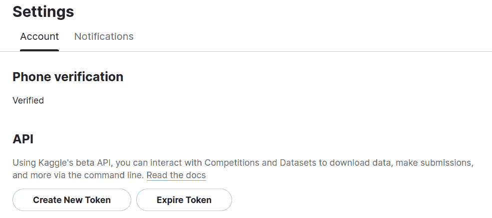
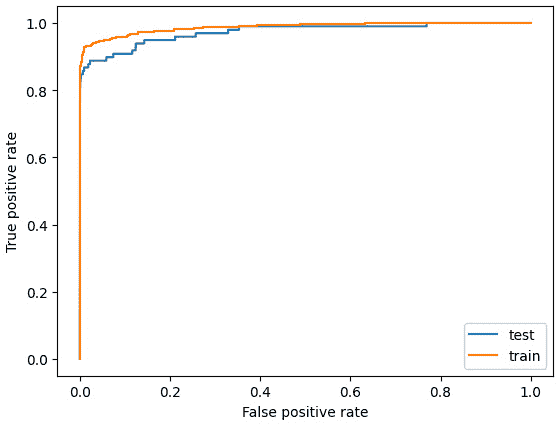
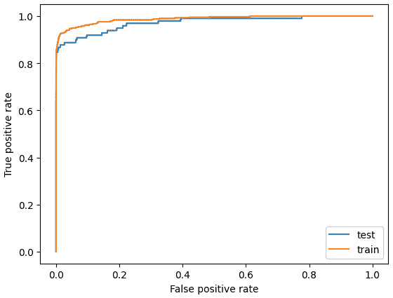
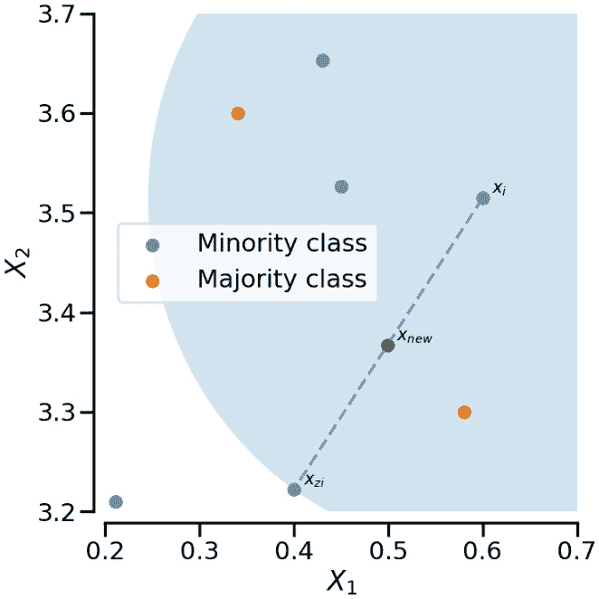

# 5

# 数据正则化

尽管有许多正则化方法可供模型使用（每个模型都有一套独特的超参数），但有时最有效的正则化方法来自于数据本身。事实上，有时即使是最强大的模型，如果数据没有事先正确转换，也无法达到良好的性能。

在本章中，我们将介绍一些有助于通过数据正则化模型的方法：

+   哈希高基数特征

+   聚合特征

+   对不平衡数据集进行欠采样

+   对不平衡数据集进行过采样

+   使用 SMOTE 对不平衡数据进行重采样

# 技术要求

在本章中，您将对数据应用几个技巧，并通过命令行重采样数据集或下载新数据。为此，您需要以下库：

+   NumPy

+   pandas

+   scikit-learn

+   imbalanced-learn

+   category_encoders

+   Kaggle API

# 哈希高基数特征

高基数特征是具有许多可能值的定性特征。高基数特征在许多应用中都会出现，例如客户数据库中的国家、广告中的手机型号，或 NLP 应用中的词汇。高基数问题可能是多方面的：不仅可能导致非常高维的数据集，而且随着越来越多的值的出现，它们还可能不断发展。事实上，即使国家数量或词汇的数据相对稳定，每周（如果不是每天）也会有新的手机型号出现。

哈希是一种非常流行且有用的处理这类问题的方法。在本章中，我们将了解它是什么，以及如何在实践中使用它来预测员工是否会离开公司。

## 入门

哈希是计算机科学中非常有用的技巧，广泛应用于密码学或区块链等领域。例如，它在处理高基数特征时也在机器学习中非常有用。它本身不一定有助于正则化，但有时它可能是一个副作用。

### 什么是哈希？

哈希通常在生产环境中用于处理高基数特征。高基数特征往往具有越来越多的可能结果。这些结果可能包括诸如手机型号、软件版本、商品 ID 等。在这种情况下，使用独热编码（one-hot encoding）处理高基数特征可能会导致一些问题：

+   所需空间不是固定的，无法控制

+   我们需要弄清楚如何编码一个新值

使用哈希代替独热编码可以解决这些限制。

为此，我们必须使用一种哈希函数，它将输入转换为一个可控的输出。一种著名的哈希函数是`md5`。如果我们对一些字符串应用`md5`，我们将得到如下结果：

```py
from hashlib import md5
print('hashing of "regularization" ->',
    md5(b'regularization').hexdigest())
print('hashing of "regularized" ->',
    md5(b'regularized').hexdigest())
print('hashing of "machine learning" ->',
    md5(b'machine learning').hexdigest())
```

输出将如下所示：

```py
hashing of "regularization" -> 04ef847b5e35b165c190ced9d91f65da
hashing of "regularized" -> bb02c45d3c38892065ff71198e8d2f89
hashing of "machine learning" -> e04d1bcee667afb8622501b9a4b4654d
```

如我们所见，哈希具有几个有趣的特性：

+   无论输入大小如何，输出大小是固定的

+   两个相似的输入可能导致非常不同的输出

这些属性使得哈希函数在与高基数特征一起使用时非常有效。我们需要做的就是这样：

1.  选择一个哈希函数。

1.  定义输出的预期空间维度。

1.  使用该函数对我们的特征进行编码。

当然，哈希也有一些缺点：

+   可能会发生冲突——两个不同的输入可能会有相同的输出（即使这不一定会影响性能，除非冲突非常严重）

+   我们可能希望相似的输入有相似的输出（一个精心选择的哈希函数可以具备这样的特性）

### 所需的安装

我们需要为这个示例做一些准备。由于我们将下载一个 Kaggle 数据集，首先，我们需要安装 Kaggle API：

1.  使用`pip`安装该库：

    ```py
    pip install kaggle
    ```

1.  如果你还没有这样做，创建一个 Kaggle 账户，访问[www.kaggle.com](https://www.kaggle.com)。

1.  转到你的个人资料页面并通过点击`kaggle.json`文件将其下载到计算机：



图 5.1 – Kaggle 网站截图

1.  你需要通过以下命令行将新下载的`kaggle.json`文件移动到`~/.kaggle`：

    ```py
    mkdir ~/.kaggle && mv kaggle.json ~/.kaggle/.
    ```

1.  现在你可以使用以下命令行下载数据集：

    ```py
    kaggle datasets download -d reddynitin/aug-train
    ```

1.  我们现在应该有一个名为`aug-train.zip`的文件，其中包含我们将在这个示例中使用的数据。我们还需要通过以下命令行安装`category_encoders`、`pandas`和`sklearn`库：

    ```py
    pip install category_encoders pandas scikit-learn.
    ```

## 如何做...

在这个示例中，我们将加载并快速准备数据集（快速意味着更多的数据准备可能会带来更好的结果），然后应用逻辑回归模型来处理这个分类任务。在所选数据集上，`city`特征有 123 个可能的结果，因此可以认为它是一个高基数特征。此外，我们可以合理地假设生产数据可能包含更多的城市，因此哈希技巧在这里是有意义的：

1.  导入所需的模块、函数和类：`pandas`用于加载数据，`train_test_split`用于划分数据，`StandardScaler`用于重新缩放定量特征，`HashingEncoder`用于编码定性特征，`LogisticRegression`作为模型：

    ```py
    Import numpy as np
    ```

    ```py
    import pandas as pd
    ```

    ```py
    from sklearn.model_selection import train_test_split
    ```

    ```py
    from sklearn.preprocessing import StandardScaler, OneHotEncoder
    ```

    ```py
    from category_encoders.hashing import HashingEncoder
    ```

    ```py
    from sklearn.linear_model import LogisticRegression
    ```

1.  使用`pd.read_csv()`加载数据集。请注意，我们不需要先解压数据集，因为压缩包只包含一个 CSV 文件——`pandas`会为我们处理这一切：

    ```py
    df = pd.read_csv('aug-train.zip')
    ```

    ```py
    print('number of unique values for the feature city',
    ```

    ```py
        df['city'].nunique())
    ```

正如我们所见，数据集中的`city`特征有`123`个可能的值：

```py
number of unique values for the feature city 123
```

1.  移除任何缺失的数据。我们在这里采取非常粗暴的策略：移除所有缺失数据较多的特征，然后移除所有包含剩余缺失数据的行。通常这不是推荐的方法，因为我们丢失了大量潜在有用的信息。由于处理缺失数据不在此讨论范围内，我们将采取这种简化的方法：

    ```py
    df = df.drop(columns=['gender', 'major_discipline',
    ```

    ```py
        'company_size', 'company_type'])
    ```

    ```py
    df = df.dropna()
    ```

1.  使用`train_test_split`函数将数据拆分为训练集和测试集：

    ```py
    X_train, X_test, y_train, y_test = train_test_split(
    ```

    ```py
        df.drop(columns=['target']), df['target'],
    ```

    ```py
        stratify=df['target'], test_size=0.2,
    ```

    ```py
        random_state=0
    ```

    ```py
    )
    ```

1.  选择并重新缩放任何定量特征。我们将使用标准化器来重新缩放所选的定量特征，但其他任何缩放器也可能适用：

    ```py
    quanti_feats = ['city_development_index', 'training_hours']
    ```

    ```py
    # Instantiate the scaler
    ```

    ```py
    scaler = StandardScaler()
    ```

    ```py
    # Select quantitative features
    ```

    ```py
    X_train_quanti = X_train[quanti_feats]
    ```

    ```py
    X_test_quanti = X_test[quanti_feats]
    ```

    ```py
    # Rescale quantitative features
    ```

    ```py
    X_train_quanti = scaler.fit_transform(X_train_quanti)
    ```

    ```py
    X_test_quanti = scaler.transform(X_test_quanti)
    ```

1.  选择并准备“常规”定性特征。在这里，我们将使用`scikit-learn`中的一热编码器，尽管我们也可以对这些特征应用哈希技巧：

    ```py
    quali_feats = ['relevent_experience',
    ```

    ```py
        'enrolled_university', 'education_level',
    ```

    ```py
        'experience', 'last_new_job']
    ```

    ```py
    quali_feats = ['last_new_job']
    ```

    ```py
    # Instantiate the one hot encoder
    ```

    ```py
    encoder = OneHotEncoder()
    ```

    ```py
    # Select qualitative features to one hot encode
    ```

    ```py
    X_train_quali = X_train[quali_feats]
    ```

    ```py
    X_test_quali = X_test[quali_feats]
    ```

    ```py
    # Encode those features
    ```

    ```py
    X_train_quali = encoder.fit_transform(
    ```

    ```py
        X_train_quali).toarray()
    ```

    ```py
    X_test_quali = encoder.transform(
    ```

    ```py
        X_test_quali).toarray()
    ```

1.  使用哈希对高基数的`'city'`特征进行编码。由于当前该特征有`123`个可能的值，我们可以只使用 7 位来编码整个可能的值空间。这就是`n_components=7`参数所表示的内容。为了安全起见，我们可以将其设置为 8 位或更多，以考虑数据中可能出现的更多城市：

    ```py
    high_cardinality_feature = ['city']
    ```

    ```py
    # Instantiate the hashing encoder
    ```

    ```py
    hasher = HashingEncoder(n_components=7)
    ```

    ```py
    # Encode the city feature with hashing
    ```

    ```py
    X_train_hash = hasher.fit_transform(
    ```

    ```py
        X_train[high_cardinality_feature])
    ```

    ```py
    X_test_hash = hasher.fit_transform(
    ```

    ```py
        X_test[high_cardinality_feature])
    ```

    ```py
    # Display the result on the training set
    ```

    ```py
    X_train_hash.head()
    ```

输出结果类似于以下内容：

```py
  col_0    col_1    col_2    col_3    col_4    col_5    col_6
18031     1       0         0       0       0         0              0
16295     0       0         0       1        0         0              0
7679      0       0         0        0       0         1              0
18154     0       0         1        0        0        0              0
10843     0       0         0        0        0        1              0
```

注意

如我们所见，所有值都被编码成七列，涵盖了 2⁷ = 128 个可能的值。

1.  将所有准备好的数据连接起来：

    ```py
    X_train = np.concatenate([X_train_quali,
    ```

    ```py
        X_train_quanti, X_train_hash], 1)
    ```

    ```py
    X_test = np.concatenate([X_test_quali,
    ```

    ```py
        X_test_quanti, X_test_hash], 1)
    ```

1.  实例化并训练逻辑回归模型。在这里，我们将使用`scikit-learn`为逻辑回归提供的默认超参数：

    ```py
    lr = LogisticRegression()
    ```

    ```py
    lr.fit(X_train, y_train)
    ```

1.  使用`.``score()`方法打印训练集和测试集的准确率：

    ```py
    print('Accuracy train set:', lr.score(X_train,
    ```

    ```py
        y_train))
    ```

    ```py
    print('Accuracy test set:', lr.score(X_test, y_test))
    ```

输出结果类似于以下内容：

```py
Accuracy train set: 0.7812087988342239
Accuracy test set: 0.7826810990840966
```

如我们所见，我们在测试集上的准确率大约为 78%，且没有明显的过拟合。

注意

可能添加一些特征（例如，通过特征工程）有助于改善模型，因为目前模型似乎没有过拟合，且在自身上似乎没有太多提升空间。

## 另见

+   类别编码器库的官方文档：[`contrib.scikit-learn.org/category_encoders/`](https://contrib.scikit-learn.org/category_encoders/)

+   关于哈希的类别编码器页面：[`contrib.scikit-learn.org/category_encoders/hashing.xhtml`](https://contrib.scikit-learn.org/category_encoders/hashing.xhtml)

# 聚合特征

当你处理高基数特征时，一种可能的解决方案是减少该特征的实际基数。这里，聚合是一个可能的解决方案，并且在某些情况下可能非常有效。在本节中，我们将解释聚合是什么，并讨论何时应该使用它。完成这些后，我们将应用它。

## 准备工作

在处理高基数特征时，一热编码会导致高维数据集。由于所谓的维度灾难，即使有非常大的训练数据集，一热编码的高基数特征也可能会导致模型泛化能力不足。因此，聚合是一种降低一热编码维度的方法，从而降低过拟合的风险。

有几种方法可以进行聚合。例如，假设我们有一个包含“手机型号”特征的客户数据库，其中包含许多可能的手机型号（即数百种）。至少有两种方法可以对这种特征进行聚合：

+   **按出现概率**：在数据中出现少于 X%的任何模型被视为“其他”

+   **按给定相似度**：我们可以按生成、品牌甚至价格来聚合模型

这些方法有其优缺点：

+   **优点**：按出现次数聚合简单、始终有效，并且不需要任何领域知识

+   **缺点**：按给定相似度聚合可能更相关，但需要对特征有一定了解，而这些知识可能不可得，或者可能需要很长时间（例如，如果有数百万个值的话）

注意

当特征存在长尾分布时，聚合也有时很有用，这意味着一些值出现得很频繁，而许多其他值则仅偶尔出现。

在本配方中，我们将对一个包含许多城市作为特征但没有城市名称信息的数据集进行聚合。这将使我们只剩下按出现次数聚合的选择。我们将重复使用前一个配方中的相同数据集，因此我们将需要 Kaggle API。为此，请参考前一个配方。通过 Kaggle API，可以使用以下命令下载数据集：

```py
kaggle datasets download -d reddynitin/aug-train
```

我们还需要`pandas`和`scikit-learn`库，可以通过以下命令安装：

```py
pip install pandas scikit-learn.
```

## 如何操作...

我们将使用与前一个配方相同的数据集。为了准备这个配方，我们将基于数据集中城市的出现次数聚合城市特征，然后在此数据上训练并评估模型：

1.  导入所需的模块、函数和类：`pandas`用于加载数据，`train_test_split`用于划分数据，`StandardScaler`用于重新缩放定量特征，`OneHotEncoder`用于编码定性特征，`LogisticRegression`作为模型：

    ```py
    Import numpy as np
    ```

    ```py
    import pandas as pd
    ```

    ```py
    from sklearn.model_selection import train_test_split
    ```

    ```py
    from sklearn.preprocessing import OneHotEncoder, StandardScaler
    ```

    ```py
    from sklearn.linear_model import LogisticRegression
    ```

1.  使用`pandas`加载数据集。无需先解压文件——这一切都由`pandas`处理：

    ```py
    df = pd.read_csv('aug-train.zip')
    ```

1.  删除任何缺失数据。就像在前一个配方中一样，我们将采用一个简单的策略，删除所有有大量缺失数据的特征，然后删除包含缺失数据的行：

    ```py
    df = df.drop(columns=['gender', 'major_discipline',
    ```

    ```py
        'company_size', 'company_type'])
    ```

    ```py
    df = df.dropna()
    ```

1.  使用`train_test_split`函数将数据拆分为训练集和测试集：

    ```py
    X_train, X_test, y_train, y_test = train_test_split(
    ```

    ```py
        df.drop(columns=['target']), df['target'],
    ```

    ```py
        stratify=df['target'], test_size=0.2,
    ```

    ```py
        random_state=0
    ```

    ```py
    )
    ```

1.  使用`scikit-learn`提供的标准缩放器对任何定量特征进行重新缩放：

    ```py
    quanti_feats = ['city_development_index',
    ```

    ```py
        'training_hours']
    ```

    ```py
    scaler = StandardScaler()
    ```

    ```py
    X_train_quanti = X_train[quanti_feats]
    ```

    ```py
    X_test_quanti = X_test[quanti_feats]
    ```

    ```py
    X_train_quanti = scaler.fit_transform(X_train_quanti)
    ```

    ```py
    X_test_quanti = scaler.transform(X_test_quanti)
    ```

1.  现在，我们必须对`city`特征进行聚合：

    ```py
    # Get only cities above threshold
    ```

    ```py
    threshold = 0.1
    ```

    ```py
    kept_cities = X_train['city'].value_counts(
    ```

    ```py
        normalize=True)[X_train['city'].value_counts(
    ```

    ```py
        normalize=True) > threshold].index
    ```

    ```py
    # Update all cities below threshold as 'other'
    ```

    ```py
    X_train.loc[~X_train['city'].isin(kept_cities),
    ```

    ```py
        'city'] = 'other'
    ```

    ```py
    X_test.loc[~X_test['city'].isin(kept_cities),
    ```

    ```py
        'city'] = 'other'
    ```

1.  使用独热编码准备定性特征，包括新聚合的`city`特征：

    ```py
    # Get qualitative features
    ```

    ```py
    quali_feats = ['city', 'relevent_experience',
    ```

    ```py
        'enrolled_university', 'education_level',
    ```

    ```py
        'experience', 'last_new_job']
    ```

    ```py
    X_train_quali = X_train[quali_feats]
    ```

    ```py
    X_test_quali = X_test[quali_feats]
    ```

    ```py
    # Instantiate the one hot encoder
    ```

    ```py
    encoder = OneHotEncoder()
    ```

    ```py
    # Apply one hot encoding
    ```

    ```py
    X_train_quali = encoder.fit_transform(
    ```

    ```py
        X_train_quali).toarray()
    ```

    ```py
    X_test_quali = encoder.transform(
    ```

    ```py
        X_test_quali).toarray()
    ```

1.  将定量特征和定性特征重新连接在一起：

    ```py
    X_train = np.concatenate([X_train_quali,
    ```

    ```py
        X_train_quanti], 1)
    ```

    ```py
    X_test = np.concatenate([X_test_quali, X_test_quanti], 1)
    ```

1.  实例化并训练逻辑回归模型。在这里，我们将保持模型的默认超参数：

    ```py
    lr = LogisticRegression()
    ```

    ```py
    lr.fit(X_train, y_train)
    ```

1.  计算并打印模型在训练集和测试集上的准确率：

    ```py
    print('Accuracy train set:', lr.score(X_train, y_train))
    ```

    ```py
    print('Accuracy test set:', lr.score(X_test, y_test))
    ```

输出结果将如下所示：

```py
Accuracy train set: 0.7805842759003538
Accuracy test set: 0.774909797391063
```

注意

对于这个特定情况，聚合似乎并没有显著帮助我们获得更强的结果，但至少它帮助模型变得更不容易预测，且对于新城市更具鲁棒性。

## 还有更多...

由于聚合代码可能看起来有些复杂，我们来看看我们做了什么。

因此，我们有`city`特征，它有许多可能的值；每个值在训练集中的频率都可以通过`.value_counts(normalize=True)`方法计算：

```py
df['city'].value_counts(normalize=True)
```

这将产生以下输出：

```py
city_103         0.232819
city_21           0.136227
city_16           0.081659
city_114         0.069613
city_160         0.045354
                                  ...
city_111         0.000167
city_129         0.000111
city_8              0.000111
city_140         0.000056
city_171         0.000056
Name: city, Length: 123, dtype: float64
```

看起来，在整个数据集中，`city_103`的值出现的频率超过 23%，而其他值，如`city_111`，出现的频率不到 1%。我们只需对这些值应用一个阈值，以便获取出现频率超过给定阈值的城市列表：

```py
df['city'].value_counts(normalize=True) > 0.05
```

这将产生以下输出：

```py
city_103           True
city_21              True
city_16              True
city_114           True
city_160         False
                             ...
city_111         False
city_129         False
city_8              False
city_140         False
city_171         False
Name: city, Length: 123, dtype: bool
```

现在，我们要做的就是获取所有真实值的索引（即城市名称）。这正是我们可以通过以下完整行来完成的：

```py
kept_cities = df['city'].value_counts(normalize=True)[
    df['city'].value_counts(normalize=True) > 0.05].index
kept_cities
```

这将显示以下输出：

```py
Index(['city_103', 'city_21', 'city_16', 'city_114'], dtype='object')
```

正如预期的那样，这将返回出现频率超过阈值的城市列表。

# 对不平衡数据集进行欠采样

机器学习中的典型情况是我们所称的“不平衡数据集”。不平衡数据集意味着对于某一类别，某些实例比其他实例更可能出现，从而导致数据的不平衡。不平衡数据集的案例有很多：医学中的罕见疾病、客户行为等。

在本方法中，我们将提出一种可能的处理不平衡数据集的方法：欠采样。在解释这个过程后，我们将其应用于一个信用卡欺诈检测数据集。

## 准备就绪

不平衡数据的问题在于，它可能会偏倚机器学习模型的结果。假设我们正在进行一个分类任务，检测数据集中仅占 1%的罕见疾病。此类数据的一个常见陷阱是模型总是预测为健康状态，因为这样它仍然可以达到 99%的准确率。因此，机器学习模型很可能会最小化其损失。

注意

在这种情况下，其他指标，如 F1 分数或**ROC 曲线下面积**（**ROC AUC**），通常更为相关。

防止这种情况发生的一种方法是对数据集进行欠采样。更具体来说，我们可以通过删除部分样本来对过度代表的类别进行欠采样：

+   我们保留所有欠代表类别的样本

+   我们仅保留过度代表类别的子样本

通过这样做，我们可以人为地平衡数据集，避免不平衡数据集的陷阱。例如，假设我们有一个由以下属性组成的数据集：

+   100 个带有疾病的样本

+   9,900 个没有疾病的样本

完全平衡的欠采样将给我们以下数据集中的结果：

+   100 个带有疾病的样本

+   100 个随机选择的没有疾病的样本

当然，缺点是我们在这个过程中会丢失大量数据。

对于这个方法，我们首先需要下载数据集。为此，我们将使用 Kaggle API（请参考*哈希高基数特征*的方法了解如何安装）。可以使用以下命令行下载数据集：

```py
kaggle datasets download -d mlg-ulb/creditcardfraud
```

还需要以下库：`pandas` 用于加载数据，`scikit-learn` 用于建模，`matplotlib` 用于显示数据，`imbalanced-learn` 用于欠采样。可以通过以下命令行安装：

```py
pip install pandas scikit-learn matplotlib imbalanced-learn
```

## 如何操作...

在本篇教程中，我们将对信用卡欺诈数据集应用欠采样。这是一个相当极端的类别不平衡数据集的例子，因为其中仅约 0.18% 的样本是正类：

1.  导入所需的模块、类和函数：

    +   `pandas` 用于数据加载和处理

    +   `train_test_split` 用于数据拆分

    +   `StandardScaler` 用于数据重新缩放（数据集仅包含定量特征）

    +   `RandomUnderSampler` 用于欠采样

    +   `LogisticRegression` 用于建模

    +   `roc_auc_score` 用于显示 ROC 和 ROC AUC 计算：

        ```py
        import pandas as pd
        ```

        ```py
        import matplotlib.pyplot as plt
        ```

        ```py
        from sklearn.model_selection import train_test_split
        ```

        ```py
        from sklearn.preprocessing import StandardScaler
        ```

        ```py
        from imblearn.under_sampling import RandomUnderSampler
        ```

        ```py
        from sklearn.linear_model import LogisticRegression
        ```

        ```py
        from sklearn.metrics import roc_auc_score
        ```

1.  使用 `pandas` 加载数据。我们可以直接加载 ZIP 文件。我们还将显示每个标签的相对数量：我们有大约 99.8% 的正常交易，而欺诈交易的比例不到 0.18%：

    ```py
    df = pd.read_csv('creditcardfraud.zip')
    ```

    ```py
    df['Class'].value_counts(normalize=True)
    ```

输出将如下所示：

```py
0         0.998273
1         0.001727
Name: Class, dtype: float64
```

1.  将数据拆分为训练集和测试集。在这种情况下，确保标签的分层非常关键：

    ```py
    X_train, X_test, y_train, y_test = train_test_split(
    ```

    ```py
        df.drop(columns=['Class']), df['Class'],
    ```

    ```py
        test_size=0.2, random_state=0,
    ```

    ```py
        stratify=df['Class'])
    ```

1.  应用随机欠采样，使用最多 10% 的采样策略。这意味着我们必须对过度表示的类别进行欠采样，直到类别平衡达到 10 比 1 的比例。我们可以做到 1 比 1 的比例，但这会导致更多的数据丢失。此比例由 `sampling_strategy=0.1` 参数定义。我们还必须设置随机状态以确保可重复性：

    ```py
    # Instantiate the object with a 10% strategy
    ```

    ```py
    rus = RandomUnderSampler(sampling_strategy=0.1,
    ```

    ```py
        random_state=0)
    ```

    ```py
    # Undersample the train dataset
    ```

    ```py
    X_train, y_train = rus.fit_resample(X_train, y_train)
    ```

    ```py
    # Check the balance
    ```

    ```py
    y_train.value_counts()
    ```

这将给我们以下输出：

```py
0         3940
1           394
Name: Class, dtype: int64
```

在欠采样后，我们最终得到了 `3940` 个正常交易样本，与 `394` 个欺诈交易样本相比。

1.  使用标准缩放器重新缩放数据：

    ```py
    # Scale the data
    ```

    ```py
    scaler = StandardScaler()
    ```

    ```py
    X_train = scaler.fit_transform(X_train)
    ```

    ```py
    X_test = scaler.transform(X_test)
    ```

注意

可以说，我们可以在重采样之前应用重新缩放。这将使过度表示的类别在重新缩放时更具权重，但不会被视为数据泄露。

1.  在训练集上实例化并训练逻辑回归模型：

    ```py
    lr = LogisticRegression()
    ```

    ```py
    lr.fit(X_train, y_train)
    ```

1.  计算训练集和测试集的 ROC AUC。为此，我们需要获取每个样本的预测概率，这可以通过 `predict_proba()` 方法获得，并且需要使用导入的 `roc_auc_score()` 函数：

    ```py
    # Get the probas
    ```

    ```py
    y_train_proba = lr.predict_proba(X_train)[:, 1]
    ```

    ```py
    y_test_proba = lr.predict_proba(X_test)[:, 1]
    ```

    ```py
    # Display the ROC AUC
    ```

    ```py
    print('ROC AUC training set:', roc_auc_score(y_train,
    ```

    ```py
        y_train_proba))
    ```

    ```py
    print('ROC AUC test set:', roc_auc_score(y_test,
    ```

    ```py
        y_test_proba))
    ```

这将返回以下结果：

```py
ROC AUC training set: 0.9875041871730784
ROC AUC test set: 0.9731067071595099
```

我们在测试集上获得了大约 97% 的 ROC AUC，在训练集上接近 99%。

## 还有更多内容...

可选地，我们可以绘制训练集和测试集的 ROC 曲线。为此，我们可以使用 `scikit-learn` 中的 `roc_curve()` 函数：

```py
import matplotlib.pyplot as plt
from sklearn.metrics import roc_curve
# Display the ROC curve
fpr_test, tpr_test, _ = roc_curve(y_test, y_test_proba)
fpr_train, tpr_train, _ = roc_curve(y_train, y_train_proba)
plt.plot(fpr_test, tpr_test, label='test')
plt.plot(fpr_train, tpr_train, label='train')
plt.xlabel('False positive rate')
plt.ylabel('True positive rate')
plt.legend()
plt.show()
```



图 5.2 – 训练集和测试集的 ROC 曲线。图形由代码生成

如我们所见，尽管训练集和测试集的 ROC AUC 非常相似，但测试集的曲线略低。这意味着，正如预期的那样，模型稍微出现了过拟合。

请注意，微调 `sampling_strategy` 可能有助于获得更好的结果。

注意

为了同时优化采样策略和模型超参数，可以使用 scikit-learn 的`Pipeline`类。

## 另见

+   `RandomUnderSampler`的文档：[`imbalanced-learn.org/stable/references/generated/imblearn.under_sampling.RandomUnderSampler.xhtml`](https://imbalanced-learn.org/stable/references/generated/imblearn.under_sampling.RandomUnderSampler.xhtml)

+   `Pipeline`的文档：[`scikit-learn.org/stable/modules/generated/sklearn.pipeline.Pipeline.xhtml`](https://scikit-learn.org/stable/modules/generated/sklearn.pipeline.Pipeline.xhtml)

+   这是一个关于双步骤管道超参数优化的优秀代码示例：[`scikit-learn.org/stable/tutorial/statistical_inference/putting_together.xhtml`](https://scikit-learn.org/stable/tutorial/statistical_inference/putting_together.xhtml%0D)

# 对不平衡数据集进行过采样

处理不平衡数据集的另一种解决方案是随机过采样。这是随机欠采样的对立面。在本配方中，我们将学习如何在信用卡欺诈检测数据集上使用它。

## 准备就绪

随机过采样可以看作是随机欠采样的对立面：其思想是复制欠代表类别的数据样本，以重新平衡数据集。

就像前面的配方一样，假设一个 1%-99%不平衡的数据集，其中包含以下内容：

+   100 个有疾病样本

+   9,900 个无疾病样本

为了使用 1/1 策略（即完全平衡的数据集）对这个数据集进行过采样，我们需要对每个疾病类别的样本进行 99 次复制。因此，过采样后的数据集将需要包含以下内容：

+   9,900 个有疾病样本（100 个原始样本平均复制 99 次）

+   9,900 个无疾病样本

我们可以轻松猜测这种方法的优缺点：

+   **优点**：与欠采样不同，我们不会丢失过代表类别的任何数据，这意味着我们的模型可以在我们拥有的完整数据上进行训练

+   **缺点**：我们可能会有很多欠代表类别的重复样本，这可能会导致对这些数据的过拟合

幸运的是，我们可以选择低于 1/1 的重平衡策略，从而限制数据重复。

对于这个配方，我们需要下载数据集。如果你已经完成了*Undersampling an imbalanced dataset*配方，那么你无需做其他操作。

否则，通过使用 Kaggle API（请参考*Hashing high cardinality features*配方了解如何安装），我们需要通过以下命令行下载数据集：

```py
kaggle datasets download -d mlg-ulb/creditcardfraud
```

还需要以下库：`pandas`用于加载数据，`scikit-learn`用于建模，`matplotlib`用于显示数据，`imbalanced-learn`用于过采样部分。它们可以通过以下命令行安装：

```py
pip install pandas scikit-learn matplotlib imbalanced-learn.
```

## 如何操作...

在本配方中，我们将对信用卡欺诈数据集应用过采样：

1.  导入所需的模块、类和函数：

    +   `pandas`用于数据加载和处理

    +   `train_test_split`用于数据划分

    +   `StandardScaler`用于数据缩放（数据集仅包含定量特征）

    +   `RandomOverSampler`用于过采样

    +   `LogisticRegression`用于建模

    +   `roc_auc_score`用于显示 ROC 和 ROC AUC 计算：

        ```py
        import pandas as pd
        ```

        ```py
        import matplotlib.pyplot as plt
        ```

        ```py
        from sklearn.model_selection import train_test_split
        ```

        ```py
        from sklearn.preprocessing import StandardScaler
        ```

        ```py
        from imblearn.over_sampling import RandomOverSampler
        ```

        ```py
        from sklearn.linear_model import LogisticRegression
        ```

        ```py
        from sklearn.metrics import roc_auc_score
        ```

1.  使用 pandas 加载数据。我们可以直接加载 ZIP 文件。与前面的小节一样，我们将显示每个标签的相对数量，以提醒我们大约有 99.8%的正常交易和不到 0.18%的欺诈交易：

    ```py
    df = pd.read_csv('creditcardfraud.zip')
    ```

    ```py
    df['Class'].value_counts(normalize=True)
    ```

这将输出以下内容：

```py
0         0.998273
1         0.001727
Name: Class, dtype: float64
```

1.  将数据划分为训练集和测试集。我们必须指定标签的分层抽样，以确保平衡保持不变：

    ```py
    X_train, X_test, y_train, y_test = train_test_split(
    ```

    ```py
        df.drop(columns=['Class']), df['Class'],
    ```

    ```py
        test_size=0.2, random_state=0,
    ```

    ```py
        stratify=df['Class'])
    ```

1.  使用 10%的采样策略进行随机过采样。这意味着我们将过采样不足表示的类别，直到类别平衡达到 10 比 1 的比例。这个比例由`sampling_strategy=0.1`参数定义。我们还必须设置随机状态以保证可重复性：

    ```py
    # Instantiate the oversampler with a 10% strategy
    ```

    ```py
    ros = RandomOverSampler(sampling_strategy=0.1,
    ```

    ```py
        random_state=0)
    ```

    ```py
    # Overersample the train dataset
    ```

    ```py
    X_train, y_train = ros.fit_resample(X_train, y_train)
    ```

    ```py
    # Check the balance
    ```

    ```py
    y_train.value_counts()
    ```

这将输出以下内容：

```py
0         227451
1           22745
Name: Class, dtype: int64
```

在过采样后，我们的训练集中现在有`227451`个正常交易（保持不变），与`22745`个欺诈交易。

注意

可以更改采样策略。像往常一样，这需要做出取舍：更大的采样策略意味着更多的重复样本来增加平衡，而较小的采样策略则意味着更少的重复样本，但平衡较差。

1.  使用标准缩放器对数据进行缩放：

    ```py
    # Scale the data
    ```

    ```py
    scaler = StandardScaler()
    ```

    ```py
    X_train = scaler.fit_transform(X_train)
    ```

    ```py
    X_test = scaler.transform(X_test)
    ```

1.  在训练集上实例化并训练逻辑回归模型：

    ```py
    lr = LogisticRegression()
    ```

    ```py
    lr.fit(X_train, y_train)
    ```

1.  计算训练集和测试集上的 ROC AUC。为此，我们需要每个样本的预测概率，我们可以通过使用`predict_proba()`方法以及导入的`roc_auc_score()`函数来获得：

    ```py
    # Get the probas
    ```

    ```py
    y_train_proba = lr.predict_proba(X_train)[:, 1]
    ```

    ```py
    y_test_proba = lr.predict_proba(X_test)[:, 1]
    ```

    ```py
    # Display the ROC AUC
    ```

    ```py
    print('ROC AUC training set:', roc_auc_score(y_train,
    ```

    ```py
         y_train_proba))
    ```

    ```py
    print('ROC AUC test set:', roc_auc_score(y_test,
    ```

    ```py
        y_test_proba))
    ```

这将返回以下内容：

```py
ROC AUC training set: 0.9884952360756659
ROC AUC test set: 0.9721115830969416
```

结果与我们通过欠采样获得的结果相当相似。然而，这并不意味着这两种技术总是相等的。

## 还有更多……

可选地，正如我们在*欠采样不平衡数据集*一节中所做的那样，我们可以使用`scikit-learn`中的`roc_curve()`函数绘制训练集和测试集的 ROC 曲线：

```py
import matplotlib.pyplot as plt
from sklearn.metrics import roc_curve
# Display the ROC curve
fpr_test, tpr_test, _ = roc_curve(y_test, y_test_proba)
fpr_train, tpr_train, _ = roc_curve(y_train, y_train_proba)
plt.plot(fpr_test, tpr_test, label='test')
plt.plot(fpr_train, tpr_train, label='train')
plt.xlabel('False positive rate')
plt.ylabel('True positive rate')
plt.legend()
plt.show()
```



图 5.3 – 训练集和测试集的 ROC 曲线。代码生成的图

在这种情况下，测试集的 ROC AUC 曲线明显低于训练集的曲线，这意味着模型稍微出现了过拟合。

## 另见

`RandomUnderSampler`的文档可以在[`imbalanced-learn.org/stable/references/generated/imblearn.under_sampling.RandomUnderSampler.xhtml`](https://imbalanced-learn.org/stable/references/generated/imblearn.under_sampling.RandomUnderSampler.xhtml)找到。

# 使用 SMOTE 重新采样不平衡数据

最后，处理不平衡数据集的一个更复杂的解决方案是名为 SMOTE 的方法。在解释 SMOTE 算法后，我们将应用这种方法来处理信用卡欺诈检测数据集。

## 准备工作

**SMOTE**代表**Synthetic Minority Oversampling TEchnique**。顾名思义，它为不平衡类创建合成样本。但它究竟如何创建合成数据？

该方法在不平衡类上使用 k-NN 算法。SMOTE 算法可以通过以下步骤总结：

1.  随机选择少数类中的样本。

1.  使用 k-NN，在少数类中随机选择的 k 个最近邻之一。我们称此样本为。

1.  计算新的合成样本，，其中𝜆在[0, 1]范围内随机抽取：



图 5.4 – SMOTE 的视觉表示

与随机过采样相比，此方法更复杂，因为它有一个超参数：考虑的最近邻数*k*。此方法也有其利弊：

+   **优点**：与随机过采样不同，它限制了在不平衡类上过拟合的风险，因为样本不会重复

+   **缺点**：创建合成数据是一种冒险的赌注；没有任何保证它具有意义，并且可能会在真实数据上成为可能

要完成此配方，如果尚未这样做，请下载信用卡欺诈数据集（查看*Undersampling an imbalanced dataset*或*Oversampling an imbalanced dataset*配方以了解如何执行此操作）。

使用 Kaggle API（参考*Hashing high cardinality features*配方以了解如何安装它），我们必须通过以下命令行下载数据集：

```py
kaggle datasets download -d mlg-ulb/creditcardfraud
```

需要以下库：`pandas` 用于加载数据，`scikit-learn` 用于建模，`matplotlib` 用于显示数据，`imbalanced-learn` 用于欠采样。它们可以通过以下命令行安装：

```py
pip install pandas scikit-learn matplotlib imbalanced-learn.
```

## 如何做…

在本配方中，我们将对信用卡欺诈数据集应用 SMOTE：

1.  导入所需的模块、类和函数：

    +   `pandas` 用于数据加载和操作

    +   `train_test_split` 用于数据拆分

    +   `StandardScaler` 用于数据重新缩放（数据集仅包含定量特征）

    +   `SMOTE` 用于 SMOTE 过采样

    +   `LogisticRegression` 用于建模

    +   `roc_auc_score` 用于显示 ROC 和 ROC AUC 计算：

        ```py
        import pandas as pd
        ```

        ```py
        import matplotlib.pyplot as plt
        ```

        ```py
        from sklearn.model_selection import train_test_split
        ```

        ```py
        from sklearn.preprocessing import StandardScaler
        ```

        ```py
        from imblearn.over_sampling import SMOTE
        ```

        ```py
        from sklearn.linear_model import LogisticRegression
        ```

        ```py
        from sklearn.metrics import roc_auc_score
        ```

1.  使用`pandas`加载数据。我们可以直接加载 ZIP 文件。与前两个配方一样，我们将显示每个标签的相对数量。再次，我们将有大约 99.8%的常规交易和少于 0.18%的欺诈交易：

    ```py
    df = pd.read_csv('creditcardfraud.zip')
    ```

    ```py
    df['Class'].value_counts(normalize=True)
    ```

输出将如下所示：

```py
0         0.998273
1         0.001727
Name: Class, dtype: float64
```

1.  将数据分割为训练集和测试集。我们必须在标签上指定分层，以确保平衡保持不变：

    ```py
    X_train, X_test, y_train, y_test = train_test_split(
    ```

    ```py
        df.drop(columns=['Class']), df['Class'],
    ```

    ```py
        test_size=0.2, random_state=0,
    ```

    ```py
        stratify=df['Class'])
    ```

1.  使用`sampling_strategy=0.1`参数应用 SMOTE，以 10%的采样策略生成不平衡类的合成数据。通过这样做，我们将在类平衡中实现 10 比 1 的比例。我们还必须设置随机状态以实现可重现性：

    ```py
    # Instantiate the SLOT with a 10% strategy
    ```

    ```py
    smote = SMOTE(sampling_strategy=0.1, random_state=0)
    ```

    ```py
    # Overersample the train dataset
    ```

    ```py
    X_train, y_train = smote.fit_resample(X_train,
    ```

    ```py
        y_train)
    ```

    ```py
    # Check the balance
    ```

    ```py
    y_train.value_counts()
    ```

通过此方法，我们将得到以下输出：

```py
0         227451
1           22745
Name: Class, dtype: int64
```

在过采样之后，我们在训练集中现在有 `227451` 个常规交易（保持不变），与 `22745` 个欺诈交易，其中包括许多合成生成的样本。

1.  使用标准化缩放器对数据进行重缩放：

    ```py
    # Scale the data
    ```

    ```py
    scaler = StandardScaler()
    ```

    ```py
    X_train = scaler.fit_transform(X_train)
    ```

    ```py
    X_test = scaler.transform(X_test)
    ```

1.  在训练集上实例化并训练逻辑回归模型：

    ```py
    lr = LogisticRegression()
    ```

    ```py
    lr.fit(X_train, y_train)
    ```

1.  计算训练集和测试集上的 ROC AUC。为此，我们需要每个样本的预测概率，这可以通过使用 `predict_proba()` 方法以及导入的 `roc_auc_score()` 函数来获得：

    ```py
    # Get the probas
    ```

    ```py
    y_train_proba = lr.predict_proba(X_train)[:, 1]
    ```

    ```py
    y_test_proba = lr.predict_proba(X_test)[:, 1]
    ```

    ```py
    # Display the ROC AUC
    ```

    ```py
    print('ROC AUC training set:', roc_auc_score(y_train,
    ```

    ```py
        y_train_proba))
    ```

    ```py
    print('ROC AUC test set:', roc_auc_score(y_test,
    ```

    ```py
        y_test_proba))
    ```

现在，输出应如下所示：

```py
ROC AUC training set: 0.9968657635906649
ROC AUC test set: 0.9711737923925902
```

结果与我们在随机欠采样和过采样中得到的结果略有不同。尽管在测试集上的性能非常相似，但在这种情况下似乎有更多的过拟合。对此类结果有几种可能的解释，其中之一是合成样本对模型的帮助不大。

注意

我们在这个数据集上得到的重采样策略结果不一定能代表我们在其他数据集上得到的结果。此外，我们必须微调采样策略和模型，才能获得合适的性能对比。

## 还有更多...

可选地，我们可以使用 `scikit-learn` 中的 `roc_curve()` 函数绘制训练集和测试集的 ROC 曲线：

```py
import matplotlib.pyplot as plt
from sklearn.metrics import roc_curve
# Display the ROC curve
fpr_test, tpr_test, _ = roc_curve(y_test, y_test_proba)
fpr_train, tpr_train, _ = roc_curve(y_train, y_train_proba)
plt.plot(fpr_test, tpr_test, label='test')
plt.plot(fpr_train, tpr_train, label='train')
plt.xlabel('False positive rate')
plt.ylabel('True positive rate')
plt.legend()
plt.show()
```

这是它的图示：


图 5.5 – 使用 SMOTE 后的训练集和测试集 ROC 曲线

与随机欠采样和过采样相比，这里过拟合似乎更加明显。

## 另见

SMOTE 的官方文档可以在 [`imbalanced-learn.org/stable/references/generated/imblearn.over_sampling.SMOTE.xhtml`](https://imbalanced-learn.org/stable/references/generated/imblearn.over_sampling.SMOTE.xhtml) 找到。

不建议将此实现应用于分类特征，因为它假设样本的特征值可以是其他样本特征值的任何线性组合。这对于分类特征来说并不成立。

也有针对分类特征的工作实现，以下是一些例子：

+   **SMOTENC**：用于处理包含分类特征和非分类特征的数据集：[`imbalanced-learn.org/stable/references/generated/imblearn.over_sampling.SMOTENC.xhtml`](https://imbalanced-learn.org/stable/references/generated/imblearn.over_sampling.SMOTENC.xhtml)

+   **SMOTEN**：用于处理仅包含分类特征的数据集：[`imbalanced-learn.org/stable/references/generated/imblearn.over_sampling.SMOTEN.xhtml`](https://imbalanced-learn.org/stable/references/generated/imblearn.over_sampling.SMOTEN.xhtml)
